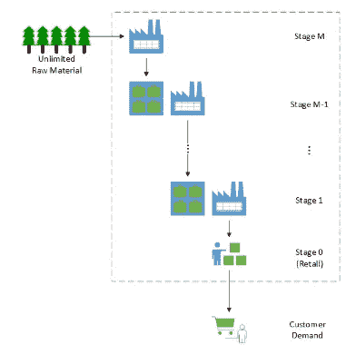
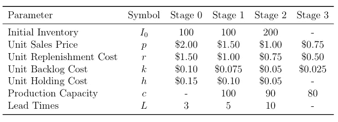
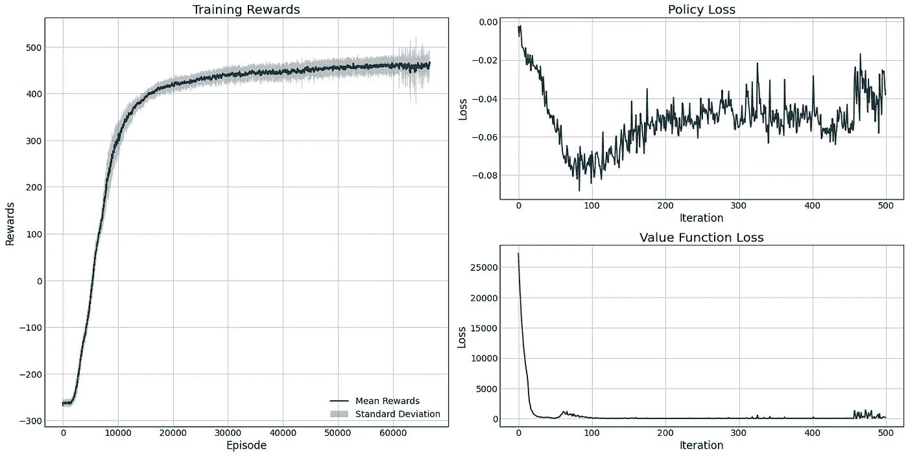
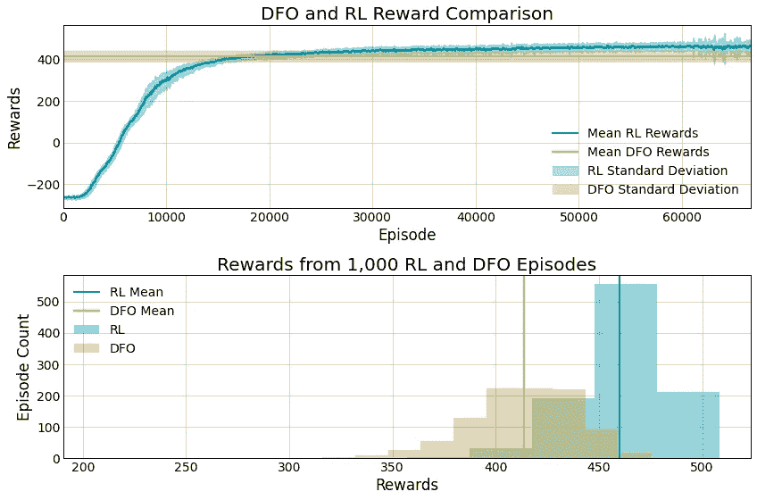

# 如何通过深度强化学习改善您的供应链

> 原文：<https://towardsdatascience.com/deep-reinforcement-learning-for-supply-chain-optimization-3e4d99ad4b58?source=collection_archive---------13----------------------->

## 利用雷和 DFO 优化多级供应链

是什么让亚马逊在网上零售的竞争中脱颖而出？他们的供应链。事实上，这一直是他们的主要竞争对手之一沃尔玛的最大优势之一。

供应链是高度复杂的系统，由全球数百家甚至数千家制造商和物流承运商组成，他们整合资源，创造出我们每天使用和消费的产品。要跟踪*所有的*投入到[一个单一的、简单的产品将是惊人的](https://www.youtube.com/watch?v=U3W2v7LN-88)。然而，纵向一体化公司内部的供应链组织的任务是管理从原材料到制造、仓储和向客户分销的投入。在这方面做得最好的公司减少了过量储存造成的浪费，减少了不必要的运输成本，减少了将产品和材料运送到系统后期的时间。优化这些系统是像苹果和 Saudi Aramco 这样不同的企业的关键组成部分。


照片由 [Shawn Ang](https://unsplash.com/@shawnanggg?utm_source=medium&utm_medium=referral) 在 [Unsplash](https://unsplash.com?utm_source=medium&utm_medium=referral) 上拍摄

已经投入了大量的时间和精力来构建有效的供应链优化模型，但是由于它们的规模和复杂性，它们可能难以构建和管理。随着机器学习的进步，特别是强化学习，我们可以训练一个机器学习模型来为我们做出这些决定，在许多情况下，比传统方法做得更好！

# TL；速度三角形定位法(dead reckoning)

我们使用[射线](/ray-and-rllib-for-fast-and-parallel-reinforcement-learning-6d31ee21c96c)和`[or-gym](https://arxiv.org/abs/2008.06319)`来训练深度强化学习模型，以优化多级库存管理模型，并使用鲍威尔的方法[根据无导数优化模型对其进行基准测试](https://www.datahubbs.com/how-to-use-deep-reinforcement-learning-to-improve-your-supply-chain/)。

# 多级供应链

在我们的例子中，我们将使用一个有提前期的**多级**供应链模型。这意味着我们需要为供应链的不同阶段做出决策，我们在不同层面做出的每个决策都会影响下游的决策。在我们的案例中，我们有从原材料生产商到客户的几个阶段。过程中的每个阶段都有不同的**提前期**，即一个阶段的输出到达并成为链中下一个阶段的输入所需的时间。这可能是 5 天，10 天，无论如何。这些交付周期变得越长，您就需要越早预测客户订单和需求，以确保您不会缺货或失去销售！



多级供应链示意图(图片由作者[提供，来自 Hubbs 等人](https://arxiv.org/abs/2008.06319)

# 使用 OR-Gym 进行库存管理

[OR-Gym](https://github.com/hubbs5/or-gym) 库有几个多级供应链模型可以用来模拟这种结构。为此，我们将使用`InvManagement-v1`环境，它具有如上所示的结构，但是如果您没有足够的库存来满足客户需求，就会导致销售损失。

如果您还没有，请继续安装该软件包:

```
pip install or-gym
```

安装完成后，我们可以使用以下工具设置我们的环境:

```
env = or_gym.make('InvManagement-v1')
```

默认情况下，这是一个四级供应链。这些行动决定了在每个时间步从上面的层级订购多少材料。订单数量受限于供应商的能力及其当前库存。因此，如果你从一个供应商那里订购 150 个部件，而该供应商的发货能力是 100 个部件，而你手头只有 90 个部件，那么你只能收到 90 个部件。

每个层级都有自己的成本结构、定价和交付周期。最后一个梯队(在这种情况下是阶段 3)提供原材料，我们在这个阶段没有任何库存限制，假设矿山、油井、森林或任何生产原材料的东西足够大，这不是我们需要关心的限制。



`Invmanagement-v` 1 环境的默认参数值。

与所有的`or-gym`环境一样，如果这些设置不适合您，只需将一个环境配置字典传递给`make`函数来相应地定制您的供应链([这里给出了一个例子](https://www.datahubbs.com/action-masking-with-rllib/))。

# 和雷一起训练

为了训练你的环境，我们将利用[射线库](https://www.datahubbs.com/ray-and-rllib-fast-reinforcement-learning/)来加速我们的训练，所以继续导入你的包。

```
import or_gym
from or_gym.utils import create_env
import ray
from ray.rllib import agents
from ray import tune
```

首先，我们需要一个简单的注册函数来确保 Ray 知道我们想要运行的环境。我们可以用下面显示的`register_env`函数注册它。

```
def register_env(env_name, env_config={}):
    env = create_env(env_name)
    tune.register_env(env_name, 
        lambda env_name: env(env_name,
            env_config=env_config))
```

从这里，我们可以设置我们的 RL 配置和训练模型所需的一切。

```
# Environment and RL Configuration Settings
env_name = 'InvManagement-v1'
env_config = {} # Change environment parameters here
rl_config = dict(
    env=env_name,
    num_workers=2,
    env_config=env_config,
    model=dict(
        vf_share_layers=False,
        fcnet_activation='elu',
        fcnet_hiddens=[256, 256]
    ),
    lr=1e-5
)# Register environment
register_env(env_name, env_config)
```

在`rl_config`字典中，您可以设置所有相关的超参数，或者将您的系统设置为在 GPU 上运行。这里，我们将使用 2 个工作线程进行并行化，并训练一个具有 ELU 激活功能的双层网络。此外，如果您打算使用`[tune](https://www.datahubbs.com/hyperparameter-tuning-with-tune/)` [进行超参数调优](https://www.datahubbs.com/hyperparameter-tuning-with-tune/)，那么您可以使用`tune.gridsearch()`之类的工具来系统地更新学习率、改变网络或任何您喜欢的东西。

一旦你满意了，就去选择你的算法并开始训练吧！下面，我只使用 PPO 算法，因为我发现它在大多数环境下训练得很好。

```
# Initialize Ray and Build Agent
ray.init(ignore_reinit_error=True)
agent = agents.ppo.PPOTrainer(env=env_name,
    config=rl_config)results = []
for i in range(500):
    res = agent.train()
    results.append(res)
    if (i+1) % 5 == 0:
        print('\rIter: {}\tReward: {:.2f}'.format(
                i+1, res['episode_reward_mean']), end='')
ray.shutdown()
```

上面的代码将初始化`ray`，然后根据您之前指定的配置构建代理。如果你对此感到满意，那么让它运行一段时间，看看效果如何！

在这种环境下需要注意的一点是:如果学习率太高，政策函数将开始发散，损失将变得巨大。此时，您将得到一个错误，通常来自 Ray 的默认预处理器，状态显示奇怪的值，因为网络给出的动作都是`nan`。这很容易通过降低学习速度并再次尝试来解决。

让我们来看看表演。

```
import numpy as np
import matplotlib.pyplot as plt
from matplotlib import gridspec# Unpack values from each iteration
rewards = np.hstack([i['hist_stats']['episode_reward'] 
    for i in results])
pol_loss = [
    i['info']['learner']['default_policy']['policy_loss'] 
    for i in results]
vf_loss = [
    i['info']['learner']['default_policy']['vf_loss'] 
    for i in results]p = 100
mean_rewards = np.array([np.mean(rewards[i-p:i+1]) 
                if i >= p else np.mean(rewards[:i+1]) 
                for i, _ in enumerate(rewards)])
std_rewards = np.array([np.std(rewards[i-p:i+1])
               if i >= p else np.std(rewards[:i+1])
               for i, _ in enumerate(rewards)])fig = plt.figure(constrained_layout=True, figsize=(20, 10))
gs = fig.add_gridspec(2, 4)
ax0 = fig.add_subplot(gs[:, :-2])
ax0.fill_between(np.arange(len(mean_rewards)), 
                 mean_rewards - std_rewards, 
                 mean_rewards + std_rewards, 
                 label='Standard Deviation', alpha=0.3)
ax0.plot(mean_rewards, label='Mean Rewards')
ax0.set_ylabel('Rewards')
ax0.set_xlabel('Episode')
ax0.set_title('Training Rewards')
ax0.legend()ax1 = fig.add_subplot(gs[0, 2:])
ax1.plot(pol_loss)
ax1.set_ylabel('Loss')
ax1.set_xlabel('Iteration')
ax1.set_title('Policy Loss')ax2 = fig.add_subplot(gs[1, 2:])
ax2.plot(vf_loss)
ax2.set_ylabel('Loss')
ax2.set_xlabel('Iteration')
ax2.set_title('Value Function Loss')plt.show()
```



图片作者。

看起来我们的代理学会了一个体面的政策！

这些经典运筹学问题的深度强化学习的困难之一是缺乏最优性保证。换句话说，我们可以看看上面的训练曲线，看到它正在学习越来越好的政策——它似乎正在向一个政策靠拢——但我们不知道这个政策有多好。我们能做得更好吗？我们应该在超参数调优上投入更多的时间(和金钱)吗？要回答这个问题，我们需要转向一些不同的方法，并开发一个基准。

# 无导数优化

测试 RL 模型的一个好方法是使用**无导数优化** (DFO)。像 RL 一样，DFO 将系统视为一个黑盒模型，提供输入并获得一些反馈，作为回报，在寻求最优值时再次尝试。

与 RL 不同，DFO 没有国家的概念。这意味着我们将试图找到一个固定的再订购政策，使库存达到一定水平，以平衡持有成本和销售利润。例如，如果阶段 0 的策略是重新订购多达 10 个小部件，而目前我们有 4 个小部件，则策略声明我们将重新订购 6 个。在 RL 的情况下，它将考虑当前的管道和我们提供给状态的所有其他信息。因此 RL 更具适应性，并且应该优于直接的 DFO 实现。如果没有，那么我们知道我们需要重新开始。

虽然这听起来可能过于简单，但这种固定的再订购策略在工业应用中并不罕见，部分原因是真实的供应链由比我们在这里建模更多的变量和相关决策组成。因此，一个固定的政策是易处理的，供应链专业人员可以很容易地处理。

## 实施 DFO

对于 DFO，有很多不同的算法和求解器。出于我们的目的，我们将利用 Scipy 的`optimize`库来实现 [Powell 的方法](https://en.wikipedia.org/wiki/Powell%27s_method)。我们不会在这里进入细节，但这是一种快速找到函数最小值的方法，并可用于离散优化-就像我们在这里。

```
from scipy.optimize import minimize
```

因为我们将使用固定的再订购策略，所以我们需要一个快速的功能来将库存水平转化为要评估的行动。

```
def base_stock_policy(policy, env):
    '''
    Implements a re-order up-to policy. This means that for
    each node in the network, if the inventory at that node 
    falls below the level denoted by the policy, we will 
    re-order inventory to bring it to the policy level.

    For example, policy at a node is 10, current inventory
    is 5: the action is to order 5 units.
    '''
    assert len(policy) == len(env.init_inv), (
        'Policy should match number of nodes in network' + 
        '({}, {}).'.format(
            len(policy), len(env.init_inv)))

    # Get echelon inventory levels
    if env.period == 0:
        inv_ech = np.cumsum(env.I[env.period] +
            env.T[env.period])
    else:
        inv_ech = np.cumsum(env.I[env.period] +
            env.T[env.period] - env.B[env.period-1, :-1])

    # Get unconstrained actions
    unc_actions = policy - inv_ech
    unc_actions = np.where(unc_actions>0, unc_actions, 0)

    # Ensure that actions can be fulfilled by checking 
    # constraints
    inv_const = np.hstack([env.I[env.period, 1:], np.Inf])
    actions = np.minimum(env.c,
                np.minimum(unc_actions, inv_const))
    return actions
```

`base_stock_policy`函数获取我们提供的策略级别，并如上所述计算该级别和库存之间的差异。需要注意的一点是，当我们计算库存水平时，我们也包括所有在运输途中的库存(在`env.T`中给出)。例如，如果阶段 0 的当前现有库存为 100，并且阶段 0 和阶段 1 之间有 5 天的提前期，那么我们也会考虑过去 5 天的所有订单。因此，如果阶段 0 每天订购 10 件，那么该层级的库存将为 150 件。这使得策略级别大于容量变得有意义，因为我们不仅要查看我们今天仓库中的库存，还要查看所有正在运输的物品。

我们的 DFO 方法需要进行函数评估调用，以查看所选变量的执行情况。在我们的例子中，我们有一个要评估的环境，所以我们需要一个函数来运行我们环境中的一集并返回适当的结果。

```
def dfo_func(policy, env, *args):
    '''
    Runs an episode based on current base-stock model 
    settings. This allows us to use our environment for the 
    DFO optimizer.
    '''
    env.reset() # Ensure env is fresh
    rewards = []
    done = False
    while not done:
        action = base_stock_policy(policy, env)
        state, reward, done, _ = env.step(action)
        rewards.append(reward)
        if done:
            break

    rewards = np.array(rewards)
    prob = env.demand_dist.pmf(env.D, **env.dist_param)

    # Return negative of expected profit
    return -1 / env.num_periods * np.sum(prob * rewards)
```

我们不是返回奖励的总和，而是返回对奖励的负面期望。消极的原因是我们使用的 Scipy 函数寻求最小化，而我们的环境是为了最大化回报而设计的，所以我们反转这个函数以确保一切都指向正确的方向。我们通过乘以基于分布的需求概率来计算预期回报。我们可以获取更多样本来估计分布，并以这种方式计算我们的期望(对于许多现实世界的应用来说，这是必需的)，但在这里，我们可以访问真实的分布，因此我们可以使用它来减少我们的计算负担。

最后，我们准备优化。

下面这个函数会根据你的配置设置搭建一个环境，拿我们的`dfo_func`来评估，应用鲍威尔的方法来解决问题。它将返回我们的策略，并确保我们的答案只包含正整数(例如，我们不能订购半个部件或负数部件)。

```
def optimize_inventory_policy(env_name, fun,
    init_policy=None, env_config={}, method='Powell'):

    env = or_gym.make(env_name, env_config=env_config)

    if init_policy is None:
        init_policy = np.ones(env.num_stages-1)

    # Optimize policy
    out = minimize(fun=fun, x0=init_policy, args=env, 
        method=method)
    policy = out.x.copy()

    # Policy must be positive integer
    policy = np.round(np.maximum(policy, 0), 0).astype(int)

    return policy, out
```

现在是时候把它们放在一起了。

```
policy, out = optimize_inventory_policy('InvManagement-v1',
    dfo_func)
print("Re-order levels: {}".format(policy))
print("DFO Info:\n{}".format(out))Re-order levels: [540 216  81]
DFO Info:
   direc: array([[  0\.        ,   0\.        ,   1\.        ],
       [  0\.        ,   1\.        ,   0\.        ],
       [206.39353826,  81.74560612,  28.78995703]])
     fun: -0.9450780368543933
 message: 'Optimization terminated successfully.'
    nfev: 212
     nit: 5
  status: 0
 success: True
       x: array([539.7995151 , 216.38046861,  80.66902905])
```

我们的 DFO 模型发现了一个固定库存策略，第 0 阶段的再订购水平为 540，第 1 阶段为 216，第 2 阶段为 81。它只用了 212 次功能评估就做到了这一点，即它模拟了 212 集来寻找最佳值。

我们可以运行该策略，然后将其输入到我们的环境中，比如说 1000 次，以生成一些统计数据，并将其与我们的 RL 解决方案进行比较。

```
env = or_gym.make(env_name, env_config=env_config)
eps = 1000
rewards = []
for i in range(eps):
    env.reset()
    reward = 0
    while True:
        action = base_stock_policy(policy, eenv)
        s, r, done, _ = env.step(action)
        reward += r
        if done:
            rewards.append(reward)
            break
```

# 比较性能

在我们开始报酬比较之前，请注意这些并不是完美的，1:1 的比较。如前所述，DFO 为我们提供了一个固定的策略，而 RL 提供了一个更加灵活、动态的策略，可以根据状态信息进行更改。我们的 DFO 方法也提供了一些需求概率方面的信息来计算期望，RL 必须从额外的抽样中进行推断。因此，虽然 RL 从近 65k 的剧集中学习，而 DFO 只需要进行 212 次函数调用，但他们并不完全可比。考虑到枚举每一个有意义的固定政策一次将需要大约 2 亿集，那么 RL 看起来并不那么低效。

那么，这些是如何叠加的呢？



图片作者。

从上面我们可以看到，RL 确实比我们的 DFO 策略平均高出 11%(460 比 414)。RL 模型在大约 15k 集后超过了 DFO 策略，并在此后稳步改进。然而，RL 政策有一些更高的差异，其中有一些可怕的插曲。总的来说，我们确实从 RL 方法中得到了更好的结果。

在这种情况下，这两种方法都很难实现，计算量也不大。我忘记将我的`rl_config`设置改为在我的 GPU 上运行，在我的笔记本电脑上训练仍然只需要大约 25 分钟，而 DFO 模型需要大约 2 秒钟。更复杂的模型可能在这两种情况下都不那么友好。

另一点需要注意的是，这两种方法对初始条件都非常敏感，而且都不能保证在每种情况下都能找到最优策略。如果你有一个想应用 RL 的问题，也许可以先使用一个简单的 DFO 解算器，尝试一些初始条件来了解问题，然后旋转完整的 RL 模型。你会发现 DFO 政策足以完成你的任务。

希望这很好地概述了如何使用这些方法和`or-gym`库。如果您有任何反馈或问题，请留下！