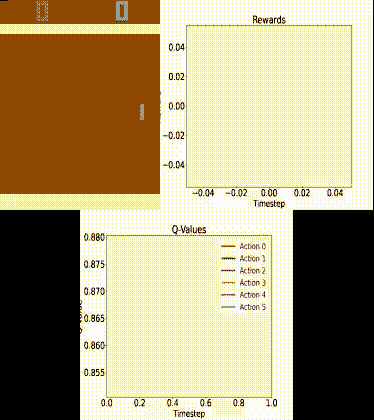
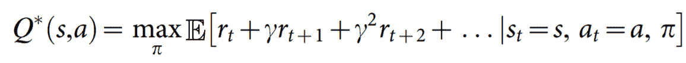
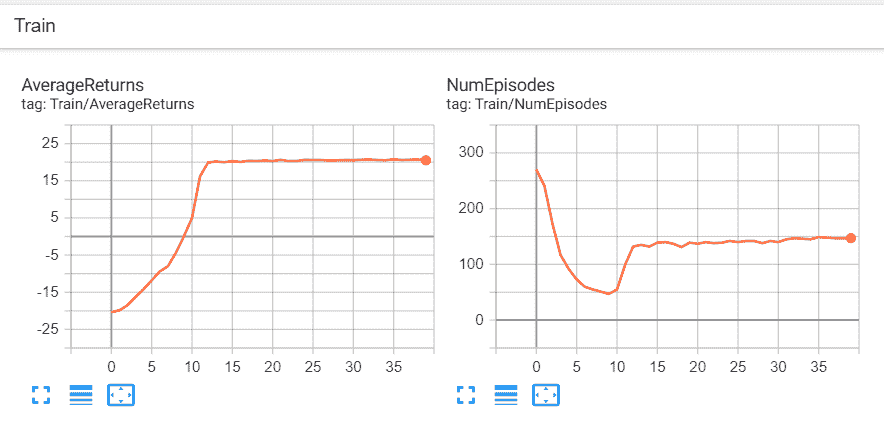
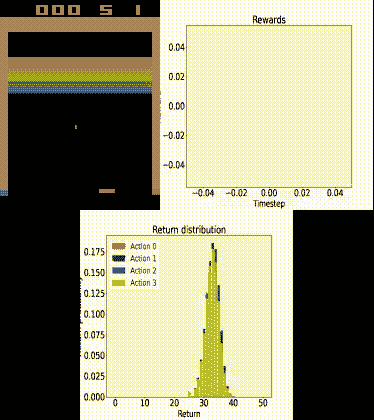

# 轻松实现视频游戏的深度强化学习

> 原文：<https://towardsdatascience.com/deep-reinforcement-learning-for-video-games-made-easy-6f7d06b75a65?source=collection_archive---------35----------------------->

## 深度 Q 网络已经彻底改变了深度强化学习领域，但是简单实验的技术先决条件直到现在还禁止新人进入…



使用 DQN 代理的雅达利乒乓

在本帖中，我们将调查如何使用谷歌强化学习库[多巴胺](https://github.com/google/dopamine)为雅达利 2600 游戏训练一个[深度 Q 网络(DQN)代理](https://storage.googleapis.com/deepmind-media/dqn/DQNNaturePaper.pdf) (Mnih 等人，2015)。虽然有许多 RL 函数库，但这个函数库是根据**的四个基本特性**特别设计的:

*   简单的实验
*   柔性开发
*   紧凑可靠
*   可再生的

> 我们相信这些原则使得多巴胺成为当今最好的学习环境之一。此外，我们甚至让这个库在 Windows 上工作，我们认为这是一个了不起的成就！

在我看来，在强化学习中，任何受过训练的 RL 代理的可视化都是绝对必要的！因此，我们将(当然)在最后为我们自己的训练有素的代理人包括这一点！

我们将检查所有需要的代码片段(与其他库相比**是最少的)，但是你也可以在下面的 [Github repo](https://github.com/holmdk/dopamine_ALE_agent) 中找到所有需要的脚本。**

# 1.强化学习和深度 Q 学习简介

深度强化学习的一般前提是

> “从高维度的感官输入中获得环境的有效表示，并使用这些来将过去的经验推广到新的情况。”
> 
> - Mnih 等人(2015 年)

如前所述，我们将由 *Deepmind* 实现 *DQN 模型*，它只使用原始像素和游戏分数作为输入。使用类似于图像分类的卷积神经网络来处理原始像素。主要区别在于**目标函数**，对于 DQN 代理来说，它被称为*最优行动值函数*



其中 *rₜ* 是在时间 *t* 用 *γ* 折现的最大奖励总和，使用行为策略 *π = P(a* ∣ *s)* 为每个观察-动作对获得。

深度 Q-Learning 的细节相对较多，如的经验重演和的迭代更新规则。因此，我们建议读者参考[原始论文](https://storage.googleapis.com/deepmind-media/dqn/DQNNaturePaper.pdf)，以便更好地了解数学细节。

与当时(2015 年)之前的方法相比，DQN 的一个关键优势是能够使用**相同的超参数集**和**仅像素值和游戏分数作为输入**，超越 Atari 2600 游戏的现有方法，这显然是一个巨大的成就。

# 2.装置

这篇文章不包括安装 [Tensorflow](https://www.tensorflow.org/) 的说明，但我们想强调的是，你可以同时使用**CPU 和 GPU 版本**。

然而，假设您使用的是`Python 3.7.x`，这些是您需要安装的库(它们都可以通过`pip`安装):

```
tensorflow-gpu=1.15   (or tensorflow==1.15  for CPU version)
cmake
dopamine-rl
atari-py
matplotlib
pygame
seaborn
pandas
```

# 3.训练我们的特工

深度强化学习的超参数调整需要大量的计算资源，因此被认为超出了本指南的范围。**幸运的是**，多巴胺的作者已经提供了 Bellemare 等人(2017)使用的具体超参数，可以在下面的[文件](https://github.com/google/dopamine/blob/master/dopamine/agents/dqn/configs/dqn_icml.gin)中找到。我们使用这个*“配置文件”*的内容作为一个字符串，我们使用 [gin 配置框架](https://github.com/google/gin-config)解析它。它包含所有相关的训练、环境和所需的超参数，这意味着我们**只需要更新我们想要运行的游戏**(尽管超参数可能不会对所有游戏都同样有效)。

我们从**导入**所需的库开始

```
import os
import gin.tf
from dopamine.discrete_domains import run_experiment
```

接下来，我们定义根路径**来保存我们的实验**

```
DQN_PATH **=** '/tmp/path/to/save/experiments/dqn'
```

然后，我们定义想要运行的**游戏**(在本例中，我们运行游戏“Pong”)，

```
GAME **=** 'Pong'
```

最后，我们定义 DQN **配置字符串**:

```
dqn_config **=** """
# Hyperparameters used for reporting DQN results in Bellemare et al. (2017).
import dopamine.discrete_domains.atari_lib
import dopamine.discrete_domains.run_experiment
import dopamine.agents.dqn.dqn_agent
import dopamine.replay_memory.circular_replay_buffer
import gin.tf.external_configurables

DQNAgent.gamma = 0.99
DQNAgent.update_horizon = 1
DQNAgent.min_replay_history = 50000  # agent steps
DQNAgent.update_period = 4
DQNAgent.target_update_period = 10000  # agent steps
DQNAgent.epsilon_train = 0.01
DQNAgent.epsilon_eval = 0.001
DQNAgent.epsilon_decay_period = 1000000  # agent steps
DQNAgent.tf_device = '/gpu:0'  # use '/cpu:*' for non-GPU version
DQNAgent.optimizer = @tf.train.RMSPropOptimizer()

tf.train.RMSPropOptimizer.learning_rate = 0.00025
tf.train.RMSPropOptimizer.decay = 0.95
tf.train.RMSPropOptimizer.momentum = 0.0
tf.train.RMSPropOptimizer.epsilon = 0.00001
tf.train.RMSPropOptimizer.centered = True

atari_lib.create_atari_environment.game_name = "{}"
# Deterministic ALE version used in the DQN Nature paper (Mnih et al., 2015).
atari_lib.create_atari_environment.sticky_actions = False
create_agent.agent_name = 'dqn'
Runner.num_iterations = 200 # 200
Runner.training_steps = 250000 #   250000  # agent steps
Runner.evaluation_steps = 125000 # 125000  # agent steps
Runner.max_steps_per_episode = 27000 # 27000  # agent steps

AtariPreprocessing.terminal_on_life_loss = True

WrappedReplayBuffer.replay_capacity = 1000000
WrappedReplayBuffer.batch_size = 32
""".format(GAME)
```

***基本上就是这样了！***

现在，我们只需编写训练代理的最终代码，

运行上面的(需要很长时间！)，你应该看到 DQN 模型粉碎乒乓游戏！

# 4.想象我们的特工

我们在 **GTX 1070 GPU** 上运行了大约 **22 小时**的实验。

我们包含了优化结果的可视化和 Pong 代理的*【live】*性能。我们将此分为**两段:**

# a)培训结果

导航到 tensorboard logs 文件夹，该文件夹可以在您之前定义的`DQN_PATH`中找到，然后运行以下命令:

```
tensorboard --logdir .
```

这应该会给你一个类似这样的视觉效果



您可以看到，运行 12 次后，性能才逐渐提高。

# b)现场演示

现在是有趣的部分！

我们将使用位于多巴胺库的`utils`文件夹中的`example_vis_lib`脚本。因此，我们运行实时演示的脚本如下所示:

运行上面的代码，您应该看到脚本开始为 1000 步生成图像，然后将图像保存到 video.mp4 文件中。

这是我们模型的 gif 图:


雅达利突破使用 DQN 代理培训 22 小时

很明显，经纪人并不完美，也确实输了不少比赛。尽管如此，它做了一个相对不错的工作！

如果我们多训练几天(或者使用更大的 GPU)，我们可能会得到一个接近完美的代理。

# 5.结论

***就这样吧！***

这基本上就是**我们实际上需要**多么少的代码来实现一个最先进的 DQN 模型来运行 Atari 2600 游戏并进行现场演示！

随意试验明显更好的[彩虹模型](https://github.com/google/dopamine/blob/master/dopamine/agents/rainbow/configs/rainbow_aaai.gin) ( [Hessel et al .，2018](https://www.aaai.org/ocs/index.php/AAAI/AAAI18/paper/download/17204/16680) )，这是**也包括在多巴胺库**，以及其他非雅达利的游戏！

作为**最终演示**，我们提供了一个小的 gif 图片，展示了一名代理人使用彩虹模型接受了为期两天的雅达利突破培训:



雅达利突破与彩虹模型训练了两天

你可以看到彩虹模型表现得非常好！

## 如果你喜欢这篇文章，请不要犹豫留下你的任何意见或建议！

# 6.参考

[1]林隆基，用神经网络进行机器人的强化学习(1993)，CS-93-103 号。

[2] M. Hessel 等，Rainbow:结合深度强化学习的改进(2018)，第三十二届 AAAI 人工智能会议。

[3] P. S. Castro，S. Moitra，C. Gelada，S. Kumar，M. G. Bellemare，[多巴胺:深度强化学习的研究框架](https://arxiv.org/abs/1812.06110) (2018)，arXiv 预印本 arXiv:1812.06110。

[4] V. Mnih 等人，(2015)，通过深度强化学习实现人类水平的控制，Nature 518.7540(529–533)。

*原载于 2020 年 7 月 22 日*[*https://holmdk . github . io*](https://holmdk.github.io/2020/07/16/DQN_agent_ALE_dopamine.html)*。*