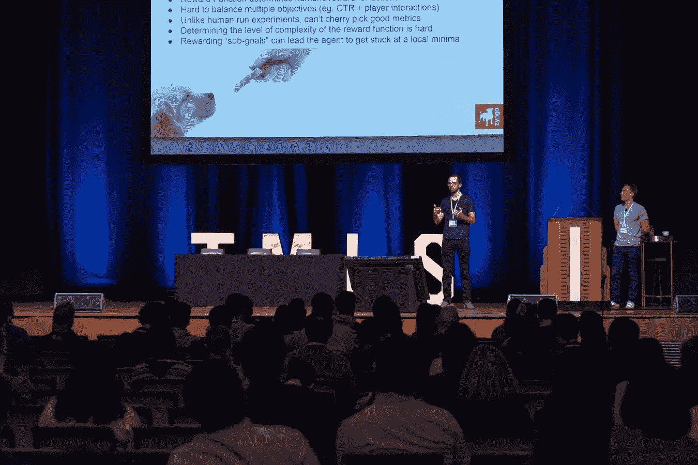

# 生产中的深度强化学习

> 原文：<https://towardsdatascience.com/deep-reinforcement-learning-in-production-7e1e63471e2?source=collection_archive---------28----------------------->

## Zynga 使用强化学习来个性化用户体验

弗兰基·查马基在 [Unsplash](https://unsplash.com?utm_source=medium&utm_medium=referral) 上拍摄的照片

由来自 Zynga ML 工程团队的[迈赫迪·本·阿耶德](https://www.linkedin.com/in/mehdi-ben-ayed/)和[帕特里克·哈利娜](https://www.linkedin.com/in/patrick-halina-88aa463a/)

# 系列介绍

设计用户体验是一门困难的艺术。与其他应用程序相比，视频游戏为设计师提供了一个巨大的工作空间。在 Zynga，我们一直在想创新的方法来最大化用户在玩游戏时的体验。

在这个多部分的系列中，Zynga 的 ML 工程团队将讨论如何在制作中使用深度强化学习(RL)来个性化 Zynga 游戏的许多方面。深度强化学习的使用已被证明在增加关键指标方面是成功的，如用户保留率和用户参与度。这些文章是我们在 2019 年[多伦多机器学习峰会和 2020 年](/deep-reinforcement-learning-in-production-at-zynga-334cd285c550) [Spark 峰会上的演讲的延伸。](https://databricks.com/session_na20/productionizing-deep-reinforcement-learning-with-spark-and-mlflow)

2019 年多伦多机器学习峰会

在第一篇文章中，我们将:

*   介绍深度强化学习
*   解释为什么它是驱动个性化系统的良好候选
*   对其在 Zynga 的使用做一个高层次的概述

本系列的其余部分将涵盖以下内容:

*   [第 2 部分:深入探究 Zynga 的 RL 应用](/deep-reinforcement-learning-in-production-part-2-personalizing-user-notifications-812a68ce2355)
*   第 3 部分:RL 技术和基础设施
*   第 4 部分:RL 的培训挑战
*   第 5 部分:提升 RL 应用程序的技巧

# 关于 Zynga

Zynga 是全球领先的手机游戏开发商之一。它的投资组合有一些世界上最受欢迎的手机游戏，如与朋友的话，帝国和谜题，香椿爆炸，CSR2，扑克，等等。Zynga 的使命是通过游戏将世界各地的人们联系起来。

# 个性化用户体验的需求

为广泛的用户构建成功的应用程序是具有挑战性的。日常挑战应该有多难？应该推荐什么游戏模式？每个用户都是不同的，这使得很难构建一个适合每个人需求的应用程序。这种差异可能是由于玩家的人口统计，位置，甚至他们的游戏风格。因此，构建个性化的用户体验有可能提高用户参与度和忠诚度。

虽然在用户会话期间有许多旋钮和杠杆可以控制，但个性化可以归结为一个共同的模式:给定用户的状态，选择一个动作以最大化长期回报。

这些是 Zynga 个性化问题中典型的状态、行为和奖励的例子:

*   **State** :用户的背景，由一组特征组成，例如，他们玩游戏多长时间了，他们在什么级别，在过去几个级别的表现历史，等等。
*   **动作**:应用程序被控制的方面。可能是下一关的难度，发送消息的时间，推荐的游戏模式等等。
*   **奖励**:这是我们希望个性化改进的关键绩效指标(KPI)。对于 Zynga 来说，其中一些指标是参与度指标，如玩家玩的关卡数量和会话长度。

# 分段个性化

Zynga 在使用个性化来增强游戏体验方面有着悠久的历史。一种已经被成功使用的简单方法是基于规则的优化。这种方法根据玩家的属性将玩家分成不同的部分(或组),并为每个部分提供定制体验。

细分对于广泛的群体很有效，但是对于细粒度的个性化就不那么有效了。该过程也是非常手动的，并且需要人在回路中进行任何调整。这导致了一些问题:

1.  将用户群细分需要人类的直觉和反复试验。
2.  需要进行 A/B 测试，以发现应该将哪种经验分配给每个细分市场，从而提升 KPI。
3.  规则中可以使用的属性数量是有限的(一个人只能制定这么多规则)。这将细分限制为非常粗粒度的个性化。
4.  随着应用程序功能的变化和受众变得更加成熟，微调的细分策略会变得陈旧，这就需要不断的手动调整和维护。

# 深度加固解决方案

近年来深度学习的兴起及其与强化学习的结合为个性化提供了新的解决方案。

**深度学习**是一种机器学习，利用人工神经网络来学习数据中的复杂关系。给定一大组数据和预期输出，训练神经网络来学习将输入数据转换为预期输出的模式。

除了使用激活函数之外，这些网络的分层架构允许这些模型学习数据中较低和较高层次的概念，这是使用经典机器学习模型所不可能的。

近年来，深度学习经历了大量的突破，导致了图像和语音识别以及深度强化学习等领域的大量成功。

安娜斯塔西娅·杜尔吉尔在 [Unsplash](https://unsplash.com?utm_source=medium&utm_medium=referral) 上的照片

**另一方面，**强化学习是一种经典的机器学习技术。它专注于训练代理人做出一系列决策，使长期总回报最大化。长期方面是关键；代理不会选择短期优化的操作。代理人可能会在短期内遭受损失，以便在稍后的时间点获得更大的收益。

强化学习代理在一个循环中与环境交互，并通过试错进行学习。在每个周期，它:

1.  从环境(例如，用户上下文)接收观察
2.  根据观察结果选择行动
3.  接收对所选行动的反馈，作为奖励和新的观察

图片来自 [Pixabay](https://pixabay.com/?utm_source=link-attribution&utm_medium=referral&utm_campaign=image&utm_content=807306) 的 [uleem odhit](https://pixabay.com/users/bcogwene-1114581/?utm_source=link-attribution&utm_medium=referral&utm_campaign=image&utm_content=807306) 和 [Pexels](https://www.pexels.com/photo/person-using-black-smartphone-3585088/?utm_content=attributionCopyText&utm_medium=referral&utm_source=pexels) 的 [cottonbro](https://www.pexels.com/@cottonbro?utm_content=attributionCopyText&utm_medium=referral&utm_source=pexels)

**深度强化学习**是两种技术的结合。使用深度神经网络作为函数逼近允许代理解决使用经典强化学习不可能解决的问题。它允许代理:

*   使用大的状态空间来表示环境的观察值
*   改进未来奖励近似值
*   使用隐藏层学习和概括复杂的问题
*   适当地处理新的观察，即使他们以前没有经历过

使用深度强化学习训练的代理不仅可以学习解决复杂问题的最佳策略，还可以适应环境的变化。

# 结论

深度学习和深度强化学习释放了解决以前不可能解决的问题的力量，例如复杂环境中的规划和高维空间中的学习模式。在 Zynga，我们相信深度强化学习的使用将继续使我们能够为每个用户个性化我们的游戏，无论他们的技能水平、位置或人口统计。

# 下一步是什么？

在接下来的文章中，我们将与您分享有关深度强化学习代理的不同用例的更多信息，以便个性化我们的用户体验。我们还将提供对我们的机器学习基础设施和深度强化学习框架的见解，我们建立并开源了名为 [rl-bakery](https://github.com/zynga/rl-bakery) 的框架。最后，我们将分享在此过程中遇到的一些主要挑战和学到的东西。

敬请期待！