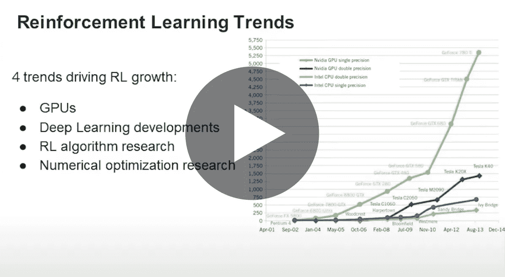

# Zynga 生产中的深度强化学习

> 原文：<https://towardsdatascience.com/deep-reinforcement-learning-in-production-at-zynga-334cd285c550?source=collection_archive---------55----------------------->

## [活动讲座](https://towardsdatascience.com/event-talks/home)

## 帕特里克·哈琳娜和迈赫迪·本·阿耶德| TMLS2019

https://torontomachinelearning.com/

深度强化学习已经在新闻中看到了很多突破，从像围棋、雅达利和 Dota 这样的游戏到自动驾驶汽车，但在生产中将其应用于数百万人带来了很多挑战。

强化学习的承诺是自动化的用户体验优化。作为世界上最大的移动视频游戏公司之一，Zynga 需要自动化，以便为我们 7000 万月活跃用户提供个性化的游戏体验。

本次演讲讨论了 RL 如何解决许多业务问题，在生产中使用 RL 的挑战，以及 Zynga 的 ML 工程团队如何通过我们的个性化管道克服这些挑战。

[Zynga 生产中的深度强化学习](https://www.youtube.com/watch?v=q4b-HHG5dG4)