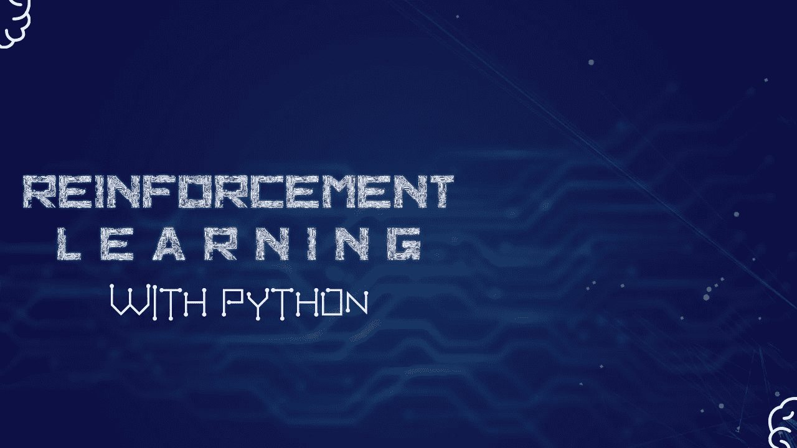

# 使用 Python 进行深度强化学习|第 2 部分|使用深度 Q 网络创建和训练 RL 代理(DQN)

> 原文：<https://towardsdatascience.com/deep-reinforcement-learning-with-python-part-2-creating-training-the-rl-agent-using-deep-q-d8216e59cf31?source=collection_archive---------6----------------------->



在[***第一部分***](https://bit.ly/3eAg32L) ***，*** 我们一行一行的讲解了游戏环境的制作。在这一部分，我们将学习如何创建和训练深度 Q 网络(DQN ),并使代理能够使用它，以便成为我们游戏中的专家。

[](/reinforcement-learning-with-python-part-1-creating-the-environment-dad6e0237d2d) [## 使用 Python 进行深度强化学习|第 1 部分|创建环境

### 设计和建立一个游戏环境，允许 RL 代理在上面训练和玩。

towardsdatascience.com](/reinforcement-learning-with-python-part-1-creating-the-environment-dad6e0237d2d) 

在这一部分，我们将讨论:

1-为什么是深 Q 网(DQN)？

2-什么是 DQN？

3-DQN 是如何工作的？

4-解释我们的 DQN 建筑。

5-解释代理类。

6-培训代理。

有人可能会问“你为什么不用 Q-Learning 而不用 DQN？”这个问题的答案取决于许多因素，例如:

## 环境有多复杂？

在我们的例子中，我们可以用两种方式回答这个问题:

*   如果我们希望 RL 代理的输入与人类的输入一样接近，我们将选择输入作为字段的数组表示。


RL 代理所看到的与人类玩家所看到的

在这种情况下，当我们使用 Q-Learning 时，环境会很复杂，而且由于 Q-Table 非常大，所以不可能存储它。为了证明这一点，考虑以下计算:

> **输入数组的状态数=** (数组中每一项可以取的不同值的个数)^(宽度*高度)
> 
> **输入数组可以具有的状态数=** 4 ^ 10 * 20
> 
> = 4 ^ 200 = 2.58225e120
> 
> **Q-表格大小** =动作空间大小*输入数组可以具有的状态数
> 
> **Q-表格尺寸**= 5 * 2.58225 e120 = 1.291125 e121
> 
> 要存储这个数量的数组(每项 8 位)，我们需要 9.39417077e109 太字节。

这就是为什么我们简单地使用 DQN 而不是 Q-Learning。

*   另一方面，如果你想使用 Q-Learning，使用另一种输入会更有效。例如，您可以使用球员和球洞的 *X* 坐标、球员的宽度和球洞的宽度。这种方式的输入比使用数组表示简单得多。

# 什么是 DQN？

它只是一个普通的神经网络，唯一的区别是它的输入是环境的状态，它的输出是为了最大化当前步骤的回报而执行的最佳动作。

我们通过使用**经验重放和重放记忆来做到这一点，**这些概念将在下一节解释。

# 深度 Q 网(DQN)如何运作？

要完全理解 DQN 是如何工作的，你需要知道一些与 DQN 相关的概念:

## 1-体验回放和回放记忆:

类似于人类通过使用他们以前经验的记忆来学习的方式，dqn 也使用这种技术。

**经验回放:**代理执行每一步后收集的一些数据，这个**经验回放**包含【当前状态，当前动作，步骤回报，下一个状态】。

**重放存储器:**是一堆*n*经验重放，重放存储器主要用于通过获得重放的随机样本来训练 DQN，并使用这些重放作为 DQN 的输入。

**为什么使用随机重放样本而不是顺序重放？**

*   当使用顺序重放时，DQN 倾向于过度拟合而不是一般化。

> 使用重放记忆的一个关键原因是打破连续样本之间的相关性。

## 2-模型和目标模型:

为了获得一致的结果，我们将训练两个模型，第一个模型**【模型】**将在代理做出每一步后拟合，另一方面，第二个模型**【目标 _ 模型】**每 n 步加载**【模型】**的权重(n = UPDATE_TARGET_EVERY)。

我们这样做是因为从一开始，一切都是随机的，从**“模型”**的初始权重到代理执行的动作。这种随机性使得**模型**更难执行好的动作，但是当我们有另一个模型每 n 步使用第一个模型获得的知识时，我们就有了某种程度的一致性。

在我们解释了一些关键概念知道我们可以总结学习的过程后，我将使用来自[这篇精彩博客](https://deeplizard.com/learn/video/xVkPh9E9GfE)的 DeepLizard 的话:

# 解释我们的 DQN 建筑:

对于我们的 DQN，尝试了许多架构，其中许多都不工作，但最终有一个架构被证明工作良好。

## 失败的尝试次数:

*   最初的失败之一是具有两个输出层的架构，第一个输出层负责预测最佳移动(向左、向右或不移动)，而另一个输出层负责预测最佳宽度改变动作(增加宽度、减小宽度、不改变宽度)。
*   另一个失败包括太深的网络，除了他们缓慢的训练过程，他们的表现太差。

## 寻找更好的架构:

在一些失败之后，进行了网格搜索，以找到能够胜过玩游戏的人的架构，下表显示了一些网格搜索的结果:

*注意:下面的表格是为了最后显示最佳结果而排列的。*

从第一次网格搜索的结果，我们可以清楚地看到，复杂和深度网络未能学会如何玩游戏，另一方面，最简单的网络工作得最好。

使用第一次网格搜索的结果，执行了另一次网格搜索，得到了一些好的结果:

从这个结果我们可以看出， ***最好的只有****并不能提高模型的性能，另一方面，同时使用 ECC(ε条件约束)和 EF(ε波动)可以提高模型的性能。*

*我们将在另一篇博客中讨论 ECC 和 EF。*

*其他一些网格搜索结果:*

*   *测试 ***【仅最佳】:****

*   *测试更简单的网络:*

*在所有这些网格搜索之后，我们最终决定使用一种架构，其中一个卷积层有 32 个滤波器，批量大小为 128，两个密集(全连接)层各有 32 个节点，我们将同时使用 ECC 和 EF。*

## *网络摘要:*

```
*Model: "model_1"
_________________________________________________________________
Layer (type)                 Output Shape              Param #   
=================================================================
input_1 (InputLayer)         (None, 20, 10, 1)         0         
_________________________________________________________________
conv2d_1 (Conv2D)            (None, 18, 8, 32)         320       
_________________________________________________________________
dropout_1 (Dropout)          (None, 18, 8, 32)         0         
_________________________________________________________________
flatten_1 (Flatten)          (None, 4608)              0         
_________________________________________________________________
dense_1 (Dense)              (None, 32)                147488    
_________________________________________________________________
dense_2 (Dense)              (None, 32)                1056      
_________________________________________________________________
output (Dense)               (None, 5)                 165       
=================================================================
Total params: 149,029
Trainable params: 149,029
Non-trainable params: 0
_________________________________________________________________*
```

*   ***输入层:**输入形状与代表游戏场地的数组形状相同 *(20 乘 10)。**
*   ***卷积层:**一个 Conv2D 层，有 32 个滤波器，大小为 *2*2**
*   *辍学率为 20%*
*   ***展平**:将 2D 卷积层的输出转换成 1D 数组。*
*   ***密集(全连接)层**:两个密集层各有 32 个节点。*
*   ***输出层:**输出层包含 5 个输出节点，每个节点代表一个动作*【无动作，左移，右移，减宽，增宽】**

# ***讲解*代理*类**类:*

***代理**类是一个包含所有与代理相关的东西的类，比如 DQN、训练函数、重放记忆和其他东西，下面是这个类的逐行解释。*

## *模型创建:*

*这两个函数用于创建给定两个列表的模型:*

*   *conv 列表:该列表的每一项定义了卷积层的滤波器数量。*
*   ***密集列表:**该列表的每一项定义了密集层的节点数。*

# *培训代理:*

*为了保持跟踪最佳模型并保存它以在训练后使用，使用以下函数:*

*接下来是一些常量:*

*接下来是将被训练的架构:*

*将使用前面的三种架构执行网格搜索，网格搜索的结果存储在数据帧中。*

*查看我的 Github 代码库:*

*[](https://github.com/ModMaamari/reinforcement-learning-using-python) [## ModMaamari/强化-学习-使用-python

### 使用 Python 的强化学习。通过以下方式为 ModMaamari/强化-学习-使用-python 开发做出贡献…

github.com](https://github.com/ModMaamari/reinforcement-learning-using-python)* 

*概括地说，我们讨论了:*

*   *选择 DQN 而不是 Q-Learning 的原因。*
*   *DQNs，简单解释一下。*
*   *dqn 是如何工作的？*
*   *我们使用了什么架构，为什么？*
*   ****代理*** 类，解释代码。*
*   *训练模型和网格搜索最佳模型的过程。*

*在下一部分，我们将:*

*   *使用 Tensorboard 分析训练结果。*
*   *尝试最好的模式。*

# *资源:*

*   *[**深度 Q 学习 w/ DQN —强化学习 p.5**](https://www.youtube.com/watch?v=t3fbETsIBCY&list=PLQVvvaa0QuDezJFIOU5wDdfy4e9vdnx-7&index=5)*
*   *[**培训&测试深度强化学习(DQN)代理—强化学习 p.6**](https://www.youtube.com/watch?v=qfovbG84EBg&list=PLQVvvaa0QuDezJFIOU5wDdfy4e9vdnx-7&index=6)*
*   *[**深度 Q 学习——结合神经网络和强化学习**](https://www.youtube.com/watch?v=wrBUkpiRvCA&list=PLZbbT5o_s2xoWNVdDudn51XM8lOuZ_Njv&index=11)*
*   *[**回放记忆讲解—深度 Q 网训练体验**](https://www.youtube.com/watch?v=Bcuj2fTH4_4&list=PLZbbT5o_s2xoWNVdDudn51XM8lOuZ_Njv&index=12)*

*本系列的其他部分:*

*[](/reinforcement-learning-with-python-part-1-creating-the-environment-dad6e0237d2d) [## Python 强化学习|第 1 部分|创建环境

### 设计和建立一个游戏环境，允许 RL 代理在上面训练和玩。

towardsdatascience.com](/reinforcement-learning-with-python-part-1-creating-the-environment-dad6e0237d2d) [](/deep-reinforcement-learning-with-python-part-3-using-tensorboard-to-analyse-trained-models-606c214c14c7) [## 使用 Python 进行深度强化学习|第 3 部分|使用 Tensorboard 分析训练好的模型

### 在前面的部分中:

towardsdatascience.com](/deep-reinforcement-learning-with-python-part-3-using-tensorboard-to-analyse-trained-models-606c214c14c7) 

您可以关注我:

*   [***碎碎念***](https://twitter.com/ModMaamari)
*   [***LinkedIn***](https://www.linkedin.com/in/mohammed-maamari/)
*   [***脸谱***](https://www.facebook.com/mamarih1/)

# 您可能还喜欢:

*   [**深度神经网络用于回归问题**](https://medium.com/@mamarih1/deep-neural-networks-for-regression-problems-81321897ca33)
*   [**AI 生成泰勒斯威夫特的歌词**](https://blog.goodaudience.com/ai-generates-taylor-swifts-song-lyrics-6fd92a03ef7e)
*   [**用 Python 介绍随机森林算法**](https://medium.com/datadriveninvestor/introduction-to-random-forest-algorithm-with-python-9efd1d8f0157)
*   [**带 TensorFlow APIs 的机器学习速成班汇总**](https://medium.com/@mamarih1/machine-learning-crash-course-with-tensorflow-apis-summary-524e0fa0a606)
*   [**如何用 Tensorflow 和 Keras**](https://medium.com/@mamarih1/how-to-make-a-cnn-using-tensorflow-and-keras-dd0aaaed8ab4) **制作一个 CNN？**
*   [**如何选择最好的机器学习模型？**](https://medium.com/@mamarih1/how-to-choose-the-best-machine-learning-model-e1dbb46bdd4d)*