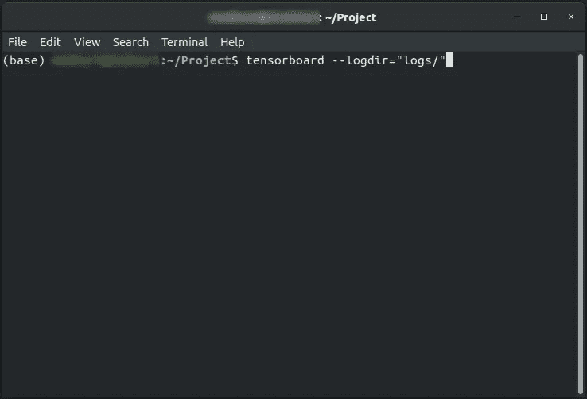
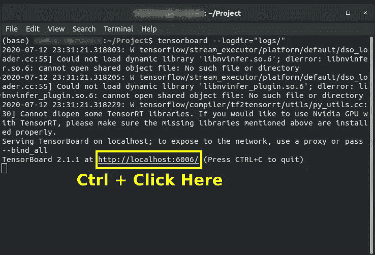
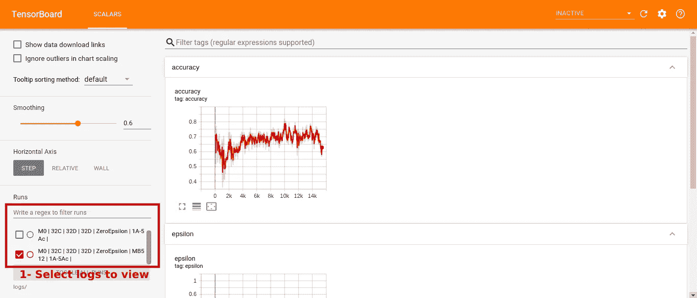
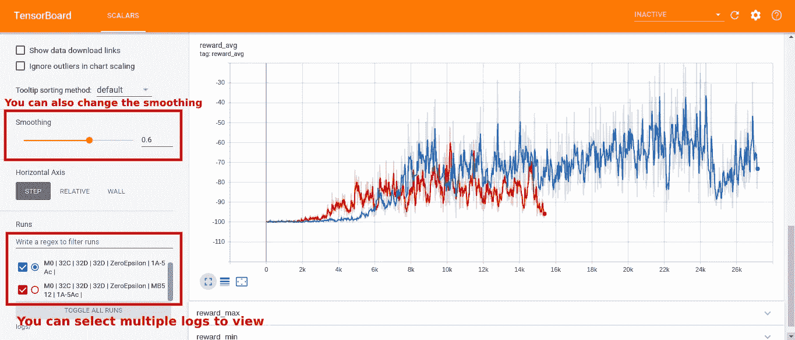
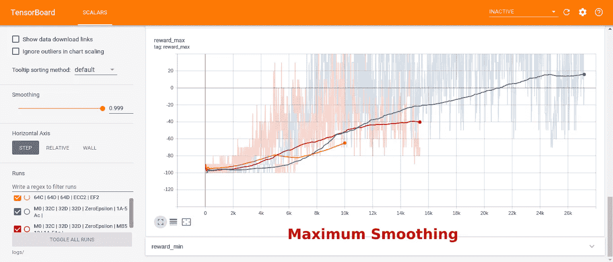

# 使用 Python 进行深度强化学习|第 3 部分|使用 Tensorboard 分析训练好的模型

> 原文：<https://towardsdatascience.com/deep-reinforcement-learning-with-python-part-3-using-tensorboard-to-analyse-trained-models-606c214c14c7?source=collection_archive---------30----------------------->


# 在前面的部分中:

*   [第一部分](https://medium.com/p/reinforcement-learning-with-python-part-1-creating-the-environment-dad6e0237d2d)讲解并创建游戏环境。

[](/reinforcement-learning-with-python-part-1-creating-the-environment-dad6e0237d2d) [## Python 强化学习|第 1 部分|创建环境

### 设计和建立一个游戏环境，允许 RL 代理在上面训练和玩。

towardsdatascience.com](/reinforcement-learning-with-python-part-1-creating-the-environment-dad6e0237d2d) 

*   [第二部分](https://medium.com/p/deep-reinforcement-learning-with-python-part-2-creating-training-the-rl-agent-using-deep-q-d8216e59cf31)讨论了训练 DQN 的过程，解释了 DQNs 并给出了选择 DQN 而不是 Q-Learning 的理由。

[](/deep-reinforcement-learning-with-python-part-2-creating-training-the-rl-agent-using-deep-q-d8216e59cf31) [## 使用 Python 的深度强化学习|第 2 部分|使用深度 Q 创建和训练 RL 代理…

### 在第一部分，我们经历了制作游戏环境，并逐行解释。在这一部分，我们是…

towardsdatascience.com](/deep-reinforcement-learning-with-python-part-2-creating-training-the-rl-agent-using-deep-q-d8216e59cf31) 

# 在这一部分中:

我们将:

*   使用 Tensorboard 可视化训练好的模型。
*   解释加载和尝试已训练模型的方式。
*   用最好的模型，让它玩游戏。

# 使用张量板:

1-使用修改的 Tensorboard 使 Tensorboard 在一个日志文件中记录来自训练过程中所有情节的数据，而不是每次我们拟合模型时都制作新的日志文件。

下一个代码***modified tensor board***来自 sentdex 的[这个博客](https://pythonprogramming.net/deep-q-learning-dqn-reinforcement-learning-python-tutorial/)，我只是稍微修改了一下，让它可以在 TensorFlow2.0 上运行:

2-在代理类的 __init__ 中定义修改后的 tensorboard 的对象:

***路径*** 和 ***名称*** 用于定义保存日志文件的完整路径。

3-拟合模型时，将修改后的张量板作为回调传递:

4-每集开始时:

5-要更新日志，请使用下一行:

# 可视化日志:

在“logs”文件夹所在的目录下打开终端，并运行:

```
tensorboard --logdir="logs/"
```



将出现一个浏览器窗口:



你可以自己尝试其他选项。

通过使用这些可视化，我们可以看到记录的变量之间的关系，例如 *epsilon* 和 *max_reward。*

# 加载和使用训练模型:

# 代理人玩游戏的一些镜头:

# 资源:

*   [**深度 Q 学习 w/ DQN —强化学习 p.5**](https://www.youtube.com/watch?v=t3fbETsIBCY&list=PLQVvvaa0QuDezJFIOU5wDdfy4e9vdnx-7&index=5)

本系列的其他部分:

[](/reinforcement-learning-with-python-part-1-creating-the-environment-dad6e0237d2d) [## Python 强化学习|第 1 部分|创建环境

### 设计和建立一个游戏环境，允许 RL 代理在上面训练和玩。

towardsdatascience.com](/reinforcement-learning-with-python-part-1-creating-the-environment-dad6e0237d2d) [](/deep-reinforcement-learning-with-python-part-2-creating-training-the-rl-agent-using-deep-q-d8216e59cf31) [## 使用 Python 的深度强化学习|第 2 部分|使用深度 Q 创建和训练 RL 代理…

### 在第一部分，我们经历了制作游戏环境，并逐行解释。在这一部分，我们是…

towardsdatascience.com](/deep-reinforcement-learning-with-python-part-2-creating-training-the-rl-agent-using-deep-q-d8216e59cf31) 

您可以关注我:

*   [***推特***](https://twitter.com/ModMaamari)
*   [***LinkedIn***](https://www.linkedin.com/in/mohammed-maamari/)
*   [***脸谱***](https://www.facebook.com/mamarih1/)

# 您可能还喜欢:

*   [**深度神经网络用于回归问题**](https://medium.com/@mamarih1/deep-neural-networks-for-regression-problems-81321897ca33)
*   [**AI 生成泰勒斯威夫特的歌词**](https://blog.goodaudience.com/ai-generates-taylor-swifts-song-lyrics-6fd92a03ef7e)
*   [**用 Python 介绍随机森林算法**](https://medium.com/datadriveninvestor/introduction-to-random-forest-algorithm-with-python-9efd1d8f0157)
*   [**带 TensorFlow APIs 的机器学习速成班汇总**](https://medium.com/@mamarih1/machine-learning-crash-course-with-tensorflow-apis-summary-524e0fa0a606)
*   [**如何用 Tensorflow 和 Keras**](https://medium.com/@mamarih1/how-to-make-a-cnn-using-tensorflow-and-keras-dd0aaaed8ab4) **制作一个 CNN？**
*   [**如何选择最好的机器学习模型？**](https://medium.com/@mamarih1/how-to-choose-the-best-machine-learning-model-e1dbb46bdd4d)