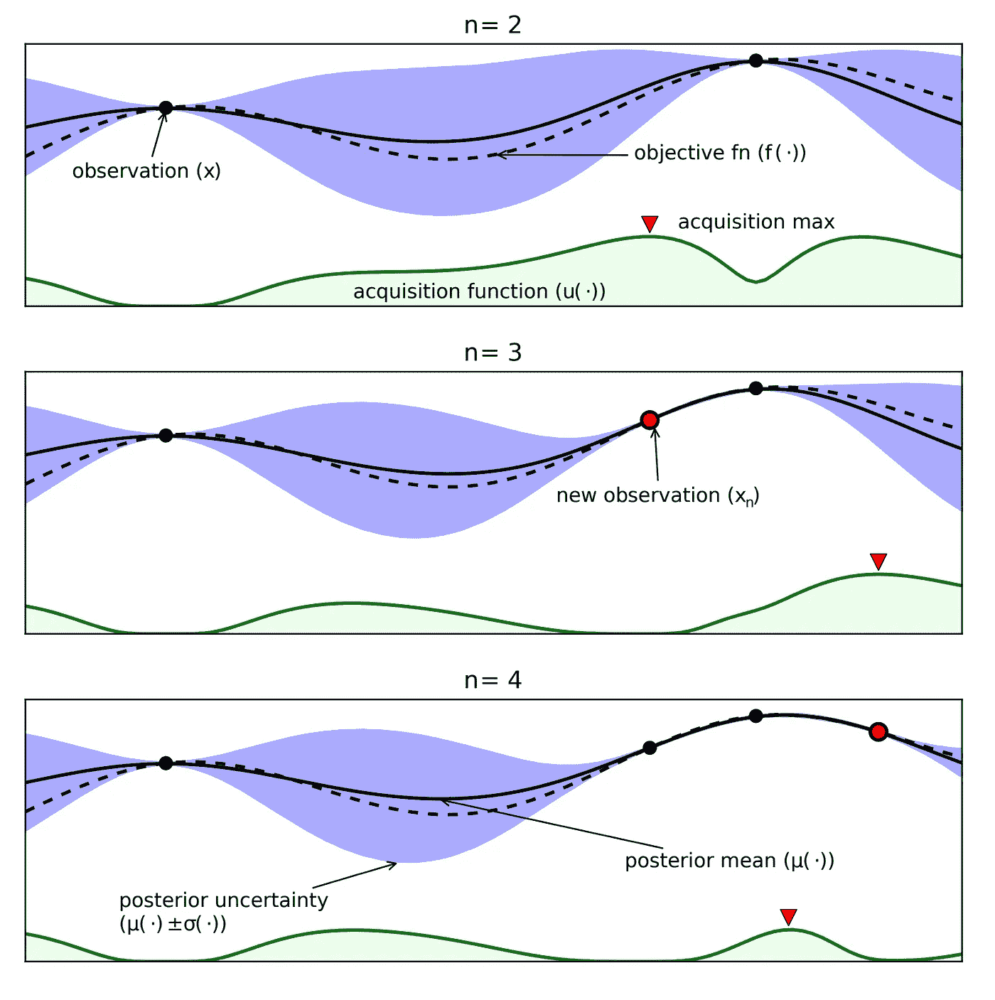
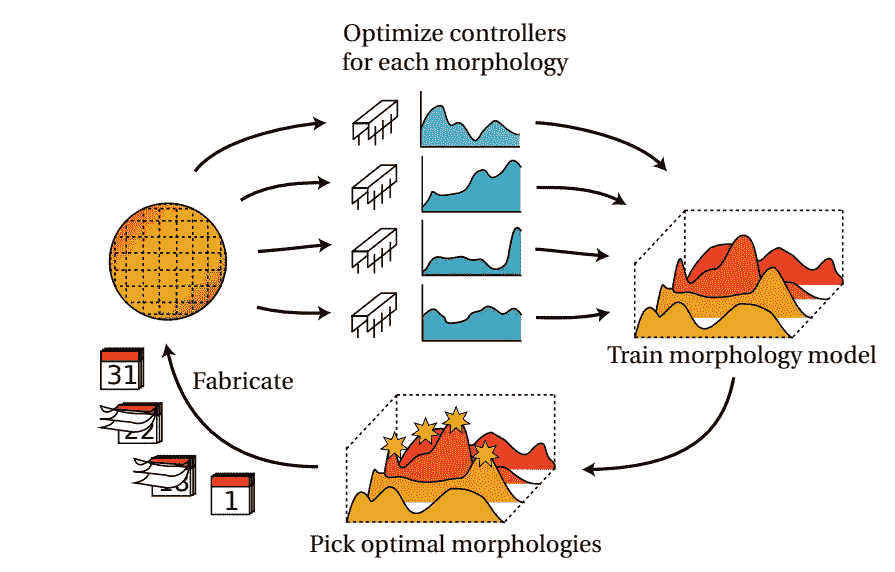
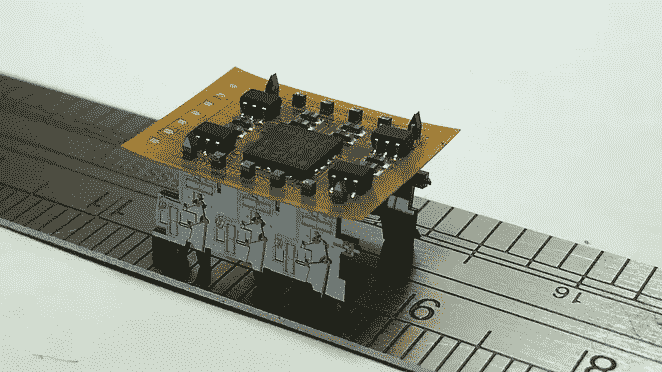
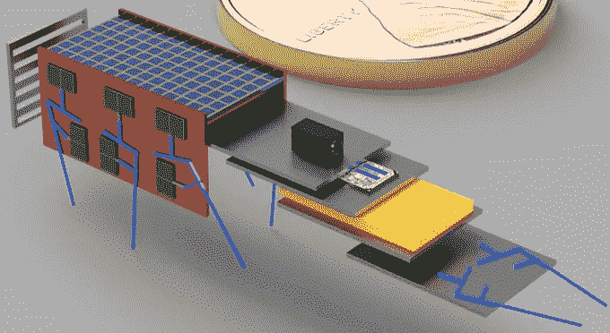
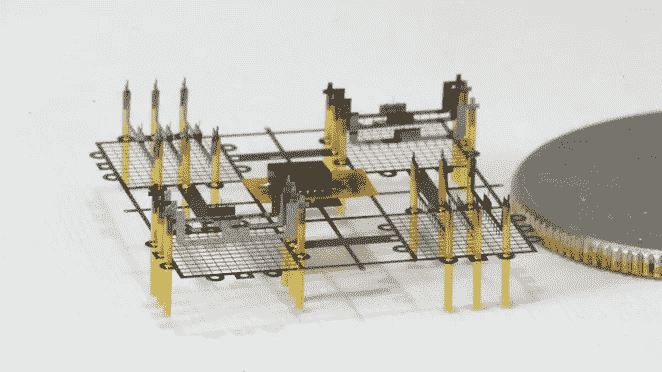

# 深度 RL 案例研究:自动化工程

> 原文：<https://towardsdatascience.com/deep-rl-case-study-automating-engineering-96779921d108?source=collection_archive---------36----------------------->

## 人工智能和计算机系统能接管工程的其他领域吗？

在不同的工程领域中，参数调整是一个常数。计算机科学家调整他们模型的值，电气工程师改变他们晶体管的宽度，化学工程师检查他们过程的效率。这些不同角色的不变方面:*人类在高维、非凸优化问题上是不可靠的。*在所有这些情况下，我们的大脑就是优化功能——**设计工程师还可以使用哪些优化器**，为什么要使用？最近发现的这些工程角色之间的差异*:只有计算问题被结构化和规范化到足以让学习戏剧性地改变它们。*

# 自动参数调整— AutoML:

AutoML，即自动机器学习，正在流行起来。当我在脸书的时候，我正在测试 PyTorch 的预发布版本，Berkeley 的同事刚刚发布了他们自己的开源包 [Tune (for Ray)](https://ray.readthedocs.io/en/latest/tune.html) 。

 [## 使用射线调谐的尖端超参数调谐

### 介绍 Ray Tune，这是最先进的超参数调节库，可供研究人员和开发人员在任何…

medium.com](https://medium.com/riselab/cutting-edge-hyperparameter-tuning-with-ray-tune-be6c0447afdf) 

AutoML 是做什么的？简而言之，它…

1.  **加载设计变量和目标的向量**，
2.  **将模型**拟合到目标函数，
3.  **返回当前数据集中的最佳参数**。

现在，我们可以了解这意味着什么。

## 设计变量和设置

每个设计问题都有一组要优化的变量，变量的数量决定了要使用的优化器的类型。由于难以限制优化器可访问的变量，自动化设计的采用受到限制。工程师运用多层次的知识来理解系统是如何工作的。他们利用这些知识来调整许多方面，并汇聚成一个解决方案——通常在不受约束的环境中工作。现代机器学习在结构化问题中工作得非常好，所以在实际问题中启用 AutoML 的很大一部分是有效的**数据科学**。设计师必须将系统最重要的方面提取到变量的子集里(有人知道主成分分析吗？)被标准化并准备好供计算机拟合和迭代。

这些原则只有在工具设置好之后才能应用，也就是说，学习算法可以直接改变感兴趣的变量并运行新的模拟。自动化设计的影响力取决于它改变和测试新参数的能力。工具的障碍是这些问题的解决方案变得非常小众的原因— *需要对参数优化和设计工具有博士水平的理解才能在硬件中部署它们*。

## 为目标建模

贝叶斯优化是 AutoML 优化器中使用最频繁的工具(*可以使用任何非梯度依赖优化器:备选包括* [*遗传算法*](https://en.wikipedia.org/wiki/Genetic_algorithm) *或* [*交叉熵方法*](https://en.wikipedia.org/wiki/Cross-entropy_method) )。

在**贝叶斯优化**循环(算法)中迭代**高斯过程**(模型)的拟合。黑点代表数据，这显示了 2 到 4 个数据点。目标函数通过测量拟合表面，并预测状态空间剩余部分的平均值和方差。绿色(激活功能)用于选择下一组参数，参见下面的**优化选择**部分。(来源— [将人类从循环中解放出来……](https://www.cs.ox.ac.uk/people/nando.defreitas/publications/BayesOptLoop.pdf))

目标的模型就是**所捕获的正在设计的系统的行为**。这是至关重要的一步，它使计算机成为一种更加结构化的选择形式。计算机可以用平滑高斯过程、深度神经网络或概率分布的组合来模拟复杂的非线性函数。

这些不同的模型选项**在表达性、可解释性和样本效率**之间进行权衡。高斯过程(最终是非参数高斯分布)是一个很好的选择，因为它们在样本效率方面占优势，同时带有可解释的不确定性概念。

## 最佳选择

这是计算机比人类获益最多的地方。

人类擅长将一种设计与另一种设计进行比较(*也许是不可思议的强烈直觉*)，但我们缺乏任何真正的能力来提出给定数据集的最佳或接近最佳的下一组参数。使用结构化学习模型为算法提供了一种明确的方式来决定下一个参数集。

在贝叶斯优化中，传递下一组参数的工具被称为**采集函数**。获取功能是另一个可供人类选择的设计选项。*其他方法(CMA、CEM 等)可以将他们的预测建模为样本分布，取这种分布的平均值就是当前的最优估计。*采集函数的不同选择在参数探索、模型开发和先验知识之间进行平衡。关键是****优化器消除了困扰人类调优*** 的选择歧义。*

* [## 将人带出循环:贝叶斯优化综述

### 编辑描述

dash.harvard.edu](https://dash.harvard.edu/handle/1/27769882) 

如果你正在为你的项目寻找一个 AutoML 工具——看看这个来自弗赖堡的[研究小组。](https://www.automl.org/)* 

*我们认为优化一组参数——人类在 ***中调十几个变量*** *还是人类选择几个* ***算法棋子*** 哪个更好？让我们看看在研究中选择适合当前特定设计问题的优化器和模型的可能性。*

**

*来源——我的大阪之旅。*

# *自动化设计的前沿*

*我概述了去年给我留下深刻印象的自动化工程的两个最近的例子。(*我正试图从这些研究中获得灵感，在我自己的研究中优化机器人设计，这有望导致这篇博文的第二个版本。*)*

## *电路设计*

*Kourosh Hakhamaneshi 等人。al 将**进化算法**(优化选择)和**深度神经网络鉴别器**(目标函数模型)应用于高维**电路设计问题**(设计空间)。*

*电路设计涉及许多方面，但在高层次上，设计一个片上系统的一个组件归结为四个步骤:1)改变**原理图**(使用的组件，例如晶体管、电阻)，2) **模拟**原理图，直到它是准确的，3) **布局**原理图，以便它可以在电路代工厂(TSMC，英特尔)创建，4) **模拟**电路布局。*最耗时的环节是最后一步，模拟可能需要几天时间*。原理图-模拟-布局-模拟是一个非常宽的循环，其中简单的迭代不会产生任何功能性结果。*

**

*(来源— [BAIR 在 BagNet 上的博客文章](https://bair.berkeley.edu/blog/2019/09/26/circuits/))*

*如果一种算法不能减少模拟(和验证)电路如何制造所需的时间，那么它知道在哪里放置带电阻的晶体管只是难题的一小部分。有一个核心技术方面使本文能够实现功能性结果(过去其他项目失败的地方):*使用深度学习鉴别器来判断哪些新设计应该在布局后仿真中进行评估*。*

*电路设计的复杂性是作者以这种方式设置问题的原因。他们需要使用进化算法，因为它可以快速地提出更多的样本，并获得关于参数是否应该工作的初始指示(给定历史人口数据)，然后鉴别器充当过滤器，以大幅减少计算负担。*

*这种方法的主要优势是 ***它能够在模拟电路设计*** 的各种约束条件下工作。这篇论文的作者代表了离线优化和电路设计领域的知识高峰——在专门问题上实现新颖优化所需的罕见组合，因此希望 [BagNet](https://www2.eecs.berkeley.edu/Pubs/TechRpts/2019/EECS-2019-25.pdf) 取得成功。*

* [## 模拟电路设计的样本高效进化算法

### 在这篇文章中，我们分享了一些关于深度学习在模拟 IC 设计中的应用的最新成果…

bair.berkeley.edu](https://bair.berkeley.edu/blog/2019/09/26/circuits/) 

## 机器人设计

这里托马斯·廖等人。al 将**贝叶斯优化**(优化选择)和**高斯过程**(目标函数模型)应用于**微机电系统**优化(设计空间)。

在任何硬件设计问题中，设计的*评估通常会因几周的制造时间*而延迟。这在微机电系统(MEMs)中尤其如此**、**，其中有两个阶段用于延迟和变化:掩模组装(工具设置)和纳米制造(实际构造)。该方法通过启用参数空间的**并行搜索来增加设计优化的吞吐量。本文使用贝叶斯优化循环的升级版本。**

(来源—[MEMs 论文中的形态学学习](https://arxiv.org/pdf/1905.01334.pdf))

伟大的洞察力是用一个新的获取函数修改贝叶斯优化，该函数返回一组参数向量以在下一次评估中尝试。然后，该模型可以立即适应所有这些试验，并提出另一批试验。这就是所谓的**分层过程约束批量贝叶斯优化(HPC-BBO)** 。该模型可以拟合来自问题的任何数据，因此并行评估是挂钟时间的实质性改进(使用新的采集功能可能会稍微降低采样效率)。

实现这一点的两个关键技术细节是 1) **用模型**想象真实过程的回报(标准贝叶斯优化需要在获得另一个样本之前评估真实系统上的参数)，首先在[批量贝叶斯优化](http://papers.nips.cc/paper/6933-process-constrained-batch-bayesian-optimisation.pdf)中提出，以及 2) **关于第二个约束的批量建议参数的上下文优化**——需要设计与特定控制器一起工作，这成为一个联合学习问题。

这种学习协议强调了 AutoML 在结构问题上的工作能力，这些问题过去是专门留给人类设计师的。**结构和并行化**使其在实际硬件中循环时非常高效。

 [## 微机器人形态学和控制器的高效数据学习

### 机器人设计通常是一个缓慢而困难的过程，需要反复构建和测试原型，并且…

arxiv.org](https://arxiv.org/abs/1905.01334) 

来自我实验室的真实(外部)和想象的微型机器人。(来源相关[学术](https://ieeexplore.ieee.org/abstract/document/7994197) [论文](https://ieeexplore.ieee.org/abstract/document/8373697)来自我的小组)* 

*这种方法在很多方面都站不住脚——设计变量太多，无法访问特定机构使用的专有设计工具之外的数据，缺乏老一辈工程师的教育。也就是说，一些年轻的专家在他们的领域所付出的努力会产生巨大的回报。*