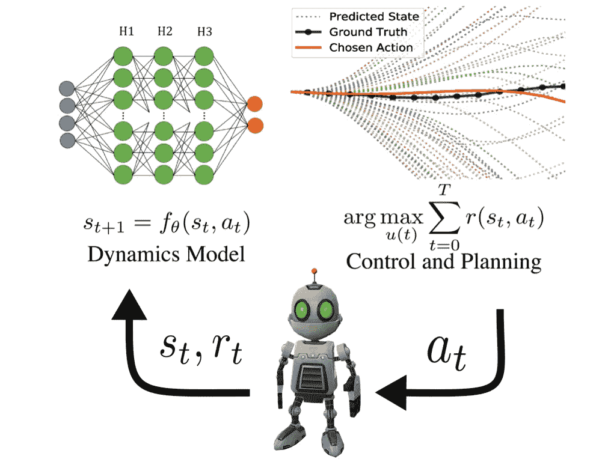
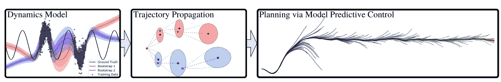
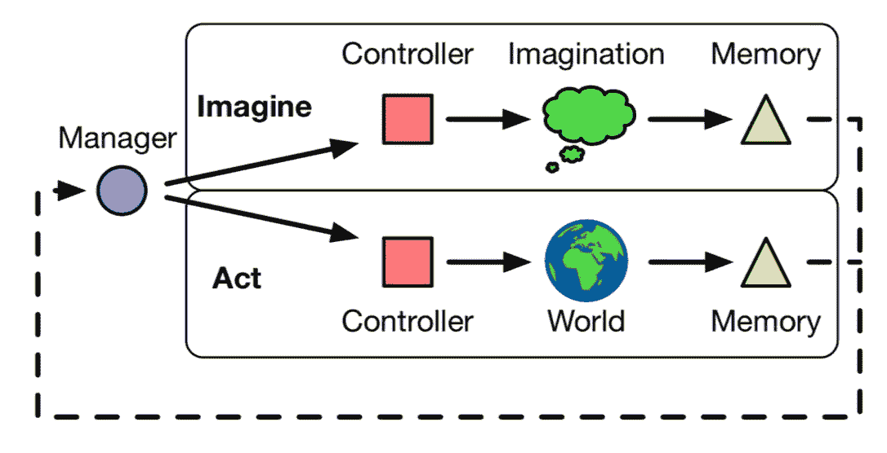
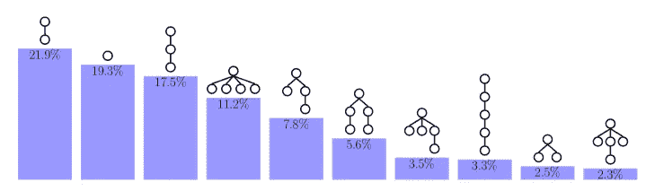
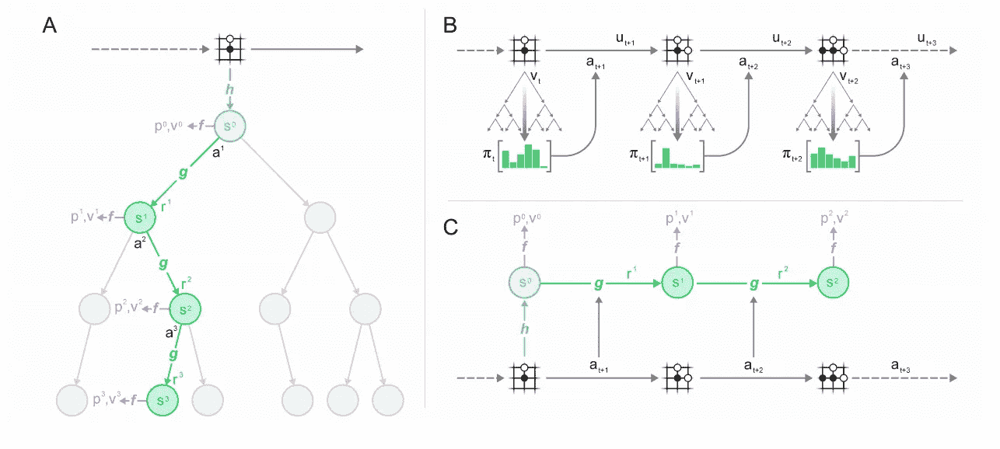

# 深度 RL 案例研究:基于模型的规划

> 原文：<https://towardsdatascience.com/deep-rl-case-study-model-based-planning-1d85822b0c0d?source=collection_archive---------22----------------------->

## 模型学习为强化学习领域提供了结构和可解释性。

什么是基于模型的强化学习，什么是对其未来的乐观，DeepMind 在最近的一篇论文中说它的代理可以通过“做梦”从零开始学习计划是什么意思。基于模型的学习可能是**样本最优的**——如果我们能够恰当地捕捉环境的动态，那么代理可以精确地计划来完成我们想要的任何任务(其中无模型学习专注于单个任务)。DeepMind 最近的 MuZero 算法向世界表明，由于其规划能力，MBRL 将继续存在。

## **快速历史拍摄**

许多决策算法一直使用环境模型来解决问题。一些经典的例子包括搜索方法，如 A-Star 或树搜索。这些计划顺序动作的方法的问题是它们缺乏在连续环境中的能力。当您试图创建一个包含无限个候选动作的动作选择树时，会发生什么？这个缩放问题是深度强化学习中基于模型的规划试图通过将动作选择转换为易处理的优化问题来覆盖的众多问题之一——给我们一个动作而不是一个样本空间。

## **基于模型的强化学习回顾**

MBRL 的方块图。来源，我在 IROS 2019 的[演讲。](https://arxiv.org/abs/1901.03737)

基于模型的强化学习(MBRL)遵循代理在其环境中行动的方法，学习所述环境的模型，然后利用该模型来行动。它通常以参数化的动态模型为特征，通知某种控制器。该回路在图中用 Clank 表示。在 MBRL，通常控制问题在它本身和动态模型的学习之间缺少一个链接，这引入了一些最优性的损失。本文将关注如何使用某种动力学模型来计划一系列的动作。我首先回顾了一些过去的方法，并借鉴了 DeepMind 最近的工作，该工作正在准备使用基于模型的规划来解决 RL 中令人兴奋的前沿问题。

我年轻的非专业摄影还在继续。降落在哥斯达黎加的坦博尔。

## **使用概率动力学模型的少量试验中的深度强化学习**

MBRL 和规划一直在大幅上升，特别是自从蔡氏等人在 2018 年神经信息处理会议上的一篇同事论文:“[使用概率动力学模型的少数试验中的深度强化学习](https://arxiv.org/pdf/1805.12114.pdf)”**(spot light paper ~ 4%的被接受论文)。艾尔。它描述了如何将动力学模型塑造成一个有用的控制器，这是 MBRL 第一次因为渐近最优(与软 actor-critic 和其他无模型算法相比)和样本效率更高而受到关注。**

****

**PETS 中使用的三个模块是深度动力学模型、轨迹传播器(不是真正的规划器)和基于采样的控制([来源](https://arxiv.org/pdf/1805.12114.pdf))。**

## ****何时信任您的模型:基于模型的策略优化****

**另一篇直接导致 DeepMind 最近工作的论文(我认为是 MBRL 领域相当有开创性的)是 Janner 等人的论文“[何时信任你的模型:基于模型的策略优化](https://arxiv.org/pdf/1906.08253.pdf)”，该论文对 MBRL 的早期工作进行了两项根本性的改变:1)他们成功地表明基于模型的算法可以使用标准的上下文策略(当状态传入时返回动作的网络)作为控制器，2) MBRL 可以使用动态模型的离线模拟来改进控制策略的当前迭代。**

**这种算法的工作原理是创建一个动态模型，然后在模拟中对动态模型运行非常短的软 actor-critic 部署，这在很少的环境交互中生成可靠的策略，创造了基于模型的策略优化(MBPO)。**

****

**在模型上进行模拟时，对未来的不确定性估计迅速增加([来源](https://arxiv.org/pdf/1906.08253.pdf))。**

## ****从头开始学习基于模型的规划****

**Pascanu、李和 DeepMind 团队的这篇较老的论文“从零开始[学习基于模型的规划](https://arxiv.org/pdf/1707.06170.pdf)”试图解决这样的批评:“虽然模型可以用来*评估*一个计划，但它并没有规定如何*构建*一个计划。”以经典的 DeepMind 方式——他们改进并整合了最近研究的许多方面到一个令人印象深刻的系统中。他们正在接受 MBRL 挑战，并为动力学模型的离线模拟创造了术语“想象力”(非常类似于两年后问世的 MBPO)。这种情况下的关键区别是，在这种新的基于想象的计划方法(IBP)中，他们还**学习何时想象**，并以巧妙的方式使用真实和模拟体验中的上下文。**

****

**对 [IBP](https://arxiv.org/pdf/1707.06170.pdf) 的想象框架。**

**类似于 MBPO，这项最新的工作使用情境化的策略进行控制。扩展在于，IBP 不是仅仅使用过去的状态来决定下一步行动，而是有自己的方法来生成上下文。作者使用长短期记忆(LSTM)模块从最近的模拟和真实经历中学习上下文，这提高了控制任务的性能。本文评估了向前一步、向前 n 步和全树探索的性能。全树探索允许管理者通过不同深度的不同动作来探索想象，通过最大计算成本来限制探索的深度和广度。 ***MBPO*** *在这个设置上做了改进，在想象时使用了一种无模型算法的状态，以获得令人印象深刻的性能。***

****

**学习基于树的规划允许对不同深度和宽度的真实世界和想象的行动进行评估，以及估计的回报([来源](https://arxiv.org/pdf/1707.06170.pdf))。**

**作者提出，这种想象框架也可以很好地进行概括。我认为这与元学习有关，在这种情况下，管理者——处理何时行动与何时计划——可以处理任务抽象，并学习学习不同的任务(在现实和模拟中)。经理目前是一个离散的行动，奖励很少，所以学习起来一定很难——他们目前在这里使用强化算法。**

> **这篇论文是 DeepMind 刚刚发布的一些工作的前身，他们将规划集成到他们的**巨型**机器学习系统中，以解决具有巨大行动空间和高天花板的游戏。**

# **高潮:穆泽罗**

**Schrittwieser 等人的模型“通过计划掌握雅达利、围棋、国际象棋和日本象棋。al 是基于模型的 RL 的一个重要时刻。显示 MBRL 可以直接从像素(建立模型的常见斗争点)解决雅达利游戏作为一种新的艺术状态，将进一步推动 MBRL 在顶级强化学习会议中的指数级上升(*几年前不到 1%，很快达到 RL 论文的 10%左右*)。**

****

**用一个已学过的模型来计划、表演和训练。a)动态模型返回一个估计的奖励和状态，它可以被转换成一个未来值，B) MuZero 根据上下文策略(类似于之前)在每个时间步使用蒙特卡罗树搜索进行操作，C) MuZero 通过验证来自重放缓冲器的轨迹并通过在真实轨迹的每一步将它们想象成一个模拟的未来来训练([来源](https://deepmind.com/research/publications/Mastering-Atari-Go-Chess-and-Shogi-by-Planning-with-a-Learned-Model))。**

**MuZero 算法将来自 MBRL 的许多块构建到一个系统中，该系统显示了无模型算法的有效性。算法需要从像素而不是物理状态观察中运行的项目，因此 MBRL 需要聪明的编码来使它们最佳地执行。主要区别包括:**

1.  **动态模型不是试图从真实的隐藏状态中计划行动和奖励，而是对一种内部状态进行编码，这种状态没有真实环境的语义表示。这允许反向传播直接最大化期望的度量，而对问题的形状具有较少的约束。**
2.  **从这个隐藏的内部状态计算策略和值函数，类似于来自 **AlphaZero** 的联合策略和值函数(它们最近的无模型 RL 成功)。**
3.  **与 AlphaZero 的蒙特卡罗树搜索(MCTS)不同的是，在推出潜在行动时，他们可以使用学习到的模型来引导**或想象**，即未来价值估计，这变成了一种基于模型的基本规划。**

**这个规划函数提高了学习算法的样本效率，因为提前规划可以达到赢得一场比赛的稀疏回报。最终，这是为什么规划有助于更快地学习的一个潜在原因——它让算法从它当前的行动中寻找回报，而不是依赖随机探索(这在 MBRL 也有帮助和贡献)。**

**(*这篇文章中没有提到的对 MBRL 的一个限制是基于模型的 RL 的墙时间效率很差——运行一个运行中的半猎豹的模拟可能需要一周时间。我希望在未来从事这项工作——基本上所有的动力学模型训练和想象步骤都会导致算法比无模型的算法运行得慢得多。一些算法，如 MBPO，甚至有奇怪的事件顺序(在每个实时步骤进行想象)，这使得它无法在真实的机器人上运行。***

**更多？订阅我关于机器人、人工智能和社会的时事通讯！**

** [## 自动化大众化

### 一个关于机器人和人工智能的博客，让它们对每个人都有益，以及即将到来的自动化浪潮…

robotic.substack.com](https://robotic.substack.com/)**