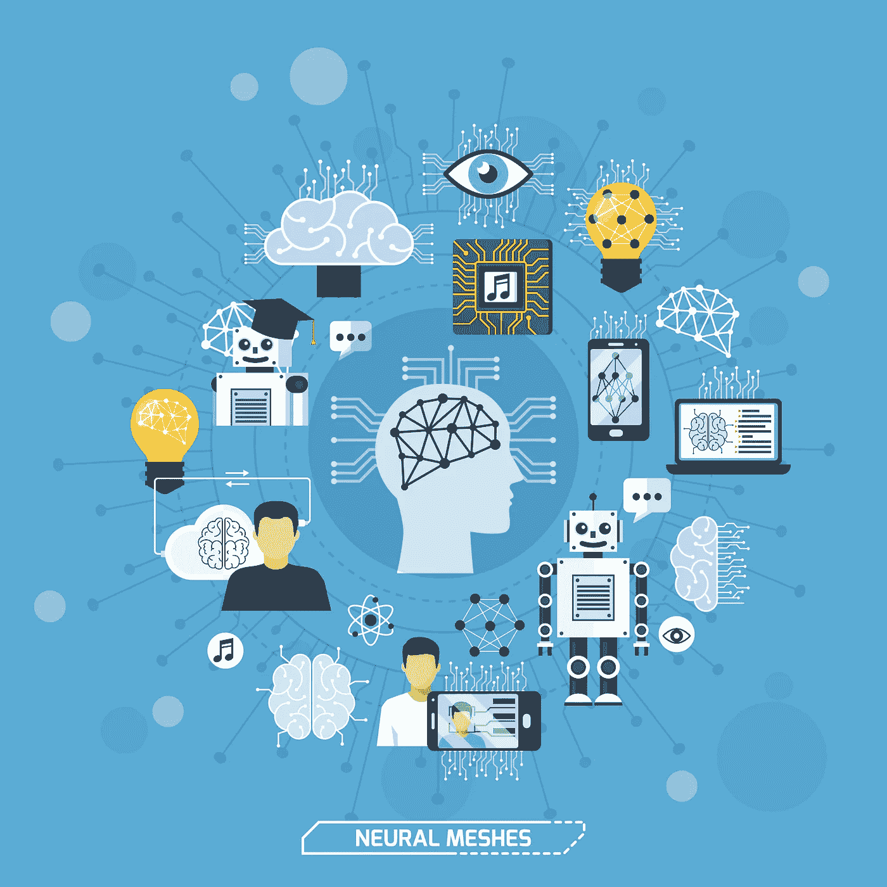

# 深度堆叠网络(DSN)

> 原文：<https://towardsdatascience.com/deep-stacking-network-dsn-f98dcf4a3631?source=collection_archive---------47----------------------->

## 神经网络已经存在了一段时间，但是提供诸如特征提取等功能的能力使得它们的使用更加可行

深度堆叠网络(DSN)是一种深度架构，旨在支持大型 CPU 集群，并受益于深度神经网络的深度学习能力。深度堆叠网络架构最初是由邓梨和董宇在 2011 年提出的，通常被称为深凸网络(DCN)，以强调用于学习网络的算法的深度。

深度网络模型已被证明是一种有前途的范式，它为高性能机器学习提供复杂数据，其中多个集中在神经网络上。近年来，为了使用非神经网络方法构建不同的深度架构，已经进行了更多的实验。深度堆叠网络(DSN)模型使用简单易学的模块来创建复杂的并行参数训练网络。

DSN 架构的核心理论是堆叠原理，正如最初建议的那样，首先组装基本的功能模块或分类器，然后相互堆叠，以便学习复杂的功能或分类器。

## 基于 SVM 的深度堆叠网络(SVM-DSN)

基于 SVM 的深度堆叠网络(SVM-DSN)使用 DSN 架构来组织用于深度学习的线性 SVM 分类器。从全局的角度来看，SVM-DSN(基于 SVM 的深层堆叠网络)可以从局部的角度，将数据表示作为深层网络逐层提取，但是是并行的。SVM 堆栈可以收敛到其理想解，并获得支持向量，与神经网络相比，这可能导致抗饱和和理解方面的令人着迷的改进。

由于其特性，SVM 和 DSN 之间的训练并行化只能达到基础水平——训练数据的定向特征和 SVM 可以为从训练数据中学习块提供支持向量。传统的 D-SNA 只能达到块级别，但是基于向量的 SVM 可以用于块学习。

SVM-DSN 模型具有一些有益的特征，例如整体和空间优化以及并行化。

## 自动编码器

自动编码器是一种人工神经网络，旨在无人值守的情况下学习有效的数据编码。深度学习当然不是什么新鲜事，但由于它能够对神经网络进行深度分层并加速其执行，近年来经历了爆发式增长。深度学习结构依赖于更多的数据，网络越深，基于样本数据进行训练并基于其成功进行奖励的受监控学习算法的数量就越多。

自动编码器堆叠是一种训练深度网络的方法，深度网络由多个层组成，并使用贪婪方法进行训练。深度堆叠网络使用采取多层感知器的简化形式的基本模块的堆叠。

有几种方法可以学习堆栈中的自动编码器，例如使用多个编码器。堆叠式自动编码器结构已经在深度神经网络的模型中使用了许多年，例如在深度学习的神经网络中。

虽然构建这些类型的深层架构可能很复杂，但它们可以很快上手。Tensorflow 中从头构建的深度堆栈自动编码器模型。在批处理架构中，每个编码层都有自己的层，它应该是一个完整的自动编码器，并且这些层都是堆叠的。由自动编码器生成的函数可以被馈送到网络的其他层，例如代码和数据层。

## DSN 的优势

神经网络已经存在了一段时间，但提供特征提取等功能的能力使其使用更加可行。GPU 能够从深度学习中受益，因为它可以更容易地训练和运行原始处理器效率不高的深度网络。这一优势使得 SVM 和 DSN 能够避免深度神经网络中的神经元饱和问题，从而提高性能。

## **引用来源**

*   [http://big road . fadyghalidesign . com/6 zax 6h/stacked-auto encoder . html](http://bigroad.fadyghalidesign.com/6zax6h/stacked-autoencoder.html)
*   [https://developer . IBM . com/technologies/artificial-intelligence/articles/cc-machine-learning-deep-learning-architectures/](https://developer.ibm.com/technologies/artificial-intelligence/articles/cc-machine-learning-deep-learning-architectures/)
*   [https://www . fotosmitk . de/0 rqzxf/image-noiseing-and-super-resolution-using-residual-learning-of-deep-convolutionary-network . html](https://www.fotosmitk.de/0rqzxf/image-denoising-and-super-resolution-using-residual-learning-of-deep-convolutional-network.html)
*   [https://www . researchgate . net/figure/A-Deep-Stacking-Network-Architecture _ fig 1 _ 272885058](https://www.researchgate.net/figure/A-Deep-Stacking-Network-Architecture_fig1_272885058)
*   [https://deepai . org/publication/SVM-based-deep-stacking-networks](https://deepai.org/publication/svm-based-deep-stacking-networks)
*   [https://arxiv.org/abs/1902.05731](https://arxiv.org/abs/1902.05731)