# 用于图像分类的深度迁移学习

> 原文：<https://towardsdatascience.com/deep-transfer-learning-for-image-classification-f3c7e0ec1a14?source=collection_archive---------3----------------------->

## 从数据导入到精度评估的分步指南

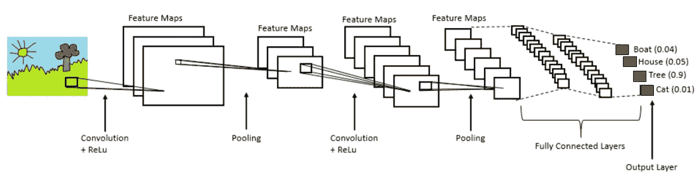

以下教程介绍了如何为图像分类建立先进的深度学习模型。该方法基于机器学习框架“Tensorflow”和“Keras”，并包括复制本教程中的结果所需的所有代码(不幸的是，在中型文章中包含代码块时的语法看起来不太好，但它应该是可读的)。

建立模型的先决条件是访问标记数据，作为一个例子，我使用了各种交通标志的图像(可以在这里下载)。因此，该模型的任务是预测它看到的是哪种交通标志。为了使示例更真实，我将数据量减少到每个类最多 200 张图像(因为在机器学习的实际应用中，数据量通常是有限的)。

这些图片当然只是作为一个例子，让你开始。只要遵循与当前设置相同的文件夹结构，就可以很容易地用您自己的图像替换它们，如下所述。

# 用您自己的数据替换图像:

将您的图像放在主文件夹“data/”下的子文件夹中，将图像类别的名称作为子文件夹名称，如下所示的示例文件夹结构。首先，您需要将图像分成训练、验证和测试数据。“training_data”文件夹中的图像是用于训练模型的实际图像，而“validation_data”文件夹中的图像用于优化训练和模型超参数。然后，测试数据被用作最终评估，在一组完全独立的图像上评估模型的准确性。

**包含数据集的文件夹结构示例:**

## 培训数据:

*   数据/列车/类别 1:类别 1 中的标志图像
*   数据/列车/类别 2:来自类别 2 的标志图像
*   …………………………………..

## 验证数据:

*   data/val/category_1:来自类别 1 的标志图像
*   data/val/category_2:第 2 类标志的图像
*   …………………………………..

## 测试数据:

*   数据/试验/类别 1:类别 1 中的标志图像
*   数据/测试/类别 2:类别 2 中的标志图像
*   …………………………………..

在“训练”、“验证”和“测试”之间分割图像的一种方式是，例如，使用 80%的图像来训练模型，并且分别对 10%的图像进行验证/测试。关于分离“训练”、“验证”和“测试”数据的重要性的简要介绍，你也可以阅读这里的

# 定义和运行模型所需的库和包:

这些是一些有用的 python 库/包，它们使我们的生活变得更加容易，因为我们不必从头开始编写所有的代码和功能。如果没有这些库/包，构建深度学习模型实际上将是一项非常艰巨的任务！

```
**import** **numpy** **as** **np**
**import** **os**
**import** **matplotlib.pyplot** **as** **plt**
**import** **seaborn** **as** **sns**

**from** **numpy.random** **import** seed
seed(1337)
**from** **tensorflow** **import** set_random_seed
set_random_seed(42)

**from** **tensorflow.python.keras.applications** **import** vgg16
**from** **tensorflow.python.keras.applications.vgg16** **import** preprocess_input
**from** **tensorflow.python.keras.preprocessing.image** **import** ImageDataGenerator, load_img
**from** **tensorflow.python.keras.callbacks** **import** ModelCheckpoint
**from** **tensorflow.python.keras** **import** layers, models, Model, optimizers

**from** **sklearn.metrics** **import** classification_report, confusion_matrix, accuracy_score
**from** **plot_conf_matr** **import** plot_confusion_matrix
```

# 定义训练/测试数据和不同的类别:

在这里，我们定义了 train/val/test 图像的位置以及我们想要分类的所有不同类别的名称。然后，我们绘制训练集中每个类别的图像数量。

```
train_data_dir = "data/train"
val_data_dir = "data/val"
test_data_dir = "data/test"category_names = sorted(os.listdir('data/train'))
nb_categories = len(category_names)
img_pr_cat = []**for** category **in** category_names:
    folder = 'data/train' + '/' + category
    img_pr_cat.append(len(os.listdir(folder)))sns.barplot(y=category_names, x=img_pr_cat).set_title("Number of training images per category:")
```

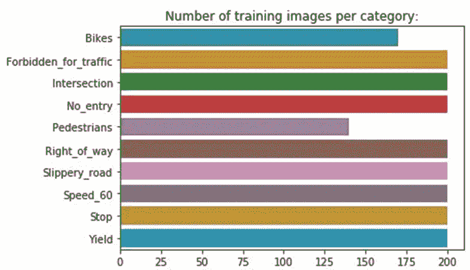

每节课的训练图像数量概述

让我们也从各种标志类别中绘制一些示例图像，以直观显示典型的图像质量:

```
**for** subdir, dirs, files **in** os.walk('data/train'):
    **for** file **in** files:
        img_file = subdir + '/' + file
        image = load_img(img_file)
        plt.figure()
        plt.title(subdir)
        plt.imshow(image)
        **break**
```

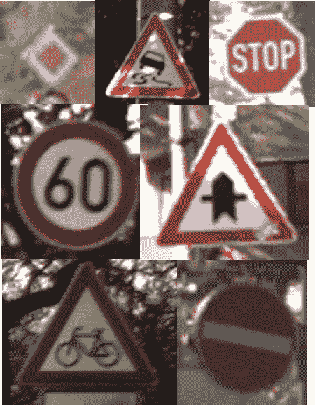

一些示例图像

正如你从上面的例子中看到的，分辨率和质量都不是很好。然而，在机器学习的实际应用中，图像质量和数据量往往非常有限。因此，与使用成千上万的“完美的”高质量图像相比，限制为每类最多 200 个训练图像的低质量图像代表了更真实的例子。

# 迁移学习:

现阶段不需要了解各种类型的深度学习模型的所有细节，但是可以在这里找到一些常用的建模方式的总结，供感兴趣的人参考。

在本教程中，我们使用预训练的深度学习模型(VGG16)作为我们图像分类器模型的基础，然后根据我们自己的数据重新训练该模型，即[迁移学习](https://en.wikipedia.org/wiki/Transfer_learning)

```
img_height, img_width = 224,224
conv_base = vgg16.VGG16(weights='imagenet', include_top=**False**, pooling='max', input_shape = (img_width, img_height, 3))
```

您可能会注意到上面的参数“pooling= 'max '”。原因是，我们不是将 VGG16 模型的卷积基础连接到最终输出层之前的几个完全连接的层(这是在原始 VGG16 模型中完成的)，而是使用最大池输出(也可以使用“平均池”，因为这取决于哪种方法效果最好的用例)。这种方法是使用完全连接的图层从要素地图过渡到模型输出预测的替代方法。根据我的经验，这种方法通常非常有效，并且使模型不容易过度拟合，正如[这篇论文](https://arxiv.org/pdf/1312.4400.pdf)中所描述的:

> 传统的卷积神经网络在网络的较低层执行卷积。对于分类，最后一个卷积层的特征图被矢量化，并馈入完全连接的层，随后是 softmax 逻辑回归层。这种结构将卷积结构与传统的神经网络分类器联系起来。它将卷积层视为特征提取器，生成的特征以传统方式进行分类。
> 
> 然而，完全连接的层容易过度拟合，从而阻碍了整个网络的泛化能力。在本文中，我们提出了另一种称为全局平均池的策略来取代 CNN 中传统的全连接层。我们没有在特征地图上添加完全连接的层，而是取每个特征地图的平均值，并将结果向量直接输入 softmax 层。与完全连接的图层相比，全局平均池的一个优势是，它通过加强要素地图和类别之间的对应关系，更适合卷积结构。因此，特征图可以很容易地解释为类别置信度图。另一个优点是在全局平均池中没有要优化的参数，因此在这一层避免了过拟合。此外，全局平均池汇总了空间信息，因此对输入的空间平移更具鲁棒性。我们可以把全局平均池看作一个结构正则化器，它明确地强制特征图成为概念(类别)的置信度图。

加载了预训练的 VGG16 模型后，我们还可以选择在下面的代码块中冻结模型的“更深的层”，只在我们自己的数据上重新训练最后几层。这是一种常见的迁移学习策略，当可用于训练的数据量有限时，这通常是一种很好的方法。

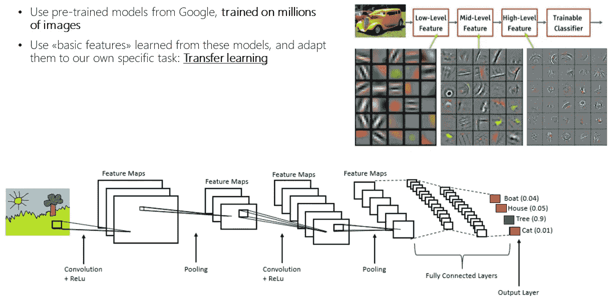

迁移学习

这个选项目前在代码中被注释掉了(使用#符号)，因此我们正在重新训练模型的所有层。训练的层数代表了一个你可以自己试验的参数。可训练层数如何影响模型性能？

```
*#for layer in conv_base.layers[:-13]:*
*#    layer.trainable = False*
```

作为检查，我们还可以打印模型所有层的列表，以及它们是否可训练(对/错)

```
**for** layer **in** conv_base.layers:
    print(layer, layer.trainable)
```

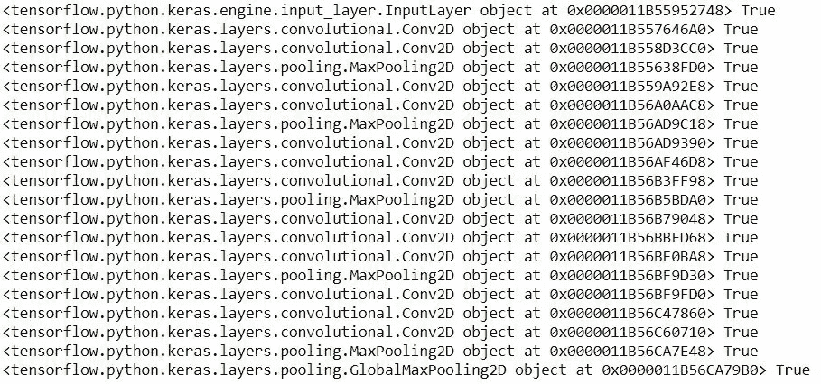

使用 VGG16 模型作为基础，我们现在在上面构建最终的分类层来预测我们定义的类。然后，我们打印模型摘要，列出模型的参数数量。如果你决定“冻结”一些层，你会注意到下面的“可训练参数”的数量将会减少。

```
model = models.Sequential()
model.add(conv_base)
model.add(layers.Dense(nb_categories, activation='softmax'))
model.summary()
```

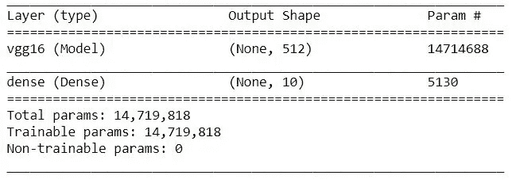

正如您所看到的，模型最后一层的输出形状对应于类的数量，在我们的例子中是 10。

# 用于读取和处理图像的发生器:

然后，我们需要定义一些函数，从我们的文件夹中读取图像，并将它们提供给图像分类器模型。作为其中的一部分，我们还添加了一些基本的图像预处理，其中输入图像被缩放为具有范围[0，1]内的像素值(在原始图像中为 0–255)。

```
*#Number of images to load at each iteration*
batch_size = 32*# only rescaling*
train_datagen =  ImageDataGenerator(
    rescale=1./255
)
test_datagen =  ImageDataGenerator(
    rescale=1./255
)*# these are generators for train/test data that will read pictures #found in the defined subfolders of 'data/'*print('Total number of images for "training":')
train_generator = train_datagen.flow_from_directory(
train_data_dir,
target_size = (img_height, img_width),
batch_size = batch_size, 
class_mode = "categorical")print('Total number of images for "validation":')
val_generator = test_datagen.flow_from_directory(
val_data_dir,
target_size = (img_height, img_width),
batch_size = batch_size,
class_mode = "categorical",
shuffle=**False**)print('Total number of images for "testing":')
test_generator = test_datagen.flow_from_directory(
test_data_dir,
target_size = (img_height, img_width),
batch_size = batch_size,
class_mode = "categorical",
shuffle=**False**)
```

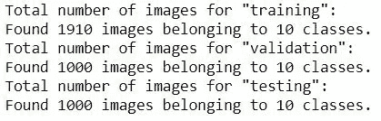

运行上述代码块的输出

# 定义模型参数并开始训练:

这里，我们定义一些控制模型训练过程的参数。重要的参数是例如训练率、多少个时期来训练模型以及使用哪个优化器。你不需要理解所有这些术语来跟随教程，但是感兴趣的人可以在这里快速阅读。

我们还定义了一个检查点参数，在训练期间，我们在每个时期之后跟踪验证的准确性。利用这一点，我们总是保留在训练过程中表现最好的模型的副本。

```
learning_rate = 5e-5
epochs = 10checkpoint = ModelCheckpoint("sign_classifier.h5", monitor = 'val_acc', verbose=1, save_best_only=**True**, save_weights_only=**False**, mode='auto', period=1)
model.compile(loss="categorical_crossentropy", optimizer=optimizers.Adam(lr=learning_rate, clipnorm = 1.), metrics = ['acc'])
```

我们现在准备好开始根据我们自己的数据训练模型，对于每个“时期”,我们打印训练和验证损失和准确性。在训练数据上测量的模型精度由“acc”给出，在验证集中的图像上的精度由“val_acc”给出。这是最重要的量，因为它告诉我们模型在训练过程中尚未看到的图像上有多精确。

理想情况下,“val_acc”应该随着我们不断训练模型而针对每个时期增加，并且当我们的模型不能从我们的训练数据中学习到任何更有用的信息时，最终达到稳定的值。

```
history = model.fit_generator(train_generator, 
                              epochs=epochs, 
                              shuffle=**True**, 
                              validation_data=val_generator,
                              callbacks=[checkpoint]
                              )
```

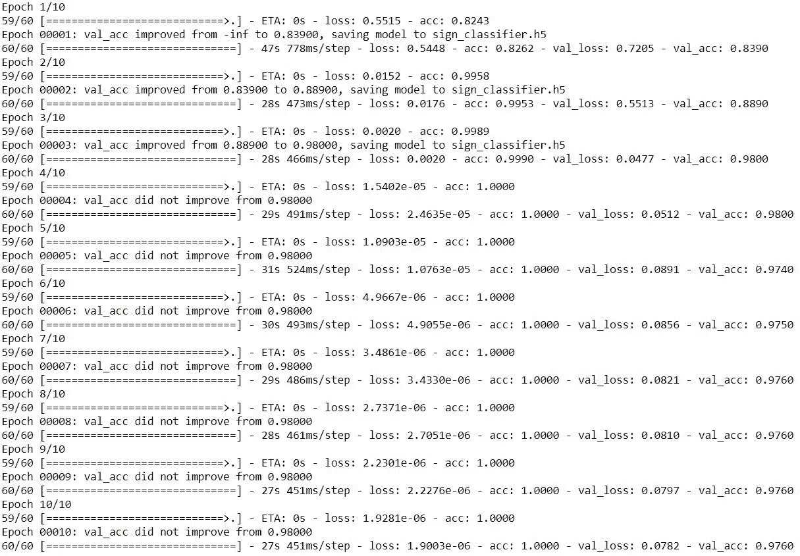

培训期间的输出

从上面显示的输出中，我们可以看到，在训练过程中，损耗减少了，而精度增加了。每次验证精度达到新的最大值时，都会保存检查点文件(输出:“将模型保存到 sign_classifier.h5”。训练完成后，我们加载在训练期间具有最佳验证准确性的检查点文件:

```
model = models.load_model("sign_classifier.h5")
```

# 评估模型准确性:

我们首先将模型精度的变化和训练过程中的损失可视化，因为这为我们提供了重要的信息来评估我们可以做些什么来提高精度。想要更好地了解这个话题，你也可以看看这个视频:

绘制和保存学习曲线的代码:

```
acc = history.history['acc']
val_acc = history.history['val_acc']
loss = history.history['loss']
val_loss = history.history['val_loss']epochs = range(1,len(acc)+1)plt.figure()
plt.plot(epochs, acc, 'b', label = 'Training accuracy')
plt.plot(epochs, val_acc, 'r', label='Validation accuracy')
plt.title('Training and validation accuracy')
plt.legend()
*plt.savefig('Accuracy.jpg')*plt.figure()
plt.plot(epochs, loss, 'b', label = 'Training loss')
plt.plot(epochs, val_loss, 'r', label='Validation loss')
plt.title('Training and validation loss')
plt.legend()
*plt.savefig('Loss.jpg')*
```

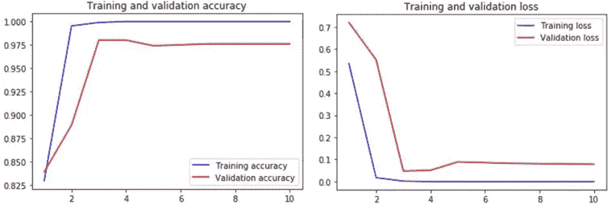

从左图开始，显示了训练/验证准确性:蓝线表示在训练图像上测量的模型准确性，我们看到这很快达到几乎为 1 的值(这表示对 100%的训练图像进行了正确分类)。然而，验证准确性是在验证集上测量的准确性，这是我们真正关心的准确性。在这种情况下，准确率稳定在 97–98%左右，这意味着我们成功地将验证集中的几乎所有图像分类到正确的类别。

为了了解不同类别的准确性，我们可以计算并绘制“[混淆矩阵](https://en.wikipedia.org/wiki/Confusion_matrix)”。这代表了评估模型准确性的说明性方式，因为它比较了测试集中所有图像的“真实”与“预测”类别。注意:如果重新运行代码时没有得到完全相同的数字，也不用担心！在模型初始化等方面存在一些固有的随机性。这使得结果有时略有不同。

(计算和绘制混淆矩阵的代码包含在图的下方)

```
Y_pred = model.predict_generator(test_generator)
y_pred = np.argmax(Y_pred, axis=1)

cm = confusion_matrix(test_generator.classes, y_pred)
plot_confusion_matrix(cm, classes = category_names, title='Confusion Matrix', normalize=**False**, figname = 'Confusion_matrix_concrete.jpg')
```

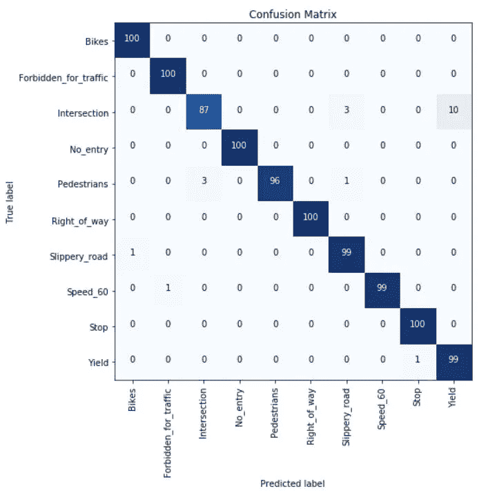

是脚本“plot_conf.py”中的代码，其中包含绘制混淆矩阵的函数“plot _ conf _ matrix”。

```
import numpy as np
import matplotlib.pyplot as pltdef plot_confusion_matrix(cm, classes, figname,
 normalize=False,
 title=’Confusion matrix’,
 cmap=plt.cm.Blues):
 “””
 This function prints and plots the confusion matrix.
 Normalization can be applied by setting `normalize=True`.
 “””
 import numpy as np
 import matplotlib.pyplot as plt
 import itertools
 if normalize:
 cm = cm.astype(‘float’) / cm.sum(axis=1)[:, np.newaxis]
 print(“Normalized confusion matrix”)
 else:
 print(‘Confusion matrix, without normalization’)plt.figure(figsize=(8,8))
 plt.imshow(cm, interpolation=’nearest’, cmap=cmap)
 plt.title(title)
 #plt.colorbar()
 tick_marks = np.arange(len(classes))
 plt.xticks(tick_marks, classes, rotation=90)
 plt.yticks(tick_marks, classes)fmt = ‘.2f’ if normalize else ‘d’
 thresh = cm.max() / 2.
 for i, j in itertools.product(range(cm.shape[0]), range(cm.shape[1])):
 plt.text(j, i, format(cm[i, j], fmt),
 horizontalalignment=”center”,
 color=”white” if cm[i, j] > thresh else “black”)plt.ylabel(‘True label’)
 plt.xlabel(‘Predicted label’)
 plt.tight_layout()
 plt.savefig(figname)
```

从上面的混淆矩阵中可以看出，模型错误分类的主要类别是“交叉点”，在其中的 10 幅图像中，它将该类别与“产量”类别相混淆。作为最后的度量，我们还可以计算在测试集上评估的总准确性

```
accuracy = accuracy_score(test_generator.classes, y_pred)
print("Accuracy in test set: **%0.1f%%** " % (accuracy * 100))
```

这给出了 98%的输出精度，这还不错！但是，我们能做得更好吗？我们的数据量有限，那么使用[图像增强](/image-augmentation-for-deep-learning-histogram-equalization-a71387f609b2)来改善它怎么样？

# 图像增强模型:

在我们的例子中，该模型已经表现得非常好，准确率为 97–98%。然而，当处理有限数量的训练数据时，一种策略是“图像增强”。也就是说，我们收集了现有图像的副本，但是做了一些小的修改。这些变化可以是变换，例如轻微旋转、缩放、水平翻转图像、++。此处还介绍了[图像增强的更多示例。](/image-augmentation-for-deep-learning-histogram-equalization-a71387f609b2)

在下文中，我们定义了与之前相同的模型，但是这里我们也将图像增强作为一种人工增加训练数据量的方式。

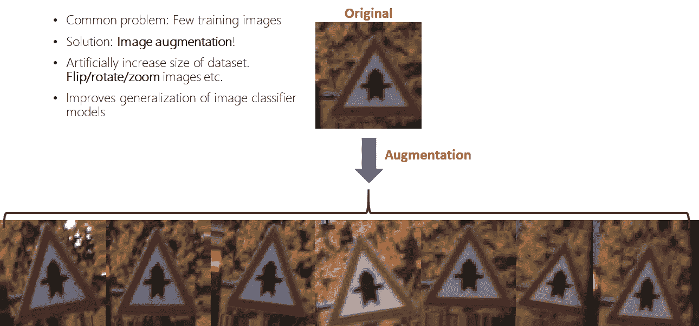

使用与之前相同的卷积基础和模型结构，编写代码来构建新模型:

```
conv_base = vgg16.VGG16(weights='imagenet', include_top=**False**, pooling='max', input_shape = (img_width, img_height, 3))

*#for layer in conv_base.layers[:-13]:*
*#    layer.trainable = False*model = models.Sequential()
model.add(conv_base)
model.add(layers.Dense(nb_categories, activation='softmax'))
```

# 增强功能:

我们代码中唯一需要更改的是下面显示的训练数据生成器的定义。我们可以在这里添加一些数据增加策略，例如[-10，10]度范围内的随机旋转，范围±10%内的随机缩放和宽度/高度移动，以及范围±10%内的亮度变化。

作为增强图像的示例，我们可以将它们保存到指定的文件夹“augm_images ”,如下面的功能“train_generator”中所定义的。此选项目前已被注释掉(以避免保存数千幅图像)，但如果您想要可视化您合并的增强，您可以更改此选项。这通常是一个好主意，只是为了确保增强的图像对于您正在处理的用例仍然有意义。

```
train_datagen = ImageDataGenerator(
        rescale=1./255,
        rotation_range=10,
        zoom_range=0.1,
        width_shift_range=0.1,
        height_shift_range=0.1,
        horizontal_flip=**False**,
        brightness_range = (0.9,1.1),
        fill_mode='nearest'
        )

*# this is a generator that will read pictures found in*
*# subfolers of 'data/train', and indefinitely generate*
*# batches of augmented image data*

train_generator = train_datagen.flow_from_directory(
train_data_dir,
target_size = (img_height, img_width),
batch_size = batch_size, 
*#save_to_dir='augm_images',* 
save_prefix='aug', 
save_format='jpg',
class_mode = "categorical")
```

# 使用扩充数据训练新模型

我们现在准备使用额外的增强数据来训练相同的模型，这应该有望提高模型的准确性。

```
learning_rate = 5e-5
epochs = 20
checkpoint = ModelCheckpoint("sign_classifier_augm.h5", monitor='val_acc', verbose=1, save_best_only=**True**, save_weights_only=**False**, mode='auto', period=1)
model.compile(loss="categorical_crossentropy", optimizer=optimizers.Adam(lr=learning_rate, clipnorm=1.), metrics = ['acc'])history = model.fit_generator(train_generator, 
                              epochs=epochs, 
                              shuffle=**True**, 
                              validation_data=test_generator,
                              callbacks=[checkpoint]
                              )
```

训练完成后，我们再次加载在训练期间具有最佳验证准确性的检查点文件:

```
model = models.load_model("sign_classifier_augm.h5")
```

## 绘制学习曲线:

```
acc = history.history['acc']
val_acc = history.history['val_acc']
loss = history.history['loss']
val_loss = history.history['val_loss']

epochs = range(1,len(acc)+1)

plt.figure()
plt.plot(epochs, acc, 'b', label = 'Training accuracy')
plt.plot(epochs, val_acc, 'r', label='Validation accuracy')
plt.title('Training and validation accuracy')
plt.legend()
*#plt.savefig('Accuracy_Augmented.jpg')*

plt.figure()
plt.plot(epochs, loss, 'b', label = 'Training loss')
plt.plot(epochs, val_loss, 'r', label='Validation loss')
plt.title('Training and validation loss')
plt.legend()
*#plt.savefig('Loss_Augmented.jpg')*
```

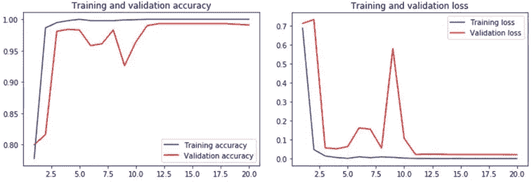

## 计算并绘制混淆矩阵:

```
Y_pred = model.predict_generator(test_generator)
y_pred = np.argmax(Y_pred, axis=1)

cm_aug = confusion_matrix(test_generator.classes, y_pred)
plot_confusion_matrix(cm_aug, classes = category_names, title='Confusion Matrix', normalize=**False**, figname = 'Confusion_matrix_Augm.jpg')
```

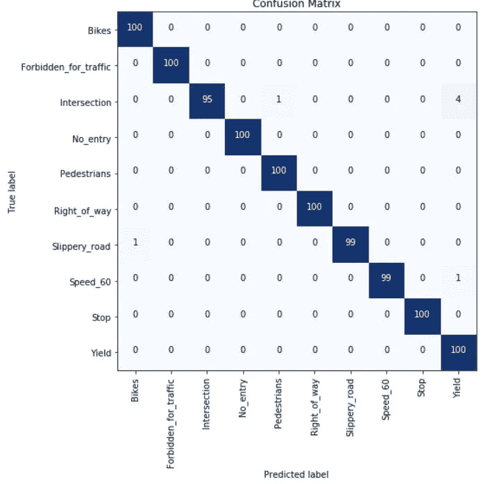

计算在测试集上评估的最终准确度:

```
accuracy = accuracy_score(test_generator.classes, y_pred)
print("Accuracy in test set: **%0.1f%%** " % (accuracy * 100))
```

这给出了 99.3%的输出，与我们没有增强图像的初始模型相比，这是一个改进！

# 模型精度的评估:

从上述模型准确性的结果可以看出，数据扩充确实提高了我们模型的准确性。在当前示例中，我们获得了大约 99%的最终准确度。此外，通过检查上面的混淆矩阵，我们可以检查模型错误地分类了哪些标志类别。在这里，我们注意到，在少数情况下，该模型仍然将“交叉点”错误分类为“产量”，但明显优于没有图像增强的模型。

注意:如果重新运行代码时没有得到完全相同的数字，也不用担心！在模型初始化等方面存在一些固有的随机性。这可能会使结果有时略有不同。

# 从测试集中绘制一些图像，并将模型预测与实际情况进行比较:

作为模型准确性的最终可视化，我们可以绘制测试图像的子集以及相应的模型预测。

为“test_subset”定义一个文件夹，其中包含了测试集中的 50 幅图像:

```
test_subset_data_dir = "data/test_subset"

test_subset_generator = test_datagen.flow_from_directory(
test_subset_data_dir,
batch_size = batch_size,
target_size = (img_height, img_width),
class_mode = "categorical",
shuffle=**False**)
```

对该文件夹中包含的图像进行预测，并将图像与预测的和实际的类一起可视化。你同意这些分类吗？

```
Y_pred = model.predict_generator(test_subset_generator)
y_pred = np.argmax(Y_pred, axis=1)

img_nr = 0
**for** subdir, dirs, files **in** os.walk('data/test_subset'):
    **for** file **in** files:
        img_file = subdir + '/' + file
        image = load_img(img_file,target_size=(img_height,img_width))
        pred_emotion = category_names[y_pred[img_nr]]
        real_emotion = category_names[test_subset_generator.classes[img_nr]]
        plt.figure()
        plt.title('Predicted: ' + pred_emotion + '**\n**' + 'Actual:      ' + real_emotion)
        plt.imshow(image)
        img_nr = img_nr +1
```

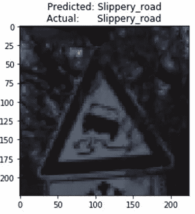

分类模型的输出示例

# 总结:

如果您设法使用包含的数据集浏览了整个教程，您有望对深度学习和图像识别如何用于解决交通标志分类的现实问题有所了解。祝你好运，用其他图片进一步探索这个模型，这些图片可以来自你的公司，也可以来自 kaggle 等资源，或者只是谷歌图片搜索！

如果你想要更多关于这个图像分类教程(以及一般的机器学习)的详细信息，我还会在下面的研讨会演示中介绍这些材料:“从炒作到现实世界的应用”。(教程演练大约开始。视频开始 35 分钟)。

祝你好运！

你觉得这篇文章有趣吗？如果是这样的话，你可能也会喜欢我的其他一些关于人工智能、机器学习、物理等主题的文章。，你可以在下面的链接和我的中型作者简介中找到:[*【https://medium.com/@vflovik】*](https://medium.com/@vflovik)

而且，如果你想成为一个媒体会员，免费访问平台上的所有资料，你也可以使用下面我的推荐链接。(注意:如果您使用此链接注册，我也会收到一部分会员费)

[](https://medium.com/@vflovik/membership) [## 通过我的推荐链接加入 Medium—Vegard flo vik

### 作为一个媒体会员，你的会员费的一部分会给你阅读的作家，你可以完全接触到每一个故事…

medium.com](https://medium.com/@vflovik/membership) 

# 更多来自 Vegard Flovik 媒体:

1.  蒙特卡洛方法简介
2.  [从物理学到数据科学的转变](/q-a-with-a-data-scientist-1f872518315f)
3.  [什么是图论，为什么要关心？](https://builtin.com/machine-learning/graph-theory)
4.  [如何(不)使用机器学习进行时间序列预测:续集](/how-not-to-use-machine-learning-for-time-series-forecasting-the-sequel-e117e6ff55f1)
5.  [建造一个能读懂你思想的人工智能](/building-an-ai-that-can-read-your-mind-8b22ad5a7f05)
6.  [人工智能和大数据隐藏的风险](https://medium.com/me/stats/post/3332d77dfa6)
7.  [如何使用机器学习进行异常检测和状态监控](/how-to-use-machine-learning-for-anomaly-detection-and-condition-monitoring-6742f82900d7)
8.  [如何(不)使用机器学习进行时间序列预测:避免陷阱](/how-not-to-use-machine-learning-for-time-series-forecasting-avoiding-the-pitfalls-19f9d7adf424)
9.  [如何利用机器学习进行生产优化:利用数据提高绩效](/machine-learning-for-production-optimization-e460a0b82237)
10.  [你是怎么把物理教给 AI 系统的？](/how-do-you-combine-machine-learning-and-physics-based-modeling-3a3545d58ab9)
11.  我们能使用纳米级磁铁建立人工大脑网络吗？
12.  [供应链管理中的人工智能:利用数据推动运营绩效](/artificial-intelligence-in-supply-chain-management-predictive-analytics-for-demand-forecasting-80d2d512f155)