# 深层变分推理

> 原文：<https://towardsdatascience.com/deep-variational-inference-2a7e43244723?source=collection_archive---------26----------------------->

## 用 DL 体系结构研究变分推理

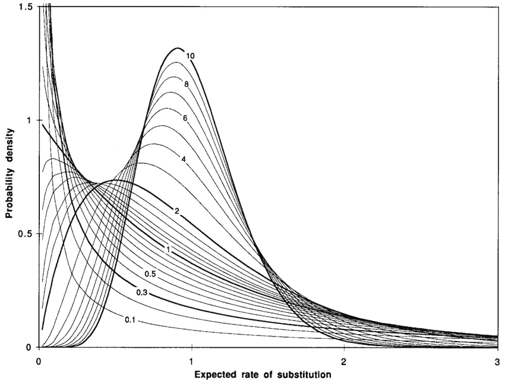

# 深度变异推理——伽玛分布

作者:纳坦·卡茨

## **贝叶斯推理**

在机器学习(ML)的世界里，贝叶斯推理经常被当作是没有人愿意采纳的奇特的谜一样的大叔。一方面，贝叶斯推理提供了大量来自数学、统计学和物理学的理论科学工具。此外，它承载着令人印象深刻的科学突破的历史遗产。另一方面，正如几乎每个数据科学家都会说的那样:它在实践中几乎从未奏效。

这篇文章由两部分组成:

1.变分推理的产生概述(六)

2.描述我尝试使用 DL 技术解决一个 VI 问题。

## **贝叶斯问题**

贝叶斯问题可以描述如下:我们有观测数据 **X**

其中数据可以表示数字、类别或任何其他可以想象的数据类型。我们假设该数据是使用潜在变量 **Z.** 生成的，我们手头有四种分布:

1.P( **Z** )潜在变量的先验分布

2.P( **X** | **Z** )可能性—此函数的分布类型由数据决定，(例如:如果我们有整数，我们可能会想到泊松，如果我们有正数，我们可能会使用伽马分布)。

3.P( **X** ) —观测数据的分布。

4.P( **Z** | **X** )后验分布——给定值 **X** 时，具有值 **Z** 的概率

这些分布通过贝叶斯公式结合在一起:

因此，贝叶斯问题是关于寻找后验分布和 **Z** 的值。障碍在于，在现实生活的模型中，P(X)很难处理。

直到 1999 年，解决贝叶斯问题的工作方式是利用抽样。诸如 Metropolis Hastings 或 Gibbs 之类的算法被成功地用于在广泛的科学领域中求解后验函数。尽管它们工作得很好，但存在两个重大问题:

高方差

缓慢收敛

1999 年迈克尔·乔丹发表了一篇论文《变分图形模型导论》(这一年更著名的 MJ 退出了，这提出了宇宙是否受“MJ 守恒定律”支配的问题)

在这篇论文中，他描述了贝叶斯问题的解析解。在这个解决方案的核心中，他建议，我们可以通过设置 **q** 的家族函数引入潜在变量 **Z.** 的分布函数 **q** ，而不是通过采样来追踪后验函数，我们可以使用这个 **q** 来逼近后验函数。对于这个解，他使用了欧拉-拉格朗日方程，这是**变分法**中的一个基本方程，它带来了**的概念:变分推理(VI)** 。

## 什么是变分推理？

在本节中，我们将详细描述 VI。回想一下，我们的目标是使用函数 **q** 来逼近后验函数 P( **Z** | **X** )，该函数是 **Z** 的分布。乔丹建议的衡量标准是 KL 散度([https://project Euclid . org/download/pdf _ 1/Euclid . aoms/1177729694](https://projecteuclid.org/download/pdf_1/euclid.aoms/1177729694)

这种解析解的思想减少了高方差和缓慢收敛的障碍。另一方面，由于我们设置了一系列函数，我们引入了一些偏差。以下公式说明了所提供的解决方案:

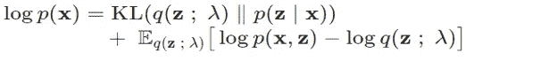

LHS 不依赖于 **Z** ，因此可以将其视为常数。最小化 KL 散度相当于最大化第二项:“证据下界”(ELBO)

作为具有预定义形状的函数， **q** 具有由λ表示的常数。

我们可以将 VI 视为一个 ELBO 最大化问题:

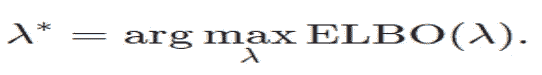

## **物理！**

Jordan 使用这个解决方案的动机来自于 Helmholtz 和 Boltzmann 在热力学方面的工作。ELBO 函数非常类似于亥姆霍兹自由能，其中第一项是能量，第二项是熵。Jordan 使用伊辛模型的平均场定理(MFT ),假设磁自旋不相关，这简化了处理 **q** 的方式。伊辛问题有一个指数解(玻尔兹曼分布)，这成为了 **q** 形状的普遍选择

## VI —示例

我现在将提供一个例子来说明如何制定一个 VI 问题。我们将假设我们有一个高斯似然的实数数据。潜变量 **Z，**因此是一对

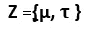

利用平均场定理， **q** 可以写成乘积

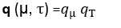

我们在哪里

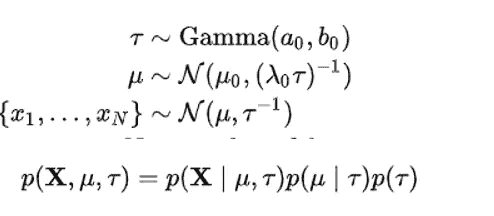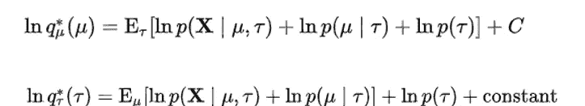

详细的配方可以在这里找到

[https://towards data science . com/variation-inference-in-Bayesian-multivarious-Gaussian-mixture-model-41 c8 cc 4d 82d 7](/variational-inference-in-bayesian-multivariate-gaussian-mixture-model-41c8cc4d82d7)

可以看出，这样的公式需要对每个模型进行大量的分析计算。当我们讨论 BBVI 时，我们将在下面的一个部分中讨论这一点。

2002 年，Blei 发表了他的“潜在的狄利克雷分配”,在那里他使用 VI 进行主题抽取，VI 得到了很大的提升

有几种工具可用于 VI，如 Edward、Stan、PyMC3 和 Pyro

**利用 VI 进行分布尾部的推断**

我必须处理的问题是识别观察数据的尾部。数据本身是一组概率值，因此我们假设可能性具有**贝塔**分布。在讨论建模步骤之前，我先举一个尾部典型问题的例子。

让我们假设我们有一个预测疾病的模型，准确率为 99%。我们可以假设 0.1%的人口患病。每天有 10 万人接受测试。990 个健康的人会听到自己有病。这个错误代价很高，因为他们要做医疗程序。出现这种问题主要是因为模型通常被训练成在对称假设下优化准确性。如果我们依赖我们的模型，阈值的微小变化可能会造成巨大的损失。因此，我们需要尽可能准确地理解 1%的尾部。

VI 作为一种分析解决方案，似乎是实现这一目的的一个有趣的工具。令人惊讶的是，我发现 DL 的世界并没有大量拥抱 VI，这确实鼓励我走这条路。

# **变分推理的深度学习**

在这一部分，我将描述我使用 DL 解决 VI 问题的尝试。回想一下，我们的数据的可能性有一个贝塔分布。这个分布有一个非常困难的先验。因此，我们把γ作为先验，因为它在正实线上有支持。在 VI 术语中，γ是先验分布和 q 分布。因此，我们训练 Gamma 对 Z**进行采样，Z** 本身就是β的{α，β}对。

**混合密度网络-MDN**

要考虑的第一个框架是 MDN(混合密度网络)。毕晓普([http://publications.aston.ac.uk/id/eprint/373/](http://publications.aston.ac.uk/id/eprint/373/))提出的这类网络旨在学习给定分布的参数。我们修改损失:而不是使用可能性，我们使用 ELBO。

**在所有图中，红色代表我们基于 VI 的样本，蓝色是由随机引擎创建的合成样本。**

以下是我们 MDN 试验的典型结果:

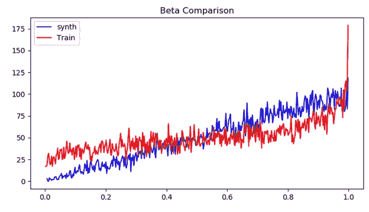

基于 VI 的样品相对接近合成样品。然而，它肯定是可以改进的。此外，虽然在内部和左侧(从我的角度来看，这是感兴趣的尾巴)非常相似，但在上部尾巴，我们遭受巨大的差异。

我们希望尝试其他工具。

## 强化学习——演员评论家

变分推理经常被解释为强化学习问题([http://www 0 . cs . UCL . AC . uk/staff/d . silver/web/Publications _ files/viral . pdf](http://www0.cs.ucl.ac.uk/staff/d.silver/web/Publications_files/viral.pdf))。我们认为 **q** 函数为策略函数， **Z** 为选项，报酬为 ELBO。当我们使用 RL 工具解决此类问题时，我们必须注意到需要进行两项修改:

我们没有插曲——我们有 IID 样本

选项不是离散的，而是伽玛分布的

为了解决第一个子句，我们必须修改 Q 学习更新公式:

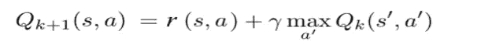

因为没有真正的插曲，所以必须去掉第二项，因为它表示未来的预期回报。

关于第二个子句，我们必须训练一个 Gamma 形式的策略函数(这里有一个很好的动机[http://proceedings.mlr.press/v70/chou17a/chou17a.pdf](http://proceedings.mlr.press/v70/chou17a/chou17a.pdf)

为了训练一个策略函数，我们将使用 actor-critic with experience replay[https://towards data science . com/understanding-actor-critic-methods-931 b 97 b 6 df 3 f](/understanding-actor-critic-methods-931b97b6df3f)并添加我们的修改。

这些是我们得到的图表:

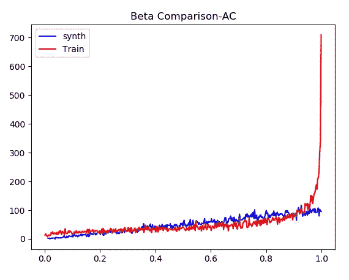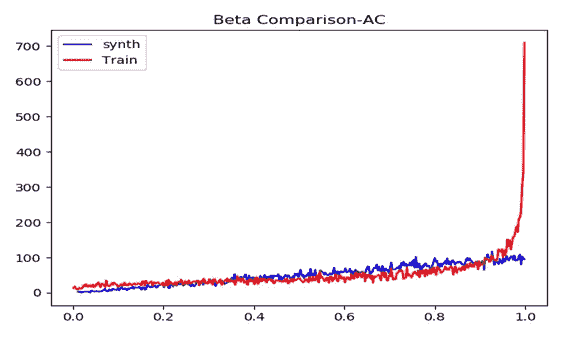

对于小正值，结果在区间[0，1-a]内相当好。我们完全没有建立上尾翼的模型。

## 黑盒变分推理

虚拟仪器的出现为研究后验分布提供了新的方向。然而，它对期望值进行了大量的分析计算(参见 Gaussian dist 的例子)。以上)。有一个明确的目标，就是找到一个更通用的方案，减少分析量，更好地处理大量数据。下面的幻灯片是 Blei 对这种需求的描述:

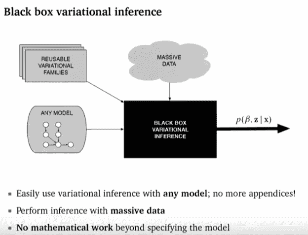

提供的解决方案使用了*随机优化*。Robbins 和 Monro 提出的一类算法(一种随机近似方法，1951 年)

**罗宾斯-门罗算法**

罗宾斯门罗算法旨在解决一个根问题:设 *F* 为函数，α为常数。我们假设方程存在唯一的解:

我们希望找到它。

假设 *F* 不可观测，但是存在随机变量 T，使得

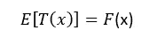

Robbins 和 Monro 已经表明，对于某些规则，以下算法收敛于 L:

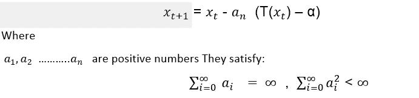

这个序列叫做罗宾斯门罗序列。

## 返回 BBVI

在 2013 年[https://arxiv.org/pdf/1401.0118.pdf](https://arxiv.org/pdf/1401.0118.pdf)的一篇论文中，Blei 建议通过使用 Robbins-Monro 序列对 VI 进行两步改进。这种算法被称为“黑盒变分推理”(BBVI)。第一步如下所示:

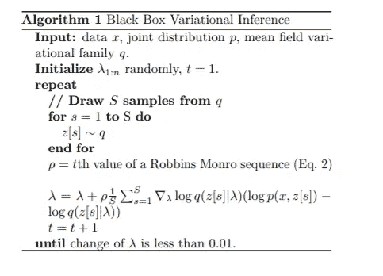

主要思想是构建一个针对 ELBO 梯度的蒙特卡罗估计器，并使用 Robbins Monro 序列，如后面部分所述。这种算法(和许多其他蒙特卡罗算法一样)存在高方差。Blei 提出了两种方法来减少这种差异:

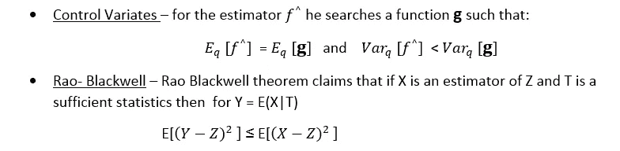

在这篇论文中，Blei 使用 Rao Blackwell 通过使用条件分布的 Rao Blackwell 性质来创建每个常数的估计量。

## 现在绘图

我使用的 BBVI 没有方差减少技术

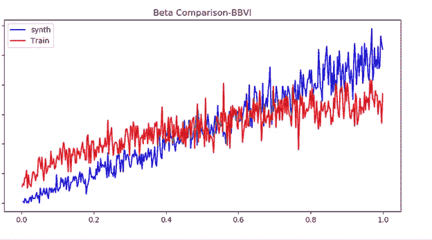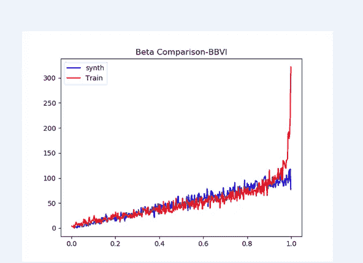

我们可以看到，与 AC 相比，我们减少了尾部问题，但仍然存在这个问题。在最后一个图中，我们没有尾部问题，但是近似性变弱了

## **成绩汇总**

我们看到，将深度学习工具用于 VI 取得了部分成功。我们在区间内进行了相当好的逼近，但无法逼近上尾部。此外，在所有的框架中，我都遭受了一定程度的不稳定。

有几个看似合理的原因:

## DL-问题

建筑不够复杂

更多时代

## γ-β问题

传统上，DL 问题是在高斯或均匀等常见分布上研究的。这些分布没有依赖于偏度和峰度的参数。这在 Gamma 中不是这样，在 Gamma 中，由引擎训练的参数完全确定偏斜度和峰度。这可能需要不同的技术

我们用 ELBO 作为损失函数。该函数强烈依赖于先前的形状。伽玛并不是贝塔的真正先验。这可能意味着需要修改损失

Beta 有紧凑的支持。事实上，我们只在尾部附近有问题(分布的一个“奇点”),这可能会带来障碍。这个“奇点”问题有待研究

我们可以总结说，这些实验已经表明 VI 可以使用 DL 机制来解决。然而，这需要进一步的工作。尽管如此，我们还是为这位神秘的叔叔澄清了一些事情。

这里有一个模仿我的试验的 torch 代码(抱歉，真实的代码已经用于我做的一些商业工作)

【https://github.com/natank1/DL-_VI 

## **致谢**

我要感谢 Uri Itai 在工作之前和期间进行的富有成效的讨论以及他的全面审查，感谢 Shlomo Kashani 和 Yuval Shachaf 提出的想法和意见，感谢 Leonard Newnham 澄清强化学习领域的问题

## **参考文献**

[http://www.jmlr.org/papers/volume3/blei03a/blei03a.pdf](http://www.jmlr.org/papers/volume3/blei03a/blei03a.pdf)

[https://people . eecs . Berkeley . edu/~ Jordan/papers/variable-intro . pdf](https://people.eecs.berkeley.edu/~jordan/papers/variational-intro.pdf)

[https://towards data science . com/a-hitch illers-guide-to-mixture-density-networks-76b 435826 CCA](/a-hitchhikers-guide-to-mixture-density-networks-76b435826cca)

[https://publications . Aston . AC . uk/id/eprint/373/1/NCRG _ 94 _ 004 . pdf](https://publications.aston.ac.uk/id/eprint/373/1/NCRG_94_004.pdf)

[https://www . ri . CMU . edu/WP-content/uploads/2017/06/thesis-Chou . pdf](https://www.ri.cmu.edu/wp-content/uploads/2017/06/thesis-Chou.pdf)

[http://www.michaeltsmith.org.uk/#](http://www.michaeltsmith.org.uk/)

[https://github.com/trevorcampbell/ubvi/tree/master/examples](https://github.com/trevorcampbell/ubvi/tree/master/examples)

[https://arxiv.org/pdf/1811.01132.pdf](https://arxiv.org/pdf/1811.01132.pdf)

[http://proceedings.mlr.press/v70/chou17a/chou17a.pdf](http://proceedings.mlr.press/v70/chou17a/chou17a.pdf)

[https://towards data science . com/understanding-actor-critic-methods-931 b 97 b 6 df 3 f](/understanding-actor-critic-methods-931b97b6df3f)

[https://www . freecodecamp . org/news/an-intro-to-advantage-actor-critic-methods-let-play-sonic-the-hedgehog-86d 6240171d/](https://www.freecodecamp.org/news/an-intro-to-advantage-actor-critic-methods-lets-play-sonic-the-hedgehog-86d6240171d/)

[http://incompleteideas.net/book/the-book-2nd.html](http://incompleteideas.net/book/the-book-2nd.html)

[https://arxiv.org/pdf/1401.0118.pdf](https://arxiv.org/pdf/1401.0118.pdf)

[https://towards data science . com/variation-inference-in-Bayesian-multivarious-Gaussian-mixture-model-41 c8 cc 4d 82d 7](/variational-inference-in-bayesian-multivariate-gaussian-mixture-model-41c8cc4d82d7)

[https://project Euclid . org/download/pdf _ 1/Euclid . aoms/1177729586](https://projecteuclid.org/download/pdf_1/euclid.aoms/1177729586)

[http://edwardlib.org/tutorials/klqp](http://edwardlib.org/tutorials/klqp)

https://mc-stan.org/users/interfaces/

【https://github.com/stan-dev/pystan/tree/develop/pystan 

[https://docs.pymc.io/notebooks/getting_started.html](https://docs.pymc.io/notebooks/getting_started.html)

[https://project Euclid . org/download/pdf _ 1/Euclid . aoms/1177729694](https://projecteuclid.org/download/pdf_1/euclid.aoms/1177729694)

h[ttps://www . cs . Princeton . edu/courses/archive/fall 11/cos 597 c/lessons/variation-inference-I . pdf](https://www.cs.princeton.edu/courses/archive/fall11/cos597C/lectures/variational-inference-i.pdf)

[http://publications.aston.ac.uk/id/eprint/373/](http://publications.aston.ac.uk/id/eprint/373/)

[https://www . researchgate . net/profile/Thomas _ Leitner/publication/14066429/figure/fig 1/AS:349553518759937 @ 1460351461646/The-gamma-distribution-described-by-different-shape-parameters-01-to-13-15-17 . png](https://www.researchgate.net/profile/Thomas_Leitner/publication/14066429/figure/fig1/AS:349553518759937@1460351461646/The-gamma-distribution-described-by-different-shape-parameters-01-to-13-15-17.png)