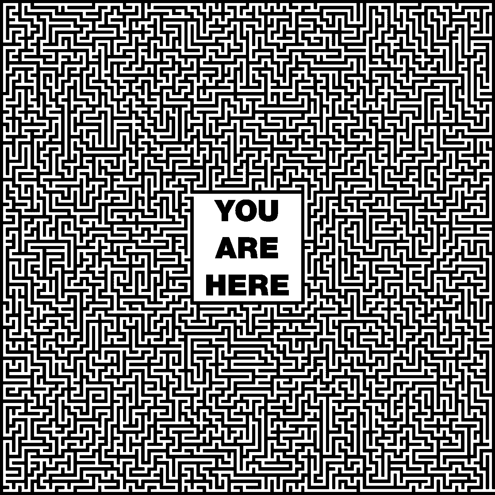
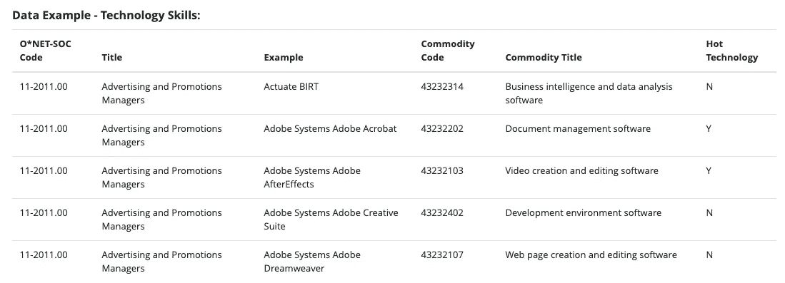
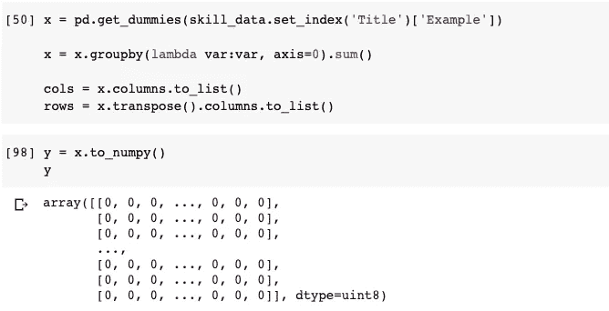
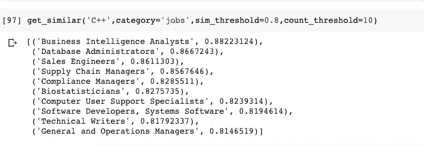
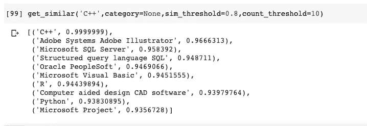
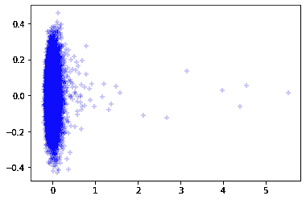
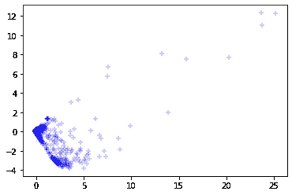
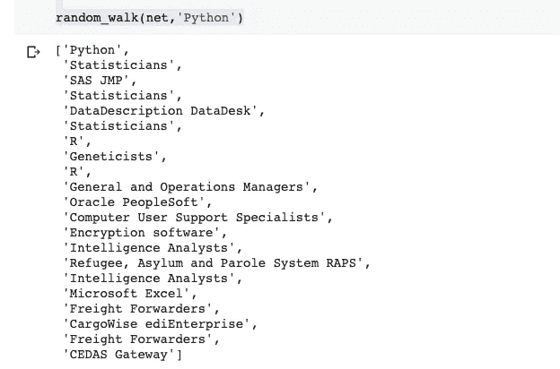
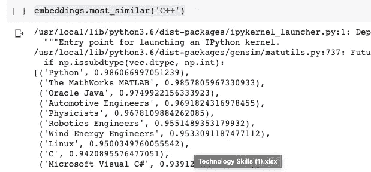
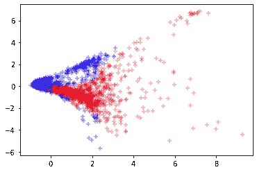

# 深度行走:被忽视的 NLP 和图数据结构的私生子

> 原文：<https://towardsdatascience.com/deep-walk-the-overlooked-lovechild-of-nlp-and-graph-data-structures-657793831800?source=collection_archive---------31----------------------->

## 随机漫步和 Word2Vec 优于矩阵分解，产生了惊人的强大的节点嵌入



信用:Pixabay

## 该理论

近年来，自然语言处理(NLP)经历了创新的复兴；似乎每年都有一些新的算法超越了它的前辈。例如，开创性的论文“注意是你所需要的”真正震撼了 NLP 雪花玻璃球，使以前的艺术级神经网络架构，如 LSTM，相形见绌。然而，您可能会惊讶地听到，随着神经网络的应用，图形数据结构刚刚达到学术兴趣的顶峰。

图形很棘手；它们可以被表示为(邻接)矩阵，但是它们也可以被表示为它们自己独特的数据结构，其中每个节点引用同一图中可变数量的其他节点。这种可变性是图表如此迷人的真正原因——它们不完全是表格数据，很容易用矩阵表示，但也不完全是非结构化的。事实上，有些人可能会认为图像比图表更具结构性。图像的内容可能变化很大，但是给定指定的尺寸，每个像素都有相同数量的相邻像素(邻居)。相反，图节点的邻居数量是可变的。尽管有其微妙的本质，图表在社会中随处可见；社交网络、电网和供应链只是图形多功能性的几个明显例子。

人们对一些问题进行了大量思考，比如*“如何最好地搜索一个图——先搜索深度还是广度？”*但是越来越多的人对寻找节点间的相似性(或相异性)感兴趣。这可以用于人道主义目标(例如，根据以前的病毒爆发位置及其结构，确定潜在的病毒爆发高风险城市)或简单的商业目标(例如，向应用程序用户推荐朋友和/或产品)。)

考虑推荐系统——不是所有的用户都喜欢相同数量的产品，也不是所有的产品都被相同数量的用户喜欢；它几乎要求图形数据结构。*然而……使用矩阵和分解技术(比如 SVD)来呈现推荐是非常普遍的。*

为了学习节点嵌入，必须以某种方式对图结构进行*采样*。一种简单(但令人惊讶的有效)的方法是通过随机漫步，这非常简单:从任何给定的节点开始，识别所有邻居，随机选择一个……然后*漫步。*冲洗并重复，直到你走了足够多的*(这需要一些判断并引入一些偏差。)在推荐系统的上下文中，我们的图是 ***二分图***——意味着有两类节点(产品和用户。)这样，给定的随机游走将从一个类的实例跳到另一个类的实例。例如:*

```
*John -> Titanic -> Allie -> Pearl Harbor -> Adam -> The Pianist* 
```

*对图形进行采样有点像在迷宫中漫步；您从一个起点随机行走(在完成行走之前可能会多次返回到起点)，并重复这个过程几次。当你完成每一步的时候，你会对迷宫 ***看起来像*** 有一个相当不错的想法。然而，在它们目前的形式下，这些随机漫步不能直观地使用。别担心——NLP 来帮忙了！*

*Google 在 2013 年提出的算法 Word2Vec，可以通过滑动窗口方案来学习单词的相似度。一次看到 x 个单词(在窗口中)，一个目标单词和(通常)5 个来自直接周围上下文的上下文单词(duh。)一个神经网络简单地学习回答问题，“*是目标词*****(在当前窗口中)的一个上下文词吗？”*所以像“狗”这样的词可能有频繁出现的上下文词，如“散步”和“宠物”同样,“猫”这个词可能有半相似的上下文词(也许不包括散步——我不知道谁会带着猫散步。我们能够通过任何两个单词共享(或不共享)相同上下文的频率来量化它们之间的相似性。并且这些上下文在嵌入中被捕获(当被目标词“激活”时，完全训练的神经元的神经网络层。)嵌入的观察数值可以通过距离度量(例如余弦相似度)与其他数值进行比较，以确定与单词的相似程度。****

**所以我们知道两件事:(A)我们的随机行走产生了语言样本，以及(B) Word2Vec 可以学习给定语言的单词嵌入(或者在我们的例子中，节点嵌入)。这就是深度行走算法的全部内容。**

**如果您对白皮书感兴趣，请不要再看了！**

## **应用程序**

**在一家著名的技术公司工作时，我带领一个数据科学实习生团队开发了一个产品，可以将求职者与招聘海报相匹配。竞争对手让求职者充斥着招聘海报，反之亦然。目标不是高质量的比赛，而是注意力超载。如果你找不到工作候选人，说明你不够努力。我的主管想要一款可以帮助求职者和求职者找到对方的产品——不是通过匹配职位，而是通过匹配技能。我拿到的教科书案例是:**

***X-Corp(一个隐藏身份和利益的假名)例行公事地需要 C++专家；他们上传“软件工程师”的招聘信息，但似乎无法及时找到合格的候选人。* *你能做什么？***

**我思考了这个问题，意识到工作描述和简历没有被充分地分析技能。仅仅一个职位头衔就足以引发 Glassdoor 上的匹配，的确如此。我们需要了解技能对技能、工作对工作以及(最重要的)技能对工作之间的关系。成功学习这些关系的意义是非常有益的。**

**由于保密协议状态，我不能提供实际的数据，也不能提供用于解决这个问题的具体架构。然而，我将使用公开可用的数据通过一个综合问题来说明这些概念。劳工统计局维护着一个名为 O*NET ( *的数据集，我相信这是职业网络的简称。这个资源由统计学家、经济学家和劳动研究人员维护。一些数据集可以在网上免费获得。感兴趣的是[技术技能数据集](https://www.onetcenter.org/dictionary/24.3/excel/technology_skills.html)。***

****

**技术技能数据预览**

**我们只对第二列和第三列感兴趣，即职称(title)和技能职称(Example。)这些数据形成了一个二分图，其中给定的工作与多种技能有关系，给定的技能与给定的工作有多种关系。通过一点数据预处理，我们可以从推荐系统中借用一页(尽管我将证明这不如深度行走方法有效。)我们简单地为每个技能-工作关联创建一个“一次性”编码，在工作-技能矩阵中，如果工作需要某项技能，则用 1 表示(如果不需要，则用 0 表示)。*与推荐系统没有任何不同！***

**为了简洁起见，我将把[存储库链接留在这里](https://github.com/jdmoore7/ONET_analysis)。**

**Pandas 有一些很酷的内置函数，允许我们相对轻松地将上述格式的数据转换成一种热编码。(但是请注意矩阵是多么稀疏！)**

****

**数据清理**

**现在，我们有几个矩阵分解的选项。就个人而言，我更喜欢使用 PyTorch 的基于梯度的方法，使用均方误差成本函数。然而，奇异值分解也在推荐系统中广泛使用。代码细节已在回购中详细说明！**

**我们可以通过“抽查”节点嵌入来定性地评估我们的性能。我写的一个简单的函数找到正确类别的节点，(工作或技能)，给定余弦相似性最小阈值和最大计数阈值。有些结果是直观的，比如数据库管理员，也许还有生物统计学家。然而，像供应链经理和技术作家这样的角色会提出这样一个问题——“一切都是随意相似的吗？“并且有证据支持这个结论，直觉匹配和非直觉匹配都落在余弦相似度范围内(0.8- > 0.9)。也许有意义的比赛只是一个机会的问题？**

****

**矩阵分解方法**

****

**类别设置为无**

**注意，在第二个截图中，我将类别设置为 none。这将检索技能和工作；但是，在给定阈值的情况下，我们没有捕获任何作业。事实上，Adobe Systems Illustrator 是 C++第二常见的节点；它比 Python“更相似”,比软件开发人员更相似(如上面的“仅工作匹配”中所示。)**

**我们可以评估节点嵌入结果的一个有趣的方法是查看它们的二维分布。我们可以通过主成分分析将维数从 10 减少到 2，这保留了模型中的大部分方差，在 2D 表示中捕获。PCA 是一个棘手的概念，我们今天不会在这个理论上绕太远。现在，让我们只检查结果！**

****

**矩阵分解 PCA 图**

**然而，在这种表示中，你看不出职业是用红色编码的，而技能是用蓝色编码的。实际上，所有节点都映射到相同的接近 0 的 x 轴值，而所有有意义的变化都发生在 y 轴上。有一些例外，但这些只是少数的*技能*。那么…哪里出了问题？**

**嗯，我们有几个重要的限制要讨论。第一，有近 9000 个技术技能，只有(差不多)1000 个工作岗位。此外，有些工作比其他工作需要更多的技能。因此，与职务对应的给定基准表行的总和可能是相对较高的数字，如 100(意味着该职务拥有 100 项技能)或相对较低的数字，如 10。这里起作用的潜在变量是节点连通性、介数和/或中心性。一些节点与技能有很好的联系，这些技能可能与其他工作有很好的联系，也可能没有。此外，由于工作与技能之间的不平衡，这种一键矩阵非常稀疏。*矩阵因式分解需要将一个矩阵分解成两个，当两个矩阵相乘时，返回原矩阵。正如你所看到的，0 的存在远远超过了 1 的影响。***

****换句话说，就*和*都不具备的技能而言，工作是相似的！当矩阵稀疏性是一个问题时，这种直觉可以应用于推荐系统。****

**您可能已经注意到，使用一次性编码矩阵可能不是最理想的。你是对的！我们可以从 NLP 中采用各种编码策略来增强我们的结果…然而，这将不可避免地引入用户偏见。例如，伪 TF-IDF 设计可能会考虑某项技能在所有作业中出现的总次数以及单个作业的总技能数。 *Microsoft Excel 在这个数据集中极为常见；应该和 C++这种相对不常见的技能一样有影响力吧？问得好！***

**(对于那些好奇的人，我还使用 SVD 来分解一个热编码矩阵。这是主成分分析图。)**

****

**奇异值分解主成分图**

**我们可能会花费数周时间来尝试对最佳*设计进行特征设计(不管分解技术如何)，但此时，让我们后退一步，考虑一种更直观、图形友好的方法。进入——深走。***

**如前所述，我们需要通过随机游走的图形采样来收集语言的“语料库”。让我们从技能 *Python 来考察一个随机游走。***

****

**从 Python 开始的随机漫步**

**请注意，职业*统计员*出现了 3 次，作为技能、 *SAS JMP* 和*数据描述数据表之间的中间跳转。随机漫步发现了什么？这些技能有些孤立，没有很好的联系，工作关联也很少。这正是扰乱矩阵分解方法的原因。然而，随机漫步雄辩地抓住了这些技能的中心性(或缺乏中心性)。注意，这个随机漫步是使用 NetworkX 执行的，NetworkX 是一个非常棒的基于 python 的图形/网络建模包。***

**现在，我们将简单地使用 Gensim 实现，而不是从头开始实现 Word2Vec。为了保持矩阵分解结果的一致性/可比性，我们还将学习 10 个潜在特征。无论是哪种情况，这都是一个你需要关注的超参数——它有效地控制了过度拟合(这在推荐系统和节点嵌入的上下文中是一个棘手的话题)。)**

**让我们看看 Deep Walk 的表现。请注意，技能和工作都被检索到，这说明它们被映射到相似的空间，但并不是任意地彼此相似——节点相似性差异是有意义的！**

****

**为了进一步说明生成的节点嵌入的质量，让我们检查另一个 PCA 图。(还是那句话，职业和红色，技能是蓝色。)**

****

**深度行走 PCA 图**

****哇！**这不仅是美丽的，它显示了我们应该想从我们的嵌入这么多的东西。(A)嵌入分布在更大的空间上。(B)存在主要是“技能”的不同分类区域和主要是“职业”的区域(C)然而，这些区域有适度的重叠，描绘了高度相互关联的节点(无论是技能还是职业。这种方法表现如此之好的一个原因是随机漫步本身。技能可能比职业多，但整个“语料库”采用了 `job -> skill -> job -> skill...` *的形式，这意味着稀疏的影响将以一种巧妙的方式得到缓解！***

**最后，我们开始的源问题——我们如何更快地找到 C++程序员？天真的直觉会告诉我们，软件开发人员是现任的 C++专家。然而，我们可以看到物理学家和机器人工程师更接近 C++。我们无法确定*为什么*会这样，但我们可以提出一些叙述。C++是一种低级语言。web 开发人员越来越多地使用框架，这样他们就不需要不断地重复发明轮子。期望一个 web 开发人员成为安全专家、网络专家、图形渲染专家、数据库专家等等，以及 web 应用程序可能需要的所有元素是不现实的。然而，物理学家可能非常需要知道从同一实验室的工程师设计的传感器中收集数据，一种低级语言将帮助他们最大限度地利用分配给他们的计算资源。**

**TL/DR —推荐系统广泛使用矩阵分解。当存在最小的阶级不平衡时(无论是用户对产品，工作对技能，等等),这是非常有用的。)像 TF-IDF 这样的编码技巧可以(理论上)增强一键编码产生的结果。然而，稀疏性会极大地限制矩阵分解的有效性。图形友好的方法是推荐系统、信息检索等等的未来！我鼓励您尝试链接存储库中的代码，并将这些技术应用到您自己选择的新颖应用程序中。**

**如果你认为我的内容没问题，请订阅！:)**