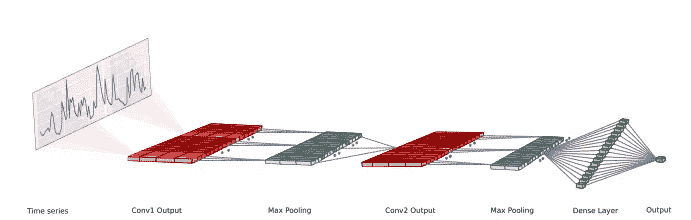
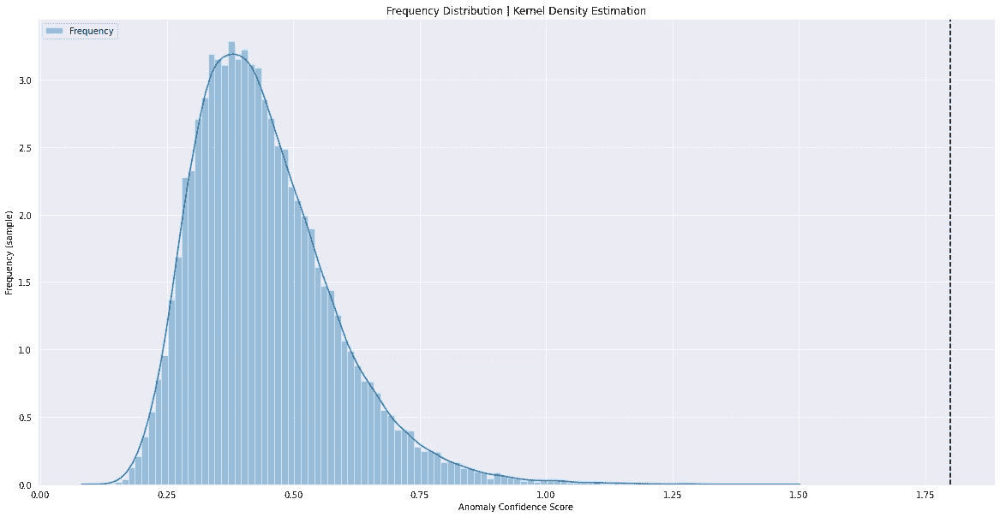
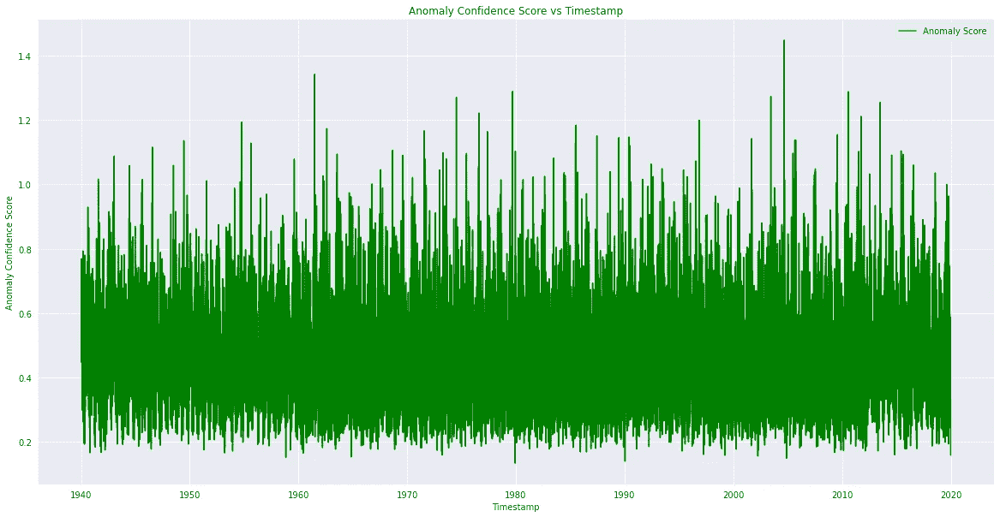

# DeepAnT——时间序列的无监督异常检测

> 原文：<https://towardsdatascience.com/deepant-unsupervised-anomaly-detection-for-time-series-97c5308546ea?source=collection_archive---------24----------------------->

## 只有当你有大海捞针的方法时，才能观察到图案的美！


丹尼尔·塔夫乔德在 [Unsplash](https://unsplash.com?utm_source=medium&utm_medium=referral) 上的照片

## 什么是异常现象，我为什么要担心？

“一个异常值”或“异常值”是样本空间中那些异常的数据点，或*超出趋势*。现在，问题是，“你如何定义异常或异常的东西？”
答:数学上，不在**相同趋势**中的数据点与其邻域中的数据点相同。

作为业务伙伴或技术专家，在日常工作中从大量数据中发现异常模式。在这里，我们将讨论一种能够以接近实时的格式检测数据中所有(*几乎*)异常的方法。

在本文中，我们将尝试学习如何从数据中检测*异常*而无需事先训练模型，因为你无法根据数据训练模型，而我们对此一无所知！
这就是**无监督学习**的想法出现的地方。
选择**时间序列**数据的原因是，它们是最常见的真实世界数据之一，我们作为数据科学家进行分析。

来到模型——“**DeepAnT”**是一个无监督的基于时间的异常检测模型，它由卷积神经网络层组成。在检测时间序列数据中的各种异常时，它确实工作得很好。但这可能需要注意检测噪声，这可以通过调整超参数来处理，如内核大小、*回看*、*时间序列窗口大小*、隐藏层中的单元等等。

代码和数据的链接在这里的 [Github](https://github.com/bmonikraj/medium-ds-unsupervised-anomaly-detection-deepant-lstmae) 链接中提供—

[](https://github.com/bmonikraj/medium-ds-unsupervised-anomaly-detection-deepant-lstmae) [## bmonikraj/medium-ds-unsupervised-异常检测-deepant-lstmae

### 使用 DeepAnT 和 LSTM 自动编码器数据描述的无监督异常检测的基于深度学习的技术…

github.com](https://github.com/bmonikraj/medium-ds-unsupervised-anomaly-detection-deepant-lstmae) 

数据中的特征数= 27(包括'时间戳'特征)
数据特征类型=数值

现在我们知道了数据，让我们进入代码库，解决我们遇到的问题。
问题描述:-我们有大约 80 年的加拿大气候数据(数据频率=每天)，我们想从气候数据中识别异常。

```
import numpy as np
import pandas as pd
import torch
from sklearn.preprocessing import MinMaxScaler
import time
import datetime
import matplotlib.pyplot as plt
import seaborn as sns
import os

data_file = ""
MODEL_SELECTED = "deepant" *# Possible Values ['deepant', 'lstmae']*
LOOKBACK_SIZE = 10
for dirname, _, filenames **in** os.walk('/kaggle/input'):
    for filename **in** filenames:
        data_file = os.path.join(dirname, filename)
```

模块被导入，文件被加载到 Kaggle 内核的环境中。

```
def read_modulate_data(data_file):
    *"""*
 *Data ingestion : Function to read and formulate the data*
 *"""*
    data = pd.read_csv(data_file)
    data.fillna(data.mean(), inplace=True)
    df = data.copy()
    data.set_index("LOCAL_DATE", inplace=True)
    data.index = pd.to_datetime(data.index)
    return data, df
```

在上面的代码片段中，我们从文件中读取数据，该文件存在于环境中。
读取后，我们将索引数据转换为*时间戳*。
将时间戳作为数据索引的主要动机是，如果需要，通过数据帧图和重采样进行更好的分析。

```
def data_pre_processing(df):
    *"""*
 *Data pre-processing : Function to create data for Model*
 *"""*
    try:
        scaled_data = MinMaxScaler(feature_range = (0, 1))
        data_scaled_ = scaled_data.fit_transform(df)
        df.loc[:,:] = data_scaled_
        _data_ = df.to_numpy(copy=True)
        X = np.zeros(shape=(df.shape[0]-LOOKBACK_SIZE,LOOKBACK_SIZE,df.shape[1]))
        Y = np.zeros(shape=(df.shape[0]-LOOKBACK_SIZE,df.shape[1]))
        timesteps = []
        for i **in** range(LOOKBACK_SIZE-1, df.shape[0]-1):
            timesteps.append(df.index[i])
            Y[i-LOOKBACK_SIZE+1] = _data_[i+1]
            for j **in** range(i-LOOKBACK_SIZE+1, i+1):
                X[i-LOOKBACK_SIZE+1][LOOKBACK_SIZE-1-i+j] = _data_[j]
        return X,Y,timesteps
    except **Exception** as e:
        print("Error while performing data pre-processing : **{0}**".format(e))
        return None, None, None
```

在这里，我们在`[0,1]`的范围内对数据进行标准化，然后通过将“时间步长”作为一个维度纳入图片来修改数据集。
想法是将维度数据集从`[Batch Size, Features]`转换到`[Batch Size, Lookback Size, Features]`

```
class **DeepAnT**(torch.nn.Module):
    *"""*
 *Model : Class for DeepAnT model*
 *"""*
    def __init__(self, LOOKBACK_SIZE, DIMENSION):
        super(DeepAnT, self).__init__()
        self.conv1d_1_layer = torch.nn.Conv1d(in_channels=LOOKBACK_SIZE, out_channels=16, kernel_size=3)
        self.relu_1_layer = torch.nn.ReLU()
        self.maxpooling_1_layer = torch.nn.MaxPool1d(kernel_size=2)
        self.conv1d_2_layer = torch.nn.Conv1d(in_channels=16, out_channels=16, kernel_size=3)
        self.relu_2_layer = torch.nn.ReLU()
        self.maxpooling_2_layer = torch.nn.MaxPool1d(kernel_size=2)
        self.flatten_layer = torch.nn.Flatten()
        self.dense_1_layer = torch.nn.Linear(80, 40)
        self.relu_3_layer = torch.nn.ReLU()
        self.dropout_layer = torch.nn.Dropout(p=0.25)
        self.dense_2_layer = torch.nn.Linear(40, DIMENSION)

    def forward(self, x):
        x = self.conv1d_1_layer(x)
        x = self.relu_1_layer(x)
        x = self.maxpooling_1_layer(x)
        x = self.conv1d_2_layer(x)
        x = self.relu_2_layer(x)
        x = self.maxpooling_2_layer(x)
        x = self.flatten_layer(x)
        x = self.dense_1_layer(x)
        x = self.relu_3_layer(x)
        x = self.dropout_layer(x)
        return self.dense_2_layer(x)
```

我们正在创建模型 DeepAnT 架构(关于论文的更多信息可以在 IEEE 的链接— [研究论文中找到)。
它包含两层卷积层，在确定数据时间模式中的异常时非常有效。
可以根据数据进一步调整内核大小和过滤器数量，以实现更好的性能。](https://ieeexplore.ieee.org/abstract/document/8581424)

让我们来看看模型架构，以便更好地直观理解—



由 Mohsin Munir、Shoaib Ahmed Siddhiqui、Andreas Dengel 和 Sheraz Ahmed 撰写的 IEEE 论文中的 DeepAnT 模型架构

```
def make_train_step(model, loss_fn, optimizer):
    *"""*
 *Computation : Function to make batch size data iterator*
 *"""*
    def train_step(x, y):
        model.train()
        yhat = model(x)
        loss = loss_fn(y, yhat)
        loss.backward()
        optimizer.step()
        optimizer.zero_grad()
        return loss.item()
    return train_step
```

功能`make_train_step`是创建迭代器，它可以向计算模型提供小批量的数据。

MSE 损失函数传递给 make_train_step 函数，Adam 优化器用于多个历元后的损失函数优化和收敛。

```
def compute(X,Y):
    *"""*
 *Computation : Find Anomaly using model based computation* 
 *"""*
    if str(MODEL_SELECTED) == "deepant":
        model = DeepAnT(10,26)
        criterion = torch.nn.MSELoss(reduction='mean')
        optimizer = torch.optim.Adam(list(model.parameters()), lr=1e-5)
        train_data = torch.utils.data.TensorDataset(torch.tensor(X.astype(np.float32)), torch.tensor(Y.astype(np.float32)))
        train_loader = torch.utils.data.DataLoader(dataset=train_data, batch_size=32, shuffle=False)
        train_step = make_train_step(model, criterion, optimizer)
        for epoch **in** range(30):
            loss_sum = 0.0
            ctr = 0
            for x_batch, y_batch **in** train_loader:
                loss_train = train_step(x_batch, y_batch)
                loss_sum += loss_train
                ctr += 1
            print("Training Loss: **{0}** - Epoch: **{1}**".format(float(loss_sum/ctr), epoch+1))
        hypothesis = model(torch.tensor(X.astype(np.float32))).detach().numpy()
        loss = np.linalg.norm(hypothesis - Y, axis=1)
        return loss.reshape(len(loss),1)
    else:
        print("Selection of Model is not in the set")
        return None
```

最后一步是通过数据运行模型(批量)。我们使用 MSE 损失函数和 Adam 优化器，并在 30 个时期内运行。
此后，我们生成假设并计算损失，即数据集中给定的各个时间戳的异常置信度得分。

## 形象化



异常置信度得分的频率分布|作者图片



异常可信度分数与时间戳(freq="daily") |作者图片

看上面的两个图，我们可以得出结论，异常置信度得分大于 1.2 的时间戳是那些可以被视为潜在异常的时间戳，并且可以通过分析采取进一步的行动:)

*   DeepAnT 是一种适用于基于时间序列的异常检测的体系结构模型。
*   用于类似问题的其他架构有:LSTM 自动编码器、具有时间信息的 kNN 聚类。
*   时间序列数据，在需要实时分析的情况下，应该考虑数据流。

对于想直接在 Kaggle 内核上运行的:)

[](https://www.kaggle.com/bmonikraj/unsupervised-timeseries-anomaly-detection/notebook) [## 无监督时间序列异常检测

### 使用 Kaggle 笔记本探索和运行机器学习代码|使用加拿大 80 年的气候数据

www.kaggle.com](https://www.kaggle.com/bmonikraj/unsupervised-timeseries-anomaly-detection/notebook) 

如有任何疑问，请通过[bmonikraj@gmail.com](mailto:bmonikraj@gmail.com)联系我本人