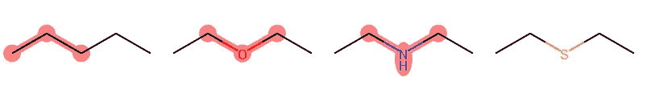

# deep chem——在生命科学和化学信息学中使用 ML 和 DL 的框架

> 原文：<https://towardsdatascience.com/deepchem-a-framework-for-using-ml-and-dl-for-life-science-and-chemoinformatics-92cddd56a037?source=collection_archive---------28----------------------->

## 使 ML 和 DL 在药物发现、材料科学、量子化学和生物学中的使用民主化。


图片来源: [Pixabay](https://pixabay.com/)

将机器学习和深度学习应用于药物发现、基因组学、显微观察和量子化学可以产生根本性的影响，并有可能显著加快医学研究和疫苗开发的进程，这是任何像 Covid19 这样的疫情所必需的。

在我们开始之前，这篇文章是一篇非常高水平的文章，专门针对对药物发现感兴趣的数据科学家和 ML 研究人员，尤其是在像 Covid19 *这样的现有疫情时期。*

DeepChem 是一个开源框架，内部使用 TensorFlow，该框架专门用于简化各种生命科学应用的深度学习模型的创建。

在本教程中，我们将了解如何设置 DeepChem，以及如何将 DeepChem 用于:

> 1.训练一个可以预测分子毒性的模型
> 
> 2.训练预测分子溶解度的模型
> 
> 3.使用智能字符串查询分子结构。

## 设置 DeepChem

虽然，在多个来源中，我看到用户表达了他们对在 Windows、Linux 和 Mac 环境中设置 DeepChem 的关注，但是我发现使用 pip 安装程序很容易做到这一点。

DeepChem 开发团队非常活跃，他们确实提供每日构建，所以我希望每个人都能看看他们的 pypi 页面:[https://pypi.org/project/deepchem/#history](https://pypi.org/project/deepchem/#history)并安装一个合适的版本，以防最新版本有任何问题。一个简单的 *pip 安装 deepchem* 将会安装最新的版本。

接下来，除了 DeepChem，您还需要安装 TensorFlow。我已经使用 *pip install tensorflow* 和开源化学信息学软件包 RDkit 安装了最新版本的 TensorFlow。对于 RDkit 和在 Windows 中安装，我没有找到任何可靠的 pip 安装程序，所以使用 conda 安装程序从[https://anaconda.org/rdkit/rdkit](https://anaconda.org/rdkit/rdkit)安装它:*conda install-c RDkit RDkit*

一旦这三个模块安装完毕，我们就可以开始实验了。

## 预测分子的毒性

分子毒性可以被定义为一种物质对任何有机体表现出的副作用的总和。计算方法实际上可以利用分子的化学和结构特性来确定给定化合物的毒性，并利用分子描述符(Dong 等人， [2015](https://www.ncbi.nlm.nih.gov/pmc/articles/PMC5714866/#B8) )和指纹(薛和 Bajorath，【2000】)来确定分子特征，可以有效地提取任何给定分子固有的化学和结构信息，用于基于预测的方法。

为了预测毒性，我们将使用 MoleculeNet 的 Tox21 毒性数据集，并使用 DeepChem 加载所需的数据集。

```
import numpy as np
import deepchem as dc
tox21_tasks, tox21_datasets, transformers = dc.molnet.load_tox21()
```

在此之后，我们将看到所有的毒性类，只是打印到 21_tasks

```
['NR-AR',
 'NR-AR-LBD',
 'NR-AhR',
 'NR-Aromatase',
 'NR-ER',
 'NR-ER-LBD',
 'NR-PPAR-gamma',
 'SR-ARE',
 'SR-ATAD5',
 'SR-HSE',
 'SR-MMP',
 'SR-p53']
```

我们可以通过以下方式将整个数据集分为训练、测试和验证数据集:

```
train_dataset, valid_dataset, test_dataset = tox21_datasets
```

如果我们检查数据集的分布，我们会发现数据集是不平衡的，因此我们需要平衡数据集，因为通常我们会尝试解决多类分类问题。因此，如果数据集不平衡，多数类会给分类器增加偏差，这会扭曲结果。因此，默认使用的 transformer 对象是一个平衡转换器。

```
print(transformers)
[<deepchem.trans.transformers.BalancingTransformer at 0x26b5642dc88>]
```

现在，对于培训部分:

```
model = dc.models.MultitaskClassifier(n_tasks=12, n_features=1024, layer_sizes=[1000])
model.fit(train_dataset, nb_epoch=10)
metric = dc.metrics.Metric(dc.metrics.roc_auc_score, np.mean)
train_scores = model.evaluate(train_dataset, [metric], transformers)
test_scores = model.evaluate(test_dataset, [metric], transformers)
```

现在，DeepChem 的子模块包含各种 **dc.models** 不同的生命科学专用模型。

最后我们看到，最终的 AUC-ROC 分数是:

```
{'training mean-roc_auc_score': 0.9556297601807405}
{'testing mean-roc_auc_score': 0.7802496964641786}
```

这向我们表明，在模型中存在一些过度拟合，因为与训练集相比，测试数据集度量得分要少得多。但是，尽管如此，现在我们确实有了一个可以预测分子毒性的模型！

## 预测分子的溶解度

溶解度是一种度量，它显示了分子在水中溶解的难易程度。对于任何药物发现，检查化合物的溶解度是非常重要的，因为药物应该溶解到患者的血流中，以达到所需的治疗效果。通常，药物化学家花费大量时间来修饰分子以增加溶解性。在本节中，我们将使用 DeepChem 来预测分子的溶解度。

我们将使用 MoleculeNet 的 **delaney 数据集来预测分子溶解度，该数据集也可在 DeepChem 中获得。**

```
# load the featurized data 
tasks, datasets, transformers = dc.molnet.load_delaney(featurizer='GraphConv')# Split into traintest-validation dataset
train_dataset, valid_dataset, test_dataset = datasets# Fit the model
model = dc.models.GraphConvModel(n_tasks=1, mode='regression', dropout=0.2)
model.fit(train_dataset, nb_epoch=100)# Use r2 score as model evaluation metric
metric = dc.metrics.Metric(dc.metrics.pearson_r2_score)
print(model.evaluate(train_dataset, [metric], transformers))
print(model.evaluate(test_dataset, [metric], transformers))
```

甚至在第一遍中，我们从模型评估结果中看到一些过度拟合。

```
{'training pearson_r2_score': 0.9203419837932797}
{'testing pearson_r2_score': 0.7529095508565846}
```

让我们看看如何预测一组新分子的溶解度:

```
smiles = ['COC(C)(C)CCCC(C)CC=CC(C)=CC(=O)OC(C)C',
'CCOC(=O)CC',
'CSc1nc(NC(C)C)nc(NC(C)C)n1',
'CC(C#C)N(C)C(=O)Nc1ccc(Cl)cc1',
'Cc1cc2ccccc2cc1C']
```

接下来，我们需要从它们的 SMILES 格式来描述这些新的分子

```
from rdkit import Chem
mols = [Chem.MolFromSmiles(s) for s in smiles]
featurizer = dc.feat.ConvMolFeaturizer()
x = featurizer.featurize(mols)predicted_solubility = model.predict_on_batch(x)
predicted_solubility
```

因此，我们可以看到预测的溶解度值:

```
array([[-0.45654652],
       [ 1.5316172 ],
       [ 0.19090167],
       [ 0.44833142],
       [-0.32875094]], dtype=float32)
```

我们很容易看到 DeepChem 如何使上述两个用例变得非常容易，这可能需要一个人类化学家花很多时间来解决这些问题！

对于最后一部分，我们将看到一些可视化和查询技术作为 RDkit 的一部分，这是任何人在处理这种用例时都非常需要的。

## **智能字符串来查询分子结构**

SMARTS 是前面描述的 SMILES 语言的扩展，可用于创建查询。

```
# To gain a visual understanding of compounds in our dataset, let's draw them using rdkit. We define a couple of helper functions to get startedimport tempfile
from rdkit import Chem
from rdkit.Chem import Draw
from itertools import islice
from IPython.display import Image, displaydef display_images(filenames):
    """Helper to pretty-print images."""
    for file in filenames:
          display(Image(file))def mols_to_pngs(mols, basename="test"):
    """Helper to write RDKit mols to png files."""
    filenames = []
    for i, mol in enumerate(mols):
        filename = "%s%d.png" % (basename, i)
        Draw.MolToFile(mol, filename)
        filenames.append(filename)
    return filenames
```

现在，让我们来看一个微笑的样本，并想象它的分子结构。

```
from rdkit import Chem
from rdkit.Chem.Draw import MolsToGridImage
smiles_list = ["CCCCC","CCOCC","CCNCC","CCSCC"]
mol_list = [Chem.MolFromSmiles(x) for x in smiles_list]
display_images(mols_to_pngs(mol_list))
```


这就是视觉结构是如何从微笑字符串形成的。

现在，假设我们想要查询具有三个相邻碳的微笑字符串。

```
query = Chem.MolFromSmarts("CCC")
match_list = [mol.GetSubstructMatch(query) for mol in
mol_list]
MolsToGridImage(mols=mol_list, molsPerRow=4,
highlightAtomLists=match_list)
```


我们看到，突出显示的部分，代表有三个相邻碳的化合物。

同样，让我们看看一些通配符查询和其他子结构查询选项。

```
query = Chem.MolFromSmarts("C*C")
match_list = [mol.GetSubstructMatch(query) for mol in
mol_list]
MolsToGridImage(mols=mol_list, molsPerRow=4,
highlightAtomLists=match_list)
```


```
query = Chem.MolFromSmarts("C[C,N,O]C")
match_list = [mol.GetSubstructMatch(query) for mol in
mol_list]
MolsToGridImage(mols=mol_list, molsPerRow=4,
highlightAtomLists=match_list)
```



因此，我们可以看到，选择性子查询也可以很容易地处理。

*因此，这就把我们带到了本文的结尾。我知道这篇文章水平很高，专门针对对药物发现感兴趣的数据科学家和 ML 研究人员，尤其是在 Covid19 等现有疫情的时代。希望我能帮上忙！如果你在生物信息学或化学信息学方面有很强的背景，并希望进入数据科学领域，请通过这里提到的*[](https://aditya-bhattacharya.net/contact-me/)**中的任何选项联系我。继续关注:*[*https://medium.com/@adib0073*](https://medium.com/@adib0073)*和我的网站:*[https://www.aditya-bhattacharya.net/](https://aditya-bhattacharya.net/)*了解更多*！*