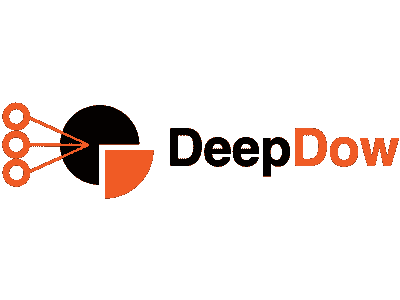
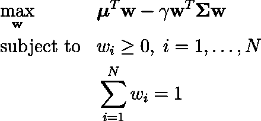
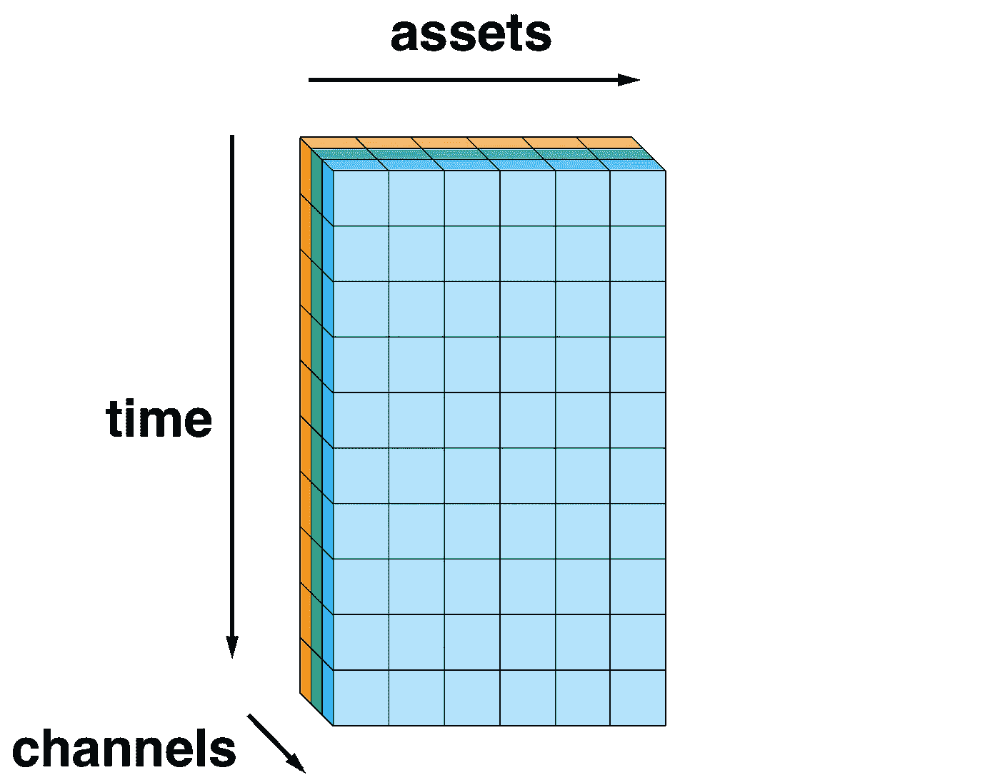
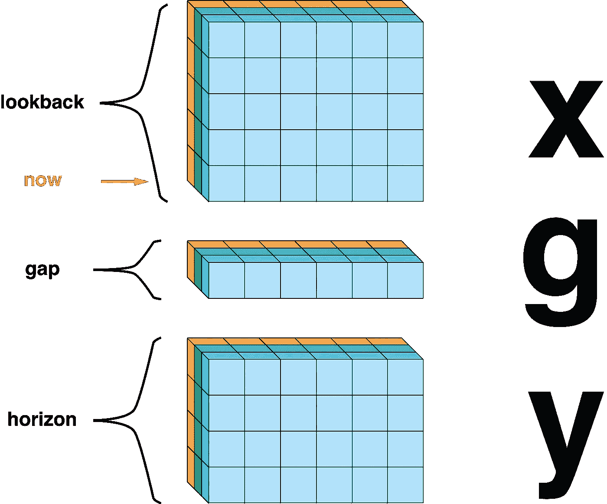
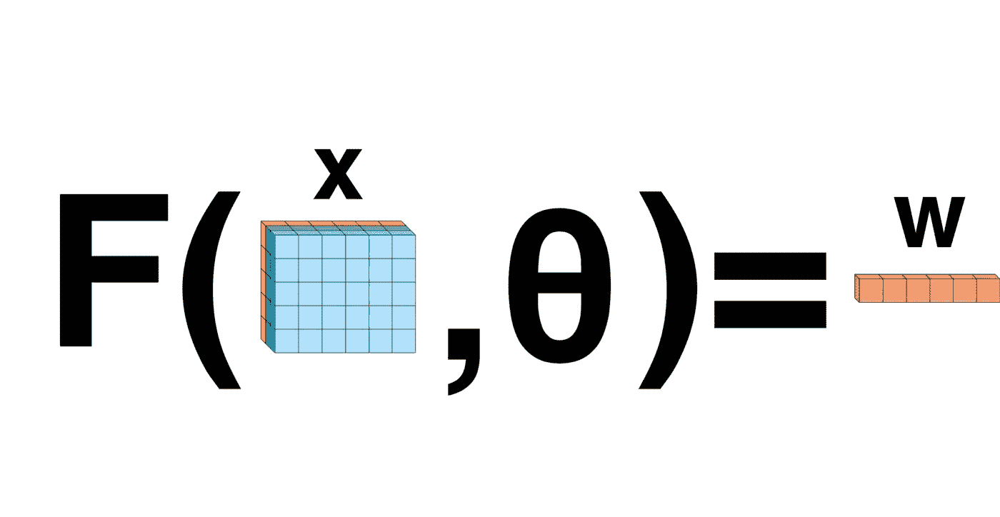
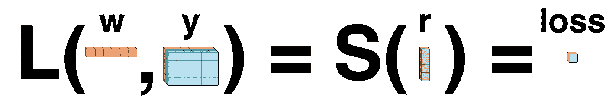

# DeepDow —深度学习的投资组合优化

> 原文：<https://towardsdatascience.com/deepdow-portfolio-optimization-with-deep-learning-a3ffdf36eb00?source=collection_archive---------19----------------------->

[DeepDow](https://github.com/jankrepl/deepdow) 是一个 Python 包，专注于在单次正向传递中执行资产分配的神经网络。

# 单前锋传球？

投资组合优化传统上是一个两步程序:

1.  建立对证券未来表现的信念
2.  根据这些信念寻找最优投资组合

两步程序的一个臭名昭著的例子(受 Markowitz 启发)是

1.  预期收益估计 **μ** 和协方差矩阵**σ**
2.  求解凸优化问题

通常，这两个步骤是完全分开的，因为它们需要不同的方法和不同的软件。

`deepdow`绝对抛弃这种范式。它力求将上述两个步骤合二为一。基本思想是构建端到端的深度网络，输入最原始的特征(回报、交易量……)并输出资产配置。这种方法有多种好处:

*   超参数可以变成可训练的重量(即第二阶段的𝛾)
*   利用深度学习提取有用的特征进行分配，不需要技术指标
*   单一损失函数

# 核心理念

金融时间序列可以被视为一个三维张量，具有以下维度

*   时间
*   资产
*   指示器/通道

举一个具体的例子，我们可以研究多个纳斯达克股票(资产维度)的每日(时间维度)开盘价回报、收盘价回报和交易量(渠道维度)。形象地说，人们可以想象

通过固定一个时间步长(代表现在)，我们可以将张量分成 3 个不相交的子张量

首先， **x** 代表所有关于过去和现在的知识。第二个张量 **g** 代表包含在不久的将来的信息，我们不能用它来做投资决策。最后， **y** 是市场的未来演变。现在可以沿着时间维度移动，并在每个时间步长应用相同的分解。这种生成数据集的方法称为滚动窗口。

现在我们关注一种特殊类型的神经网络，它输入 **x** 并返回所有资产的单个权重分配 **w** ，使得它们的总和为 1。换句话说，根据我们过去的知识, **x** 我们构建了一个投资组合, **w** 我们立即买入并持有一段时间。设 **F** 是带有参数𝜃的神经网络，下图代表高级预测管道。

难题的最后一块是损失函数的定义。在最一般的术语中，每样本损失 **L** 是输入 **w** 和 **y** 并输出实数的任何函数。然而，在大多数情况下，我们首先计算投资组合在时间范围内每个时间步的回报率 **r** ，然后应用一些汇总函数 **S** 如均值、标准差等。

# 网络层

好吧，但是我们如何构建这样的网络呢？不是硬编码一个单一的架构`deepdow`实现强大的构建块(层),用户可以自己组装。两个最重要的图层组是

## 变形层

目标是从输入中提取特征。

*   RNN
*   1D 卷积
*   时间扭曲
*   …

## 分配层

给定输入张量，它们输出有效的资产分配。

*   可微凸优化(`cvxpylayers`)即 Markowitz
*   Softmax(稀疏和约束变量也是)
*   基于聚类的分配器
*   …

一般的模式是创建一个由多个转换层组成的管道，最后是一个分配层。注意，几乎任何实值超参数都可以变成一个可学习的参数，甚至可以被某个子网络预测。

# 想了解更多？

如果这篇文章引起了你的兴趣，请随时查看下面的链接。

*   [GitHub](https://github.com/jankrepl/deepdow)
*   [入门教程](https://deepdow.readthedocs.io/en/latest/auto_examples/end_to_end/getting_started.html#sphx-glr-auto-examples-end-to-end-getting-started-py)
*   [单据](https://deepdow.readthedocs.io/)
*   [更多例子](https://deepdow.readthedocs.io/en/latest/auto_examples/index.html)

我将非常乐意回答任何问题。此外，建设性的批评或帮助发展是非常受欢迎的。