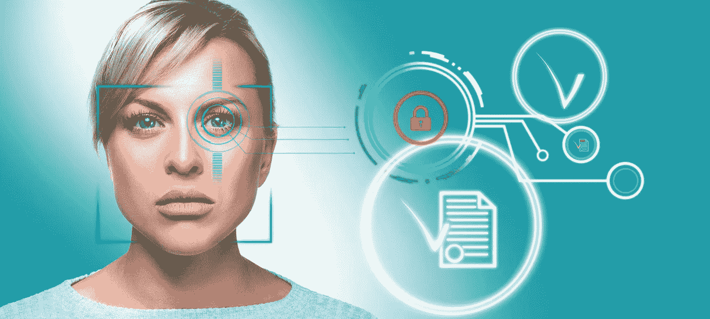
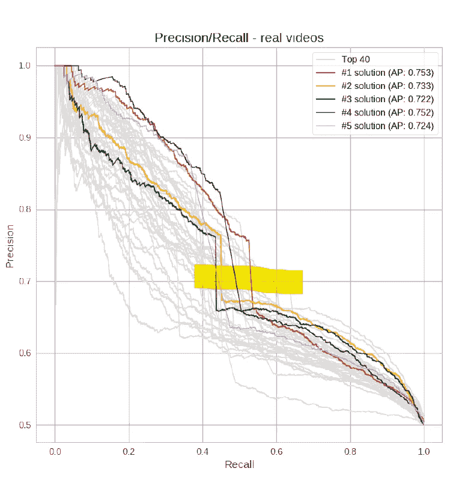
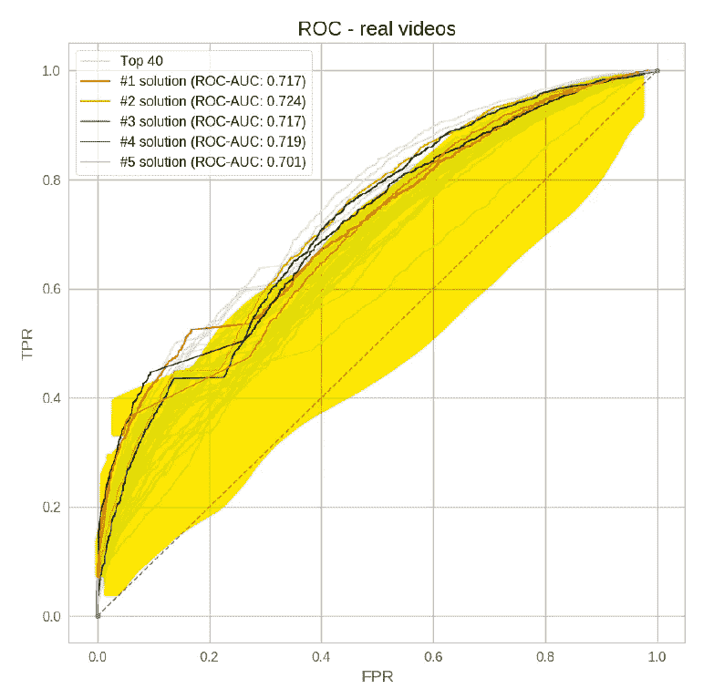

# Deepfake 检测超级难！！！

> 原文：<https://towardsdatascience.com/deepfake-detection-is-super-hard-38f98241ee49?source=collection_archive---------28----------------------->

## 脸书 Deepfake 检测挑战赛回顾与分析。

照片由 stock.adobe.com 斯塔夫罗斯授权

人工智能(AI)和云计算技术的最新进展导致了音频、视频和图像处理技术的快速发展。这种合成媒体内容通常被称为“deep fakes[【1】](https://www.vice.com/en_us/article/bjye8a/reddit-fake-porn-app-daisy-ridley)”基于人工智能的工具可以以越来越可信的方式操纵媒体，例如通过复制一个公众人物的声音或将一个人的脸叠加在另一个人的身体上。

> [这本书现已在亚马逊上架——https://www . Amazon . com/deep fakes-aka-Synthetic-Media-Humanity-ebook/DP/b0b 846 ycnj/](https://www.amazon.com/Deepfakes-aka-Synthetic-Media-Humanity-ebook/dp/B0B846YCNJ/)

立法、政策、媒体素养和技术必须协同工作，为恶意使用 deepfakes 提供有效的补救措施。

> *用于减轻 deepfakes 影响的技术对策分为三类:媒体认证、媒体出处和 deepfake 检测。*

媒体身份验证包括通过使用水印、媒体验证标记、签名和监管链记录来帮助证明整个媒体生命周期的完整性的解决方案。身份验证是防止对可信媒体进行欺骗性操作的最有效方法，因为它可以在整个内容生命周期中验证和跟踪完整性，或者在分发端点进行验证。

媒体出处包括提供关于媒体来源的信息的解决方案，或者在媒体本身中，或者作为媒体的元数据。反向媒体搜索也可以是一个有效的出处工具，一个特定媒体过去出现过的网站列表可以用来证明媒体的来源。出处和认证一起，可以提供重要的取证工具来帮助揭穿 deepfakes。

Deepfake 检测包括利用多模式检测技术来确定目标媒体是否被操纵或合成生成的解决方案。现有的检测技术可以大致分为手动和算法方法。手工技术包括人类媒体法医从业者，通常配备有软件工具。算法检测使用基于人工智能的算法来识别被操纵的媒体。

由于大多数 deepfakes 都是通过对抗性训练(GANs)创建的，因此 creator 算法规避基于人工智能的检测方法的能力将随着它们被引入新的检测系统而提高。如果创建者可以使用它，任何检测器都将有很短的保质期。

业内有一个广泛的共识，即 deepfake 检测可能在短期内解决问题，但从长远来看，实际的解决方案将是认证和出处技术，以及媒体素养。

我将在以后的文章中更详细地讨论技术对策。]

**脸书 Deepfake 检测挑战赛(DFDC)结果**

> 最好的模型在真实世界的数据上有 65%的准确率。这些结果增加了 deepfake 检测的难度，并强调了人工智能模型在减轻合成媒体威胁方面的局限性。

2019 年 9 月，脸书与微软、AWS、Partnership on AI 合作，在 [Kaggle](https://www.kaggle.com/c/deepfake-detection-challenge) 宣布了 Deepfake 检测挑战赛( [DFDC](https://deepfakedetectionchallenge.ai/) )，邀请研究人员开发 deepfake 检测算法。为了提供数据来训练潜在的算法，脸书雇佣了 3500 名演员来录制数千个视频，然后使用各种 deepfake cheapfake 创作技术对这些视频进行处理。总共向研究人员发布了 100，000 个原始和被操纵内容的视频剪辑，作为建立 deepfake 检测器算法的训练集。值得注意的是，这个数据集包括了比以前的训练数据集更多样化和包容性的演员。

挑战赛的提交于 3 月 31 日截止，脸书于 6 月 12 日宣布了比赛的结果。

超过 2000 名参与者提交了 35，000+个检测算法。性能最好的模型使用了谷歌的 [EfficientNet](https://arxiv.org/abs/1905.11946) 算法，这是一种高性能和可扩展的[卷积神经网络](https://en.wikipedia.org/wiki/Convolutional_neural_network) (CNN)。

脸书在这里发表了一篇详细介绍这场竞争的论文[。](https://arxiv.org/abs/2006.07397)

在 DFDC 的训练数据上，获胜团队的准确率达到了 82.56%。虽然这看起来很高，但同样的算法在不可预见的真实世界 deepfakes 中获得了 **65.18%的精度*** 。

**DFDC 结果数据的主要观察结果:**

1.  约 65%的精度意味着系统识别为阳性(deepfakes)的 deepfakes 中有 35%是假阳性(不是 deepfakes)。被算法归类为 deepfakes 的 1/3 的 deepfakes 不是 deepfakes。
2.  在 65%精度的算法中，召回率(或算法识别为真阳性的 deepfakes 的数量与数据集中实际 deepfakes 的数量相比的度量)约为 50%(请参见下面的精度召回率图表)。也就是说，该算法在 50%的情况下将真实视频识别为 deepfake(假阳性)。一半的时间算法不能识别一个深假。
3.  ROC(受试者操作特征)上的 AUC(曲线下面积)是～0.7，ROC 是真阳性率(TPR)和假阳性率(FPR)的图。获胜的算法并没有表现得特别好，相比之下，一个简单的模型，如扔硬币算法，可以实现 0.5[[2]](https://people.inf.elte.hu/kiss/11dwhdm/roc.pdf)的 AUC。

> *DFDC 的结果增加了检测 deepfake 的难度。除了媒体识读措施之外，最有希望的技术对策仍然是认证和出处技术。*

**关于 AI 的伙伴关系(PAI)建议**

PAI 在 2019 年末创建了 [AI 和媒体完整性指导委员会](https://www.partnershiponai.org/ai-and-media-integrity-steering-committee/)，作为合作伙伴的正式机构，开发和建议加强错误/虚假信息解决方案的项目，包括检测操纵和合成内容。DFDC 是人工智能和媒体诚信指导委员会的第一个项目。他们发表了一份关于 DFDC 的重要经验的报告。

**关于 Deepfake 检测的主要建议:**

1.  单靠检测无法解决信息完整性挑战。
2.  检测应该结合真实世界例子和线索才有意义。
3.  检测能力必须以易于理解的界面扩展到记者、事实审查员和民间社会团体。
4.  Deepfake 检测解决方案的开发面临着开源数据集和模型与阻止对手使用这些资源来改进 deep fake 之间的权衡。
5.  在这个问题领域，我们需要一个有意义的多利益攸关方协作方法。

该报告是了解 deepfake 检测挑战和有效对策建议的重要资源。

**DFDC 结果的技术分析**

一些技术术语的词汇表和机器学习度量的快速指南。

**真阳性(TP)** : Deepfakes 被检测为 Deepfakes

**真阴性(TN)** :非 Deepfakes 检测为非 deepfakes。

**假阳性(FP)** :非 Deepfakes 检测为 deepfakes。

**假阴性(FN)** : Deepfakes 被检测为非 Deepfakes。

**准确率**:定义为找到的所有准确数据(TP+TN)与所有数据(TP+FP+TN+FN)的比值。对于 DFDC 上下文，由于类偏斜，不使用精度，而是使用加权精度。

**DFDC 的精确测量**:由于深度假检测(分类真阳性)比真阴性(非深度假阳性)更关键，并且由于类别偏斜，真实世界中假与真视频的不平衡，假阳性数字(非深度假阳性)将为任何模型提供高精确度。脸书创建了一个加权精度指标来衡量算法的有效性。将权重添加到假阳性以使假阳性标准化，从而使检测模型具有实际效用。

**:也称为特异性，由算法分类出的所有阳性 deepfakes (TP)中的真阳性 deep fakes(TP)计算得出，包括假阳性，(TP+FP)。**

***精度= TP / (TP + FP)***

**由于 DFDC 模型的精度是 65%，这意味着系统识别为阳性的 deepfakes(deep fakes)中有 35%不是 deep fakes。这些算法有 35%的时候将非 deepfakes 错误分类为 deepfakes，这是非常高的。**

****回忆**:也称为模型的敏感度，计算为真阳性(deepfakes)与数据集中所有真 deepfakes 的比值(TP + FN)。**

***召回= TP / (TP + FN)***

**根据下面 0.65 精度的图表，召回率约为 50%，这意味着最好的模型将真实视频归类为 deepfake 的概率为 50%。**

****F1 得分**:理想情况下，我们想要一个没有误报(精度= 1)和漏报(召回= 1)的算法。因此，算法的性能通常由 F1 分数来衡量，F1 分数是精确度和召回率的调和平均值。根据域，您可以调整可接受的误报和漏报的阈值。像在晚期疾病分类场景中，假阴性可能具有可怕的后果，因此更高的召回(低假阴性)是期望的。对于垃圾邮件分类器，误报(错过重要邮件)可能是不可接受的，但误报(收到垃圾邮件)是可以的，因此他们可以同意较低的召回率但较高的精确度。**

***F1 得分= 2 *(精度*召回)/(精度+召回)***

**对于 DFDC 算法来说，F1 值(0.65 的精度和 0.5 的召回率)是 0.56，在我看来，这对于 DFDC 算法来说不是一个好的性能指标。该算法在假阳性和假阴性上都是错误的。**

****受试者操作者特征(ROC)** 曲线:是真阳性率和假阳性率的曲线。曲线下面积(AUC)是算法性能的良好指示。我突出显示了 AUC。**

****

**精确召回曲线[https://arxiv.org/abs/2006.07397](https://arxiv.org/abs/2006.07397)**

****

**ROC (TPR FPR 曲线)【https://arxiv.org/abs/2006.07397 **

***喜欢吗？* [*随便给我买本书*](https://www.buymeacoffee.com/ashishjaiman)**

****参考文献:****

**[【1】](http://file///C:/jaiman/Blog/Deepfake%20detection%20doesn't%20work.docx#_ftnref1)[https://www . vice . com/en _ us/article/bjye 8a/Reddit-fake-porn-app-daisy-Ridley](https://www.vice.com/en_us/article/bjye8a/reddit-fake-porn-app-daisy-ridley)**

**[【2】](http://file///C:/jaiman/Blog/Deepfake%20detection%20doesn't%20work.docx#_ftnref2)[https://people.inf.elte.hu/kiss/11dwhdm/roc.pdf](https://people.inf.elte.hu/kiss/11dwhdm/roc.pdf)**