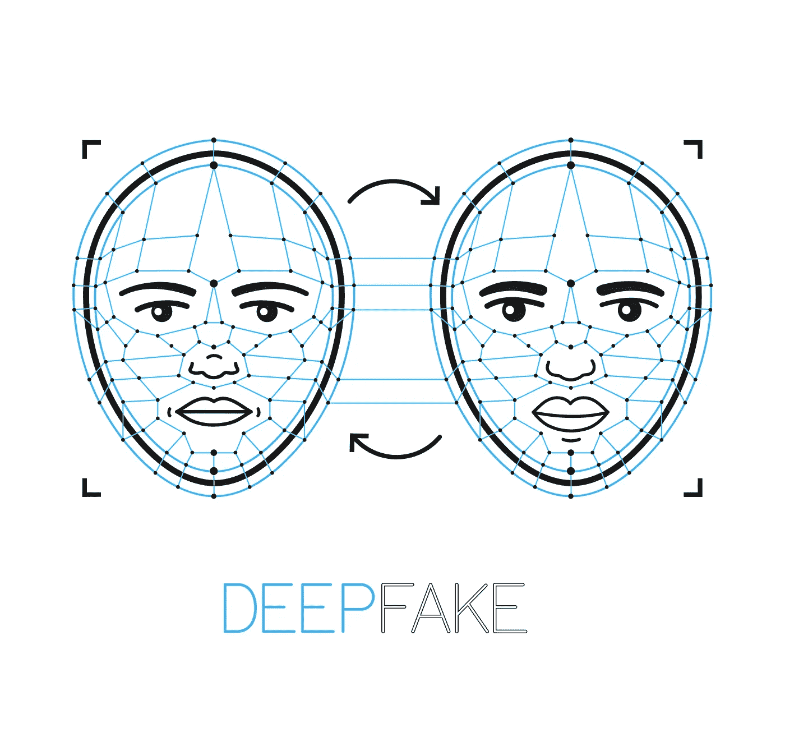
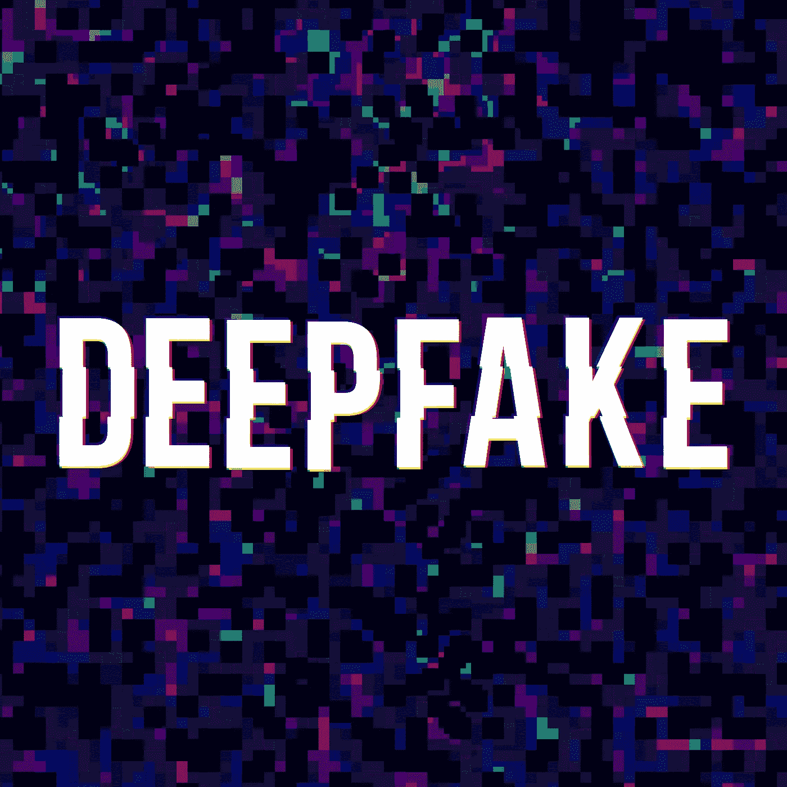
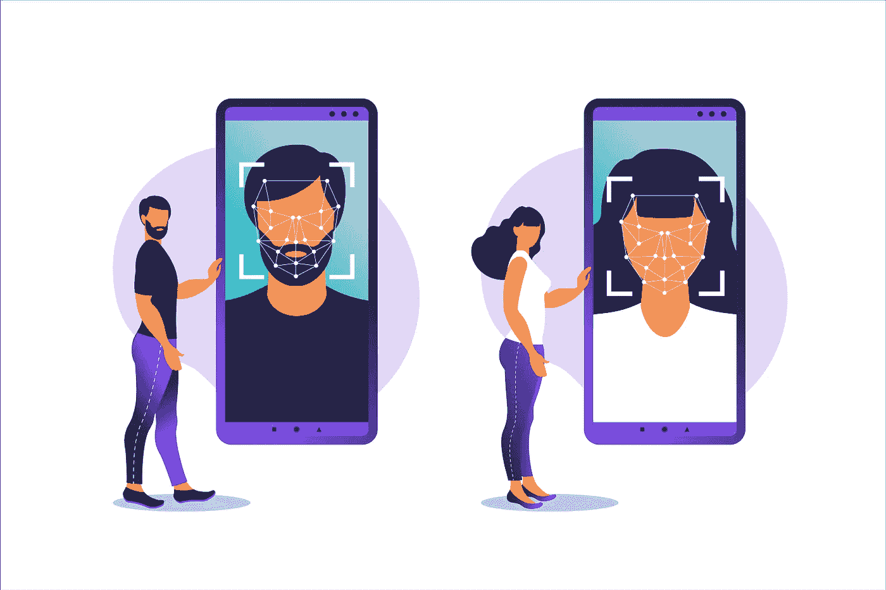

# Deepfake 通过使用生成式对抗网络(GANs)来绕过面部识别

> 原文：<https://towardsdatascience.com/deepfake-to-bypass-facial-recognition-by-using-generative-adversarial-networks-gans-37a8194a87b1?source=collection_archive---------25----------------------->

随着面部识别软件越来越多地用于解锁智能手机和电脑，仅举几个用例，Deepfakes 将使实现真正的面部识别成为可能。随着我们达到一个更高的水平，科技正在迅速进步，在这个水平上，很难区分欺骗和朋友。

Deepfake 使用深度学习 AI 将视频中一个人的面部和声音替换为他们自己的面部、声音或两者的组合。人工智能(AI)的进步是近年来人机交互领域最令人兴奋的发展之一，但还有很长的路要走。

目前有许多涉及虚假语言技巧的欺诈案例，例如试图说服公司的一名员工将钱转到一个欺诈账户[1]。欺诈者使用被称为生成式对抗网络(GANs)的分析技术，为此转向 Deepfake，创造了一种无法区分真实事物和 Deepfakes 的方法。这使得保证收费变得相当困难，因为无法区分合法和假冒[8]。

生成对抗网络(GANs) [2]是一种较新的分析技术，另一方面，它可以以虚假图像和视频的形式产生假阳性和假阴性。这种现象的一个更近的表现是 Deepfake，这是一种人工智能驱动的技术，可以产生极其逼真的文本、图像或视频，人类很难将其与赝品区分开来。

幸运的是，Deepfakes 背后的技术也是可以检测欺诈的技术[3]。随着计算能力的增长和算法变得更快，深度假货正在成为远程客户识别的越来越大的威胁。目前，由虚假视频驱动的技术还不足以推翻现有的生物识别技术。然而，已经有一些高调的尝试访问账户，并覆盖使用假视频的生物特征数据和身份验证解决方案[7]。

通过结合使用人工智能和生物面部识别，公司可以验证用户，而不必通过驾照或护照等身份证明来验证他们的实际存在。Deepfakes 的使用可以绕过这些生物特征和身份证明，获取个人数据[4]。

生物面部识别技术的使用被[监管机构](https://www.ncsl.org/research/civil-and-criminal-justice/facial-recognition-and-biometrics.aspx)视为在入职过程中验证个人数字身份的一种手段。然而，这不足以防范在线身份识别，尤其是随着深度伪造技术的兴起[7]。

Deepfake 技术已被用于实施在线欺诈，并利用它来影响公众舆论和让政治官员难堪。这种技术对那些通过远程生物特征认证带来新客户的组织构成了明显的威胁。

客户 KYC onboarding 播放器嵌入了一种生命识别形式，作为身份验证流程的一部分。活体检查试图确认其身份的人是否是活的主体，而不是复制品或仿制品。结合了活性检测以减少欺骗尝试的成功机会。

一款名为 Zao 的应用程序使用人工智能将电影或电视剪辑中人物的脸替换为你上传到该应用程序的任何人的照片。使用 Zao 的面部交换技术可以绕过面部识别系统。用它来破解安全系统不是一件容易的事。在用户发现该应用背后有“中国开发者”，尽管有可疑的小字，人们开始猜测中国人出于邪恶的目的从手机上偷拍人脸和照片。幸运的是，事实证明这些面孔实际上在亚马逊位于美国本土的数据中心的服务器上，并在 48 小时内被删除了，但恐慌是巨大的[6]。

这项技术近年来取得了巨大的进步，有人担心它可能被用来创建妥协的照片和视频认证，以绕过语音和面部识别协议。

RemoteVerify 是一个身份验证解决方案，结合了 NorthRow 最流行的两项技术:活体检测和生物认证。在一个例子中，生物认证的成功关键在于识别“活动性”，生物认证试图确定你是坐在电脑前还是拿着智能手机并允许你创建和访问银行账户的真人。

活体检测有可能防止骗子在试图绕过验证协议时使用机器人、视频、照片和伪造的文档。相比之下，[美国政府](https://www.nist.gov/document/401newtonpdf)和[欧盟(EU)](https://www.planetbiometrics.com/article-details/i/3157/desc/biometric-standardisation-in-the-european-union-cen-tc224-wg18/) 已经提倡使用经过认证的活体检测方法，这些方法反过来又被绑定到一个被称为 [ISO 30107](https://www.iso.org/obp/ui/#!iso:std:67381:en) 的全球生物特征标准上。

**引用来源**

*   [1][https://www . acuantcorp . com/blog/deep fakes-newest-threat-to-identity/](https://www.acuantcorp.com/blog/deepfakes-newest-threat-to-identity/)
*   [2][https://www . csoonline . com/article/3504740/prediction-2-anagements-to-generate-deep fakes-to-bypass-face-recognition . html](https://www.csoonline.com/article/3504740/prediction-2-adversaries-to-generate-deepfakes-to-bypass-facial-recognition.html)
*   [3][https://mgmt 3d . com/ai-deep fakes-and-face-recognition-raise-questions-about-security/](https://mgmt3d.com/ai-deepfakes-and-facial-recognition-raise-questions-about-security/)
*   [4][https://securityboulevard . com/2020/01/deep fakes-pose-new-security-challenges/](https://securityboulevard.com/2020/01/deepfakes-pose-new-security-challenges/)
*   [5][https://techno de . com/2019/09/11/deep fakes-is-not-a-threat-to-face-payments-for-now/](https://technode.com/2019/09/11/deepfakes-are-not-a-threat-to-facial-payments-for-now/)
*   [6][https://www . bobs guide . com/guide/news/2019/Nov/29/are-deep-fakes-a-threat-to-the-future-of-identity-verification/](https://www.bobsguide.com/guide/news/2019/Nov/29/are-deep-fakes-a-threat-to-the-future-of-identity-verification/)
*   [7][https://www . cybersecasia . net/features/cyber security-predictions-2020-face-the-deep fake-threat/2](https://www.cybersecasia.net/features/cybersecurity-predictions-2020-facing-the-deepfake-threat/2)
*   [8][https://www . pym nts . com/authentic ation/2019/deep fakes-next-stop-banking/](https://www.pymnts.com/authentication/2019/deepfakes-next-stop-banking/)