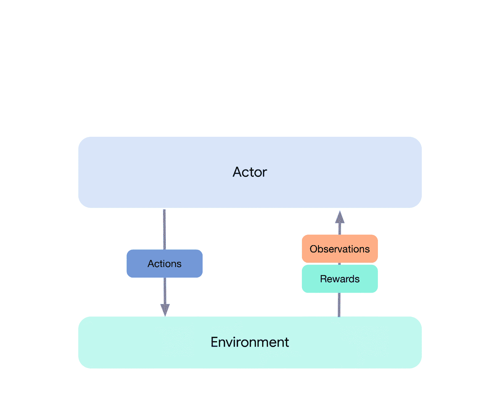

# DeepMind 不断涌现，发布了 Acme 和 Reverb RL 库

> 原文：<https://towardsdatascience.com/deepmind-surges-on-releasing-acme-and-reverb-rl-libraries-10545996cd05?source=collection_archive---------76----------------------->

## Alphabet 子公司继续为机器学习研究社区提供有用的软件库。

在 [Unsplash](https://unsplash.com?utm_source=medium&utm_medium=referral) 上由 [Franck V.](https://unsplash.com/@franckinjapan?utm_source=medium&utm_medium=referral) 拍摄的照片

# 要旨

Deepmind 现在完全是 Alphabeta 的子公司，是一家专注于人工智能的创新软件公司。你可能因为他们在训练 [AlphaGo](https://deepmind.com/research/case-studies/alphago-the-story-so-far) 和 [AlphaGoZero](https://deepmind.com/blog/article/alphago-zero-starting-scratch) 中的成就而知道他们。AlphaGoZero 强化学习代理从零开始学习，直到[成为围棋世界冠军](https://www.theverge.com/2019/11/27/20985260/ai-go-alphago-lee-se-dol-retired-deepmind-defeat)。

尽管取得了这样或那样的巨大成功，但由于缺乏可重复性，该公司的学术成就一直面临挫折。独立复制学术作品的能力是验证和进一步合作的生命线。因此，提供服务至关重要，尤其是在一个计算资源丰富的人和其他人之间的差距越来越大的世界里。

DeepMind 明白。

近年来，他们已经进入了一个凹槽，不断地发布模块化软件库来帮助其他研究人员。这些库有多种用途，包括:

*   再现性
*   简单
*   模块性
*   并行化
*   效率

随着他们的 Acme 和 Reverb 库的发布，这一趋势继续发展。事实上，该库的作者在他们的网站上明确提出了 Acme 的高层次目标:

> *1。使我们的方法和结果具有可重复性——这将有助于澄清是什么使 RL 问题变得困难或容易，这是很少显而易见的。
> 2。为了简化我们(以及整个社区)设计新算法的方式——我们希望下一个 RL 代理对每个人来说都更容易编写！
> 3。提高 RL 代理的可读性——当从一篇论文过渡到代码时，不应该有隐藏的惊喜。*
> 
> [*DeepMind 极致作者*](https://deepmind.com/research/publications/Acme)

# 好吧，但是怎么做？

他们实现这些目标的方法之一是通过适当的抽象层次。强化学习的领域就像一个洋葱，就其层次而言，它的使用效果最好。从表面上看，你有一个从数据中学习的代理。剥开数据部分，你会看到这个数据要么是一个存储的数据集，要么是一个活生生的体验序列。剥开代理，您会看到它计划并采取行动，从它的环境中产生一个有度量的响应。你可以再次剥离更多，深入研究政策，经验，重放等。下图很好地展示了这一点。

*分层显示的强化学习问题[* [*来源*](https://deepmind.com/research/publications/Acme)

*Acme 实现其目标的另一种方式是通过一种可扩展的数据存储机制，实现为配套的混响库。为此，考虑代理的典型经验重放缓冲。这个缓冲区有多大？通常，它是在至少几万到几十万个经验元组的数量级上，这是针对每个代理的。当处理一个涉及数千到数百万代理的模拟时，你会得到…很多。*

*通过解耦数据生产者(代理)和数据消费者(学习者)的概念，一个有效的数据存储机制可以独立地位于两者之间。这正是混响的作用。作为一个公司支持的库，它有超过 70%的 C++代码和一个整洁的 python 界面，我真的很兴奋能够深入其中。*

*一名 R2D2 RL 代理人正在玩街机游戏 Breakout [ [来源](https://www.youtube.com/watch?v=3hnlDfJYWcI&feature=youtu.be)*

# *结论*

*通过不断发布类似这样的精彩开源库，DeepMind 有助于降低准入门槛，并为 ML 和 AI 研究创造公平的竞争环境。将此与低成本云计算解决方案相结合，任何人都可以直接加入进来！提交你用这些库做的任何酷项目。我迫不及待想见到他们。*

# *跳进来*

*[【极致】Github 资源库](https://github.com/deepmind/acme)
[【极致】白皮书](https://github.com/deepmind/acme/blob/master/paper.pdf)
[【极致】Google Colab 示例](https://colab.research.google.com/github/deepmind/acme/blob/master/examples/tutorial.ipynb)
[【混响】Github 资源库](https://github.com/deepmind/reverb)
[【混响】Google Colab 示例](https://colab.research.google.com/github/deepmind/reverb/blob/master/examples/demo.ipynb)*

# *保持最新状态*

*在学术界和工业界，事情发展得很快！用一般的 [LifeWithData](https://lifewithdata.org/blog/) 博客和 [ML UTD](https://lifewithdata.org/tag/ml-utd/) 时事通讯让自己保持最新状态。*

*如果你不是时事通讯的粉丝，但仍想参与其中，可以考虑将 lifewithdata.org/blog 的[和 lifewithdata.org/tag/ml-utd 的](https://lifewithdata.org/blog)[添加到](https://https//lifewithdata.org/tag/ml-utd) [Feedly](http://that%27s%20all%20for%20ml%20utd%202.%20however%2C%20things%20are%20happening%20very%20quickly%20in%20academics%20and%20industry%21%20aside%20from%20ml%20utd%2C%20keep%20yourself%20updated%20with%20the%20blog%20at%20lifewithdata./) 聚合设置中。*

**原载于 2020 年 6 月 1 日 https://lifewithdata.org***。***