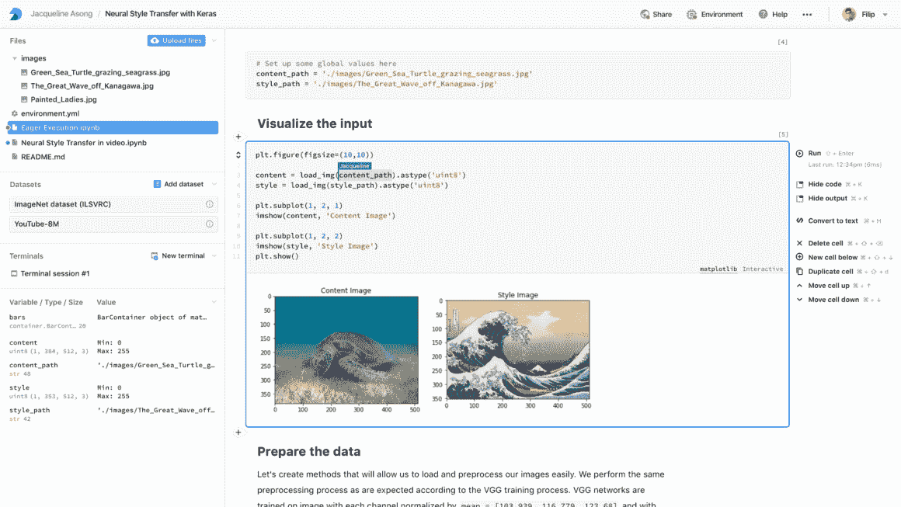
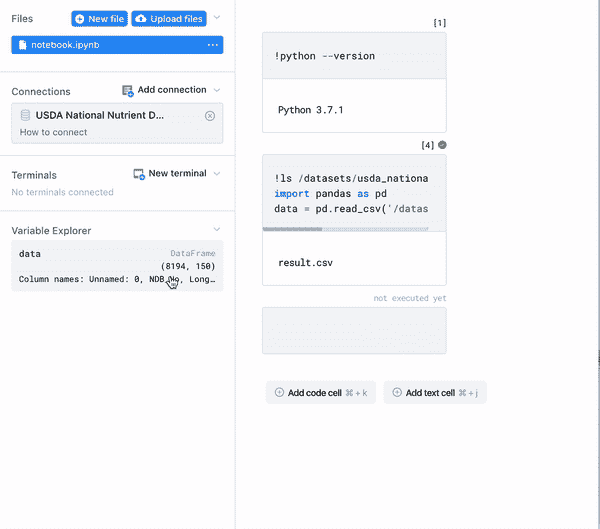
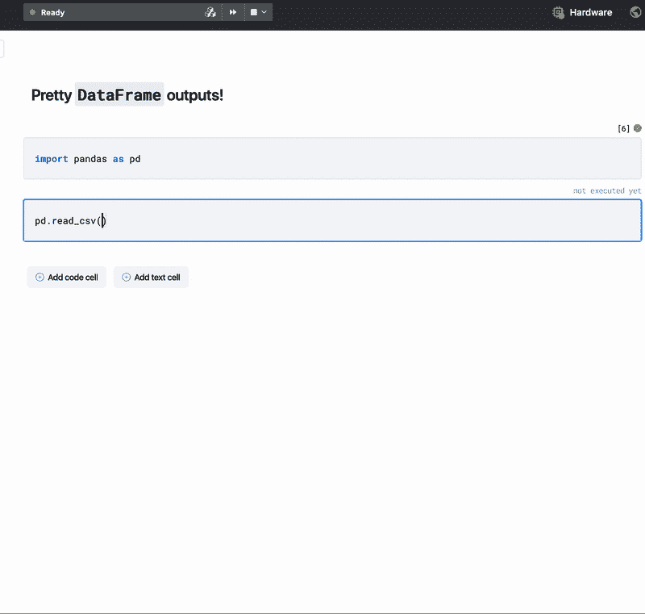
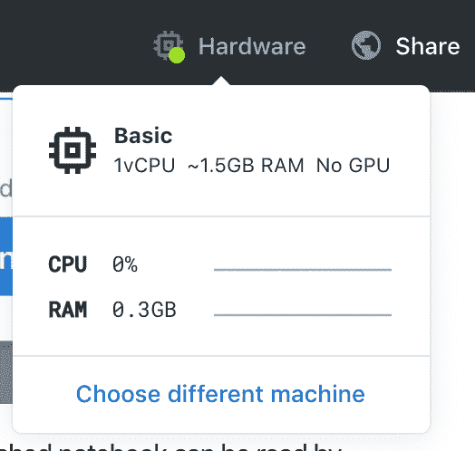
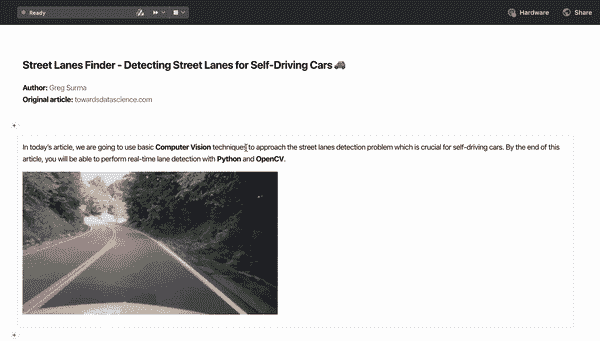
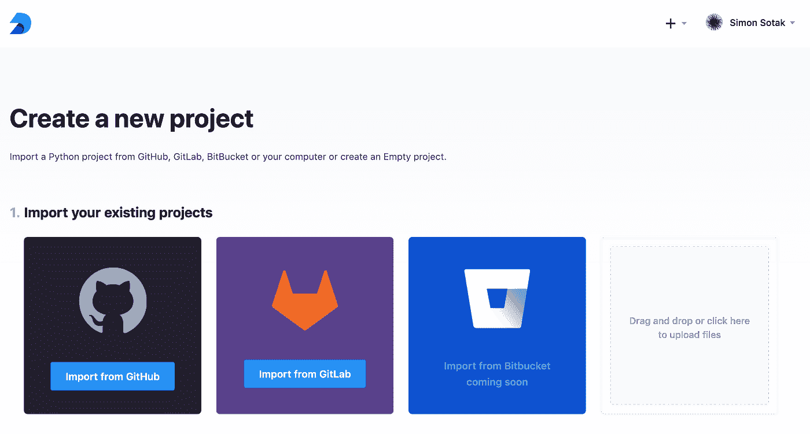
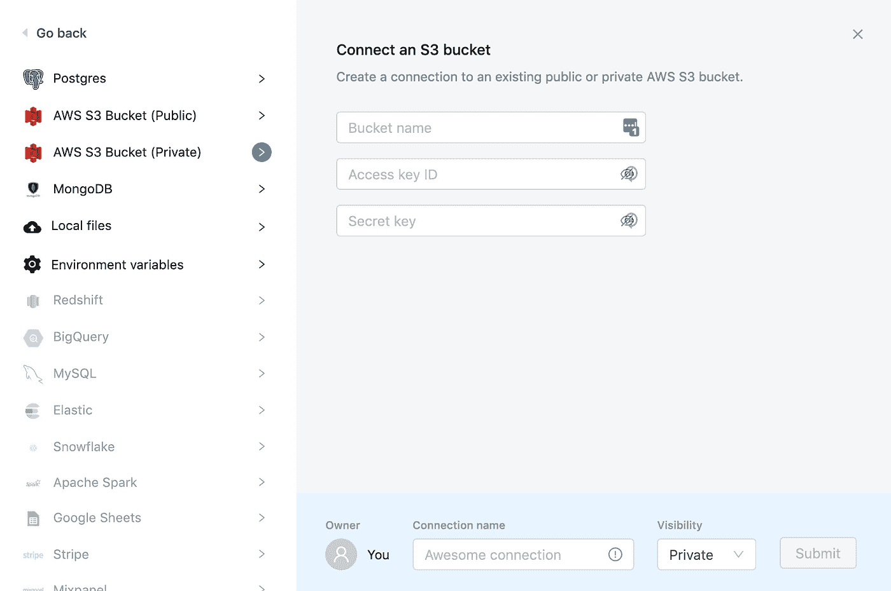

# Deepnote 将成为 Jupyter 黑仔

> 原文：<https://towardsdatascience.com/deepnote-sets-course-to-become-the-jupyter-killer-d0cb6e3ca011?source=collection_archive---------5----------------------->

DeepNote 笔记本体验预览([来源](http://docs.deepnote.com))

DeepNote，一个位于旧金山的小型[团队](https://www.deepnote.com/)，想要在你的数据科学工作流程中取代 Jupyter。我想他们可能会这么做。

> *如果你像我一样是一名数据科学家，你可能会花更多时间在工程任务上，而不是实际研究上。安装库、管理数据库、跟踪你的实验、调试代码、耗尽内存……你明白了。*
> 
> *【关于】* [*页面*](https://www.deepnote.com/about/) *深注*

Jupyter 笔记本非常适合数据科学原型开发。在一个单一的环境中，人们可以无缝地执行探索性分析，可视化数据，并建立 ML 模型原型。

也就是说，不久前，大多数数据科学家认为 [Spyder IDE](https://www.spyder-ide.org/) 是万能的。即使是最伟大的工具最终也会寿终正寝，不管是因为缺乏适应性、缺乏持续的支持，还是其他什么原因。

尽管 Jupyter 笔记本在数据科学社区广受欢迎，但许多人也指出了一些重要的弱点。新工具以更好或更快的方式解决现有工具中的弱点的能力通常使它们能够被现状工具集所采用。让我们来看看 DeepNote 提供的一些激动人心的竞争优势。

# 实时协作

谷歌的在线协作工具套件(文档、表格、幻灯片等)占据了微软 Office 的巨大市场份额，却没有增加多少功能。他们是怎么做到的？让世界踏上通往他们家门口的道路的主要区别在于实时协作。

通过在谷歌套件中与同事实时协作，你不再需要同步开发，也不再需要为融合差异而烦恼。此外，您总是知道您的合作者目前在哪里工作，这使得分工更加容易。

DeepNote 带来了开箱即用的功能，在共享计算环境中实现无缝协作。事实上，这确实会带来名称空间变化的问题。然而，我认为这是一个比共享 Jupyter 笔记本更好的问题，因为要获得给定的状态，必须重新运行这些笔记本。

在此查看实时 DeepNote 协作的运行[。](https://lifewithdata.org/wp-content/uploads/2020/02/deepnote-feature-collab.mp4)

此外，DeepNote 为每个协作者提供了不同的权限级别:查看、执行、编辑、管理和所有者。这允许对这些笔记本电脑的操作进行大量控制。

首先，想象一个师生场景。在线课程的教师可以在虚拟教室中浏览共享的笔记本。教师拥有管理员/所有者权限，而教室的其余部分仅包含查看权限。

作为另一个例子，考虑一个上级评估一个团队成员的工作。团队成员使用所有者权限来完全控制笔记本。上级使用编辑权限提供内联反馈，但不能执行任何单元格。通过只对团队成员保留执行权限，上级不能更改(读取:污染)团队成员的名称空间。

# 变量浏览器

Spyder IDEs 中我在 Jupyter 笔记本中真正错过的一个方面(至少，没有扩展/小部件)是易于访问的名称空间浏览器。当然，有`who` / `whos`魔法命令。然而，这些并不能真正与 Spyder 的产品相提并论。

我们再一次用 DeepNote 填补了空白！

DeepNote 笔记本为你的变量提供了漂亮的摘要([来源](https://docs.deepnote.com/))

除了坚固的变量浏览器，没有漂亮的熊猫`DataFrame`显示器，任何有自尊的笔记本环境都是不完整的。

是的，DeepNote 笔记本也有漂亮的熊猫`DataFrame`显示屏([来源](https://docs.deepnote.com/))

# DeepNote 附着在云硬件上

我肯定你听说过经验法则(实际上，更多的是抱怨)，大约 80%的数据科学是除了数学和统计之外的一切。在云计算环境中，这一比例变得更像 90/10，额外损失了 10%的时间来为您的笔记本电脑提供合适的计算能力。

轻松查看和选择笔记本电脑运行的硬件( [source](https://docs.deepnote.com/) )

DeepNote 了解您的困难，并提供对基于云的硬件的无缝访问，以满足您的所有需求。所谓无缝，我的意思是你在笔记本界面上设置一切！哦，顺便说一下，他们不会关闭你的内核，除非它实际上是空闲的。

# Python 包管理

Python 有一个很棒的包管理系统。DeepNote 意识到了这一点，并坚持使用其工作目录中的一个`requirements.txt`文件。即使这样，仍然很容易忘记预先安装一些依赖项。当这种情况发生时，直到我们尝试导入并失败时，我们才意识到遗漏！

为此，DeepNote 的笔记本会主动监控您的包导入，通知您声明的需求中缺少的依赖项。此外，如果需求文件还不存在，它会对该文件进行最好的猜测。剧透警告:猜测通常是正确的。

DeepNote 包管理器建议安装一个缺少的依赖项([源](https://docs.deepnote.com/)

# DeepNote 集成了…很多

创建新项目的示例([来源](https://docs.deepnote.com/)

最后，DeepNote 提供了几乎所有你期望使用的集成。为了保持笔记本的有序，您可以选择不同的源代码控制库连接。这可以在笔记本创建过程中使用，也可以用于写回更新。

除了源代码控制，DeepNote 笔记本还允许连接到云计算数据存储，如 S3、GCS 和公共数据库引擎。

正式连接到各种云基础设施([来源](https://docs.deepnote.com/))

# 暂时就这样了

虽然 DeepNote 还没有达到真正消灭 Jupyter 的境界，但这个轨迹肯定是存在的。我渴望看到他们如何继续！然而，不要只相信我的话。像我一样，报名参加他们的[早期接入项目](https://www.deepnote.com/)。他们在一周内做出了回应，从那以后我们就一直在漫不经心地讨论改进！不要只是抱怨现状，成为改善现状的一份子。

# 保持最新状态

学术界和工业界的事情发生得非常快！通过一般的 [LifeWithData 博客](https://lifewithdata.org/blog/)、ML UTD 简讯和 [Twitter feed](https://twitter.com/anthonyagnone) 让自己保持最新状态。

如果你不是收件箱时事通讯的粉丝，但仍然想参与其中，可以考虑将这个 URL 添加到聚合设置中。

*原载于 2020 年 2 月 23 日 https://lifewithdata.org***。**