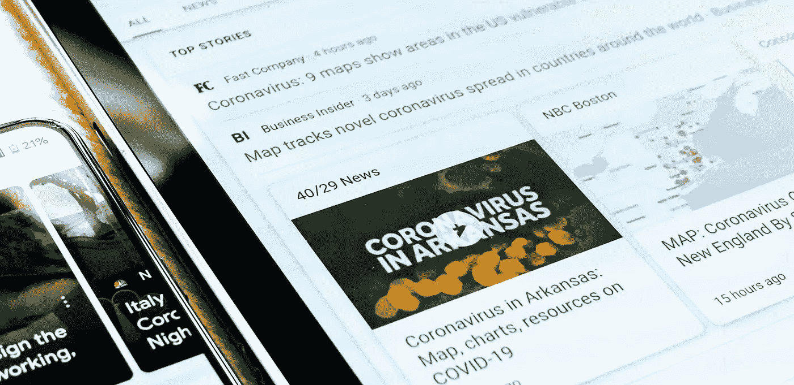
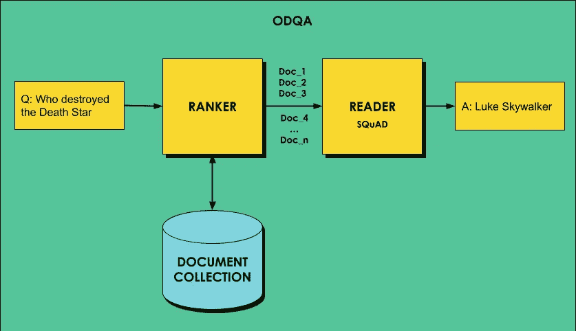
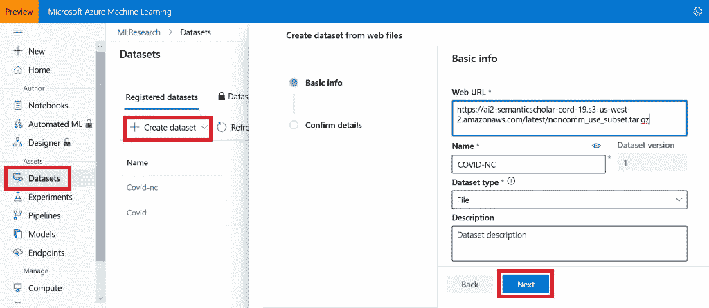

# DeepPavlov:自然语言处理的“Keras”回答 COVID 问题

> 原文：<https://towardsdatascience.com/deeppavlov-keras-for-natural-language-processing-answers-covid-questions-9da6199c5489?source=collection_archive---------55----------------------->

## 使用 Azure 机器学习和 DeepPavlov 库在 COVID 论文数据集上训练开放域问答模型。



奥比·奥尼耶德在 [Unsplash](https://unsplash.com/s/photos/medical-paper?utm_source=unsplash&utm_medium=referral&utm_content=creditCopyText) 上拍摄的照片

在与图像相关的深度学习领域，Keras 库发挥了重要作用，从根本上简化了迁移学习或使用预训练模型等任务。如果您切换到 NLP 领域，执行相对复杂的任务，如问题回答或意图分类，您将需要让几个模型一起工作。在这篇文章中，我描述了使 NLP 民主化的 [DeepPavlov](http://deeppavlov.ai/?utm_source=medium&utm_medium=article&utm_campaign=odqa_covid) 库，以及如何使用它和 Azure ML 在 COVID 数据集上训练问答网络。

> *本帖是*[*AI April*](http://aka.ms/aiapril)*倡议的一部分，四月的每一天我的同事都会在这里发布与 AI、机器学习和微软相关的新原创文章。看看* [*日历*](http://aka.ms/aiapril) *找到其他已经发表的有趣的文章，并在这个月内继续查看那个页面。*

在过去的几年里，我们见证了许多与自然语言处理相关的任务取得了重大进展，这主要归功于 [transformer 模型](https://medium.com/inside-machine-learning/what-is-a-transformer-d07dd1fbec04)和 [BERT](/bert-explained-state-of-the-art-language-model-for-nlp-f8b21a9b6270) 架构。一般来说，BERT 可以有效地用于许多任务，包括文本分类，命名实体提取，预测上下文中的屏蔽词，甚至问答。

从头开始训练 BERT 模型[是非常资源密集型的](https://medium.com/@ranko.mosic/googles-bert-nlp-5b2bb1236d78)，大多数应用程序依赖于预先训练的模型，使用它们进行特征提取，或者进行一些温和的微调。因此，我们需要解决的原始语言处理任务可以分解为更简单步骤的**管道**，BERT 特征提取是其中之一，其他是标记化，将 TF-IDF 排名应用于一组文档，或者只是简单的分类。

这个流水线可以看作是由一些神经网络代表的一组处理**步骤**。以文本分类为例，我们将有提取特征的 BERT 预处理器步骤，然后是分类步骤。这一系列步骤可以组成一个神经架构，并在我们的文本数据集上进行端到端的训练。

# DeepPavlov

DeepPavlov 图书馆来了。它主要为你做这些事情:

*   允许您通过编写一个**配置**，将文本处理管道描述为一系列步骤。
*   提供了许多预定义的步骤，包括预训练的模型，如 BERT 预处理器
*   提供了许多预定义的配置，您可以使用它们来解决常见的任务
*   从 Python SDK 或命令行界面执行管道训练和推理

这个库实际上做的远不止这些，它让你能够在 REST API 模式下运行它，或者作为微软机器人框架的 chatbot 后端。然而，我们将关注使 DeepPavlov 对自然语言处理有用的核心功能，就像 Keras 对图像一样。

您可以通过在[https://demo . DeepPavlov . ai](https://demo.deeppavlov.ai)上玩一个交互式 web 演示来轻松探索 DeepPavlov 的功能。

# 用 DeepPavlov 进行 BERT 分类

再次考虑使用 BERT 嵌入的文本分类问题。 [DeepPavlov](https://github.com/deepmipt/DeepPavlov) 包含一些预定义的配置文件，例如，看看 [Twitter 情感分类](https://github.com/deepmipt/DeepPavlov/blob/master/deeppavlov/configs/classifiers/sentiment_twitter_bert_emb.json)。在此配置中，`chainer`部分描述了管道，包括以下步骤:

*   `simple_vocab`用于将预期输出(`y`)，即一个类名，转换成数字 id ( `y_ids`)
*   `transformers_bert_preprocessor`取输入文本`x`，产生一组伯特网络期望的数据
*   `transformers_bert_embedder`实际上为输入文本生成 BERT 嵌入
*   `one_hotter`将`y_ids`编码成分类器最后一层所需的一位热码
*   `keras_classification_model`是分类模型，是定义了参数的多层 CNN
*   `proba2labels`最终层将网络的输出转换成相应的标签

Config 还定义了`dataset_reader`来描述输入数据的格式和路径，以及`train`部分中的训练参数，以及其他一些不太重要的东西。

一旦我们定义了配置，我们就可以从命令行训练它，如下所示:

```
python -m deeppavlov install sentiment_twitter_bert_emb.json
python -m deeppavlov download sentiment_twitter_bert_emb.json 
python -m deeppavlov train sentiment_twitter_bert_emb.json
```

`install`命令安装执行该过程所需的所有库(如 Keras、transformers 等)。)，第二行`download`是所有预训练的模型，最后一行执行训练。

一旦模型经过训练，我们就可以从命令行与它进行交互:

```
python -m deeppavlov interact sentiment_twitter_bert_emb.json
```

我们也可以使用任何 Python 代码中的模型:

```
model **=** build_model(configs**.**classifiers**.**sentiment_twitter_bert_emb) result **=** model(["This is input tweet that I want to analyze"])
```

# 开放领域问答

可以使用 BERT 执行的最有趣的任务之一叫做 [**开放领域问答**](https://en.wikipedia.org/wiki/Question_answering) ，简称 ODQA。我们希望能够给计算机一堆文本来阅读，并期望它对一般问题给出具体的答案。*开放领域*问答的问题指的是我们不是指一个文档，而是指一个非常广阔的知识领域。

ODQA 通常分两个阶段工作:

*   首先，我们试图为查询找到最匹配的文档，执行*信息检索*的任务。
*   然后，我们通过网络处理该文档，以从该文档中产生特定答案(*机器理解*)。



开放领域问答架构，来自 [DeepPavlov 博客](https://medium.com/deeppavlov/open-domain-question-answering-with-deeppavlov-c665d2ee4d65)

在这篇博文中[已经很好地描述了使用 DeepPavlov 进行 ODQA 的过程，然而，他们在第二阶段使用的是 R-NET，而不是 BERT。在本帖中，我们将把 ODQA 与 BERT 一起应用于](https://medium.com/deeppavlov/open-domain-question-answering-with-deeppavlov-c665d2ee4d65)[新冠肺炎开放研究数据集](https://www.kaggle.com/allen-institute-for-ai/CORD-19-research-challenge/)，该数据集包含超过 52，000 篇关于新冠肺炎的学术文章。

# 使用 Azure ML 获取训练数据

为了训练，我将使用 [Azure 机器学习](https://docs.microsoft.com/azure/machine-learning/?WT.mc_id=aiapril-blog-dmitryso)，特别是[笔记本](https://docs.microsoft.com/azure/machine-learning/tutorial-1st-experiment-sdk-setup/?WT.mc_id=aiapril-blog-dmitryso)。将数据放入 AzureML 的最简单方法是创建一个**数据集**。在语义学者页面可以看到所有可用的数据[。我们将使用非商业子集，位于](https://pages.semanticscholar.org/coronavirus-research)[这里](https://ai2-semanticscholar-cord-19.s3-us-west-2.amazonaws.com/latest/noncomm_use_subset.tar.gz)。

为了定义数据集，我将使用 [Azure ML Portal](http://ml.azure.com/?WT.mc_id=aiapril-blog-dmitryso) ，并从 web 文件创建数据集**，选择**文件**作为数据集类型。我唯一需要做的就是提供网址。**



要访问数据集，我需要一台**笔记本**和**计算机**。因为 ODQA 任务相当密集，而且需要大量内存，所以我会用 112Gb 或 RAM 的 [**NC12**](https://docs.microsoft.com/azure/virtual-machines/nc-series/?WT.mc_id=aiapril-blog-dmitryso) 虚拟机创建一个大计算。这里描述了创建计算机和笔记本的过程[。](https://docs.microsoft.com/azure/machine-learning/tutorial-1st-experiment-sdk-setup/?WT.mc_id=aiapril-blog-dmitryso)

要从我的笔记本中访问数据集，我需要以下代码:

```
from azureml.core import Workspace, Dataset
workspace **=** Workspace**.**from_config()
dataset **=** Dataset**.**get_by_name(workspace, name**=**'COVID-NC')
```

数据集包含一个压缩的`.tar.gz`文件。为了解压缩它，我将数据集挂载为一个目录，并执行 UNIX 命令:

```
mnt_ctx **=** dataset**.**mount('data')
mnt_ctx**.**start() 
!tar **-**xvzf **./**data**/**noncomm_use_subset**.**tar**.**gz 
mnt_ctx**.**stop()
```

所有文本以`.json`文件的形式包含在`noncomm_use_subset`目录中，在`abstract`和`body_text`字段中包含摘要和完整的纸质文本。为了将文本提取到单独的文本文件中，我将编写简短的 Python 代码:

```
from os.path import basename**def** **get_text**(s):     
    **return** ' '**.**join([x['text'] **for** x **in** s]) os**.**makedirs('text',exist_ok**=**True) 
**for** fn **in** glob**.**glob('noncomm_use_subset/pdf_json/*'):
     **with** open(fn) **as** f:
         x **=** json**.**load(f)
     nfn **=** os**.**path**.**join('text',basename(fn)**.**replace('.json','.txt'))       
     **with** open(nfn,'w') **as** f:         
         f**.**write(get_text(x['abstract']))         
         f**.**write(get_text(x['body_text']))
```

现在我们将有一个名为`text`的目录，所有的论文都以文本的形式存在。我们可以去掉原来的目录:

```
!rm **-**fr noncomm_use_subset
```

# 设置 ODQA 模型

首先，让我们在 DeepPavlov 中建立原始的预训练 ODQA 模型。我们可以使用名为`en_odqa_infer_wiki`的现有配置:

```
import sys 
!{sys**.**executable} **-**m pip **--**quiet install deeppavlov 
!{sys**.**executable} **-**m deeppavlov install en_odqa_infer_wiki 
!{sys**.**executable} **-**m deeppavlov download en_odqa_infer_wiki
```

这将需要相当长的时间来下载，你将有时间意识到你是多么幸运地使用云资源，而不是你自己的电脑。下载云到云要快得多！

要从 Python 代码中使用这个模型，我们只需要从 config 构建模型，并将其应用到文本:

```
from deeppavlov import configs 
from deeppavlov.core.commands.infer import build_model 
odqa **=** build_model(configs**.**odqa**.**en_odqa_infer_wiki) 
answers **=** odqa([ "Where did guinea pigs originate?",                   		 
                 "When did the Lynmouth floods happen?" ])
```

我们将得到的答案是:

```
['Andes of South America', '1804']
```

如果我们试图问网络一些关于冠状病毒的问题，下面是我们将得到的答案:

*   什么是冠状病毒？— *一种特定病毒的毒株*
*   什么是新冠肺炎？— *在屋顶或教堂塔楼上筑巢*
*   新冠肺炎起源于哪里？— *阿帕特北部海岸*
*   上一次疫情是什么时候？— *1968 年*

远非完美！这些答案来自旧的维基百科文本，该模型已被训练过。现在我们需要根据我们自己的数据重新训练文档提取器。

# 训练模型

用你自己的数据训练 ranker 的过程在 [DeepPavlov 博客](https://medium.com/deeppavlov/open-domain-question-answering-with-deeppavlov-c665d2ee4d65)中有描述。因为 ODQA 模型使用`en_ranker_tfidf_wiki`作为排序器，我们可以单独加载它的配置，并替换用于训练的`data_path`。

```
from deeppavlov.core.common.file import read_json 
model_config **=** read_json(configs**.**doc_retrieval**.**en_ranker_tfidf_wiki) 
model_config["dataset_reader"]["data_path"] **=** 
			os**.**path**.**join(os**.**getcwd(),"text") 
model_config["dataset_reader"]["dataset_format"] **=** "txt" model_config["train"]["batch_size"] **=** 1000
```

我们还减小了批量大小，否则训练过程将无法适应内存。再次意识到我们手头可能没有 112 Gb RAM 的物理机器。

现在让我们训练模型，看看它的表现如何:

```
doc_retrieval **=** train_model(model_config) doc_retrieval(['hydroxychloroquine'])
```

这将为我们提供与指定关键字相关的文件名列表。

现在让我们实例化实际的 ODQA 模型，看看它是如何执行的:

```
*# Download all the SQuAD models* squad **=** build_model(configs**.**squad**.**multi_squad_noans_infer,
					download **=** True) 
*# Do not download the ODQA models, we've just trained it* odqa **=** build_model(configs**.**odqa**.**en_odqa_infer_wiki, 
					download **=** False)
odqa(["what is coronavirus?","is hydroxychloroquine suitable?"])
```

我们将得到的答案是:

```
['an imperfect gold standard for identifying King County influenza admissions',  'viral hepatitis']
```

还是不太好…

# 使用 BERT 回答问题

DeepPavlov [有两个预先训练好的问答模型](http://docs.deeppavlov.ai/en/master/features/models/squad.html)，在[斯坦福问答数据集](https://rajpurkar.github.io/SQuAD-explorer/) (SQuAD): [R-NET](https://www.microsoft.com/en-us/research/publication/mcr/) 和 BERT 上训练。在前面的例子中，使用了 R-NET。我们现在将它切换到 BERT。`squad_bert_infer` config 是使用 BERT Q & A 推论的良好起点:

```
!{sys**.**executable} **-**m deeppavlov install squad_bert_infer 
bsquad **=** build_model(configs**.**squad**.**squad_bert_infer, 
						download **=** True)
```

如果你[看 ODQA 配置](https://github.com/deepmipt/DeepPavlov/blob/master/deeppavlov/configs/odqa/en_odqa_infer_wiki.json)，以下部分负责问答:

```
{    
   "class_name": "logit_ranker",    
   "squad_model": {
       "config_path": ".../multi_squad_noans_infer.json" },
   "in": ["chunks","questions"],
   "out": ["best_answer","best_answer_score"]
}
```

为了改变整个 ODQA 模型中的问答引擎，我们需要替换 config:

```
odqa_config **=** read_json(configs**.**odqa**.**en_odqa_infer_wiki)
odqa_config['chainer']['pipe'][**-**1]['squad_model']['config_path'] **=**                      
			'{CONFIGS_PATH}/squad/squad_bert_infer.json'
```

现在，我们以与之前相同的方式构建和使用模型:

```
odqa **=** build_model(odqa_config, download **=** False) 
odqa(["what is coronavirus?",       
      "is hydroxychloroquine suitable?",
      "which drugs should be used?"])
```

以下是我们从最终模型中获得的一些问题和答案:

*   什么是冠状病毒？— *呼吸道感染*
*   羟氯喹合适吗？— *耐受性良好*
*   应该使用哪些药物？— *抗生素、乳果糖、益生菌*
*   潜伏期是多少？—*3–5 天*
*   患者在潜伏期有传染性吗？— *中东呼吸综合征不会传染*
*   如何污染病毒？— *基于辅助细胞的拯救系统细胞*
*   什么是冠状病毒类型？— *包膜单链 RNA 病毒*
*   什么是 covid 症状？— *失眠、食欲不振、疲劳和注意力不集中*
*   什么是生殖数？— *5.2*
*   杀伤力如何？— *10%*
*   新冠肺炎起源于哪里？— *葡萄膜黑色素细胞*
*   抗生素疗法有效吗？— *不太有效*
*   什么是有效的药物？— *M2、神经氨酸酶、聚合酶、附着和信号转导抑制剂*
*   对抗 covid 什么有效？— *神经氨酸酶抑制剂*
*   covid 和 sars 相似吗？— *所有冠状病毒的功能和结构基因都有非常相似的组织*
*   covid 类似于什么？— *血栓形成*

# 结论

这篇文章的主要目的是演示如何使用 Azure 机器学习和 DeepPavlov NLP 库来做一些很酷的事情。我没有动力在 COVID 数据集中做出一些意想不到的发现——ODQA 方法可能不是最好的方法。然而，DeepPavlov 可以以类似的方式用于在该数据集上执行其他任务，例如，[实体提取](http://docs.deeppavlov.ai/en/master/features/models/ner.html)可以用于将论文聚类到主题组中，或者基于实体对它们进行索引。我绝对鼓励读者去看看 Kaggle 上的 [COVID 挑战赛，看看你是否能提出可以使用 DeepPavlov 和 Azure 机器学习实现的原创想法。](https://www.kaggle.com/allen-institute-for-ai/CORD-19-research-challenge/)

Azure ML 基础设施和 DeepPavlov 库帮助我在几个小时内完成了我描述的实验。以这个例子为起点，你可以取得好得多的结果。如果有，请与社区分享！数据科学可以做很多奇妙的事情，但当许多人开始一起研究一个问题时，就更是如此了！

【https://soshnikov.com】原载于 2020 年 4 月 29 日[](https://soshnikov.com/azure/deep-pavlov-answers-covid-questions/)**。**