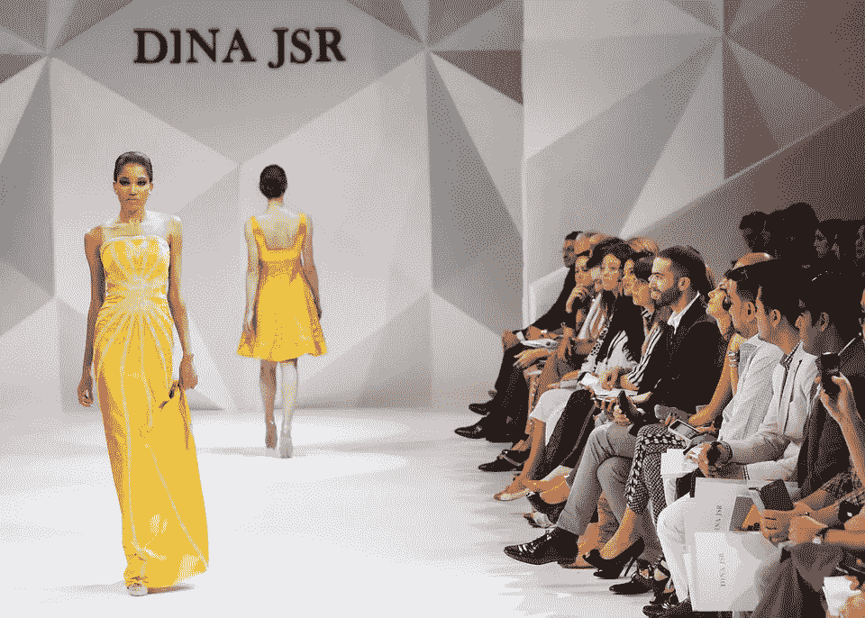
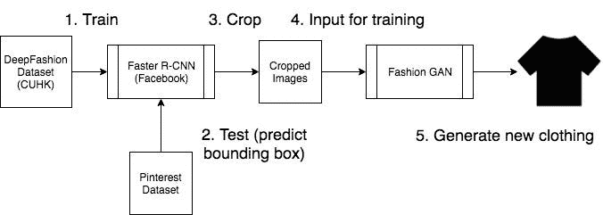
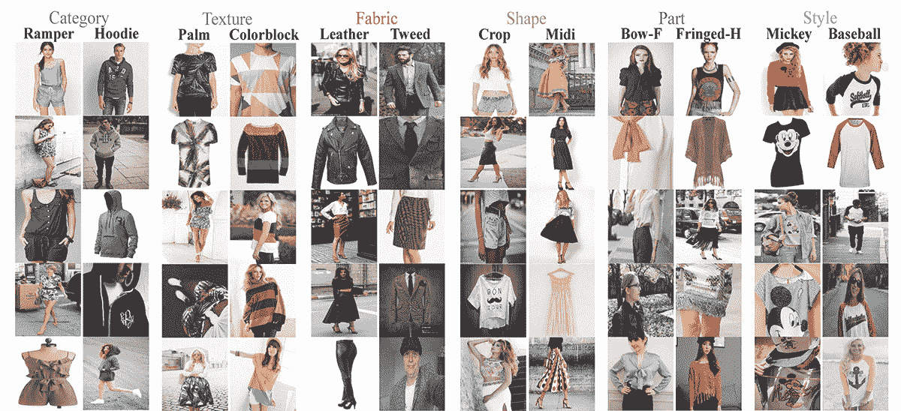
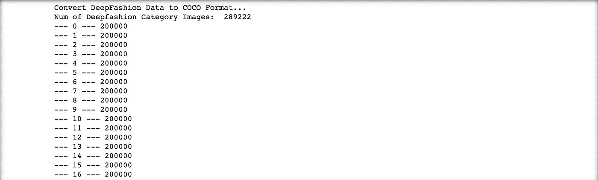
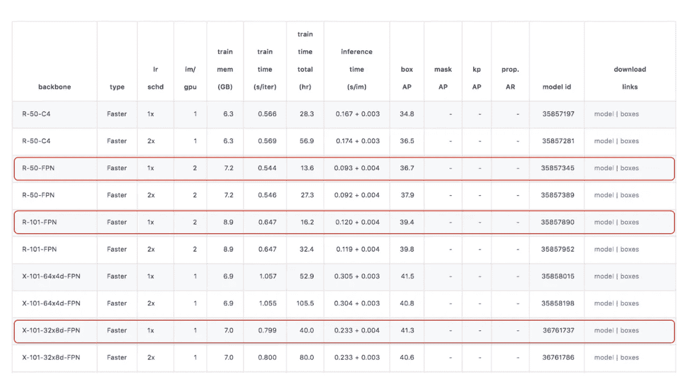
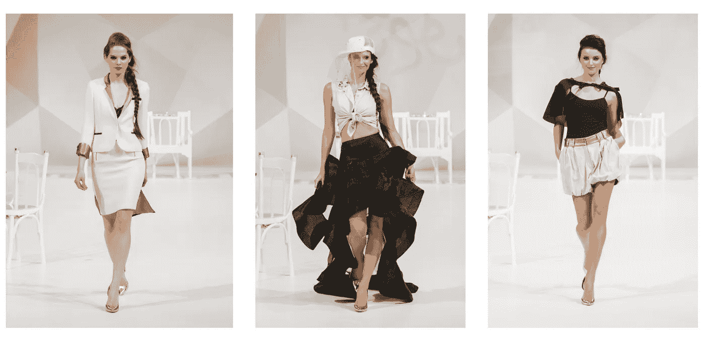

# DeepStyle(第 1 部分):使用最先进的深度学习生成现实的高级时尚服装和风格

> 原文：<https://towardsdatascience.com/deepstyle-f8557ab9e7b?source=collection_archive---------20----------------------->

## 提供[纸](https://github.com/itsuncheng/DeepStyle/blob/master/full_paper.pdf)和 [github 代码](https://github.com/itsuncheng/DeepStyle/)！点击[此处](/deepstyle-part-2-4ca2ae822ba0)进入第二部分。



模特走秀([来源](https://pixabay.com/photos/fashion-show-fashion-catwalk-model-1746582/))

这是我在 2019 年春天在我的家乡大学 [**香港科技大学**](http://www.ust.hk/home) 为计算机视觉**深度学习**课程做的一个项目。那时候，我正在慢慢了解时尚和风格的世界:如何穿得更好，跟上现代潮流。我开始观看高级时尚奢侈品牌的时装秀，甚至街上随便一个人都知道。迪奥、古驰、路易威登、香奈儿、爱马仕、乔治·阿玛尼、卡地亚、博柏利等等。随着我看得越来越多，我开始逐渐融入时尚界。当我需要为我的计算机视觉课程想出一个最终项目主题的时候，我想，**为什么不创建一个深度学习系统**，它将能够**生成好看且有创意的高级时装**？想象一下会很有趣，对吗？

所以我和我的队友创造了**深度风格**。

# 什么是 DeepStyle？

简而言之， **DeepStyle** 就是具有生成高级时尚服装单品能力的定制深度学习框架。它可以作为时装设计师的灵感，也可以预测时装业的下一个流行项目。DeepStyle 吸收流行时尚图片，并创造新的产品，作为有效预测未来趋势的一种方式。

我们的研究包括两个部分:**建立高级奢侈品时尚数据库，并使用人工智能生成类似的时尚物品**。第一部分，我们需要一个可靠的来源，在那里我们可以收集所有来自 t 台的**高级奢华时尚图片**。但除此之外，我们还希望有一个**模型，可以识别服装**和**裁剪**出图像的其余部分，因为最终，如果我们在后台生成假的模型和观众，那会很奇怪😂。在我们将图像裁剪为仅包含服装本身之后，我们可以将图像输入到另一个模型中，该模型将能够**从头开始生成新的服装**。裁剪图像对于尽可能去除噪声至关重要。

# 框架

在简要分析了我们试图构建的东西之后，这里有一个粗略的框架。



深度风格框架

DeepStyle 的第一部分包含 [**更快的 R-CNN**](https://arxiv.org/pdf/1506.01497.pdf) 这是一个实时对象检测模型，已经证明使用其 [**区域提议网络**](https://arxiv.org/pdf/1506.01497.pdf) 可以达到最先进的准确性。你可以在这里阅读官方文件[了解更多细节。我们将用香港中文大学发布的](https://arxiv.org/pdf/1506.01497.pdf) [**深度时尚数据库**](http://mmlab.ie.cuhk.edu.hk/projects/DeepFashion.html) 来训练我们更快的 R-CNN。

深度时尚数据库的快速介绍:这是迄今为止最大的时尚数据集，由大约 80 万张不同的时尚图片组成，这些图片具有不同的背景、角度、光线条件等。这个数据集由四个用于不同目的的基准组成，我们在项目中使用的是 [**类别和属性预测基准**](http://mmlab.ie.cuhk.edu.hk/projects/DeepFashion/AttributePrediction.html) 。该基准具有 **289，222 幅服装图像**，每幅图像都由包围盒坐标和相应的服装类别标注。



**deep fashion 数据库[来源](http://mmlab.ie.cuhk.edu.hk/projects/DeepFashion.html)的类别和属性预测基准**

在对 DeepFashion 数据库训练更快的 R-CNN 后，该网络将能够预测服装在哪里，给定任何测试图像。这就是 Pinterest 数据库 出现的地方。我们可以建立一个刮刀，从 Pinterest 上刮下几个大型奢侈品牌的高级时装秀，并将其用作我们更快的 R-CNN 的测试图像。我们之所以选择 Pinterest，是因为 Pinterest 提供了大量干净、高质量的图片，而且也很容易刮。

经过推理，Pinterest 图像的边界框将被预测，图像的其余部分可以被裁剪掉，因为我们只需要特定的项目。然后，我们最终将它传递给我们的**时尚 GAN** ，它将使用 [**DCGAN**](https://arxiv.org/pdf/1511.06434.pdf) 或深度卷积生成对抗网络来实现。另一个[甘](https://papers.nips.cc/paper/5423-generative-adversarial-nets.pdf)的快速教程:一个生成式对抗网络基本上包含两个主要组件:生成器和鉴别器。生成器努力创建看起来真实的图像，而鉴别器试图区分真实图像和虚假图像。在训练过程中，随着时间的推移，发生器在生成真实图像方面变得更好，而鉴别器在辨别真假方面变得更好。当鉴别者不再能判断出发生器产生的图像是真是假时，就达到了最终的平衡。

最终结果是由 DCGAN 产生的一组图像。希望它们看起来很时尚！

# 履行

## 步骤 1 安装 Detectron 和 DeepFashion 数据集

为了实现更快的 R-CNN，我们将使用由[脸书 AI](https://ai.facebook.com/) 提供的 [Detectron 库](https://github.com/facebookresearch/detectron)。Detectron 库包含用于实现最先进的对象检测算法的代码，如更快的 R-CNN、Mask R-CNN、Retina-Net 等。可以通过以下步骤安装官方库:

根据您的 CUDA 版本安装 Caffe2

1.  对于支持 CUDA 9 和 CuDNN 7 的 Caffe2:

```
conda install pytorch-nightly -c pytorch
```

2.对于支持 CUDA 8 和 CuDNN 7 的 Caffe2:

```
conda install pytorch-nightly cuda80 -c pytorch
```

安装了 Caffe2 之后，现在继续安装 COCO API。

```
# COCOAPI=/path/to/clone/cocoapi
git clone https://github.com/cocodataset/cocoapi.git $COCOAPI
cd $COCOAPI/PythonAPI
# Install into global site-packages
make install
# Alternatively, if you do not have permissions or prefer
# not to install the COCO API into global site-packages
python setup.py install --user
```

现在，你可以下载官方回购并安装 Detectron。

```
git clone [https://github.com/facebookresearch/Detectron.git](https://github.com/facebookresearch/Detectron.git)
```

您可以通过以下方式安装 Python 依赖项:

```
cd Detectron
pip install -r requirements.txt
```

通过以下方式设置 Python 模块:

```
make
```

您可以通过以下方式验证 Detectron 是否已成功安装:

```
python detectron/tests/test_spatial_narrow_as_op.py
```

更多安装细节，可以参考[这里](https://github.com/facebookresearch/Detectron/blob/master/INSTALL.md)。

*注:脸书 AI 最近发布了*[*Detectron 2*](https://github.com/facebookresearch/detectron2)*，是 Detectron 的更新版本。我在做这个项目的时候用过 Detectron，如果你愿意，你可以看看 Detectron 2。*

接下来，我们要下载 [DeepFashion 数据集](http://mmlab.ie.cuhk.edu.hk/projects/DeepFashion.html)。你可以从他们的[主页](http://mmlab.ie.cuhk.edu.hk/projects/DeepFashion.html)阅读更多关于数据集的细节。你可以从谷歌硬盘上下载数据集。我们想要的是类别和属性预测基准，可以从[这里](https://drive.google.com/drive/folders/0B7EVK8r0v71pWGplNFhjc01NbzQ)下载。

## 步骤 2 将 DeepFashion 数据集转换为 COCO 格式

为了使用 Detectron 的自定义数据集训练模型，我们必须首先将数据集转换成 [COCO 格式](https://cocodataset.org/#home)。COCO 是一个大规模的对象检测、分割和字幕数据集，也是对象检测数据集的标准格式。我们可以使用以下代码将 DeepFashion 数据集转换为 COCO 格式:

COCO 基本上将数据集的轮廓保存在一个`.json`文件中，该文件包括关于对象检测数据集的基本信息。最值得注意的是`coco_dict['images']`和`coco_dict['annotations']`,它们分别给出了图像及其相应注释的信息。



DeepFashion 数据库到 COCO 输出

## 在 DeepFashion 上训练更快的 R-CNN 模型

在成功地将数据集转换成 COCO 格式后，我们终于可以训练我们更快的 R-CNN 模型了！在此之前，我们需要首先选择我们想要使用的更快的 R-CNN 的具体变体。有大量**端到端**更快的 R-CNN 变体供我们选择:



支持更快的 R-CNN 型号([来源](https://github.com/facebookresearch/Detectron/blob/master/MODEL_ZOO.md))

当时，我训练了三种不同的变体:R-50-FPN_1x，R-101-FPN_1x，X-101–32x8d-FPN _ 1x。然而，为了简单说明的目的，我将只告诉你如何训练 R-50-FPN，因为步骤是相同的。你可以通过访问[这里](https://github.com/facebookresearch/Detectron/blob/master/MODEL_ZOO.md)获得 Detectron 支持的型号列表。

在我们决定使用更快的 R-CNN R-50-FPN_1x 后，我们可以前往`configs/12_2017_baselines/`查看提供的现有模型配置。我们可以找到我们想要的——它被命名为`[e2e_faster_rcnn_R-50-FPN_1x.yaml](https://github.com/facebookresearch/Detectron/blob/master/configs/12_2017_baselines/e2e_faster_rcnn_R-50-FPN_1x.yaml)`。在那里你可以看到并根据我们的意愿修改模型和训练配置。

最重要的是将训练和测试数据集改为我们的 DeepFashion 数据集，它已经是 COCO 格式了。我们还可以将规划求解参数更改为我们想要的参数。我的看起来像这样:

在我们选择完模型及其配置后，现在我们终于可以开始训练这个模型了！根据您拥有的 GPU 数量，您可以通过执行以下命令开始培训:

1.  **单 GPU 训练**

```
python tools/train_net.py \
    --cfg configs/12_2017_baselines/e2e_faster_rcnn_R-50-FPN_1x.yaml \
    OUTPUT_DIR [path/to/output/]
```

2.**多 GPU 支持**

```
python tools/train_net.py \
    --multi-gpu-testing \
    --cfg configs/12_2017_baselines/e2e_faster_rcnn_R-50-FPN_1x.yaml \
    OUTPUT_DIR [path/to/output/]
```

运行上面的任何一个命令后，指定为`--cfg`的模型将开始训练。包括模型参数、验证集检测等的输出。会保存在`/tmp/detectron-output`下。更多训练细节，可以参考[这里](https://github.com/facebookresearch/Detectron/blob/master/GETTING_STARTED.md)。

## 第四步建立高级时装的 Pinterest 数据库



示例图像([左侧源](https://pixabay.com/photos/fashion-show-fashion-catwalk-model-1746596/)、[中间源](https://pixabay.com/photos/fashion-show-fashion-catwalk-model-1746610/)、[右侧源](https://pixabay.com/photos/fashion-show-fashion-catwalk-model-1746592/))

*注意:由于版权问题，上面的图片实际上不是 Pinterest 数据库中的项目，而只是作为项目一般外观的参考。*

在我们测试我们更快的 R-CNN 定位服装商品的能力之前，我们首先需要有我们自己的测试数据库。我们可以建立一个刮刀，从 Pinterest 上刮下时装秀的图片。当时，我们搜索了 2017 年，2018 年和 2019 年的秋冬时装秀。我们搜集的品牌包括:博柏利、香奈儿、克洛伊、迪奥、纪梵希、古驰、爱马仕、Jimmy Choo、路易威登、迈克高仕、普拉达、范思哲、圣罗兰。我们最终收集了分散在所有这些品牌中的总共 10，095 张时尚图片。

尽管我很想给出 Pinterest 的 scraper 代码，**我已经没有代码了:(**)。因为我不再能够访问我们当时在这个项目中使用的虚拟机。然而，使用 [BeautifulSoup](https://www.crummy.com/software/BeautifulSoup/bs4/doc/) 可以很容易地构建这个刮刀，因为 Pinterest 图片都是静态的，而不是使用 Javascript 动态生成的。

恭喜你走了这么远！下一步是在 Pinterest 数据库上运行我们速度更快的 R-CNN。在那之后，我们可以开始构建一个 DCGAN，它将能够获取服装图像，并生成与它们相似的好东西。因为这篇文章已经很长了，我们将把它留到第 2 部分。

# 要继续，请点击此处查看第 2 部分:

[](/deepstyle-part-2-4ca2ae822ba0) [## 时尚的甘(下)

### 第 2 部分继续:构建 DCGAN 以生成逼真的服装

towardsdatascience.com](/deepstyle-part-2-4ca2ae822ba0)