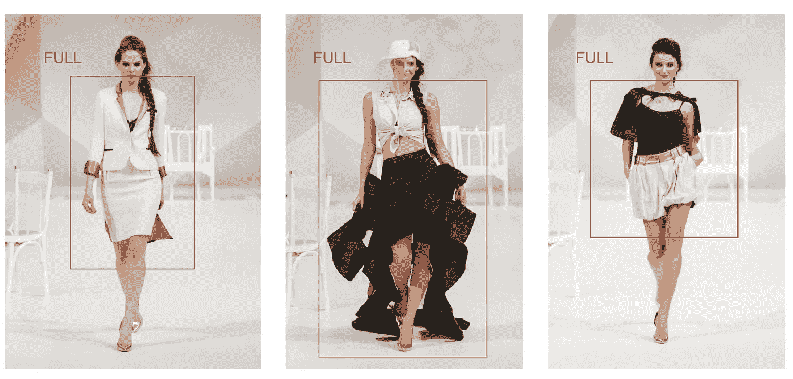
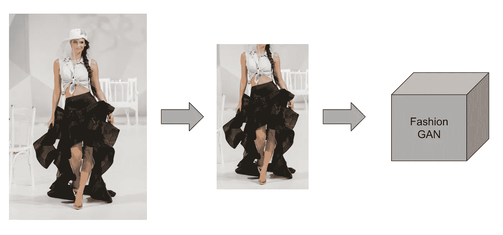
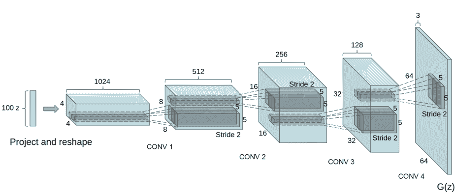
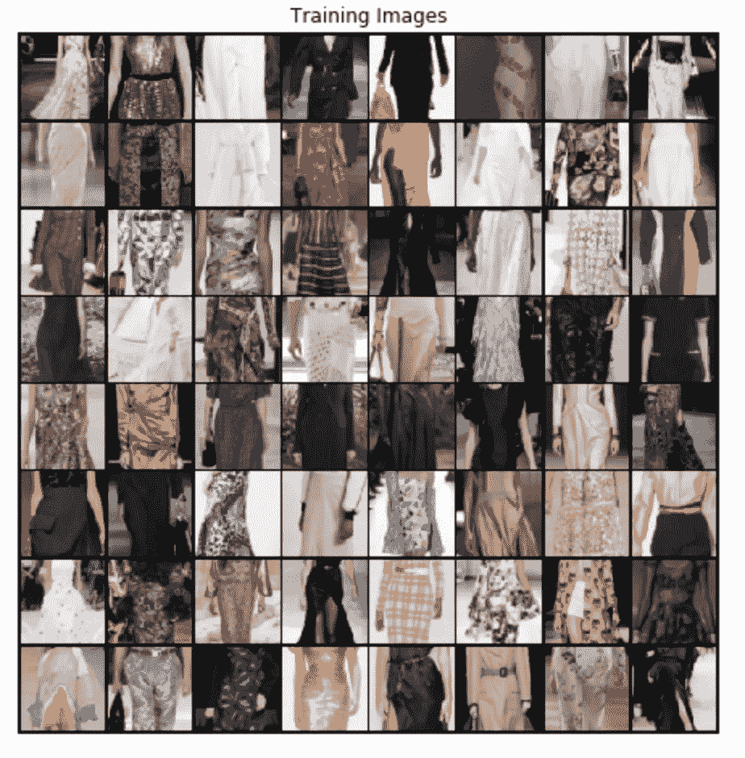
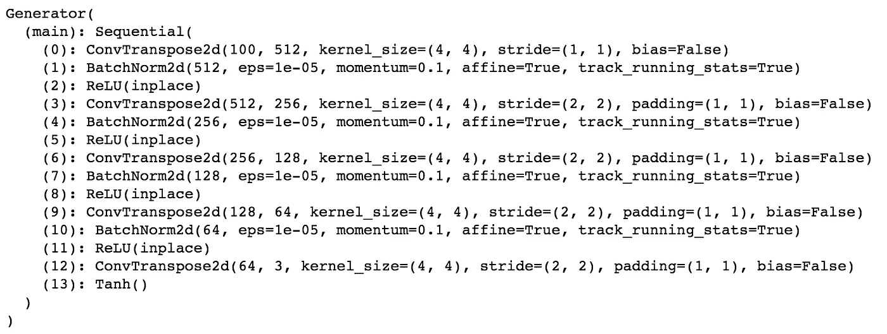
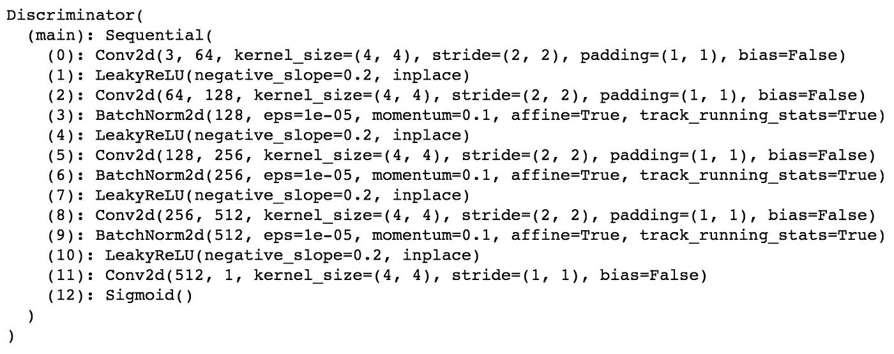
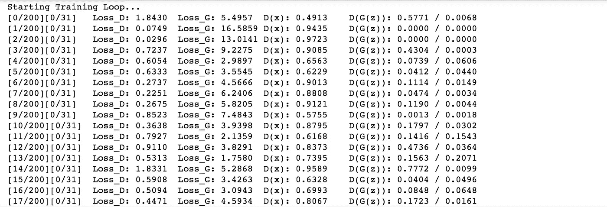
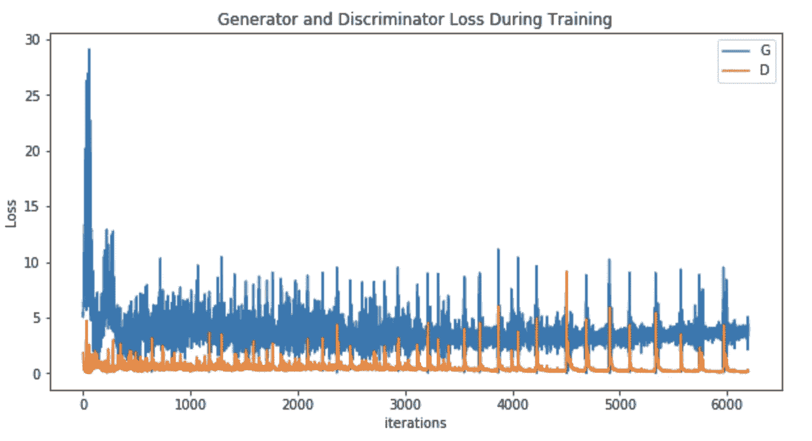
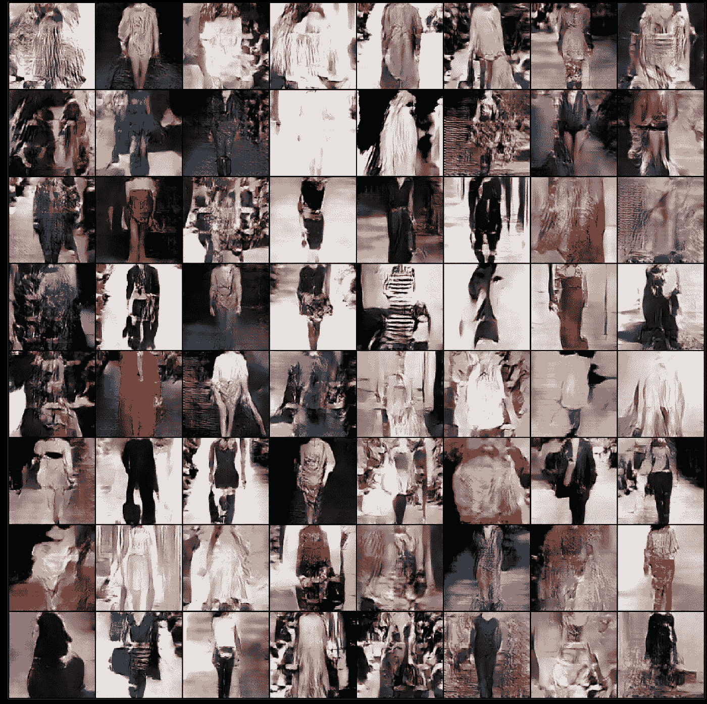
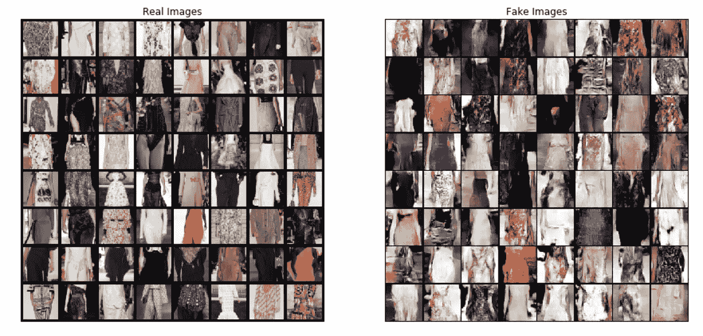

# 时尚的甘(下)

> 原文：<https://towardsdatascience.com/deepstyle-part-2-4ca2ae822ba0?source=collection_archive---------26----------------------->

## 构建 DCGAN 以生成逼真的高级时尚服装

如果您还没有阅读第 1 部分，请先阅读它，因为本文假设您已经阅读了第 1 部分。

[](/deepstyle-f8557ab9e7b) [## DeepStyle:使用最先进的深度学习生成现实的高级时装服装和…

### 提供论文和 Github 代码

towardsdatascience.com](/deepstyle-f8557ab9e7b) 

现在假设您已经阅读了第 1 部分，让我们继续。

## 在 Pinterest 数据库和 Crop 上运行更快的 R-CNN

在收集了 Pinterest 数据库之后，现在我们可以使用我们之前训练的更快的 R-CNN 对这些图像进行推理。但在我们这样做之前，我们需要首先添加功能，我们将**裁剪检测到的对象并保存结果图像**，因为该功能不是开箱即用的。你可以去这个项目的 [github repo 下载`vis.py`来完成。然后，导航到`detectron/utils`，用下载的版本替换现有的`vis.py`。新的`vis.py`与已经提供的相同，但有一个主要的不同——裁剪检测到的对象并将其保存在一个目录中。](https://github.com/itsuncheng/DeepStyle)

添加的代码预测检测到的对象的类别，如果类别是“Full ”,即全身衣服，那么它将裁剪图像并将其保存在指定的目录中。我们只保存全身服装，因为我们希望能够生成全身服装，而不仅仅是简单的衬衫或裙子。

经过微小的修改后，我们就可以在 Pinterest 数据集上运行我们的模型了！我们可以在之前通过以下方式训练的更快的 R-CNN 上运行推理:

```
python tools/infer.py \
   --im [path/to/image.jpg] \
   --rpn-pkl [path/to/rpn/model.pkl] \
   --rpn-cfg configs/12_2017_baselines/e2e_faster_rcnn_R-50-FPN_1x.yaml \
   --output-dir [path/to/output/dir]
```

`[path/to/image.jpg]`是我们存储 Pinterest 图像的目录，`--rpn-pkl`是我们之前保存模型`.pkl`文件的地方，`--rpn-cfg`是我们存储配置文件的地方，最后，`--output-dir`是我们想要保存预测的地方。然而，这个`--output-dir`并不重要，因为它将包含带有预测的未剪裁图像。我们要寻找的是我们在`vis.py`中指定的目录，因为那是保存裁剪图像的地方。



包围盒预测([左源](https://pixabay.com/photos/fashion-show-fashion-catwalk-model-1746596/)、[中间源](https://pixabay.com/photos/fashion-show-fashion-catwalk-model-1746610/)、[右源](https://pixabay.com/photos/fashion-show-fashion-catwalk-model-1746592/))

在对模型进行推断之后，我们应该得到以服装为中心的裁剪图像，并且模型以及背景大部分被移除。即使仍然有一些噪音，我们已经足够好了。



将裁剪后的图像传递给时尚 GAN ( [来源](https://pixabay.com/photos/fashion-show-fashion-catwalk-model-1746610/))

## 第 6 步将预测和图像传递给 DCGAN 进行生成



DCGAN 架构([来源](https://pytorch.org/tutorials/beginner/dcgan_faces_tutorial.html))

现在我们终于有了高质量的服装图像，我们可以开始构建 DCGAN 模型了！

*注意:代码基于 Pytorch 的官方 DCGAN 教程，您可以从这里的* [*访问*](https://pytorch.org/tutorials/beginner/dcgan_faces_tutorial.html) *。代码就不解释太详细了，更详细的解释可以参考教程。*

我们开始吧。首先，我们必须导入所有必需的库:

接下来，我们设置稍后需要的所有变量:

设置完变量后，我们现在创建数据集和数据加载器，稍后我们将把它们输入到模型中。我们调整图像的大小，将它们居中裁剪到所需的图像大小，并使它们正常化。我们的图像尺寸设置为 64，因为较小的尺寸通常更一致。

我们还绘制了一些训练图像来可视化:



样本训练图像

之后，我们定义了生成器上的权重初始化和待构建的鉴别器:

我们制造发电机:



发电机架构

还有鉴别器！



鉴别器架构

然后我们定义培训流程。我们使用 BCELoss 函数，因为鉴别器的工作是识别图像是真是假。我们为生成器和鉴别器设置了 Adam 优化器。然后，我们逐批更新两个网络:

这将开始培训过程。输出是:



培训产出

培训过程需要一段时间。训练后，我们可以绘制训练期间的发生器和鉴频器损耗:



生成器和鉴别器训练损失与迭代

完成所有这些工作后，这是最后一步——将图像保存到本地硬盘:

# 结果

最后，伙计们，在所有这些工作之后！**我们将看到生成的结果**:



DCGAN 生成的图像！

现在，我们可以并排绘制并比较数据集的真实图像和生成的图像。



真实服装和生成的服装的并排比较

不错吧？假图像与真实图像相差不远。**事实上，有些在我眼里看起来相当时尚**😁。

就是这样，伙计们！希望你们都喜欢我的文章，并希望再次见到你。同样，本文中显示的全部代码以及我写的[论文](https://github.com/itsuncheng/DeepStyle/blob/master/full_paper.pdf)可以在[我的 github repo](https://github.com/itsuncheng/DeepStyle) 中获得！如果你喜欢我的内容，请在 Medium 上关注我，我会定期发布关于深度学习的话题！

# 参考

[](https://github.com/facebookresearch/Detectron) [## Facebook 研究/检测

### Detectron 已被弃用。请参阅 detectron2，这是 PyTorch 中 detectron 的全新重写版本。侦探是脸书·艾…

github.com](https://github.com/facebookresearch/Detectron)  [## 更快的 R-CNN:用区域提议网络实现实时目标检测

### 最先进的目标检测网络依靠区域提议算法来假设目标位置…

arxiv.org](https://arxiv.org/abs/1506.01497) [](http://mmlab.ie.cuhk.edu.hk/projects/DeepFashion.html) [## 深度时尚数据库

### 我们贡献了 DeepFashion 数据库，一个大规模的服装数据库，它有几个吸引人的特性:首先…

mmlab.ie.cuhk.edu.hk](http://mmlab.ie.cuhk.edu.hk/projects/DeepFashion.html) [](https://cocodataset.org/#home) [## COCO -上下文中的常见对象

### 编辑描述

cocodataset.org](https://cocodataset.org/#home)  [## 深度卷积生成对抗网络的无监督表示学习

### 近年来，卷积网络的监督学习(CNN)在计算机视觉领域得到了广泛应用…

arxiv.org](https://arxiv.org/abs/1511.06434)  [## DCGAN 教程- PyTorch 教程 1.5.1 文档

### 本教程将通过一个例子对 DCGANs 进行介绍。我们将训练一个生成性的对抗网络…

pytorch.org](https://pytorch.org/tutorials/beginner/dcgan_faces_tutorial.html)