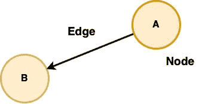
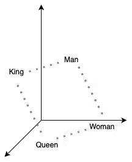
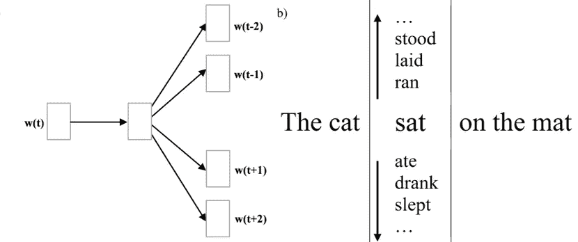
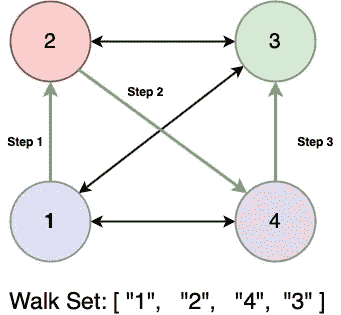
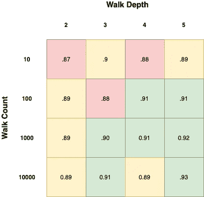

# DeepWalk:它的行为和如何实现它

> 原文：<https://towardsdatascience.com/deepwalk-its-behavior-and-how-to-implement-it-b5aac0290a15?source=collection_archive---------18----------------------->


照片由[法比奥·布拉克特](https://unsplash.com/@bracht?utm_source=medium&utm_medium=referral)在 [Unsplash](https://unsplash.com?utm_source=medium&utm_medium=referral) 上拍摄

## 使用 Python、Networkx 和 Gensim 快速分析和评估图网络关系的备忘单

图形数据结构表示复杂交互的能力带来了新的方法来分析和分类由它们的共同交互定义的实体。虽然这些分析在发现社区内的不同结构方面是强大的，但是它们缺乏对图形的各个方面进行编码以输入到传统的机器学习算法中的能力。随着 DeepWalk 的提出，[1]图中的相互作用可以被简单的神经网络捕获并编码到可由上述 ML 算法使用的嵌入中。然而，虽然有文章简单介绍了 DeepWalk 算法，但我能找到的很少文章提供了代码并讨论了这些系统的实现细节。细节包括模型参数化、部署考虑和处理不可见数据。

在这篇短文中，我将提供对图网络、Word2Vec / Skip-Gram 和 DeepWalk 过程的高级概述。为了帮助解决这个问题，我将给出一个多类分类的例子来演示这个算法。之后，我将考虑不同的参数配置，并展示它们对算法性能的影响。最后，我将概述在系统中部署和处理不可见数据的一些注意事项。

# 图形网络

图是有效地表示生态系统中两个或多个对象之间的交互的数据结构。该结构由两个对象定义，一个节点*或*顶点定义系统内的实体。在本文中，我将使用一个电子商务网站上的购物网络示例，图中的节点是正在销售的产品。



*作者图片*

图的另一个方面是连接它们的东西:一条*边*，它定义了连接两个节点的交互。一条边可以是有向的，显示出一种 to-from 关系——想象一个人 A 给人 b 发了一封电子邮件。一条边也可以有一个定义他们交互的*权重*。在我们的例子中，我们可以定义一个边缘权重，代表在我们的电子商务网站上购买了*和*两种产品的消费者的比例。

# **深度行走算法:**

DeepWalk 是一种图形神经网络*【1】*—一种直接在目标图形结构上操作的神经网络。它使用随机路径遍历技术来洞察网络中的局部结构。它通过利用这些随机路径作为序列来做到这一点，然后使用这些序列来训练 Skip-Gram 语言模型。为了简单起见，本文中我们将使用 Gensim 包 Word2Vec 来训练我们的 Skip-Gram 模型。

## **Word2Vec**

DeepWalk 算法的这个简单实现非常依赖于 Word2Vec 语言模型[2]。由谷歌在 2013 年推出的 Word2Vec 允许将单词嵌入到 n 维空间中，相似的单词彼此靠近。这意味着经常一起使用/在类似情况下使用的单词将具有较小的余弦距离。



单词嵌入行为的三维示例，*作者的图片*

Word2Vec 通过使用 **Skip-Gram** 算法将目标单词与其上下文进行比较来实现这一点。在高层次上，Skip-Gram 使用滑动窗口技术进行操作——在给定中间目标单词的情况下，它试图预测周围的单词。对于我们试图将图中的相似节点编码为在 n 维空间中彼此靠近的用例，这意味着我们有效地试图猜测我们网络中目标节点周围的邻居*。*



一个来自 S. Doshi [3]的 Skip-Gram 示例，修改了取自原作者的图像[2]

## 深度行走

DeepWalk 通过图使用随机路径来揭示网络中的潜在模式，然后这些模式被神经网络学习和编码，以产生我们的最终嵌入。这些随机路径以极其简单的方式生成:从目标根开始，随机选择那个节点的一个*邻居，并将其添加到路径中，接下来，随机选择那个*节点的一个*邻居，并继续遍历，直到已经走了期望的步数。以电子商务为例，这种对网络路径的重复采样产生了一个产品 id 列表。然后，这些 ID 被视为句子中的标记，使用 Word2Vec 模型从这些 ID 中学习状态空间。更简洁地说，DeepWalk 过程遵循以下步骤:*

## **DeepWalk 过程分几个步骤进行:**

1.  对于每个节点，从该节点开始执行 N 个“随机步骤”
2.  将每次遍历视为一系列节点 id 字符串
3.  给定这些序列的列表，使用 Skip-Gram 算法对这些字符串序列训练一个 word2vec 模型



*作者图片*

## 这在代码中看起来像什么？

我们从核心的 networkx 数据结构开始，它定义了一系列产品，这些产品由它们的 ID 给出。两个产品之间的顶点是在电子商务生态系统中共同购买的产品。首先，我们要定义一个函数 **get_random_walk** (Graph，Node_Id):

```
# Instantiate a undirected Networkx graph
G = **nx.Graph**()
G.**add_edges_from**(list_of_product_copurchase_edges)**def get_random_walk**(graph:nx.Graph, node:int, n_steps:int = 4)->List[str]:
   """ Given a graph and a node, 
       return a random walk starting from the node 
   """ local_path = [str(node),]
   target_node = node **for** _ **in** **range**(n_steps):
      neighbors = **list**(**nx.all_neighbors**(graph, target_node))
      target_node = **random.choice**(neighbors)
      **local_path.append**(**str**(target_node)) **return** local_pathwalk_paths = []**for** node **in** **G.nodes**():
   **for** _ **in** **range**(10):
      walk_paths.**append**(**get_random_walk**(G, node))

walk_paths[0]
***>>>*** *[‘10001’, ‘10205’, ‘11845’, ‘10205’, ‘10059’]*
```

这些随机漫步提供给我们的是一系列字符串，它们充当从起始节点开始的路径——沿着列表从一个节点随机漫步到下一个节点。我们接下来要做的是将这个字符串列表视为一个句子，然后利用这些字符串序列来训练一个 Word2Vec 模型

```
# Instantiate word2vec model
embedder = **Word2Vec**(
   window=4, sg=1, hs=0, negative=10, alpha=0.03, min_alpha=0.0001,    
   seed=42
)# Build Vocabulary
**embedder.build_vocab**(walk_paths, progress_per=2)# Train
**embedder.train**(
   walk_paths, total_examples=embedder.corpus_count, epochs=20, 
   report_delay=1
)
```

# 调谐和参数

现在我们已经有了 DeepWalk 的基本结构，在 Word2Vec 模型的一般模型参数的之外，还有许多方面是可参数化的*。这些可能包括:*

1.  为 W2V 训练数据执行的随机行走的次数
2.  从节点开始的每次行走的深度

我将利用一个样本数据集上的通用分类方法来展示这些参数如何影响模型的性能。在上面描述的图表中——利用一系列产品，用一个图表定义共同购买的产品——我们试图将产品分类到它们各自的 10 个类别。



作者图片

上面显示了在我们的 Word2Vec 模型的节点向量上训练的分类器的分类性能(精确度),在 y 轴上使用增加的随机行走次数，在 x 轴上使用增加的随机行走深度。**我们看到的是，准确性随着两个参数的增加而增加，但随着两个参数的增加，回报率逐渐降低**。需要注意的一点是，随着行走次数的增加，训练时间**线性增加，**所以训练时间会随着行走次数的增加而激增。例如，左上角的训练时间只相差 15 秒，而右下角的训练时间则相差一个多小时。

# 部署系统:

## *热启动再培训*

既然我们知道了它的行为方式，我们如何让它变得实用呢？在大多数图形系统中，核心问题是更新和维护系统，而不必立刻重新训练整个模型。幸运的是，由于 DeepWalks 与 NLP 的关系，我们可以依赖类似的更新过程。使用 gensim 时，更新算法更加简单，其流程如下:

1.  将目标节点添加到图中
2.  从该节点执行随机行走
3.  使用这些序列来更新 Word2Vec 模型

```
# Add new nodes to graph from their edges with current nodes
**G.add_edges_from**([new_edges])# From a list of the new nodes' product_ids (unknown_nodes) get rw's
sequences = [**get_random_walks**(G, node) **for** node **in** unknown_nodes]**model.build_vocab**(new_nodes, update=True)
**model.train**(sequences,total_examples=model.corpus_count, epochs=model.epochs)
```

## 不需要再培训

或者，有一种更简单的方法来处理系统中的新节点。您可以利用模型的已知嵌入来推断未知节点的嵌入。遵循与前面的实现类似的模式:

1.  将目标节点添加到图中
2.  从该节点执行随机行走
3.  聚集来自随机行走的嵌入，然后使用该聚集来代替未知节点嵌入

```
# Add new nodes to the graph from their edges with current nodes
**G.add_edges_from**([new_edges])sequences = [**get_random_walk**(G, node) **for** node **in** unknown_nodes]**for** walk **in** sequences:
   nodes_in_corpus = [
        node **for** node **in** walk **if** node **in** word2vec
   ]
   node_embedding = [ # here we take the average of known embeddings
        **np.mean**(embedder[nodes_in_corpus])
   ]
```

这里，我们的嵌入是从未知节点开始的随机行走中已知节点的平均值。这种方法的好处是它的速度，我们不需要重新训练任何东西，并且正在执行几个对 Gensim 中类似字典的数据结构的 *O* ( *1* )调用。缺点是它的不精确性，在没有重新训练模型的情况下，新节点和它的邻居之间的交互是近似的，并且只和你的聚合函数一样好。要更深入地了解这些方法，您可以查阅讨论此类聚合功效的论文，如 TF-IDF 平均等。[4]

在过去的 10 分钟里，我们走过了[*哈。*】DeepWalk 的核心组件，如何实现，以及在自己的工作中实现的一些考虑。对于图网络的评估，有许多可能性可以考虑，鉴于其简单性和可伸缩性，DeepWalk 当然应该在其他可用的算法中加以考虑。下面你可以找到一些上面概述的算法的参考，以及一些关于单词嵌入的进一步阅读。

## **来源:**

[1] Perozzi 等人。**深度行走:在线学习社交表征**[https://arxiv.org/pdf/1403.6652.pdf](https://arxiv.org/pdf/1403.6652.pdf)

[2]米科洛夫等人。**向量空间中单词表示的有效估计**[https://arxiv.org/pdf/1301.3781.pdf](https://arxiv.org/pdf/1301.3781.pdf)

[3] S .多希。 **Skip-Gram: NLP 上下文单词预测算法:**[https://towardsdatascience . com/Skip-Gram-NLP-context-words-prediction-algorithm-5 bbf 34 f 84 e0c？gi = 8 ff 2 eada 829](/skip-gram-nlp-context-words-prediction-algorithm-5bbf34f84e0c?gi=8ff2aeada829)

[4] Levy 等人。**利用从单词嵌入中吸取的经验教训改进分布相似性【https://www.aclweb.org/anthology/Q15-1016/**T22