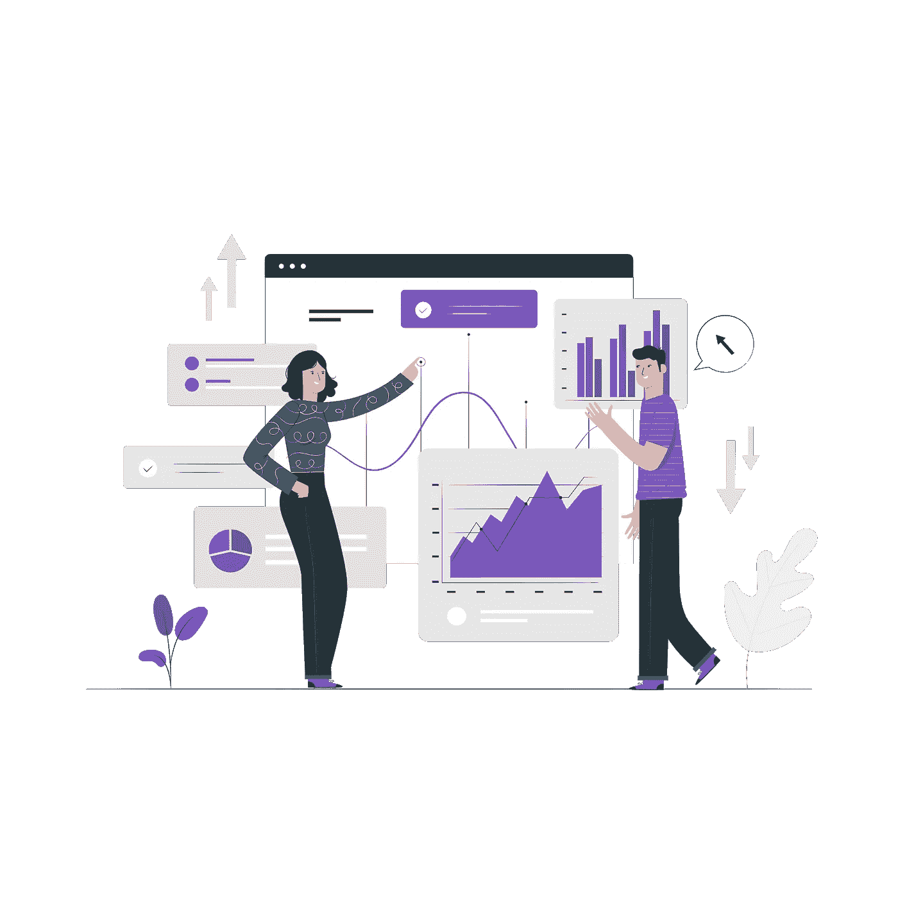

# 定义数据科学、机器学习和人工智能

> 原文：<https://towardsdatascience.com/defining-data-science-machine-learning-and-artificial-intelligence-95f42a60b57c?source=collection_archive---------44----------------------->

# 有可能区分它们吗？

随着可用数据的数量、种类和速度不断增加，科学学科为我们提供了先进的数学工具、过程和算法，使我们能够以有意义的方式使用这些数据。数据科学(DS)、机器学习(ML)和人工智能(AI)就是三个这样的学科。在许多与数据相关的讨论中经常出现的一个问题是，DS、ML 和 AI 之间的区别是什么？它们能被比较吗？根据你和谁交谈，他们有多少年的经验，以及他们做过什么项目，你可能会得到上述问题的非常不同的答案。在这篇博客中，我将尝试根据我的研究、学术和行业经验来回答这个问题；并促成了许多关于这一主题的对话。然而，这仍然是一个人的意见，应该被视为如此。我还将提到，这篇文章旨在提供这三个领域之间的概念差异；因此，一般情况下，肯定会有边缘情况。

如果你把 DS、ML 或 AI 看作是一套工具和技术，要恰当地区分它们几乎是不可能的。它们重叠；然而，它们是 ***而不是彼此的适当子集*** 。例如，如果有人使用“聚类”算法，他们可能正在进行 DS、ML 或 AI 工作，甚至可能是 ML+DS、DS+AI、ML+AI 或三者的组合！我希望您考虑一种定义这些领域的替代方法，将它们**与工具和技术**分开，并将其与最终目标联系起来。尽管它们可能使用重叠的技能、工具和技术，但是 DS、ML 和 AI 可以通过它们对实现**不同最终目标**的关注来区分。

以下是概括的重点领域:

> **数据科学是关于使用数据提供价值(金钱、增长、声誉等)。)到一个组织。**
> 
> **机器学习是关于使用数据进行优化的推理和预测。**
> 
> **人工智能是利用数据将类似人类的决策传递给机器。**

有了这些定义，很容易看出这些字段非常有趣地重叠在一起。例如，能够*做出类似人类的决定*可能包括让*更好* *推论*等等。向一个组织提供*价值*可能涉及创造具有*类人决策*的数字代理。类似地，在创建学习模型以使*更好地预测*时，人们可能希望致力于将为组织提供*最大价值*的指标。你可以想象，这三个学科之间的界限变得混乱，我们经常用一个为另一个服务。真正的“为什么”是你正在做的，你正在用数据做什么，这可以帮助确定你当前的工作是否应该归入数据科学、机器学习或人工智能。需要记住的另一点是，在数据科学中几乎总是有一个人类代理人参与其中。你可能会听到“这台计算机正在运行机器学习算法”或“这个数字代理正在展示人工智能”，但你不会听到“这台机器正在做数据科学。”数据科学几乎总是由人类来完成。

下面我们考虑一个简化的例子来把这些概念结合起来。

考虑一个正在研究为老年患者制造辅助机器人的医疗机构。机器人的任务是在没有人护理的情况下帮助老年病人行走。机器人需要知道这个人什么时候起床，这样它才能开始行动。这种确定可以通过观察手和腿的运动来进行。医疗保健机构将这个项目外包给另一家公司，要求他们设计一种算法(模型)，可以对一个人的站立意图进行准确预测。这可以通过对图像和视频进行训练来完成，以预测哪些手和腿的运动可能表明这个人正在起床。这是一个 ***机器学习*** 项目。

一旦人起来了，机器人的任务就是帮助他们行走。最好的帮助方式是什么？那么，在这种情况下，一个训练有素的人类护理人员会怎么做呢？他们可能会走近病人，根据病人走路需要多少帮助，提供一只或两只手臂或手来依靠。此外，护理人员可以温和地抓握虚弱的人，并且更牢固地抓握，将脚牢牢地放在地上以支撑肥胖的人。让机器人模仿训练有素的人类护理员的行为是人工智能*的领域。*

*现在考虑医疗保健机构想要决定是否继续投资这个项目。这种确定可以通过从各种来源收集数据来进行，例如老年人跌倒造成的伤害率、人类护理人员的工作时间和工资、通过使用新机器人减少的跌倒率、训练机器人的成本、技术采用率、由于减少伤害而节省的医疗费用等。一旦对数据进行了整合、建模和分析，就可以向医疗保健机构提出几项建议，例如，辅助机器人导致 80%(虚构数字)的较少跌倒，并且该机构可以在 5 年内收回其投资(虚构数字)。这个以数据开始，以对决策者有价值的见解结束的过程就是 ***数据科学*** 。*

*我希望下一次你看到这些术语时，你会比它们所使用的工具和技术看得更深。工具和技术随着时间而发展；意图依然存在。*

*【www.freepik.com】由故事创造的载体——*