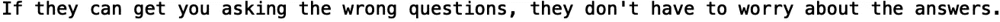
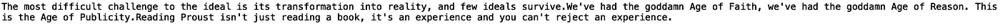
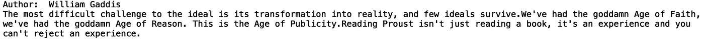
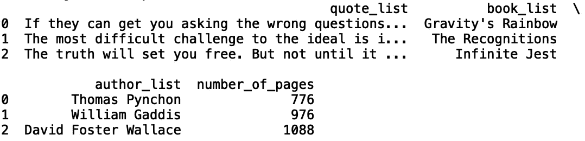
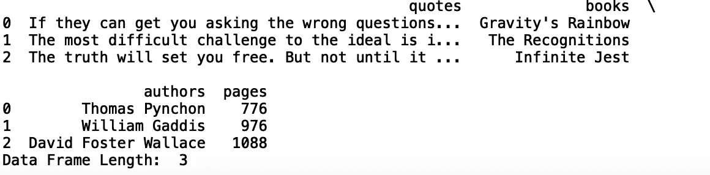
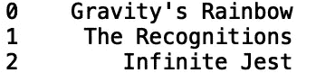
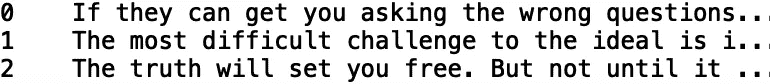

# 在 Python 中定义函数

> 原文：<https://towardsdatascience.com/defining-functions-in-python-d0affe657e1d?source=collection_archive---------56----------------------->

## 定义 Python 函数


[来源](https://www.pexels.com/photo/snow-dawn-landscape-sunset-4403924/)

在计算机科学中，函数提供了执行特定任务的一组指令。函数是软件程序的重要组成部分，因为它们是我们今天使用的大多数应用程序的核心。在这篇文章中，我们将讨论如何在 python 中定义不同类型的函数。

我们开始吧！

## 定义一个简单函数

首先，让我们定义一个简单的函数。我们使用“def”关键字来定义 python 中的函数。让我们定义一个函数来打印引用自托马斯·品钦的*万有引力的彩虹*:

```
def print_quote():
    print("If they can get you asking the wrong questions, they don't have to worry about the answers.")
```

现在，如果我们调用我们的函数，它应该显示我们的报价:

```
print_quote()
```



如果我们愿意，我们可以让函数使用 return 关键字返回字符串:

```
def print_quote():
    return "If they can get you asking the wrong questions, they don't have to worry about the answers."
```

然后，我们可以将函数返回值存储在一个变量中，并打印存储的值:

```
quote = print_quote()
print(quote)
```


编写函数的一种更简洁的方式是将字符串存储在函数范围内的一个变量中，然后返回该变量:

```
def print_quote():
    quote =  "If they can get you asking the wrong questions, they don't have to worry about the answers."
    return quote
```

让我们将函数返回值存储在一个变量中，并打印存储的值:

```
my_quote = print_quote()
print(my_quote)
```


## 用输入定义函数

现在，让我们讨论如何用输入定义函数。让我们定义一个函数，它接受一个字符串作为输入，并返回该字符串的长度。

```
def quote_length(input_quote):
    return len(input_quote)
```

我们可以定义一些变量来存储不同长度的报价。让我们引用威廉·加迪斯的*中的几句话:*

```
quote_one = "The most difficult challenge to the ideal is its transformation into reality, and few ideals survive."quote_two = "We've had the goddamn Age of Faith, we've had the goddamn Age of Reason. This is the Age of Publicity."quote_three = "Reading Proust isn't just reading a book, it's an experience and you can't reject an experience."
```

让我们用这些引用来调用我们的函数:

```
quote_length(quote_one)
quote_length(quote_two)
quote_length(quote_three)
```


我们还可以对输入字符串执行各种操作。让我们定义一个函数，将我们的引号组合成一个字符串。我们可以使用“join()”方法将一系列字符串组合成一个字符串:

```
quote_list = [quote_one, quote_two, quote_three]def combine_quote(string_list):
    return ''.join(string_list)
```

如果我们用“quote_list”作为输入来打印函数，我们会得到以下结果:

```
print(combine_quote(quote_list))
```



我们的函数中也可以有多个输入值。让我们的函数接受一个指定作者姓名的输入字符串。在函数的范围内，让我们打印作者的名字:

```
def combine_quote(string_list, author_name):
   print("Author: ", author_name)
   return ''.join(string_list)
```

现在，让我们调用我们的函数并打印它的返回值:

```
print(combine_quote(quote_list, 'William Gaddis'))
```



## 返回多个值

在一个函数中返回多个值也非常简单。让我们定义一个函数，它接受一段引文、书名、作者姓名和书中的页数。在我们的函数中，我们将创建一个数据框，其中包含报价、书名、作者和页数等列。该函数将返回数据帧及其长度。

首先，让我们定义一个引用、对应作者、书名和页数的列表:

```
quote_list = ["If they can get you asking the wrong questions, they don't have to worry about the answers.", "The most difficult challenge to the ideal is its transformation into reality, and few ideals survive.", "The truth will set you free. But not until it is finished with you."]book_list = ['Gravity's Rainbow', 'The Recognitions', 'Infinite Jest'] author_list = ["Thomas Pynchon", "William Gaddis", "David Foster Wallace"]number_of_pages = [776, 976, 1088]
```

接下来，让我们用适当的键将每个列表存储在字典中:

```
df = {'quote_list':quote_list, 'book_list':book_list, 'author_list':author_list, 'number_of_pages':number_of_pages}
```

现在，让我们将字典从 Pandas 库中传递到数据框构造函数中:

```
import pandas as pd 
df = pd.DataFrame({'quote_list':quote_list, 'book_list':book_list, 'author_list':author_list, 'number_of_pages':number_of_pages})
```

让我们放松对使用 Pandas 的显示列数量的限制，并打印结果:

```
pd.set_option('display.max_columns', None)
print(df)
```



现在让我们将这段代码包装在一个函数中。让我们将我们的函数命名为“get_dataframe”。我们的函数将返回数据帧及其长度:

```
def get_dataframe(quote, book, author, pages):
    df = pd.DataFrame({'quotes':quote,   'books':book, 'authors':author, 'pages':pages})
    return df, len(df)
```

现在让我们用列表调用函数，并将返回值存储在两个独立的变量中:

```
df, length = get_dataframe(quote_list, book_list, author_list, number_of_pages)
print(df)
print("Data Frame Length: ", length)
```



我们可以自由选择在函数中返回哪些值和多少个值。让我们也返回对应于“报价”和“书籍”列的熊猫系列:

```
def get_dataframe(quote, book, author, pages):
    df = pd.DataFrame({'quotes':quote,   'books':book, 'authors':author, 'pages':pages})
    return df, len(df), df['books'], df['quotes']
```

现在，让我们再次调用我们的函数:

```
df, length, books, quotes = get_dataframe(quote_list, book_list, author_list, number_of_pages) 
```

我们可以印刷书籍:

```
print(books)
```



和报价:

```
print(quotes)
```



我就讲到这里，但是您可以自己随意摆弄代码。

## 结论

总之，在这篇文章中，我们讨论了如何在 python 中定义函数。首先，我们展示了如何定义一个打印字符串的简单函数。对应一本书的引用。接下来，我们讨论了如何定义一个接受输入值、操作输入并返回值的函数。最后，我们展示了如何定义一个返回多个值的函数。我希望你觉得这篇文章有用/有趣。这篇文章中的代码可以在 [GitHub](https://github.com/spierre91/medium_code/blob/master/basic_python/defining_functions_tutorial.py) 上找到。感谢您的阅读！