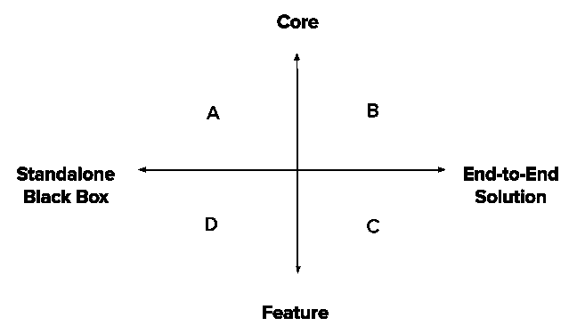

# 人工智能产品战略的 7 个要素

> 原文：<https://towardsdatascience.com/defining-your-ai-product-strategy-7-areas-of-focus-2cf112c82c07?source=collection_archive---------25----------------------->

## 构建 ML 驱动的产品、团队和业务的剧本

资料来源:Anne Nygå rd，Unsplash

构建和销售机器学习(ML)产品很难。底层技术不断发展，要求组织时刻保持警觉……而关于成功和盈利产品的规则手册[仍在编写中](https://a16z.com/2020/02/16/the-new-business-of-ai-and-how-its-different-from-traditional-software/])，导致不确定的结果。

我们在 [Semantics3](https://www.semantics3.com/) 与机器学习产品合作了 5 年多，不得不应对许多源于行业不景气的挑战。在这篇文章中，我从这些经历中提炼出一组考虑因素，用于主动预测和处理这些突发事件。仔细考虑这些因素有助于我们调整产品以取得长期成功。

以下观点涵盖了总体趋势；当然，规范总会有例外。

# #1 —人工智能/人工智能在您的产品中扮演什么角色？

## **象限 A(左上):以 ML 模型为核心的独立黑盒产品**

*你销售的是一个黑盒 ML 模型，在这个模型中，客户决定如何最好地利用所提供的智能(例如，像 Amazon Transcribe 或 Google Speech-To-Text 这样的转录服务)。*

如果你的产品属于这一类，仔细想想顾客可能会给你的所有输入的怪癖。您的模型可能已经在特定的上下文中进行了训练，在您的训练数据集中有所表示，您需要防止客户测试边缘情况、接收到较差的输出并得出您的服务没有达到标准的结论。

在 Semantics3，当我们发布我们的电子商务分类 API 时，我们遇到了这一挑战…同时我们的系统被训练为接收产品名称(“苹果 iPhone X — 64GB 黑色”)，客户发送的不兼容的通用输入(“iPhone”，“手机”)。

有三种方法可以防止这种情况。

1.  确保您的产品被正确使用，要么通过定义输入的自由度(强制使用某种格式的输入)，要么通过教育客户(通过文档、培训材料和直接沟通渠道)。
2.  通过构建检测图层来拒绝不符合标准的输入(通过与训练数据进行比较来检测异常值的非监督方法效果很好)。
3.  构建一个处理所有边缘情况的产品。这是困难的，并且可能在超过一个阈值后收益递减。但是，如果你的客户对所有人都有很强的亲和力——欢迎谷歌搜索框用户体验，它可能会带你度过难关。

## **象限 B(右上):以 ML 模型为核心的端到端解决方案**

*机器学习是你的产品的核心，没有它你的产品就无法运行，但你已经将它打包成一个更广泛的解决方案，旨在解决特定的需求(例如无人驾驶汽车)。*

使用这样的产品，您可以控制自由度，从而避免黑盒方法的陷阱。您还可以获得更多的价值，并有可能扩大您的市场，为不太精明的客户提供服务。

但另一方面，自由度的减少意味着理解客户需求和设计所需体验的责任落在了你身上。您的开发团队的需求也可能更加多样化——您可能需要投资构建支持硬件、软件和数据层以及可定制的组件。我的经验是，这些挑战比前一组更容易应付。

## **象限 C(右下角):采用 ML 技术的端到端解决方案**

*机器学习实现了你产品的一个关键特性，但是即使没有任何机器学习的参与，你的产品也有显著的效用(例如网飞推荐)。*

从数据科学家的角度来看，这些产品为部署 ML 模型提供了最有利的环境。由于机器学习的附加值是递增的，即使没有这一功能，客户也能获得效用，因此逐步推广和迭代是可能的。最棒的是，该产品本身通常会生成构建模型所需的训练数据集。

在这些生态系统中，机器学习有可能增加产品的价值，并建立更强的防御能力……但产品基本面需要由数据科学领域以外的举措来驱动。

## **象限 D(左下角):具有 ML 供电功能的独立黑盒产品**

如果你的产品落入这个桶里，你就看错文章了！

# #2 —您的产品如何影响客户的工作流程？

## **a]该产品是否通过取代相关人员来实现手动流程的自动化？**

完全取代人类是一件非常困难的事情。人类有能力处理边缘情况和细微差别，这种方式对编程到模型中是一种挑战。您的模型将总是根据这个基准来衡量，并且很可能在经验上(如果不是统计上)达不到要求。

此外，减少人力成本节约的角度没有你想象的那么吸引人。客户不会主动裁员来实现节约，除非他们真的被迫这样做，并且确信你的解决方案是一个时代的解决方案，因为这种激烈的措施很难收回。即使你越过了这个障碍，你所能控制的收入上限也将永远是以节省的成本而不是交付的价值来衡量的。

如果允许预算有限的组织大规模执行原本只能在子集上完成的任务，这种策略通常效果最佳。

## 该产品是否能让参与手工流程的人更快地完成任务？

支持人类活动通常是更好的策略。使用这种方法，您可以利用帕累托原则并调整您的模型来处理最常见的决策类型。有了正确的产品工作流程，您可以进行设置，以便在遇到边缘情况时，人在回路中可以介入并覆盖。同样，缺点是你的附加值将会以节约成本为框架，而你的产品将会以人力来衡量。

## **c】该产品是否解决了以前没有类似手动替代方案的问题？**

这包括以下产品:

*   解决人类根本无法解决的问题(例如人工智能药物发现)
*   在需要的地方释放人力(例如自动驾驶汽车)
*   以比人快得多的速度执行决策，从而实现迄今为止无法实现的新用例(例如实时 HS 代码估计)

这些问题更像是绿地，因此争议更少，更有利于价值捕捉。

# #3 —你的独特辩护销售主张(USP)是什么？

有很多原因可以让顾客发现你的产品的价值，其中一些比另一些更有说服力。

## **一个获得数据科学的人才**

向技术采用缓慢的老行业销售可以帮助获得早期回报，但这种策略不能提供强大的防御能力。如果合同规模变得太大，产品开始变得对客户的需求太重要，或者市场上出现了新的竞争对手，那么你的立足点将开始变得薄弱。这也不是快速增长的咒语，所以不要被早期采用所迷惑。

## **b]唯一数据集**

如果你可以访问独特的数据集，你训练的模型可能比你的竞争对手带来的更有效。但是，您应该认识到数据集的独特性:

*   最强有力的保护形式是从一个独特的来源长期合法地保证你的访问。
*   如果建立训练数据集的成本是阻止竞争对手的原因，那么你可以肯定，如果市场有利可图，你的蓝海不会长期没有鲨鱼。
*   如果这种独特性源于你的先发优势或你最初客户群的规模，那么请再想一想——已经有很多关于[数据网络效应](https://www.nfx.com/post/truth-about-data-network-effects) [是否会形成强大的护城河](https://a16z.com/2019/05/09/data-network-effects-moats/)的文章。

## **c】创新的模型架构**

有时，你的数据科学团队可能非常有能力，在一个普遍可用的数据集上获得比其他任何人都好得多的结果。然而，这几乎从来不是长期防御的来源。由于该行业的开源基因，新的创新迅速扩散。更重要的是，由于创新的速度，看似开创性的技术很快就会被新的浪潮完全淹没。

通常，这三个选项中没有一个足以确保增长和防御。从长远来看，造成差异的是你如何将它们结合在一起，来制作你的过程和产品。流程是指如何将模型和数据集与人在回路中、分类法、试探法和分析法编织在一起，以解决手头的问题。产品是指如何以满足客户需求的方式使这些过程对客户可用。

# #4 —人类在你的循环中扮演什么角色？

*“每当你有歧义和错误时，你需要考虑如何将人置于循环中，并升级到人来做出选择。对我来说，这是人工智能产品的艺术形式。如果你有歧义和错误率，你必须能够处理异常。但首先你必须检测出异常，幸运的是，在人工智能中，你有信心、概率和分布，所以你必须利用所有这些让人类参与进来。”*——[塞特亚·纳德拉](https://qz.com/792554/microsoft-msft-ceo-satya-nadella-on-artificial-intelligence-algorithmic-accountability-and-what-he-learned-from-tay/)

具有讽刺意味的是，人工智能需要人类才能使其可用，无论是处理边缘案件，建立训练数据集，生成启发式或量化样本准确性。在这些人类活动中，有些活动比其他活动影响力更大，成本更低。你如何将人的角色设计到你的产品工作流程中，将决定你的成本和你的用户体验。一些需要思考的观点:

*   你有没有在你的产品中建立反馈环，让你的用户间接地“训练”你的模型？还是所有识别和提供反馈的成本都由您的后端注释团队承担？
*   您的注释团队是否处理单个数据点，或者您是否有一种机制让他们交流他们在数据中看到的更广泛的模式？
*   你会像一个庞然大物一样解决潜在的问题吗？还是使用智能采样技术和主动学习模型将人的注意力集中在可以提供最高 RoI 的地方？

# #5 —您的客户如何衡量您产品的质量？

在学术界，ML 系统的质量是通过对 ImageNet 等标准化数据集进行基准测试来衡量的，精确度越高，模型越好。

然而在工业界，这些标准化的基准并不存在。您训练的数据集是自定义的，可能不代表手头的问题-事实上，最大的挑战通常是建立一个准确模拟问题的数据集。此外，没有两个客户从同一个角度看待问题，因此单一精度/召回基准的想法是象征性的，最多可能是指示性的。加上像数据漂移和概念漂移这样的现象，你会发现自己漂浮在海上，没有锚。

你面临的挑战是不仅要找到一种方法来衡量每个客户的质量，还要找到一种方法来将这个数字传达给客户，以管理他或她对你产品的看法。我们使用 5 个步骤来处理这个问题:

## **a】统计教育**

让你的客户了解统计思维和经验思维的区别。无论你采取什么样的措施，边缘案例和断层线总是存在的。虽然从统计数据来看，完美几乎从来不是一个要求，但问题是人类倾向于凭经验思考。客户对个别例子的负面反应并不少见(导致数据科学家发泄他们的统计愤怒)。

然而，统计教育说起来容易做起来难，即使你与客户有直接的沟通渠道。我倾向于从与客户的第一次营销互动开始，并确保这种想法渗透到您的销售组织的推销中。顾客通常会接受合理的论点，即使竞争对手向他们许下种种承诺。根据你的业务性质，以及你与客户的接触程度，你可能需要找到创新的方法来做到这一点。

## **b】确定代表性数据集**

寻找或建立一个数据源，定量地获取客户使用产品的方式。通常，这包括跟踪和记录客户行为，无论是输入到您的模型中，还是基于反应的反馈循环。该数据集代表了客户的问题空间。

## **c】抽样方法**

如果代表性数据集的大小太大而无法进行分析或标注，则决定一种采样方法来放大到更小的子集。

## **d】评估方法**

确定最能抓住客户优先事项的指标。如果要对数据集进行注释，就要包含一组简单且一致的规则来定义如何进行注释。此外，决定执行这些评估的频率。

## **e】设定目标和补救措施**

确定每个指标的最小阈值，以及如果没有达到这些阈值将采取的补救措施。

## **f】获得客户认可并定期报告**

这是关键部分——尽你所能，让客户了解你选择采用的方法，并且最好将他们的反馈反馈反馈到流程中。然后，定期严格地主动向客户提供这些指标，以消除任何不满。

如果您从事销售企业合同的业务，并且每个客户的毛利润很高，请将这些指标用作合同中保证的 SLA。虽然这给你的团队带来了更多的挑战，但它确保了任何关于质量的讨论都是通过一个共同的统计透镜来简化的。

讨论了所有这些之后，统计教育说起来容易做起来难。由于各种各样的原因，观察者偏差很难克服。我们遇到过很多这样的情况，我们产品的日常用户对我们的方法很满意，但是当一个高级主管(和产品的零星用户)遇到一个边缘情况并敲响了所有的警钟时，他们就变得手忙脚乱了。要处理这种情况，请考虑内置覆盖机制来根据症状处理问题。你的数据科学团队中的清教徒可能会不高兴，但这是一个你可能想要做出的权衡，以确保对你的产品功效的感知不会被变幻莫测的机会所左右。

此外，客户特定的调整和测量并不便宜。您必须考虑质量和成本之间的权衡，并配置您的定价模型，以将这些“支持”成本转嫁给客户。

# # 6——你是否接受了过多的挑战？

ML 产品团队在两种项目上花费了大量的时间，这两种项目损害了用户体验并增加了运营成本。

## **解决不属于产品核心价值主张核心的“模糊”问题**

可以用机器学习解决的问题范围很广。然而，这并不意味着你遇到的所有问题都应该用机器学习来解决。在构建您的产品时，您可能会遇到许多挑战，数据科学团队对此的第一反应是使用 ML。在这样的时刻，有必要问一下，是否有不那么优雅、效率可能更低、但更简单的解决方案可供选择。

机器学习通常被视为必须尽可能撒在任何地方的魔法灰尘，即使是那些理解它的人也是如此。训练第一组模型来解决一个新问题，甚至交付有希望的结果，可能是非常容易和令人兴奋的。但是如上所述，部署到生产环境需要的不仅仅是一个有好结果的模型。因此，在实践中，尽可能少用魔法，求助于不那么令人兴奋但肯定有效的替代方法，比如启发式……或者尽可能完全放弃产品功能，这可能不是一个坏主意。

## **b】内部构建工具以弥补开源或云生态系统中的空白**

Tensorflow 和 PyTorch 是两个领先的深度学习框架，还不到 5 岁。像 Sagemaker 和 Kubeflow 这样的基础设施工具还不到 2 岁。开源工具的生态系统才刚刚兴起，每隔几个月就会有新的改变游戏规则的库出现。

当您开始使用这些工具时，您经常会发现您的特定开发工作流或产品特性所必需的某些组件不见了。对于一个有进取心的工程师团队来说，这可能是一个建立新工具来填补空白的号召。在 Semantics3，这些年来我们已经这样做了很多次。我们已经建立了一个并行处理暨缓存层，用于处理需要大量预处理的训练数据集…最近，我们使用[脸书的 FAISS 库](https://github.com/facebookresearch/faiss)创建了我们自己的网络数据库。

不过，这种暴跌应该仔细考虑，并通过构建 vs 购买 vs 等待演算。如果你发现开源或云生态系统中有一个巨大的需求需要满足，很可能你不是唯一的一个，其他人也在做这件事——询问周围的人以获得早期访问是值得的。如果你没有其他选择或者发现你的需求很紧急，记住这些工具需要定期维护，尤其是当它们被放在你的书架上的时候。

# #7 —您的数据科学团队是否具备完成手头任务的合适 DNA？

一旦你理解了你的产品是什么，你就可以反过来确定你需要组建什么样的团队:

*   你正在解决绿色领域的问题吗？这些问题要求你在这一领域的工作中聘请最前沿的博士。
*   您的增值是否来自调整模型架构—您是否需要一群数据科学家整天训练模型和优化超参数？
*   钉住边缘案例对你的用户体验至关重要吗——你是否需要有黑客心态的测试人员来放弃注释思想、启发式框架和其他合适的工具？
*   在这里，对领域的深刻理解是必不可少的吗——你需要对你的问题领域有多年经验的人吗？
*   您的销售和售后流程的结构化程度如何？您是否需要通才数据科学家与整个组织的员工合作，以确保流程正确？
*   优化运营执行的云成本是否是获得合理毛利润的瓶颈——您是否需要同时拥有基础架构头衔的数据科学家？
*   如果 ML 模型只是一个更大整体的一个组成部分，那么在预算有限的情况下，你需要在产品经理和前端工程师身上投资多少

我见过一些产品是由大批 ML 工程师在发布前制造的，还有一些是由游击队员组成的迷你披萨团队制造的。一个和另一个是不一样的，每个群体对挑战的反应都不一样。拥有正确的 DNA 会带来巨大的不同。

总之，企业主对价值主张、防御能力和成本的计划越多，增长的可预测性就越大。产品经理对他们的方法考虑得越周到，ML 模型、环中人和客户工作流之间的和谐就越大。数据科学经理对工具选择和团队构成越慎重，代码和愿景之间的协同作用就越大。客户负责人在衡量质量和管理认知方面越系统，你的流失率就越低。

“人工智能行业”不是一个整体——有许多方法来构建机器学习支持的产品。虽然现在还为时尚早，这方面的剧本还在继续编写，但如果你正着手在这个领域开发一款产品，那么系统地考虑可能影响你成功的各种决策会有所帮助。