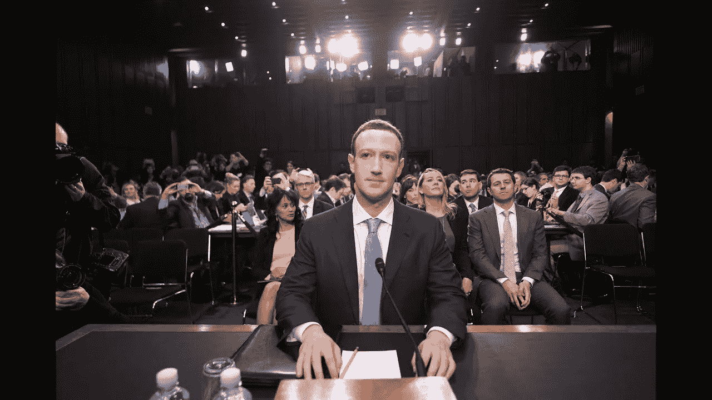

# 绝对不要点击这个点击诱饵

> 原文：<https://towardsdatascience.com/definitely-dont-click-on-this-click-bait-20d3289a7691?source=collection_archive---------27----------------------->

由 [Unsplash](https://unsplash.com?utm_source=medium&utm_medium=referral) 上的 [Mael BALLAND](https://unsplash.com/@mael_bld?utm_source=medium&utm_medium=referral) 拍摄的照片

## 社交媒体的政治

互联网政策假新闻技术算法伤害社会

W 社交媒体出现之前的世界是什么样的？在六度、Friendster、LinkedIn、MySpace、Twitter、Snapchat、Reddit、Instagram 和脸书出现之前，社会是什么样子的？

2004 年，MySpace 成为首个月活跃用户达到 100 万的社交媒体网站。如今，脸书拥有超过 [1.62](https://zephoria.com/top-15-valuable-facebook-statistics/) **亿** ***日活跃用户。虽然 Instagram、WhatsApp 和 Messenger 等公司帮助这一数字增长，但不可否认的是，社交媒体已经深深嵌入社会。***

快速的技术变革不是没有代价的。用户慢慢发展社交媒体平台，以适应他们的 UX 需求，但人们往往忘记了社交媒体如何同样影响社会。

> “技术不仅是人类活动的辅助工具，也是重塑人类活动及其意义的强大力量。”—兰登·温纳

听过煮青蛙的古老寓言吗？

要煮一只活青蛙，把它放在一锅沸水里是行不通的——它会直接从锅里跳出来。相反，必须将它放入一壶室温的水中，随着时间的推移慢慢加热。青蛙不会意识到它舒适的炉顶热水浴缸已经成为一个坟墓，直到为时已晚。

# 社交媒体就像一口烧开的锅

每个社交媒体平台都有被黑客操纵的风险。算法多年来一直受到攻击。每天有超过 10 亿的活跃用户，这些算法有能力引导社会走向更好或更坏。一些平台比其他平台面临更大的攻击风险。

## 1.Twitter 趋势

Twitter 最脆弱的算法是允许标签、事件和短语免费到达数百万观众的算法。虽然 Twitter 趋势最初是为了显示用户周围的*实际上是*趋势信息而创建的，但它已经成为参与度操纵的一个大目标。

对于黑客来说，Twitter 的趋势比简单的 *#throwbackthursday* 要强大得多。数百万的观众很容易就足以左右选举，传播假新闻，隐藏重要的真相。

2011 年，垃圾邮件即服务市场攻击 Twitter 趋势，审查关于俄罗斯议会选举结果的公众意见。2012 年，墨西哥[竞选总统的政客雇佣了成千上万的墨西哥公民通过推特操纵趋势来影响公众舆论](https://opendocs.ids.ac.uk/opendocs/bitstream/handle/20.500.12413/7697/IDSB_47_1_10.190881968-2016.111.pdf?sequence=1&isAllowed=y)。2015 年，趋势算法被用于[试图让公众脱离伊朗核谈判](https://dl.acm.org/doi/10.1145/3085228.3085273)，也被用于[推动委内瑞拉公众的政治观点](https://arxiv.org/pdf/1507.07109.pdf)。

黑客们发现了如何[人为夸大虚假趋势](https://www.cc.gatech.edu/projects/doi/Papers/DIrani_CEAS_2010.pdf)和人为缩小真实趋势来操纵公众知识和参与度。甚至还存在秘密市场和团体，它们可以被雇佣来以低廉的价格人为地创造一种 Twitter 趋势。

换句话说，黑客、垃圾邮件制造者和政客已经找到了非常有效的方法来控制哪些内容会出现在 Twitter 的首页。尽管 Twitter 在打击其平台上的虚假趋势和机器人方面做得很好，但决定什么时候成为趋势的算法仍然是专有的。这意味着用户没有办法知道 Twitter 趋势是真是假。*

## 2.剑桥分析和脸书公司

2015 年至 2018 年间的扎克伯格迷因和大数据流行语让许多数字公民感到害怕、有趣和严重困惑。脸书和剑桥分析公司之间到底发生了什么，出了这么大的问题？

这是几年前开始的。剑桥分析公司最初并没有违反任何法律。脸书也没有。剑桥分析公司只是一家战略传播公司。他们利用潜在选民的数据来战略性地与他们交流选举细节(并希望说服他们投票给他们的客户)。然而，他们做了一些错误的决定。

2013 年，剑桥分析公司开始通过完全合法的手段收集脸书用户的数据。他们最初收集的每个用户的账户都是经过同意的。这不成问题。

当分析公司开始滥用这种同意时，问题就出现了。对于每一个同意的用户，他们也可以从他们账户上的所有朋友那里获得所有的个人资料信息，而不需要征得同意。

他们开始收集数据；**大量的数据。**

数据变成了力量。他们对人们了解得越多，就越能影响他们。

> “今天在美国，我们在每个人身上有近四五千个数据点……所以我们对美国大约 2.3 亿成年人的个性进行建模。”——剑桥分析公司首席执行官亚历山大·尼克斯，2016 年 10 月。

2015 年，特德·克鲁兹竞选团队聘请剑桥分析公司[帮助他影响目标潜在选民。2016 年，](https://www.politico.com/story/2015/07/ted-cruz-donor-for-data-119813#ixzz3zR4A2d8U)[川普竞选团队做了同样的事情](https://www.forbes.com/sites/kathleenchaykowski/2018/03/21/mark-zuckerberg-addresses-breach-of-trust-in-facebook-user-data-crisis/#769406dd3e36)。2018 年，一名举报者将这一政治活动公之于众。

剑桥分析公司违法了吗？[关于这个](https://techcrunch.com/2019/01/09/cambridge-analyticas-parent-pleads-guilty-to-breaking-uk-data-law/)还有争论。

剑桥分析公司的行为不道德吗？这就更清楚一点了。简而言之:

1.  该公司从没有明确表示同意的不知情的社交媒体用户那里收集数据。这些用户也没有被告知他们的数据是在事后收集的。
2.  这些数据是打着*【学术目的】的幌子收集的，而它却被用于完全不同的用途。*

*说到研究，大多数伦理问题都不是法律问题。*

*在第二次世界大战期间对人进行了不人道的科学实验后，机构审查委员会(IRB)成立，为科学家提供伦理指导。*

*在大学，IRB 委员会管理研究伦理。社交媒体数据挖掘很难监管，因为很难知道什么被认为是“公开可用的数据”。例如，收集和分析公开的 Twitter 帖子进行研究通常不需要征得同意。但是，下载一个脸书朋友的私人帖子需要得到同意。*

*如果剑桥分析公司要求 IRB 批准他们的活动，他们会被拒绝。未经同意，他们不可能收集任何“朋友”的个人资料。他们也不可能将人类数据用于与其最初意图不同的目的。*

*一些人仍在争论剑桥分析公司是否真的对美国选举进程产生了那么大的影响。截至目前，还没有办法衡量其影响。*

*然而，不可否认的是，剑桥分析公司收集的数据是危险的和*强大的。**

# *我们是青蛙*

**

*由[拍摄的照片](https://unsplash.com/@abuchotlz?utm_source=medium&utm_medium=referral)*

*社交媒体公司可能是公开交易的，但它们是私有的。用户可以免费玩游戏，那么这些大型科技巨头是如何赚钱的呢？*

> *如果你不是顾客，你就是产品。*

*UX 设计最初并不是为了让用户满意而创造的。它是为用户*保留期*创建的。社交媒体用户不用钱支付，他们用**数据**支付。用户就是产品。真正的客户是那些想要数据、想要喜欢和想要参与的人。*

*对于剑桥分析公司来说，参与就是投票率。对脸书来说，互动吸引了广告商。对于 Twitter 趋势来说，参与影响了从选举到公共审查的一切。*

*社会还能怎样被社交媒体无声地伤害？*

*每天都有数十亿人使用社交平台。数以万亿计的文字被发布、点赞、分享、发推特，并传播给大众。算法操纵只是众多危险之一。最近的研究强调了社交媒体上出现的一些有趣现象:*

1.  ***过滤气泡和回音室**:社交媒体用户经常上网，让自己置身于类似的社区中，有效地将自己置于一个重申其信仰/观点的内容“气泡”中。当推荐与兴趣相匹配时，过滤泡沫就会加剧，思想的多样性就会消失。当用户被推入极端分子的回音室时，这变得更加危险。*
2.  ***反馈回路**:*

**

*clickbait 的示例。这些能激起你的兴趣吗？*

*从心理学上来说，人类更容易传播吸引两样东西的信息:[情感和信任](https://philpapers.org/rec/RINFNA)。情感是由点击诱饵和极端主义引发的。某样东西看起来越令人兴奋，就越能引发我们的注意。社交媒体上的信任以喜欢和分享的形式出现。又名:人们信任那些被分享和喜欢的帖子。*

*具有讽刺意味的是，**假新闻**引发争议。争议滋生情绪。情绪引发更多的喜欢和分享。喜欢和分享创造信任。*直接导致人们信任误传*。*

*总之，社交媒体上的内容总是主观的，而且经常是假的。但是用户没有办法衡量它的主观性或有效性。*

*青蛙正在享受温水。*

# *如何走出沸腾的锅*

**

*照片由[拉德·格林](https://unsplash.com/@laddtheimpaler?utm_source=medium&utm_medium=referral)在 [Unsplash](https://unsplash.com?utm_source=medium&utm_medium=referral) 上拍摄*

## *第一步:背书*

*大约一年前，我把手机换成了西班牙语，为去南美旅行做准备。虽然切换语言让我对优秀的 UX 设计有了新的欣赏，但它也让我在一天早上滚动 LinkedIn feed 时获得了有趣的见解。*

*在英语中，当我想对 LinkedIn 上某人的帖子做出反应时，我会点击“ *like* ”按钮。然而，在我的西班牙语手机上，我注意到“*喜欢*”按钮在西班牙语中没有被动词“ *gustar* ”(喜欢)取代。取而代之的是“*建议者*”。*

*这种区别非常重要。*

**在社交媒体上喜欢*某件事并不一定等同于*同意*某件事。如果我*喜欢*一条推文或一个帖子，我很容易讨厌那个帖子。我可以对一个帖子有各种各样的情绪，但仍然喜欢它。我可能会喜欢一篇让我感到非常愤怒的虚假政治新闻文章。我会喜欢一个点击诱饵，因为它有一个有趣的标题。*

*在西班牙语中，recomendar 的意思是*推荐*，*建议，或者建议*。*

*如果我看到一篇假新闻文章，我会推荐别人看吗？我会建议我的朋友受它的影响吗？我会建议向公众传播吗？大概不会。*

*这让我想知道，如果“喜欢”按钮变成了“认可”按钮，社交媒体会发生怎样的变化。当参与等同于认可时，用户传播的错误信息就少了，假新闻也不再像以前那样有那么大的影响力。*

## *第二步:脸书的内部评级法*

*《剑桥分析》并不是脸书第一次被置于公众监督之下。2016 年，一个 A/B 测试出错的案例凸显了一个怪异的未来。脸书的研究人员发表了一篇关于脸书情绪传染能力的论文。*

*这篇文章强调了一些可怕的事实，其中之一是脸书时间线的内容严重影响了用户的离线情绪。研究人员通过随机选择一组脸书用户作为更多负面时间线内容的实验对象，而另一组则被给予更多正面时间线内容，从而发现了这一点。不足为奇的是，结果证明了脸书供稿中内容的情感确实与消费该内容的用户的情感相关。又名:负面的社交媒体信息会产生负面的人，反之亦然。*

*这项研究发表后，公众强烈反对。脸书用户对该公司在未经他们同意的情况下将他们的在线生活用作实验室感到愤怒。讽刺的是，这些研究一直都在发生。私企每天都在用户身上做 A/B 测试，没有问过他们。这是用户在签署社交媒体最畅销的条款和条件文档时同意的许多事情之一。*

*不管怎样，公众对脸书在他们身上做实验感到愤怒。幸运的是，脸书像大学一样，创建了自己的内部 IRB 委员会。脸书的 IRB 由五名员工组成，他们审查提交的研究来决定它们是否符合伦理。*

*虽然脸书的内部评级法[还有很大的改进空间](http://wired.com/2016/06/facebooks-research-ethics-board-needs-stay-far-away-facebook/)，但这是朝着非常好的方向迈出的一步。*

*目前，在不道德行为成为法律问题之前，私有公司不会被追究责任。当涉及到社交媒体时，这个概念可能会非常危险，原因有两个:(1)对于数据隐私，大多数道德问题都不是法律问题。(2)在操纵参与度的情况下，当技术丑闻成为法律问题时，伤害通常已经造成了。*

*针对私营科技公司的内部评级法可以消除这些担忧。如果政策不支持技术伦理，那么公共关系可以为合规提供动力。对于社交媒体公司来说，如果 IRB 意味着增加用户保留率，那么道德就是性感的。*

## *第三步:正念*

*多年来，特朗普一直在发动一场反对媒体的战争。这是一个危险的游戏。如果新闻机构失去了全体民众的信任，还有可能区分现实和诱饵吗？*

*即使是现在，当你登录你的脸书、Twitter、LinkedIn 或者你喜欢的社交媒体时，是什么让你相信你所看到的是真实的呢？你真的确定你上周分享的文章不是假的吗？你的 feed 里那些推荐的文章呢，你能相信那些吗？Twitter 上的这种趋势是由人还是由机器人发起的呢？*

*在一个充满误传的世界里，真理的源泉在哪里？有吗？*

*我不认为特朗普应该与媒体机构开战。当所有的新闻都被看做假新闻，社会就不知道该相信谁了。*

*然而，怀疑并不一定是一件坏事。*

*许多主观的真理拼凑在一起，可以描绘出一幅类似客观的画面。*

*这就是为什么做一个负责任的数字公民是如此重要，尤其是在社交媒体网站上。假新闻没有。私营科技公司没有内部评级法。剩下的只有直觉和信任。*

*以下是我的主观建议:*

*如果你的新闻订阅中出现了一篇有争议的文章，在点击分享按钮之前做一些研究。不要相信 clickbait，除非你知道它会把你带到哪里。在网上要小心。为信息丰富的互联网做出贡献，而不是有害的互联网。*

*不要做开水锅里的青蛙。*

*不要相信你看到的一切。*

*不要相信你所相信的一切。*

****脚注:****

**召集所有编码员！！如果你有兴趣成为一个更用心的数字公民，请随意查看我制作的这个教程。在这个回购中，您将获得尝试逆向设计 Twitter 趋势算法所需的所有资源，以更好地了解是什么推动了我们的在线参与。***

* [## jesmith 14/Twitter 趋势

### 欢迎光临！在您开始之前，我建议您阅读这项研究的报告。在本存储库/教程中…

github.com](https://github.com/jesmith14/TwitterTrends)*