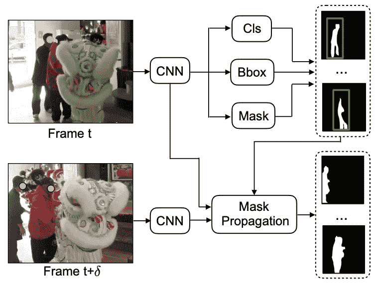

# 可变形卷积及其在视频学习中的应用

> 原文：<https://towardsdatascience.com/deformable-convolution-and-its-applications-in-video-learning-e21005cab58e?source=collection_archive---------42----------------------->

## [实践教程](https://towardsdatascience.com/tagged/hands-on-tutorials)

## 利用带有稀疏标记数据的视频帧

([来源](https://www.researchgate.net/figure/The-illustration-of-deformable-convolution-The-offset-ranges-in-the-width-and-the-height_fig1_334104866)

卷积层是卷积神经网络的基本层。虽然它广泛应用于计算机视觉和深度学习，但它有几个缺点。例如，对于特定的输入特征图，核权重是固定的，并且不能适应局部特征变化，因此我们需要更多的核来建模特征图的复杂上下文，这是多余的并且效率不高。此外，由于输出像素的感受野总是矩形，作为分层卷积的累积效应，感受野变得更大，其中将包含一些与输出像素无关的上下文背景。不相关的背景会给输出像素的训练带来噪声。

想象一下，为了克服上述问题，你想对传统的卷积层做一个小小的改变:核可以适应局部特征变化，感受野可以收敛到与输出像素对应的语义背景。幸运的是，它已经实现了，细化卷积层的名称叫做可变形卷积层。

在本帖中，我将介绍这些话题:

1.  可变形卷积
2.  利用可变形卷积提高关键点估计的性能
3.  使用可变形卷积增强实例分割的性能

## 可变形卷积

(可变形卷积)

可变形卷积是卷积层加偏移学习。如上所示，对于卷积核的每个足迹，学习 2D 偏移，以便将足迹引导到对训练最优化的位置。偏移学习部分也是卷积层，其输出通道的数量是输入通道数量的两倍，因为每个像素有两个偏移坐标。基于该方法，核可以适应局部特征变化，有利于语义特征学习。

(覆盖区偏移示例)

这是偏移学习的一个例子。a 是传统的卷积，其中内核足迹完全不移动。b、c 和 d 表示足迹的移动。

(可变形卷积的感受野细化)

结果，在可变形卷积中，深像素的感受野集中于相应的物体。如上图，在 a 中，深蓝色像素(上图)属于大羊。然而，它的矩形感受野(底部)包含左下方的小绵羊，这可能会为实例分割等任务带来模糊性。b 中感受野变形，集中在大羊上，其中避免了歧义。

## 理解可变形卷积中的偏移

如上所述，偏移有助于局部特征的核心适应和感受野的集中。顾名思义，offset 用于使内核足迹局部变形，从而使感受野整体变形。

现在棘手的部分来了:既然可以学习偏移来适应当前图片中的对象，我们是否可以通过提供偏移来使当前图片中的对象适应另一张图片中的对象？

让我们把它具体化。假设我们有一个视频，其中每一帧都与其相邻帧相似。然后，我们稀疏地选择一些帧，并在像素级对它们进行标记，如语义分割或关键点等。既然这几类像素级的标签都很贵，那我们能不能用无标签的相邻帧来提高概化的精度呢？具体来说，用一种方法将未标记帧的特征图变形到其相邻的标记帧，以补偿标记帧中缺失的信息？

## 从稀疏标记视频中学习时间姿态估计

(特征地图扭曲模型)

这项研究很好地解决了上面讨论的问题。由于标记是昂贵的，所以在视频中只有少量的帧被标记。然而，标记帧图像中的固有问题，如遮挡、模糊等。阻碍模型训练的准确性和效率。为了解决这个问题，作者使用可变形卷积将未标记帧的特征映射变形为它们相邻的标记帧的特征映射，以补偿上面讨论的固有问题。偏移量就是已标记帧与其未标记相邻帧之间的优化特征差异。可变形部分由多分辨率特征金字塔构成，其中使用了不同的膨胀。这种方法的优点是，我们可以利用相邻的未标记帧来增强标记帧的特征学习，因此我们不需要标记视频的每一帧，因为相邻的帧是相似的。这种变形方法，也被作者称为“扭曲”方法，比其他一些视频学习方法，如光流或 3D 卷积等，更便宜，更有效。

(扭曲模型的训练和推断)

如上所示，在训练期间，未标记帧 B 的特征图被扭曲到其相邻的标记帧 A 的特征图。在推断期间，帧 A 的基本事实可以使用训练的扭曲模型来传播，以获得帧 B 的关键点估计。此外，可以扭曲更多的相邻帧，聚集它们的特征图，以提高关键点估计的准确性。

## 具有掩模传播的视频中的实例分割

(基于掩码 RCNN 的掩码传播)

作者还通过在现有的 Mask-RCNN 模型中添加掩模传播头，提出了用于实例分割的掩模传播，其中在时间 t 的预测实例分割可以传播到其相邻的帧 t + δ。

(掩模传播的网络结构)

网络结构类似于上面讨论的姿态估计网络，但有点复杂。它有三个部分:1)帧 t 的实例分割预测；2)帧 t 和 t + δ之间的偏移优化和分割变形；3)用于帧 t + δ处实例分割的最终预测的特征图聚集。在这里，作者还使用乘法层来过滤噪声，只关注对象实例存在的特征。利用来自相邻帧的特征集合，可以减轻遮挡、模糊的问题。

## 结论

可变形卷积可以被引入到具有给定偏移的视频学习任务中，其中标签传播和特征聚集被实现以提高模型性能。与传统的一帧一标签学习方式相比，作者提出了多帧一标签学习方式，利用相邻帧的特征图来增强表征学习。因此，模型可以被训练来从相邻帧中看到被其他眼睛遮挡或模糊的内容。

## 参考

[可变形卷积网络，2017](https://arxiv.org/pdf/1703.06211.pdf)
[从稀疏标记的视频中学习时间姿态估计，2019](https://arxiv.org/pdf/1906.04016.pdf)
[利用掩模传播对视频中的对象实例进行分类、分割和跟踪，2020](https://arxiv.org/pdf/1912.04573.pdf)

 [## 加入我的介绍链接-陈数杜媒体

### 阅读陈数·杜(以及媒体上成千上万的其他作家)的每一个故事。您的会员费直接支持…

dushuchen.medium.com](https://dushuchen.medium.com/membership)