# 去神秘化的可变形卷积

> 原文：<https://towardsdatascience.com/deformable-convolutions-demystified-2a77498699e8?source=collection_archive---------5----------------------->

## 可变形卷积越来越受欢迎，并被应用于复杂的计算机视觉任务，如物体检测。在这篇文章中，我将尝试详细解释它们，并阐明它们在未来计算机视觉应用中的重要性。

([来源](https://unsplash.com/photos/NE0XGVKTmcA))

# 先决条件:

帖子的读者必须对卷积神经网络有一个基本的了解。如果你不熟悉这个话题，你可以参考这个[**链接**](https://cs231n.github.io/convolutional-networks/) 如果你想了解更多关于卷积运算的知识，它实际上是从基本的图像处理中派生出来的，你也可以阅读这个 [**博客**](/convolution-vs-correlation-af868b6b4fb5) 。

# 介绍

简而言之，卷积神经网络或 CNN 是人工智能研究在一个非常艾龙的冬天之后复兴的主要原因之一。基于它们的应用首次展示了人工智能或深度学习的力量，并恢复了该领域的信心。在马文·明斯基指出感知器只能处理线性可分数据，而不能处理最简单的非线性函数(如 XOR)后，这种信心已经丧失。
卷积神经网络在计算机视觉领域非常流行，几乎所有最新的应用程序，如谷歌图像、无人驾驶汽车等，都基于它。在非常高的水平上，它们是一种神经网络，其关注局部空间信息，并使用权重共享以分层方式提取特征，这些特征最终以某种特定于任务的方式聚集，以给出特定于任务的输出。

虽然 CNN 在视觉识别任务方面表现出色，但在对物体比例、姿态、视点和部分变形的几何变化或几何变换建模时却非常有限。
几何变换是将图像的位置和方向变换为另一个位置和方向的基本变换。
一些基本的几何变换包括缩放、旋转、平移等。
卷积神经网络缺乏模拟几何变化的内部机制，只能使用固定且受用户知识限制的数据扩充来模拟几何变化，因此 CNN 无法学习用户未知的几何变换。
为了克服这个问题并增加 CNN 的能力，微软亚洲研究院推出了****。在他们的工作中，他们引入了一种**简单的**、**高效的**和**端到端的**机制，使得 CNN 能够根据给定的数据学习各种几何变换。****

## ******为什么卷积神经网络无法模拟几何变换？******

********

******图一。**简单卷积运算 **(** [**来源**](https://www.freecodecamp.org/news/content/images/2019/07/convSobel.gif) **)******

****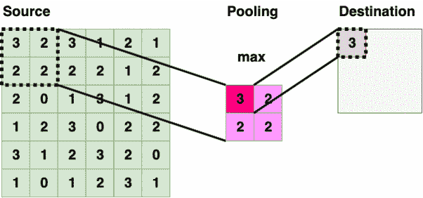****

****图二。2x2 矩形内核的最大池操作([来源](https://miro.medium.com/max/1204/0*uYmuSGuwM7N-88QT.gif))****

****CNN 对模型几何变换的限制源于用于从特征图采样的核的固定结构。CNN 内核使用固定的矩形窗口(**图 1** )在固定位置从输入特征地图中进行采样，汇集层使用相同的矩形内核(**图 2** )以固定比率降低空间分辨率。这引入了各种问题，例如给定 CNN 层中的所有激活单元具有相同的感受野，即使在不同的空间位置可能存在不同尺度的对象。对于需要精细定位的视觉识别任务，例如物体检测、分割等，需要适应物体的比例并对不同的物体具有不同的感受野大小。****

# ****可变形卷积****

******高级解释**:****

****在可变形卷积中，为了将不同对象的尺度考虑在内并根据对象的尺度具有不同的感受野，在标准卷积运算中，将 2D 偏移添加到规则网格采样位置，从而使前面激活单元的恒定感受野变形。使用额外的卷积层，添加的偏移可以从前面的特征图中获知。因此，所应用的变形以局部、密集和自适应的方式取决于输入特征。添加的可变形卷积层向现有模型添加了非常小的参数和计算，并且可以使用正常的反向传播进行端到端训练。****

****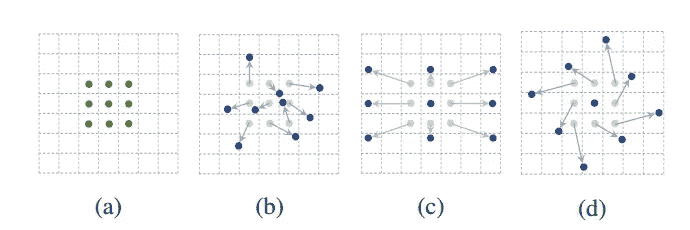****

******图 3。**正常卷积运算(a)与可变形卷积运算(b，c，d)的采样位置。****

******详解**:****

****为了详细解释可变形卷积，我将首先讨论正常的卷积运算，然后解释将它们转换为可变形卷积的简单思想。****

****正常的卷积运算包括两个基本步骤:****

1.  ****使用矩形核对输入图像或特征图的小区域进行采样。****
2.  ****将采样值乘以矩形核的权重，然后在整个核上对它们求和，以给出单个标量值。****

****我会用方程式和视觉的形式来解释以上两个概念。
让我们先试着用数学方程式来理解。****

****设 R 是一个 3×3 的核，用于对输入特征图的一个小区域进行采样。****

****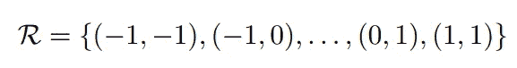****

******方程式 1。**采样内核****

****那么正常的二维卷积运算的等式将如下图所示，其中 **w** 是核的权重， **x** 是输入特征图， **y** 是卷积运算的输出， **p₀** 是每个核的起始位置， **pₙ** 是 r 中所有位置的枚举****

****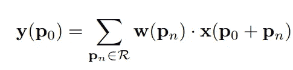****

******方程式 2。**普通卷积运算****

****该等式表示卷积运算，其中采样网格上的每个位置首先乘以权重矩阵的相应值，然后求和以给出标量输出，并且在整个图像上重复相同的运算给出了新的特征图。****

****下面直观地描述了上面解释的操作，其中绿色内核滑过由蓝色矩阵描述的图像，并且相应的权重值与来自图像的采样值相乘，然后求和以给出输出特征图中给定位置的最终输出。****

****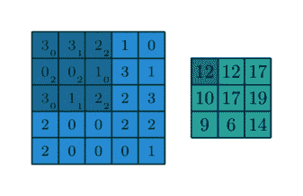****

******图 4** 。卷积运算的直观演示****

****可变形卷积不是使用简单的固定采样网格，而是将 2D 偏移引入到上述正常卷积运算中。****

****如果 R 是正常网格，则可变形卷积运算将学习到的偏移增加到网格，从而使网格的采样位置变形。****

****可变形卷积运算由下面的等式描述，其中**δpₙ**表示添加到正常卷积运算的偏移。****

****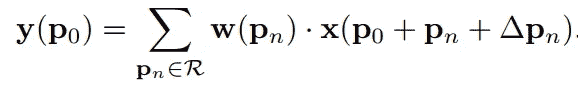****

******方程式 3** 。变形卷积运算****

****现在，由于采样是在不规则和偏移位置上进行的，并且**δpₙ**通常是分数，我们使用双线性插值来实现上述等式。
使用双线性插值是因为当我们向现有采样位置添加偏移时，我们获得的分数点不是网格上定义的位置，为了估计它们的像素值，我们使用双线性插值，使用相邻像素值的 2x2 网格来估计新变形位置的像素值。****

****下面给出了用于执行双线性插值和估计分数位置处的像素值的等式，其中 p(**p₀+pₙ+****δpₙ)**是变形位置， **q** 列举了输入特征图上的所有有效位置，而 **G(..)**是双线性插值核。****

****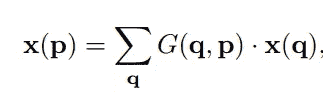****

******方程式 4。**双线性插值运算****

******注:** G(..)是二维的，并且可以根据轴分解成两个一维内核，如下所示。****

****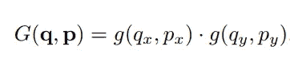****

******方程式 5。**轴向双线性插值内核****

****从视觉上看，可变形卷积的实现如下图所示。****

****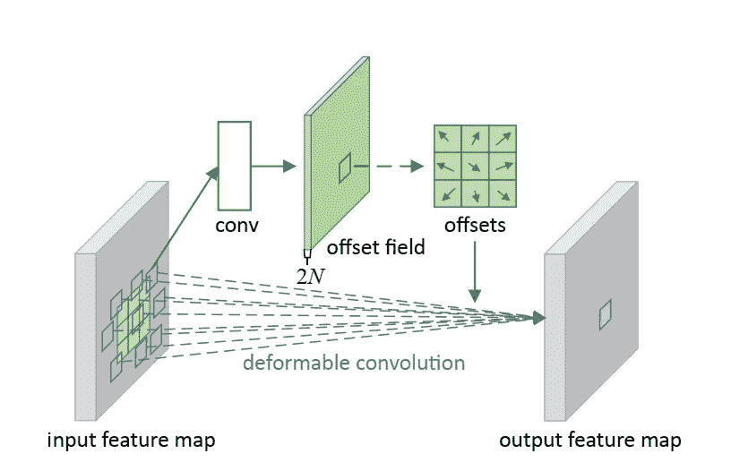****

******图五。**可变形卷积运算的可视化表示****

****如图**图 5** 所示，通过在输入特征地图上应用卷积层获得偏移。所使用的卷积核具有与当前卷积层相同的空间分辨率和膨胀。输出偏移字段的分辨率与输入要素地图的分辨率相同，具有 2N 个通道，其中 2N 对应于 N 个 2d 偏移。****

# ****网络修改详细信息****

****可变形卷积层主要应用于卷积网络的最后几层，因为与提取更多基本特征如形状、边缘等的早期层相比，它们更可能包含对象级语义信息。实验结果表明，将可变形卷积应用于最后 3 个卷积层在诸如对象检测、分割等任务中提供了最佳性能。****

****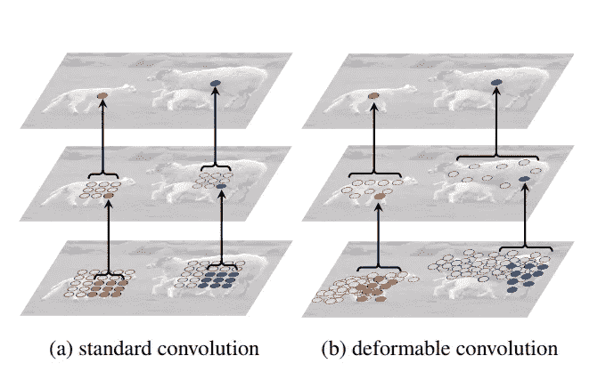****

****图 6。标准卷积中固定感受野和变形卷积运算中自适应感受野的图示。****

# ****使用可变形卷积的优点****

****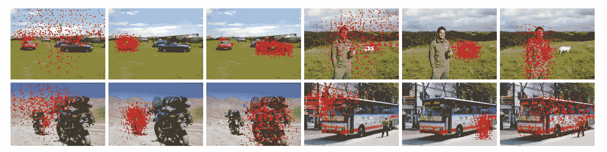****

******图 7。**描绘每个对象的适应性感受野的三联图像。****

****使用可变形卷积运算的优势在**图 7** 中有清晰的描述。如您所见，有 4 个图像三元组，其中特定三元组中的每个图像描绘了关于特定对象的感受野。如果这是一个正常的卷积运算，那么给定图像中所有物体的感受野应该是相同的。但是正如你所注意到的，在可变形卷积的情况下，感受野根据物体的大小是自适应的。与大尺寸物体相比，小尺寸物体(例如第一组中的汽车)具有较小的感受野。你可以注意到，背景物体的感受野是最大的，与前景物体相比，需要大的感受野来检测背景物体。****

# ****结论:****

****在这篇文章中，我试图解释可变形卷积，这种卷积在当前新颖的对象检测和分割模型中很容易应用。它们获得动力的主要原因是它们提供了内部机制，使卷积神经网络能够模拟各种空间变换。它们提供了自适应感受野的优势，该感受野从数据中学习并根据对象的规模而变化。****

****希望你喜欢这篇文章，如果你有任何疑问或建议，请使用 [Twitter](https://twitter.com/Perceptron97) 或 [LinkedIn](https://www.linkedin.com/in/divyanshu-mishra-ai/) 联系我。****

# ******参考文献:******

1.  ****可变形卷积网络。戴，齐，熊，李，张，胡，魏****