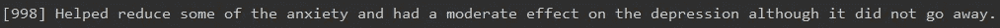
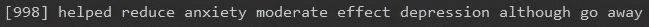
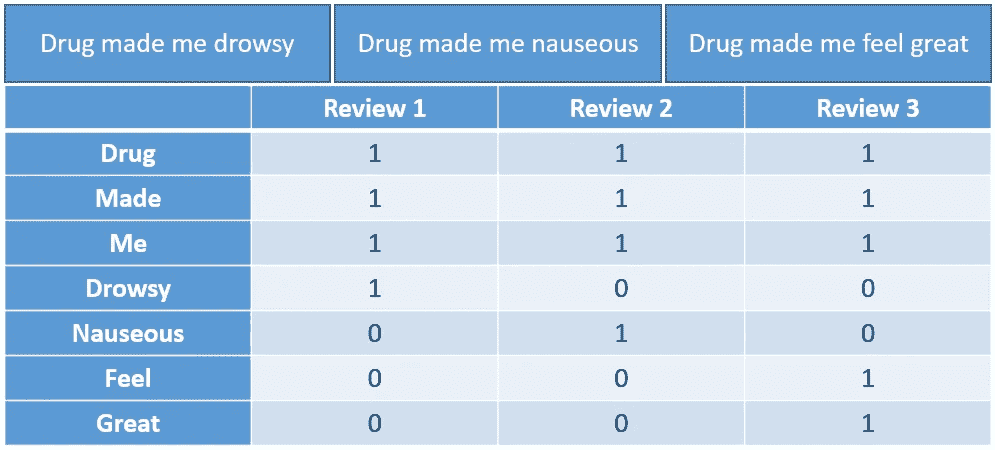
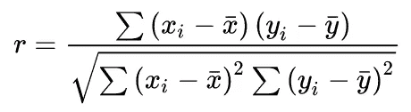
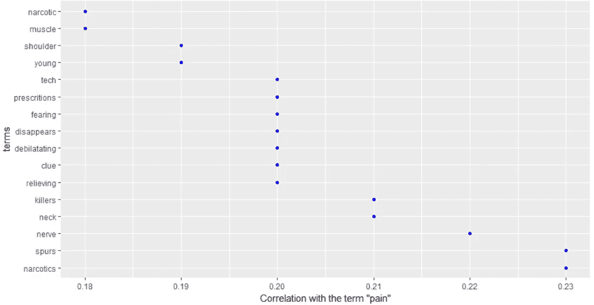
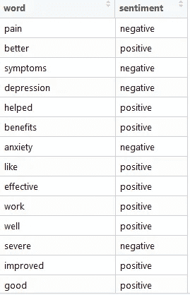
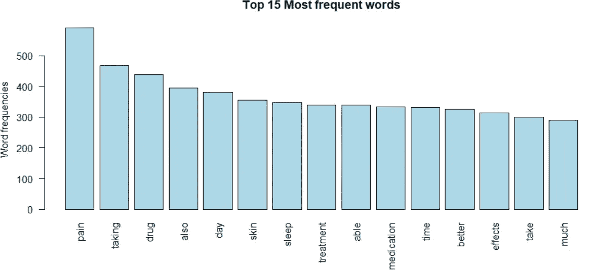
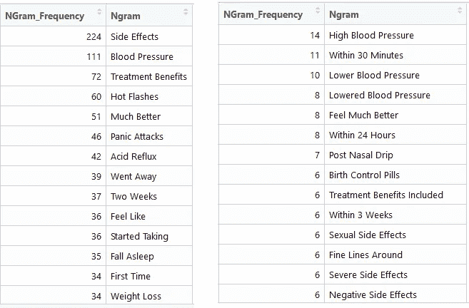
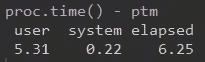

# 通过 NLP & R 提供即时商业价值

> 原文：<https://towardsdatascience.com/delivering-immediate-business-value-with-nlp-r-c51020d72ce4?source=collection_archive---------44----------------------->

## 让我们面对现实吧——我们不能整天坐在那里训练神经网络

**照片:** [**弗洛伦西亚 Viadana**](https://unsplash.com/@florenciaviadana) **，Unsplash**

作为数据科学家，我们的工作是为企业提供切实的底线结果。虽然我喜欢整天训练神经网络，但关键是我们要与业务部门建立稳固的关系，并找到交付易于理解和量化的价值的方法。

除非你在一家大型科技公司工作，否则你的团队很可能有大量的分析用例。在这个简短的教程中，我将为您提供代码，并概述如何利用基本的自然语言处理(NLP)来交付真实、可沟通、有价值的分析。

关于从互联网上收集必要的文本数据的教程(和一些警告),请查看我关于 web 爬行的文章:

完全初学者的第 1 部分可以在这里找到****和第 2 部分，在那里我们采取了一种更加面向对象和可重用的方法，可以在这里找到**。******

# ******TL；博士-给我密码******

******数据集可以在这里找到****(代码中也有链接)。**********

# ******让我们来分解一下:语料库******

******语料库是我们将用于 NLP 的核心数据结构。因为我们将一个字符向量传递给 Corpus()函数，所以我们需要指定源是一个向量源。使用 inspect()方法将允许您查看新创建的语料库。******

******在语料库创建之后，我们使用一些常用的方法清理文本数据。我们的 cleaner()函数做了一些基本的操作，比如删除数字，但是它也删除了所有的停用词，这些词本身没有什么意义。流行的停用词是“the”和“a”******

******请注意，删除停用字词时可能会丢失一些信息。这就是分析变得更像艺术而不是科学的地方。你可以选择只删除基本术语，也可以决定删除特定行业术语，等等。******

************

******产品的原始评论(图片由作者提供)******

************

******去掉了停用词。请注意，“它没有”不再出现在句子中(图片由作者提供)******

# ******TDM 和词云******

******当我们创建语料库时，R 基本上将每篇评论编码为一个单独的文本文档。术语文档矩阵(TDM)采用语料库，并对每个单词制作一个**的矢量化频率表。下面是一个 TDM 中包含 3 个虚拟评论的示例:********

********

****TDM 是如何制作的示例(图片由作者提供)****

****从这个 TDM 中，我们可以创建一个矩阵，按行和(词频)排序，然后使用词云可视化结果。这是我们分析的第一部分。****

********

****药品评论的文字云(图片由作者提供)****

# ****单词相关性****

****云这个词是一个很好的开始，但却是一个很基础的起点。我们可以通过评估单词之间的相关性来增强我们的分析。单词相关性利用 R 的 base cor()函数使用的相同方法，Pearson 相关性是默认的。这是皮尔逊相关公式:****

********

****皮尔逊相关系数(r)公式，****

****因为我们的 TDM 是矢量化的，所以 R 可以有效地执行这些比较。在我们的主代码中，我们需要输入一个感兴趣的项和一个相关下限。如果你看到大多数单词的相关度都在 15%以下，不要惊讶。事实上，由于我们数据集的庞大规模，15%可能是一个显著的相关性。即使我们的数据集很小(按 ML 标准)，我们的 TDM 也非常大(2300 万个元素——3107 条评论 x 750 个单词)。****

****让我们看一下单词“Pain”和我们的 TDM 的其余部分之间的相关图，施加 18%的相关下限:****

********

****TDM 和“疼痛”之间的关联图，18%关联下限(图片由作者提供)****

****这张图表立刻向我们展示了一些见解。例如，我们看到“神经”与疼痛有很高的相关性，相关性为 22%。这可以产生直接、即时的业务影响；我们有效地总结了 3000 多篇评论，并找出了一个常见的问题。****

# ****情感分析****

****虽然有许多复杂的方法来执行情感分析，但在本文中，我们将重点关注合理执行的开箱即用的方法。对于情感分析的详细概述，请查看这个[维基百科页面](https://en.wikipedia.org/wiki/Sentiment_analysis)。对于快速启动，我们基本上利用了微软情感词典中大量预先标记的消极/积极词汇。我们用我们的单词列表加入词典，然后只计算正面和负面单词的比率。****

********

****来自我们合并列表的片段(图片由作者提供)****

# ****N-Grams****

****但是等等，还有呢！虽然我们可以更仔细地观察单个词频，但这表面上是我们在词云中可视化的条形图/表格形式。单个单词也有信息缺失的问题。类似于我们在讨论停用词时看到的，我们可能会用这种方法丢失句子中的重要修饰语。例如，我们可以将“粉丝”作为我们的首选词之一，但可能有一半的句子也包括“我不是一个…****

********

****作者图片****

****我们可以用 N-gram 分析来应对这种信息丢失。一个 N-gram 基本上是在我们的数据集中同现的“N”个单词。在这个代码模板中，我们需要做的就是将方法中的“n”改为我们想要的大小。以下是运行二元和三元模型分析并清理数据集后的结果。****

********

****几乎是瞬间，我们对热门话题有了一个很好的了解(图片由作者提供)****

# ****太好了，我怎么卖？****

****这个代码模板有几个很大的技术和非技术优势:****

1.  ******战斗偏见&显著性:**采用程序化方法的最重要优势之一是消除了人为因素。对于公司来说，让一个关键人员审查报告的药物副作用、内部调查等是很常见的。这是一个问题。人都是有偏见的，不管自己知不知道。潜意识偏见会导致一种类型的评论保持突出或直接影响结果的交付。像这样的程序可以很容易地扩展和大规模共享(见#4)，消除了孤立的偏见/突出的影响。****
2.  ******谁不喜欢字云？**由此产生的视觉效果易于理解，看起来很漂亮，是建立业务方对您的分析的信心的好方法。****
3.  ******速度:**当然，不是完全优化，但是这个代码是*快*。从开始到结束，这个程序在我的电脑上运行 6.25 秒。诚然，我的电脑比大多数工作机器快一点，但也没快多少。一个人仔细梳理这 3100 条评论可能需要几天时间。****

********

****脚本计时(图片由作者提供)****

****4.**没有分析基础设施？没问题！该模板可以回收用于任何文本分析，几乎不需要用户交互。基础设施有所帮助，但并不是真正必要的。如果我们想对此类代码进行“软部署”:******

*   ****添加您想要查看的任何导出条件(图表、n-gram 等。)****
*   ****创建引用此脚本的. bat 文件****
*   ****安排一个 windows 进程在数据更新时每“X”天运行一次可执行文件，或者只需单击。蝙蝠****