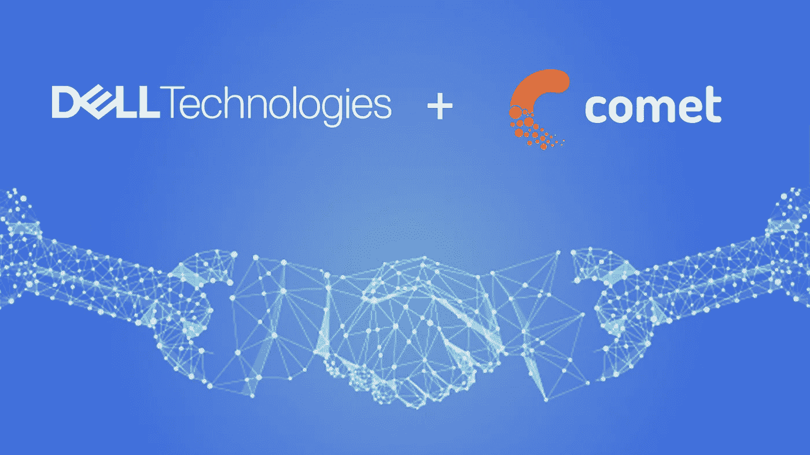
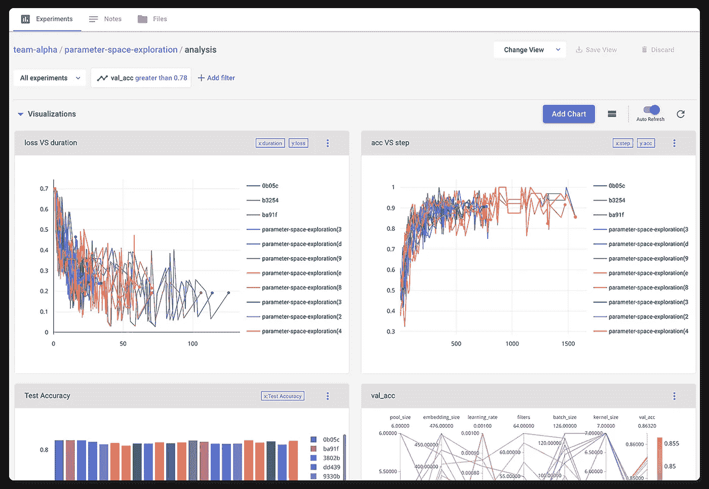

# 戴尔 EMC 和 Comet 宣布机器学习平台合作

> 原文：<https://towardsdatascience.com/dell-emc-and-comet-release-kubernetes-reference-architecture-1706c1575530?source=collection_archive---------65----------------------->

[为数据科学团队提供全栈解决方案的领先提供商戴尔 EMC](https://www.delltechnologies.com/en-us/solutions/data-analytics/machine-learning/ready-solutions-for-ai.htm) 和行业领先的元机器学习实验平台 [Comet](http://comet.ml/) 发布了一个参考体系结构，供希望利用戴尔 EMC 基础架构与 Comet 元机器学习平台的强大功能的数据科学团队使用。[阅读由 Comet 和戴尔共同撰写的白皮书](https://www.dellemc.com/resources/en-us/asset/white-papers/products/ready-solutions/dell-comet-machine-learning-wp.pdf)，了解 Comet 与戴尔 EMC 人工智能基础架构的配合使用。

借助 Dell EMC PowerEdge 参考体系结构，组织可以部署人工智能工作负载优化的机架系统，比设计正确的配置和部署解决方案大约快 6 到 12 个月。组织现在可以依赖由我们的戴尔工程师测试和验证的体系结构，并且知道服务可以在您需要的时间和地点提供。

Comet 联合创始人/首席执行官 Gideon Mendels 表示:“对于我们的许多客户来说，协调和管理企业数据科学团队的堆栈是一个巨大的难题。“戴尔 EMC 的 Kubeflow 和 Kubernetes 解决方案是同类最佳的解决方案，是任何希望构建强大且可扩展的 ML 平台的数据科学团队的绝佳选择。”

Comet 是一个元机器学习实验平台，允许用户自动跟踪他们的指标、超参数、依赖性、GPU 利用率、数据集、模型、调试样本等。通过利用 Comet，数据科学团队产生了更快的研究周期，以及更加透明和协作的数据科学。Comet 还提供了内置的超参数优化服务、交互式混淆矩阵、完整的代码跟踪和可再现性特性。Comet 本地安装可以支持任何规模的团队，从单台机器到分布式微服务。

“这是一种让你质疑没有它你如何运作的产品。“Comet 为数据科学团队提供了他们需要的所有自动化和生产力功能，但他们从来没有时间开发自己，”戴尔 EMC 高级首席工程师兼杰出技术人员菲尔·胡梅尔说。

参考体系结构利用戴尔 EMC 支持人工智能的 Kubernetes 解决方案，由 Canonical 的[charged Kubernetes](https://ubuntu.com/kubernetes/docs/overview)和 Kubeflow 提供支持，符合人工智能工作负载的所有要求。该解决方案包括 100%上游 Kubernetes 的最新代码，这些代码被打包成易于使用的包，并由 Canonical 提供支持。

戴尔 EMC 和 Comet 的参考体系结构和数据科学团队用户案例说明了我们的联合解决方案如何为团队提供管理其机器学习工作流(数据存储、实验和模型构建以及部署)所需的工具和基础架构，同时随着团队的扩展提供灵活而强大的部署选项。要了解有关戴尔 EMC 支持人工智能的 Kubernetes 集群选项的更多信息，请阅读更多信息[此处](https://www.delltechnologies.com/en-us/servers/reference-architectures.htm#accordion0&accordion1&accordion2)或直接联系戴尔 EMC[安排电话](https://www.delltechnologies.com/en-us/servers/reference-architectures.htm#accordion0&accordion1&accordion2)。要了解更多关于 Comet 的元机器学习平台的信息，请阅读更多关于 Comet 的信息[这里](https://www.comet.ml/site/enterprise/)或者联系 Comet 的[客户解决方案团队](https://www.comet.ml/site/contact-sales/)以获取更多信息或安排演示。

点击此处阅读[完整白皮书](https://www.dellemc.com/resources/en-us/asset/white-papers/products/ready-solutions/dell-comet-machine-learning-wp.pdf)，该白皮书涵盖(a)将 Comet 与戴尔 EMC 人工智能基础架构结合使用，以及(b)技术安装说明。