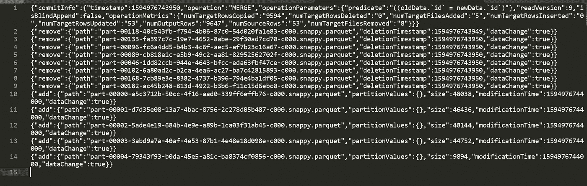

# 有火花的三角洲湖:什么和为什么？

> 原文：<https://towardsdatascience.com/delta-lake-with-spark-what-and-why-6d08bef7b963?source=collection_archive---------6----------------------->

## 了解支持 ACID 和 Spark 更新的存储层


弗兰基·查马基在 [Unsplash](https://unsplash.com/s/photos/big-data?utm_source=unsplash&utm_medium=referral&utm_content=creditCopyText) 上拍摄的照片

让我首先介绍两个问题，这是我在使用 Apache Spark 的过程中反复遇到的问题:

1.  同一路径上的数据“覆盖”会在作业失败时导致数据丢失。
2.  数据的更新。

有时我通过设计变更解决上述问题，有时通过引入另一个层，如 Aerospike，或者有时通过维护历史增量数据。

维护历史数据通常是一个直接的解决方案，但是我不太喜欢处理**的历史增量数据**，如果不是真的需要的话，因为(至少对我来说)它会在失败的情况下引入回填的痛苦，虽然失败可能不太可能，但是不可避免。

以上两个问题都是“问题”，因为 Apache Spark 并不真正支持 ACID。我知道 Spark 从来没有处理事务的用例(你好，你不可能拥有一切)，但有时，可能会有这样的场景(就像我上面的两个问题)，ACID 合规性会派上用场。

当我读到德尔塔湖和它的耐酸性时，我认为它是我的两个问题的可能解决方案之一。请继续阅读，了解这两个问题如何与酸性合规失败相关联，以及三角洲湖如何被视为救世主？

# 三角洲湖是什么？

三角洲湖文档将三角洲湖介绍为:

> [Delta Lake](https://delta.io/) 是[开源存储层](https://github.com/delta-io/delta)，为[数据湖](https://databricks.com/discover/data-lakes/introduction)带来可靠性。Delta Lake 提供了 ACID 事务、可扩展的元数据处理，并统一了流式和批量数据处理。Delta Lake 运行在您现有的数据湖之上，并且与 Apache Spark APIs 完全兼容。

三角洲湖关键点:

*   支持酸
*   实现时间旅行
*   启用 UPSERT

# 火花如何失败酸？

考虑下面这段从数据集中删除重复项的代码:

```
# Read from HDFS
df = spark.read.parquet("/path/on/hdfs") # Line 1
# Remove duplicates
df = df.distinct() # Line 2
# Overwrite the data
df.cache() # Line 3
df.write.parquet("/path/on/hdfs", mode="overwrite") # Line 4
```

对于运行在这段代码上的 spark 应用程序，考虑一个场景，它在第 4 行失败，也就是在写入数据时失败。这可能会也可能不会导致数据丢失。【问题#1:如上所述】。您可以通过创建测试数据集来复制该场景，并在作业处于*写*阶段时终止作业。

让我们试着用上面的场景来理解 spark 中的酸失效。

## 酸中的 a 代表原子数，

*   *什么是原子性:*要么所有的变化都发生，要么都不发生，系统永远不会处于中途状态。
*   【spark 如何失败:在写入数据时，(上面第 4 行)，如果在旧数据被删除而新数据尚未写入的阶段发生失败，则发生数据丢失。我们丢失了旧数据，并且由于作业失败、原子性失败，我们无法写入新数据。[它可以根据使用的文件输出提交器而变化，请务必阅读文件输出提交器，以了解数据写入是如何发生的，我解释的场景是针对 v2 的]

## 酸中的 c 代表一致性，

*   *什么是一致性*:数据在系统中必须始终保持一致和有效。
*   【Spark 如何失败:如上所述，在失败和数据丢失的情况下，我们在系统中留下无效数据，一致性失败。

## 酸中的 I 代表隔离，

*   *什么是隔离:*多个事务隔离发生
*   *spark 如何失败:*考虑并行运行的两个作业，一个如上所述，另一个也使用相同的数据集，如果一个作业覆盖数据集，而另一个仍在使用它，可能会发生失败，隔离失败。

## 酸中的 d 代表耐久性，

*   *什么是持久性:*更改一旦做出就永远不会丢失，即使在系统出现故障的情况下。
*   *Spark 可能如何失败:* Spark 确实不影响耐用性，它主要由存储层管理，但由于我们在作业失败的情况下会丢失数据，在我看来，这是一个耐用性故障。

# 三角洲湖如何支持酸？

Delta lake 在写入数据的路径中维护一个 Delta 日志。增量日志维护如下详细信息:

*   类似于
    的元数据-写入操作中添加的路径。
    -写入操作中移除的路径。
    -数据大小
    -数据的变化
*   数据模式
*   提交信息，如
    -输出行数
    -输出字节数
    -时间戳

在某些操作后创建的 _delta_log_ directory 中的示例日志文件:



成功执行后，会在 _delta_log_ 目录中创建一个日志文件。重要的是要注意，当你保存你的数据作为增量，没有文件一旦写入被删除。这个概念类似于版本控制。

通过在 _delta_log_ 中跟踪删除、添加的路径和其他元数据信息，Delta lake 是 ACID 兼容的。

版本控制启用了 Delta Lake 的时间旅行属性，也就是说，我可以回到任何数据状态，因为所有这些信息都保存在 _delta_log_ 中。

# 三角洲湖如何解决我上面提到的两个问题？

*   有了对 ACID 的支持，如果我的作业在“覆盖”操作期间失败，数据不会丢失，因为更改不会提交到 _delta_log_ directory 的日志文件。此外，由于 Delta Lake 不会在“覆盖操作”中删除旧文件，因此我的数据会保持旧状态，不会有数据丢失。(是的，我测试过)
*   Delta lake 支持上面提到的更新操作，因此它使得处理数据更新更加容易。

*下次见，
再见。*