# 需求预测:波士顿犯罪数据

> 原文：<https://towardsdatascience.com/demand-forecast-boston-crime-data-64a0cff54820?source=collection_archive---------22----------------------->


[上的照片是 stockphoto](https://www.istockphoto.com/tr/en/portfolio/dedmityay)

*能够预测某一天某一特定地点发生暴力犯罪可能性的模型。*

**需求预测**是零售、供应链管理和物流领域的热门话题和永无止境的目标。决策者需要根据预测的需求优化他们的资源，因此它也与优化问题直接相关。

**预测**在其通常的机器学习用途中处理一维的时间序列数据。[预测股票价格](/time-series-analysis-in-python-an-introduction-70d5a5b1d52a)或跨年度购买数量是最常见的用例。像 [ARIMA](https://en.wikipedia.org/wiki/Autoregressive_integrated_moving_average) 这样的加性模型是这个领域中最古老的数学模型之一:

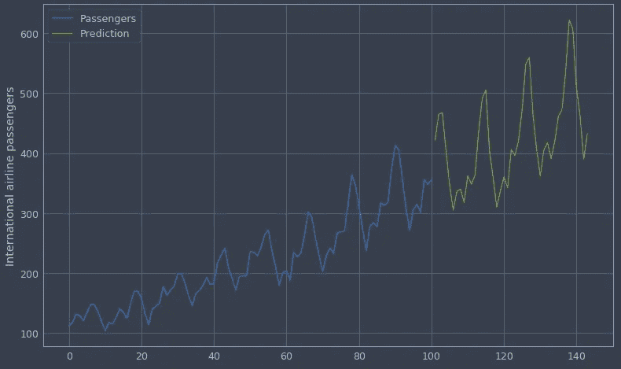

预测明确的趋势。看起来很简单，是吧？

使用这些众所周知的数据——几年来航空乘客的数量——来理解预测的基础当然是有帮助的。但即使乍一看，也不难猜到现实生活中的问题很少如此简单。

**波士顿犯罪数据简介**


马特·波波维奇在 [Unsplash](https://unsplash.com?utm_source=medium&utm_medium=referral) 上的照片

[分析波士顿](https://data.boston.gov/)波士顿的开放数据中心发布各种城市数据。其[犯罪事件报道](https://data.boston.gov/dataset/crime-incident-reports-august-2015-to-date-source-new-system)就是其中之一。该市的表格数据列出了 2015 年以来的犯罪事件。我们可以在这里看到他们数据集中的主要特征(总共有 16 列):

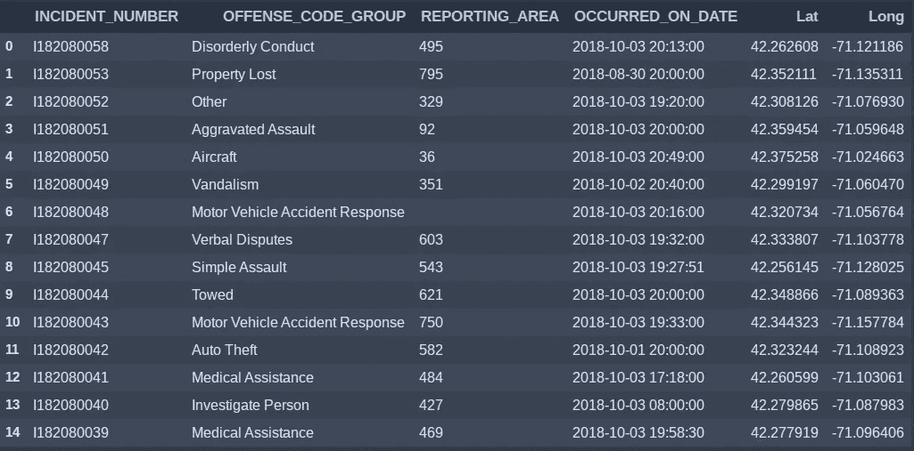

*   事件编号:事件的唯一标识符
*   犯罪代码组:事件按犯罪类型分组
*   报告区域:报告区域的代码。
*   发生日期:事件发生的日期
*   Lat:犯罪地点的纬度
*   Long:犯罪地点的经度

他们的最新数据超过 40 万行。他们还将自己的[数据集上传到 Kaggle](https://www.kaggle.com/AnalyzeBoston/crimes-in-boston) 来介绍它并挑战数据科学界。

对犯罪类型及其趋势的分析肯定有助于我们了解这个城市的犯罪动态。但是如果我们能比这更进一步呢？

# 目标

历史数据集具有城市中不同类型犯罪的时间和空间维度。

因此，最令人兴奋的项目是在犯罪真正发生之前为社区预测犯罪。


**不，不是那个方向！** —图片由[杰拉尔丁·杜克斯](https://pixabay.com/users/GerDukes-4387545/?utm_source=link-attribution&amp;utm_medium=referral&amp;utm_campaign=image&amp;utm_content=2114403)提供，来自[皮克斯贝](https://pixabay.com/?utm_source=link-attribution&amp;utm_medium=referral&amp;utm_campaign=image&amp;utm_content=2114403)

现在我们需要一个框架来组织问题。仅仅预测一个街区或者大体上整个城市的犯罪数量，并没有说太多，也没有用。我们需要预测某个特定地区是否会发生罕见的犯罪。

此外……这类问题不常被研究，而波士顿的犯罪数据给了我们一个机会去调查一个具有挑战性的问题。为什么？更多信息请见挑战部分。

# 问题框架

这里**我将遵循另一篇** [](https://www.academia.edu/25277353/Crime_Prediction_Using_Data_Analytics_the_Case_of_the_City_of_Boston)**论文中分享的方法，“使用数据分析的** [犯罪预测:波士顿市的案例”。](https://www.academia.edu/25277353/Crime_Prediction_Using_Data_Analytics_the_Case_of_the_City_of_Boston)**它包含了解决的核心。我将使用 Python 实现它，并对特性(较少的空间工程)和模型(Xgboost 以提高准确性)进行一些修改。我还会分享代码，这样每个人都可以跟着做，并尝试改进预测。我们可以总结如下:**

*   ****我们需要预测一些罕见事件(在本例中为暴力犯罪)在特定日期以空间特征发生的概率**。这样，警察可以利用这一点每天集中在城市的特定地区，以防止暴力犯罪，或至少增加在那里巡逻的机会。**

**这个框架如何塑造数据解决方案？无需过多思考，我们可以说我们将:**

*   **A **汇总每天每个地区/报告区域的历史犯罪数据。****
*   **标记这些地点和日期的组合，以便**当天是否发生暴力犯罪**。**
*   ****用概率**预测二进制值。这是一个分类问题。可以使用基于逻辑回归或决策树的模型。**

**由于**我们的数据集将非常不平衡，**对机器学习模型和决策阈值进行一些调整将是必要的。请记住，我们预测的是罕见事件。**

****

**[克里斯托夫辊](https://unsplash.com/@krisroller?utm_source=medium&utm_medium=referral)在 [Unsplash](https://unsplash.com?utm_source=medium&utm_medium=referral) 上拍照**

# **挑战—为什么不使用时间序列预测？**

**请注意，我们已经将预测问题转化为传统的机器学习分类。这是为什么呢？**

**如果我们需要预测多个值，就会出现困难，因为设置和分析 ARIMA 类型的模型并不容易。**

**那么我们需要为此建立多个模型吗？如果我们需要为数百个时间序列数据建立模型，会发生什么？这可行吗？**

**让我们列出当**需求分布在城市中且没有明确边界的情况下，在很长一段时间内**如一年，预测需求所面临的挑战。**

**考虑[出租车需求预测](https://blog.goodaudience.com/taxi-demand-prediction-new-york-city-5e7b12305475)可能是一个很好的起点，因为我们将遵循类似的逻辑。在这种情况下，我们有在特定日期从特定位置开始的出租车出行数据。预测需求的挑战如下:**

*   ****需求是空间分布的，是连续的**。它没有中心。想想城市里的几个市场，它们都有固定的位置。您可以建立预测模型来预测它们中每一个的总销售额，但这里的情况并非如此。**
*   **即使您对需求进行聚类，也可能有太多的聚类中心来为每个聚类中心建立预测模型。**
*   **您知道某些特征(如天气或时间——如假期)会严重影响需求。但是在传统的时间序列建模中，不可能添加这些特征。深度学习( [LSTM 模型](https://machinelearningmastery.com/multivariate-time-series-forecasting-lstms-keras/)举例)允许这样做。**

**现在，对于犯罪预测来说，还有一个额外的挑战。我们需要预测像暴力犯罪这样罕见的事件:**

*   **请记住，传统的时间序列预测处理的是数字数据。这里我们需要预测一个二进制值:0 或 1。**

****方法****

****

****开始建造吧！谁需要方法？**—[马库斯·斯皮斯克](https://unsplash.com/@markusspiske?utm_source=medium&utm_medium=referral)在 [Unsplash](https://unsplash.com?utm_source=medium&utm_medium=referral) 上拍照**

**现在，让我们列出创建预测模型要做的事情:**

*   **划分空间以聚集每个空间单元(格网或报告区域)的需求**
*   **将犯罪类型分为暴力犯罪和非暴力犯罪。**
*   **每天汇总每个空间单元的历史犯罪数据。该行的标签将是 1 或 0，这取决于那天在该位置是否发生了暴力犯罪。**
*   **将历史天气数据集成为波士顿每天的一项功能。**
*   **将数据分为训练集和测试集。使用一个特定的日期，在该日期之前，训练数据约为 70%，在该日期之后，测试数据为所有数据集的 30%。**
*   **建立一个侧重于预测阳性标签的模型:增加真阳性率，即[灵敏度](https://en.wikipedia.org/wiki/Sensitivity_and_specificity)。(稍后将详细介绍)**
*   **通过选择阈值来评估测试集的准确性和敏感性。**

# **1-群需求**

**从这一点开始，你可以遵循 github repo 中的代码[。](https://github.com/alptuzel/bostoncrimeprediction)**

**在对数据进行了一些探索之后，我们可以从“来自报告区域的集群中心”一节开始。通过取纬度和经度的平均值来计算报告区域中心:**

**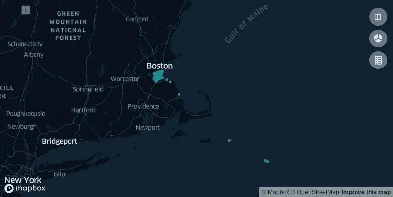**

**用于可视化空间数据的 KeplerGL 包**

**显然，有一些异常值。通过使用此处的[城市边界文件](https://catalog.data.gov/dataset/500-cities-city-boundaries-acd62)，我们绘制并提取波士顿多边形外的报告区域:**

```
# load shape file for 500 cities
city_data = gpd.read_file("geodata/CityBoundaries.shp")# some spatial processing here...# select the reporting areas (points in geodf_ra) that are 
# in geodf_boston polygon. using spatial join function
# in geopandas package 

geodf_ra_inboston=gpd.sjoin(geodf_ra, geodf_boston, how="inner", op='within')
```

**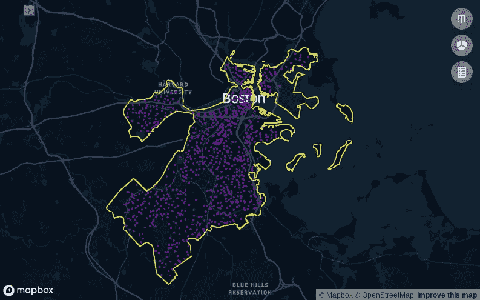**

**现在它们都在波士顿多边形内**

**在论文中，使用了 500 个网格。因此，按照同样的逻辑，我们可以创建 500 个集群，使需求中心更少，需求面分布更均匀。**

```
# create 500 centers with K-means
clusterer = KMeans(n_clusters=500,random_state=101).fit(reporting_area_centers[["Long","Lat"]])
# get predictions from our Kmeans model
preds_1 = clusterer.predict(reporting_area_centers[["Long","Lat"]])
# set our new column: cluster_no
reporting_area_centers["cluster_no"]=preds_1
```

**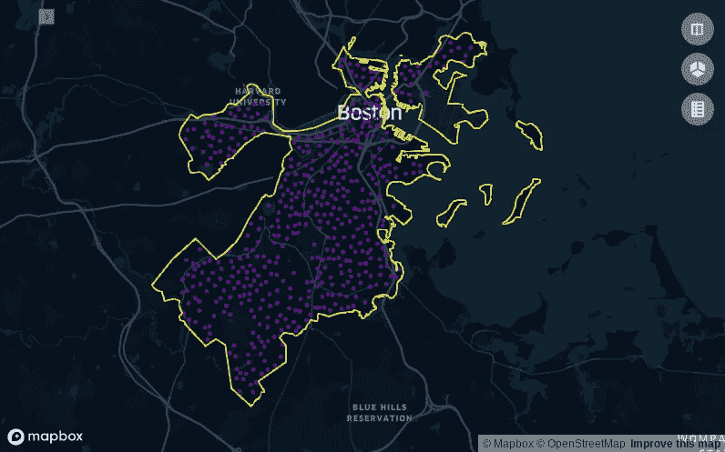**

**报告区域的 500 个集群中心。**

**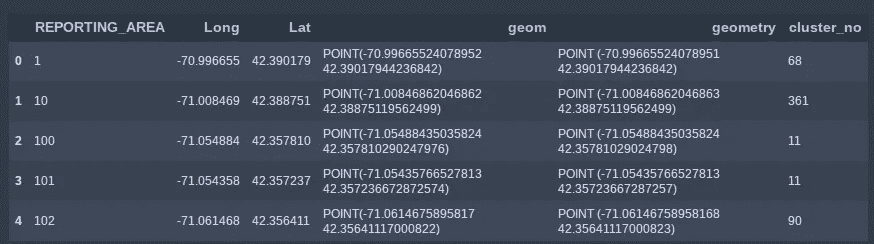**

**报告区域聚集成 500 个中心。**

# **2-集团犯罪类型**

**现在我们需要对犯罪类别进行分组(OFFENSE _ CODE _ GROUP ),以便将其中一些归类为暴力犯罪。我根据我的假设添加了这些类别，其中哪些是暴力犯罪，但是当然你可以交叉引用法律定义..**

```
# check labeled crime groups: violent, property and other
# the crimes are grouped manually into 3 groups: violent, property or other
data_1718_ocg=pd.read_csv("./data/data_1718_ocg_grouped.csv")
```

**被称为暴力犯罪的有:**

**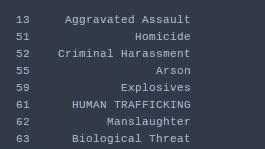**

# **3-汇总历史犯罪数据**

**至此，在笔记本文件中，我们已经到达了“为 ML 准备数据:为每个集群和日期组合聚集数据”部分。**

**我们有标有经纬度的聚类中心。**现在我们需要预测功能**！**

****这是脚本**的核心部分:每天计算所有聚类中心过去的犯罪统计数据。过去 120 天、30 天、7 天、1 天都是这样做的。**

**为了准备剧本，我先做了一天的计算。然后我写了一个全天的“for 循环”。**

```
# check one of the lists:
# here we calculated sums for different crimes for the date: 2017-10-3
# they are aggregated for each clusters.
# in this table we see the results for the past 120 days
working_120_results.head()
```

**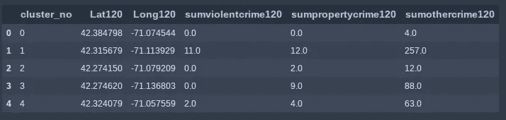**

**在这里，我们可以看到仅一天内不同地区不同犯罪类型的总和。它是通过计算该地区前 120 天的相关犯罪类型来计算的。**

**在检查了结果的合理性之后，我们可以继续进行更大的计算:“计算过去 365 天和最后一天每天的统计数据。”**现在我们运行一个循环来聚合每个集群和日期组合的历史犯罪数据**。**

```
# check resulting dataframe. This is going to be our baseline for train&test data
crime_stats_fordays_df.info()
```

**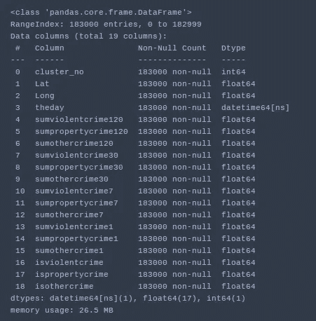**

**所有历史预测特征被聚集**

**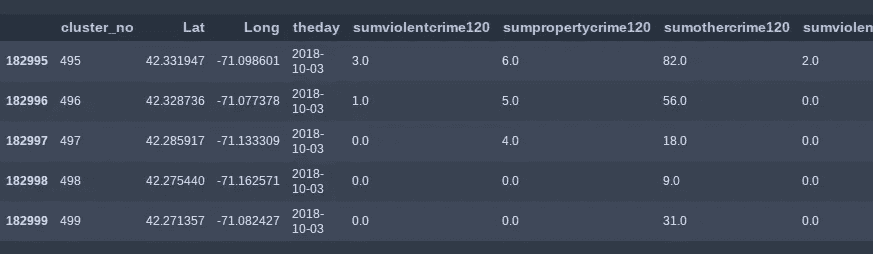**

**查看生成的数据框**

# **4-整合天气数据**

**同样，根据这篇论文，我们希望将天气数据集成到我们的训练集中，作为一个预测功能。我们认为天气状况可能会影响暴力犯罪。**

**出于这个原因，我们可以使用 Python 包 [wwo-hist](https://github.com/ekapope/WorldWeatherOnline) ，它封装了来自世界天气在线的[天气 API。我已经创建了一个免费试用帐户来收集所需的 API 密钥。你可以尝试其他选择，但这似乎是最快的解决方案。](https://www.worldweatheronline.com/developer/api/)**

```
# use package: [https://github.com/ekapope/WorldWeatherOnline](https://github.com/ekapope/WorldWeatherOnline)from wwo_hist import retrieve_hist_data# daily frequency.
frequency=24
start_date = '1-JAN-2015'
end_date = '31-DEC-2018'
api_key = 'your-api-key-comes-here'
location_list = ['boston,ma']# this one runs for all days from start_date to end_date
# and saves the results as csv to the current directory.

hist_weather_data = retrieve_hist_data(api_key,
                                location_list,
                                start_date,
                                end_date,
                                frequency,
                                location_label = False,
                                export_csv = True,
                                store_df = True)## some processing# include weather data to our aggregated data for: rain, cloud cover and minimum temperature. 
# you can include more features herecrime_stats_fordays_df=pd.merge(crime_stats_fordays_df,weather_data[["date_time","precipMM","cloudcover","mintempC"]],left_on="theday",right_on="date_time")
```

**我们使用云量、最低温度和降水量作为预测特征。**

# **5-建模**

**首先，我们将数据分为训练集和测试集。因为这是时间序列预测，所以我们选择一个截止日期，使之前的数据对应于 70%的数据。**

**然后，我们决定功能列:**

```
 # feature set
x_columns=[ 'Lat', 'Long', 
        'sumviolentcrime120', 'sumpropertycrime120',      'sumothercrime120', 
        'sumviolentcrime30','sumpropertycrime30', 'sumothercrime30', 
        'sumviolentcrime7','sumpropertycrime7', 'sumothercrime7', 
        'sumviolentcrime1','sumpropertycrime1', 'sumothercrime1', 
        'precipMM','cloudcover', 'mintempC']# outcome
y_column=["isviolentcrime"]
```

**请注意，与我们一直关注的论文不同，我们在这里使用经度和纬度来标识位置。这是因为如果您使用每个网格的收入数据，您将失去空间编码的“位置敏感”特性。简单来说，我们需要这样的空间特征，如果它们在二维空间中彼此接近，那么它们的编码就彼此接近。如果我们仅仅使用“收入数据”,我们就失去了这个特征，因为遥远的邻居可能有相同的平均收入。**

**这一选择的另一个结果是**我们需要使用基于树的模型，因为纬度和经度在物流回归等线性模型中不携带信息**。**

**我继续为模型使用“ [Xgboost 分类器](https://xgboost.readthedocs.io/en/latest/python/python_api.html#xgboost.XGBClassifier)”。正如我们在开始时说的，这是一个分类问题。**我们已经为每个聚类中心和每一天创建了聚合的历史特征。现在我们将根据这些历史特征和天气数据来预测那天是否发生了暴力犯罪。****

**我跳过了模型的调优，以免过多地扩展文章，但是可以在 Jupyter 笔记本的“调优参数”一节中查看。**

```
# tuned parameters: in the next session we run hyperparameter search with cross validation
# these parameters are gathered from that tuning session.
# so you can just continue with the tuned parameters
# you can switch back and forth between the baseline model and the tuned model to see the
# change in accuracy and other parametersxgb_model=xgb.XGBClassifier(base_score=0.5, booster='gbtree', colsample_bylevel=1,
       colsample_bynode=1, learning_rate=0.1,
       max_delta_step=0, missing=None,
       n_estimators=100, n_jobs=1,   
       nthread=None,scale_pos_weight=83,
       objective='binary:logistic', random_state=101,
       subsample= 0.6,
       min_child_weight= 10,
       max_depth= 3,
       gamma= 1,
       colsample_bytree= 0.8)
```

# **6 阈值选择**

**现在我们有了将“isviolentcrime”目标标记为 1 或 0 的概率。但是，我们应该如何选择决策阈值来将行(区域和日期组合)标记为 1 或 0 呢？**

**从论文中得出的假设如下:**让我们假设警察每天可以巡逻城市的 30%**。这最终确定了我们问题的框架。我们需要这样一个模型，它能在 30%的时间里预测阳性标签。因此，警方每天将有 30%的区域被标记为阳性。**

```
# 30 percent of the labels: 38250.0
X_train.shape[0]* 0.3# tune threshold so that 30 percent of all the labels are predicted as positive
# we found we can use 0.48 as our threshold# (38819,)
y_pred_prob_pos[y_pred_prob_pos>0.48].shape# it is 1 if greater than 0.48
xgb_predictions=np.where(y_pred_prob_pos>0.48,1,0)
```

# **7-评估**

**让我们检查一下培训数据的指标:**

```
# my accuracy score: 0.7031058823529411
accuracy_score(y_train,xgb_predictions)train_confusion_matrix=confusion_matrix(y_train, xgb_predictions)pd.DataFrame.from_dict({"Negatives":train_confusion_matrix[0],
                        "Positives":train_confusion_matrix[1]},orient='index',columns=["Negative Pred.","Positive Pred."])
```

**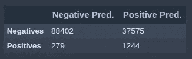**

****注意，在 1523 个阳性病例中，我们的模型正确预测了 1244 个**，因此具有 1244/1523=0.82 的真实阳性率。**

**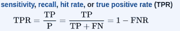**

**真实阳性率公式来自[维基百科](https://en.wikipedia.org/wiki/Sensitivity_and_specificity)**

**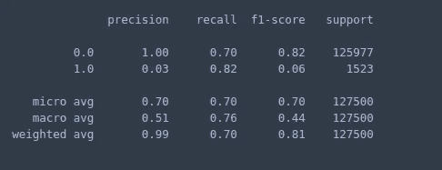**

**我们可以看到总体评估指标。请注意，标签 1 的召回率为 0.82。**

**现在是测试集:**

**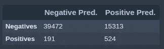****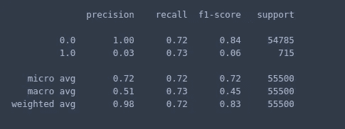**

**我们的**真阳性率(召回)下降到 0.73** 。**

**其计算方式为 191 / (191+524)**

**我们还为训练数据设置了 30%正标签的阈值。我们在测试集中使用了相同的阈值，如果您检查:**

```
# our predictor predicts 28 percent positive labels
# police needs to travel 28 percent of the area
xgb_predictions_test.sum() /y_test.shape[0]
```

**在测试集中，甚至有更少的正面预测标签，这甚至更好。**

# **摘要和用法**

**那么我们在这里做了什么？而且最重要的是，这种方法怎么用？**

*   **首先，我们对犯罪报告区域进行聚类，使 500 个需求中心平稳地分布在波士顿市。**
*   **我们将一些犯罪类别归类为暴力犯罪。**
*   **然后，我们使用历史犯罪数据来创建一个训练数据集。对于每个聚类中心和每一天，我们汇总过去的犯罪数据以用作预测特征:该地区过去 120 天、30 天、7 天等的暴力犯罪总数…该地区过去 120 天、30 天、7 天等的财产犯罪总数…**
*   **我们整合了历史天气数据作为预测特征。**
*   **我们建立了一个机器学习模型来预测那天和那个地区是否发生了暴力犯罪。**

**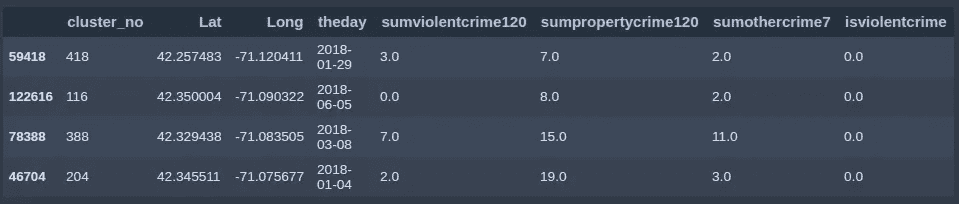**

**我们的训练数据。一些特征和目标变量:“isviolentcrime”**

*   **我们为我们的分类模型选择了一个阈值，使得 30%的预测是肯定的。**

**这意味着，如果对每个空间单元(在我们的例子中是分布在城市中的 500 个需求中心)的历史犯罪数据进行相应的汇总，警方就可以使用该模型来预测暴力犯罪。每天，警察可以运行这个模型，他们将得到大约 30%的聚类中心对暴力犯罪的积极预测。这相当于 500 个地点中的 150 个。**他们甚至可以订购那些贴有正面标签的区域**。排序将考虑相应的概率，从而优先考虑暴力犯罪的最危险区域。**

****

**比尔·牛津在 [Unsplash](https://unsplash.com?utm_source=medium&utm_medium=referral) 上的照片**

**凭借该模型的这一性能，警察只需巡逻 30%的区域，就可以捕获 70%的暴力犯罪。如果你分析历史犯罪数据，你会发现每天大约有 7 起暴力犯罪。根据我们的真实阳性率，警方可以预计每天大约有五起暴力犯罪。**

# **结论**

**预测整个波士顿市的暴力犯罪问题尤其具有挑战性。它不同于通常的需求预测问题:**

*   **通常的需求预测模型有固定的需求和供应中心。**
*   **需求是一个连续的特征，就像总销售额或总请求量一样。**

**在我们的案例中:**

*   **需求在城市中不断分布。需要聚类。**
*   **需求是一个分类特征。问题是那里是否发生过暴力犯罪。**
*   **而作为一个二元分类问题，我们的数据集是高度不平衡的。阳性标签只占 2%左右。这给建模和调整增加了额外的挑战。**

# **未来的工作**

**我们知道波士顿市有 12 个警察局/区。因此，我们可以尝试找到 12 个供应中心的最佳位置，以捕捉暴力犯罪的需求。**

**这个问题对应于[设施选址问题](https://en.wikipedia.org/wiki/Facility_location_problem)。实际上我已经用 Python 的优化包做到了。我的下一篇文章将介绍和实现这些包来解决一个线性优化问题。**

# **源代码和注释**

**我在我的 github repo 中分享了我的 Python 代码和准备好的数据[。](https://github.com/alptuzel/bostoncrimeprediction)**

# **参考**

**[1] G. Martegiani，L. Berrada，[利用数据分析进行犯罪预测:波士顿市的案例](https://www.academia.edu/25277353/Crime_Prediction_Using_Data_Analytics_the_Case_of_the_City_of_Boston) (2016 年)**

**[2] A .贾恩，[波士顿犯罪数据/ Kaggle 数据集](https://www.kaggle.com/ankkur13/boston-crime-data)，(2018)**

**[3]分析波士顿，[波士顿犯罪/卡格尔数据集](https://www.kaggle.com/AnalyzeBoston/crimes-in-boston)，(2018)**

**[4] G. Sharma，[出租车需求预测—纽约市—好观众](https://blog.goodaudience.com/taxi-demand-prediction-new-york-city-5e7b12305475) (2018)**