# 使用 FB-Prophet 进行需求预测

> 原文：<https://towardsdatascience.com/demand-forecasting-using-fb-prophet-e3d1444b9dd8?source=collection_archive---------10----------------------->


来源:维基百科，时间序列预测

## 实施简单有效的需求预测方法

预测未来需求是一个基本的商业问题，任何成功解决这一问题的解决方案都将在不同的商业领域找到有价值的商业应用。在零售环境中，实施需求预测方法来做出有关购买、供应、补货和财务规划的决策。应用于需求预测和供应的一些常见时间序列方法包括移动平均法、指数平滑法和 ARIMA。Kaggle 时间序列预测竞赛中最受欢迎的模型是梯度推进模型，该模型将时间序列数据转换为表格数据，时间序列中的滞后项作为“特征”或表格中的列。

脸书先知模型是 GAM(广义加法模型)的一种类型，专门解决商业/计量经济学-时间序列问题。我在这个项目中的目标是应用和调查脸书先知模型在需求预测问题上的表现，为此，我使用了卡格尔 M5 需求预测竞赛数据集并参加了竞赛。该竞赛旨在在产品商店层面生成 28 天前的积分预测。

该数据集涉及 3049 种产品的单位销售额，分为 3 个产品类别(爱好、食品和家居)和 7 个部门。这些产品在 3 个州(加利福尼亚州、德克萨斯州和威斯康星州)的 10 家商店销售。该图概述了产品的聚合级别。竞争数据由沃尔玛提供。


图 1:时间序列层次和聚合级别的分解[2]

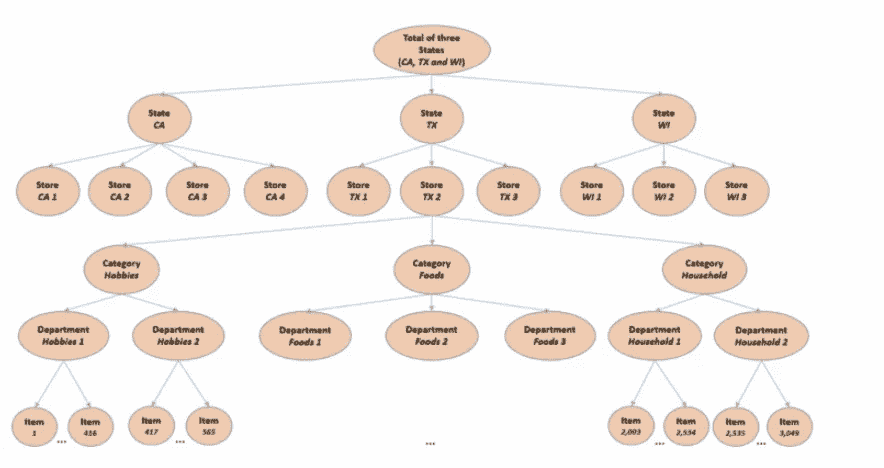

图 2:数据层次图[2]

来源:-[https://mofc.unic.ac.cy/m5-competition/](https://mofc.unic.ac.cy/m5-competition/)

## 数据描述

销售数据的数据范围是从 2011 年 1 月 29 日到 2016 年 6 月 19 日。因此，产品最多有 1941 天或 5.4 年的可用数据。(不包括 28 天的测试数据集)。

数据集分为日历数据、价格数据和销售数据[3]。

**日历数据—** 包含日期、工作日、月份、年份以及德克萨斯州、加利福尼亚州和威斯康星州的快照日等列。此外，该表通过其列 event_type1 和 event_type2 包含有关假日和特殊事件(如超级碗)的信息。节日/特殊活动分为文化、民族、宗教和体育活动[3]。

**价格数据**——该表由列组成——商店、商品、周和价格。它提供了某一周某一商店某一商品的价格信息。

**销售数据** —由验证和评估文件组成。评估文件包括额外 28 天的销售额，可用于模型评估。该表提供了特定部门、特定州和商店中特定商品的销售量信息[3]。

数据可以在链接中找到—【https://www.kaggle.com/c/m5-forecasting-accuracy/data 

## 数据分析和故事讲述

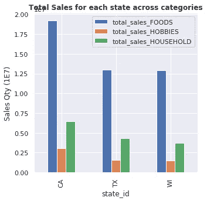

图 3:各状态下的销售数量

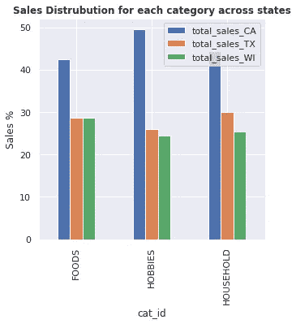

图 4:每个类别的销售额百分比

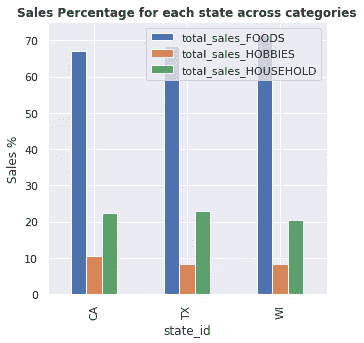

图 5:每个州的销售额百分比

从上面的图表中可以看出，在每个类别中，CA 的销售额最高，其次是 TX 和 WI。CA 贡献了约 50%的业余爱好销售额。这三个州的销售类别分布是对称的，在每个州按销售降序排列的最高销售类别是食品、家居和爱好。

## 价格数据分析

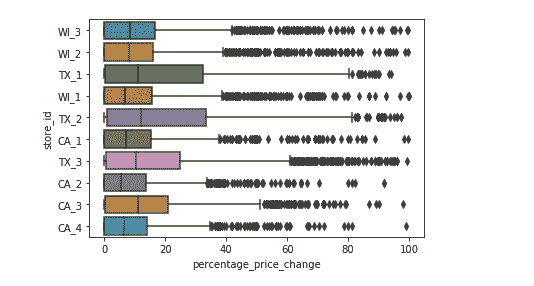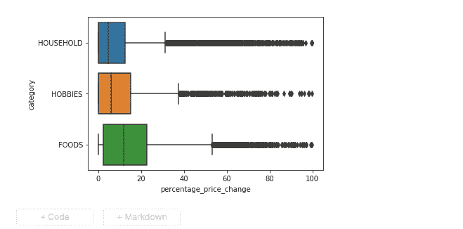

图 6:价格变化百分比= 100*(最高价格-最低价格)/最高价格

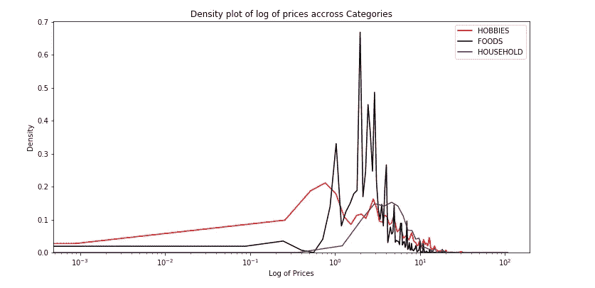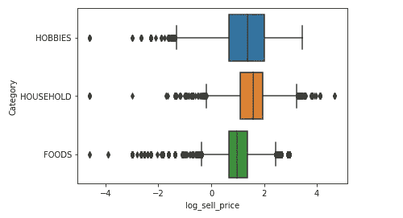

图 7:原木分布(售价)

上面的图表显示百分比价格变化是高度右偏的。对 sell_price 执行对数变换，使其分布更加对称。

## 快照日的影响

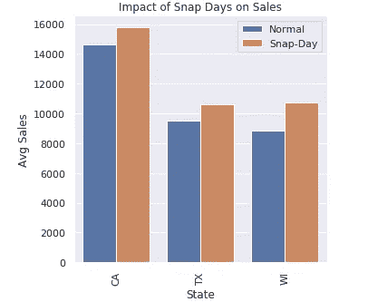

图 8:平均值。销售与快照日

上图显示，在所有 3 个州的抢购日都有较高的销售额。

## 调查销售数据的季节性

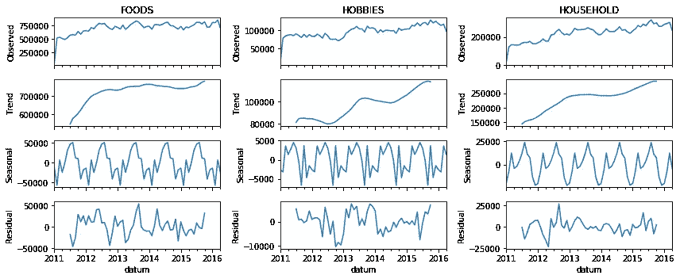

图 9:跨类别的时间序列分解

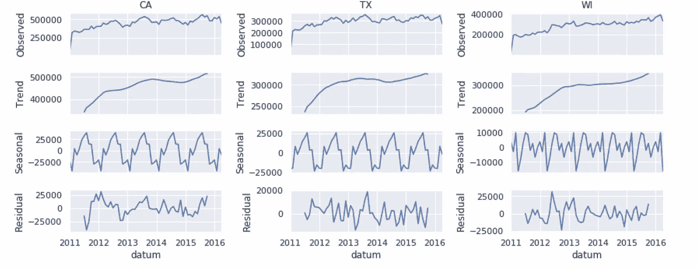

图 10:跨状态的时间序列分解

使用*stats models . TSA . seasonal _ decompose*函数对时间序列进行季节性分解。上面的图表显示了随着时间的推移，销售的线性增长(跨类别和州)以及季节性的影响。从 2014 年开始，线性在时间序列的后半部分尤为明显。在所有州和类别中都可以看到年度季节性。

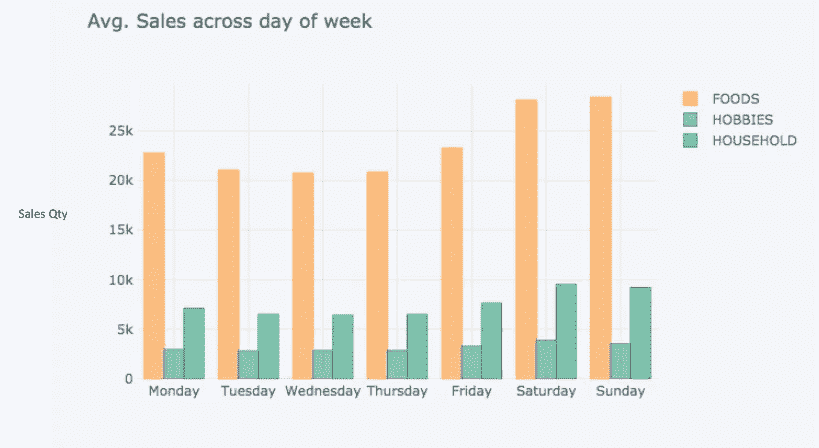

图 11:每周季节性:一周中各天的销售额

上图显示了所有 3 个类别的每周季节性。周末和周一的销售额比平日高。


图 12:月度季节性-当月各天的销售额

上图显示了不同类别的月度季节性。我们看到的模式是，销售额在月初很高，然后稳步下降，接近月底时再次回升。

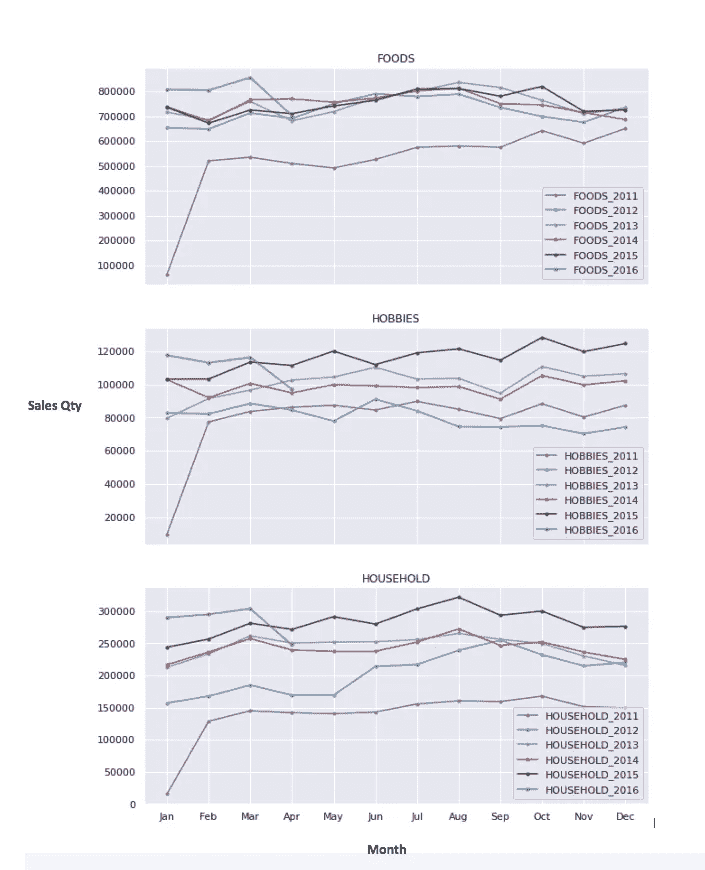

图 13:2011-2016 年不同类别的年度季节性

上面的图表显示了 2011 年至 2016 年各个类别的年度季节性。销售行为在每个类别中都是对称的，例如，2011 年的家庭销售额与 2012 年的家庭销售额相似，以此类推。这种历史数据在预测某个类别的年销售额时会很有用，例如，2011 年家庭销售额的数据在预测 2012 年家庭销售额时会很有用。

## 模型描述

对 Prophet 模型进行训练，并在产品商店级别进行预测。因此，30490 个不同的 prophet 模型在产品商店级别针对 30490 个不同的时间序列进行了训练。两年的训练数据和 28 天的预测/评估数据用于每个系列的模型训练和评估。最后 28 天的测试数据被 Kaggle 隐藏。下表显示了培训、评估和测试数据的划分-

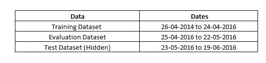

训练-评估-测试数据分割

在所有时间序列中尝试了两个模型—

**模型 1**

```
def run_prophet(id1,data):
    holidays = get_holidays(id1)
    model = Prophet(uncertainty_samples=False,
                    holidays=holidays,
                    weekly_seasonality = True,
                    yearly_seasonality= True,
                    changepoint_prior_scale = 0.5
                   )
    model.add_seasonality(name='monthly', period=30.5,   fourier_order=2)
```

**模式二**

```
def run_prophet(id1,data):
    holidays = get_holidays(id1)
    model = Prophet(uncertainty_samples=False,
                    holidays=holidays,
                    weekly_seasonality = True,
                    yearly_seasonality= True,
                    changepoint_prior_scale = 0.5
                   )
    model.add_seasonality(name='monthly', period=30.5, fourier_order=2)
    model.add_regressor('log_sell_price')
```

**模型 1** 由假期、周季节性、年季节性和月季节性组成。

**模型 2** 由以下部分组成——假期、每周季节性、每年季节性、每月季节性，此外还有回归变量 log_sell_price = log(sales_price)。假设每个 product-store 系列中的最新 sales_price 在 28 天的预测范围内保持不变，并用于预测未来的销售额。

脸书先知模型类似于 GAM(广义相加模型)，使用一个可分解的时间序列模型，该模型由三个部分组成——趋势、季节性和节假日——y(t)= g(t)+s(t)+h(t)+e(t)[4]。

**Growth g(t):** 默认情况下，Prophet 允许您使用线性增长模型进行预测。这里使用的就是这种模式[4]。

**节假日 h(t):——**先知考虑节假日影响。这里模拟的假日有宗教假日、文化假日、国家假日和快照日。Prophet 允许用户添加一个“上窗口”和“下窗口”,在假日日期前后扩展假日的效果。在当前模型中，0 天的上下窗口应用于快照日，1 天的上下窗口应用于其他节假日。Prophet 假设每个假日 D_i 是相互独立的[4]。

**季节性 s(t): —** 傅立叶级数用于模拟季节性影响。在下面给出的公式中，P 是正常周期(每周— 7 天，每年— 365.25 天)。拟合季节参数，需要拟合 2 N 个参数— beta = (a1，b1，… an，bn) [4]。

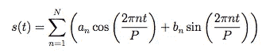

季节性傅立叶级数[4]

例如，对于年度数据，N = 10，季节分量 S(t)= X(t)*β

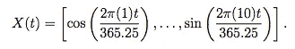

N=10 时的 x(t )[ 4]

平滑先验—beta～Normal(0，sigma)应用于 beta。增加傅里叶级数的项数 N 会增加模型的复杂性，并增加过度拟合的风险[4]。

**建模变点** : —几个变点的参数可以用超参数“changepoint_prior_scale”调整。这在 Prophet 中的变点参数之前施加了稀疏。增加这个参数可以增加模型的灵活性[4]。

## 实施多重处理和优化运行时

```
from joblib import Parallel, delayedsubmission = Parallel(n_jobs=4, 
                      backend="multiprocessing")(delayed(run_prophet)(comb_lst[i][0],comb_lst[i][1]) for i in range(30490))model.make_future_dataframe(periods=28, include_history=False)
```

FB Prophet 中的模型训练和预测比 ARIMA 模型或指数平滑模型需要更长的时间。由于我们在产品商店级别拟合模型 30490 次，因此有必要减少单个系列的运行时间，并将 30490 系列的训练和预测并行化。前者通过 1)在模型 1 &模型 2 中使用的 *Prophet()* 函数中设置“不确定性 _ 样本=假”来实现。这可防止为预测创建不确定性区间，以及 2)在用于模型预测的 *make_future_dataframe()* 函数中设置“include_history=False”(如上所示)，这可防止 Prophet 显示适合训练数据集的模型。

*joblib。Parallel()* 函数用于实现 30490 系列拟合和预测的多重处理，如上面的代码片段所示。

## 模型评估

使用三个指标评估点预测的准确性——RMSE、RMSSE 和 WRMSSE。度量 WRMSSE 是 Kaggle 在比赛中使用的评估度量。

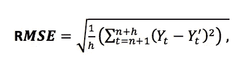

均方根误差

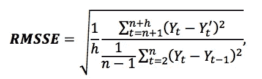

均方根标度误差

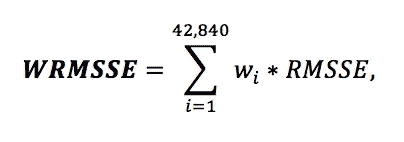

加权均方根标度误差

wi 是数据集中 42，840 个(包括如图 1 所示的各种级别的聚合)时间序列中每个时间序列的权重。权重是根据一段时间内该系列的累计美元销售额计算的。竞赛指南中给出了重量的更多细节—[https://mofc.unic.ac.cy/m5-competition/](https://mofc.unic.ac.cy/m5-competition/)

## 结果

模型 1 和模型 2 的性能如下所示。通过计算所有 30490 个产品商店时间序列的平均 RMSE 或 RMSSE 来计算平均 RMSE 和平均 RMSSE。可以看出，模型 2 中包含 log_price 提高了所有指标的性能。Kaggle 计算了隐藏测试数据集上的性能。

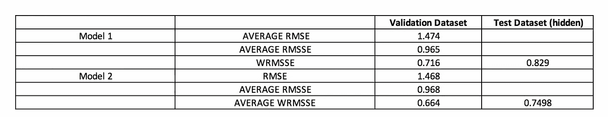

预测结果

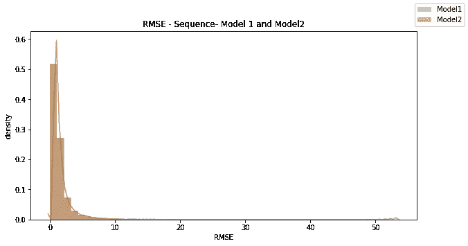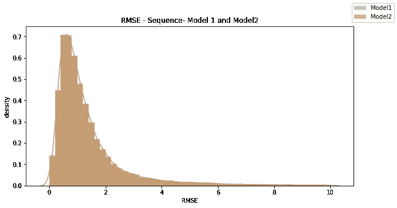

图 14:https://github.com/Ritvik29/Walmart-Demand-Prediction<10 (R)

The graphs above show the RMSE distribution of the 30490 product-store time-series. As can be seen, the distribution is heavily right-skewed. The performance of both models is similar across all RMSE levels. For more details on the code and implementation kindly refer the GitHub repository -[RMSE 分布(左)放大 RMSE 分布 RMSE](https://github.com/Ritvik29/Walmart-Demand-Prediction)

总之，FB- Prophet 中的季节性、变点、增长和假期等组件使其特别适合处理需求预测等商业时间序列问题。我建议分析师至少把 Prophet 作为建立需求预测模型的第一站。

## 参考

**【1】https://www.kaggle.com/c/m5-forecasting-accuracy 卡格尔 M5 预测—准确率竞赛**

https://mofc.unic.ac.cy/m5-competition/

****【3】https://www.kaggle.com/c/m5-forecasting-accuracy/data 卡格尔 M5 —精准预测竞赛数据****

****【4】泰勒·勒瑟姆(2017)，《规模化预测》**[https://peerj.com/preprints/3190/](https://peerj.com/preprints/3190/)**

****【5】FB prophet—quick start**[https://Facebook . github . io/prophet/docs/quick _ start . html # python-API](https://facebook.github.io/prophet/docs/quick_start.html#python-api)**