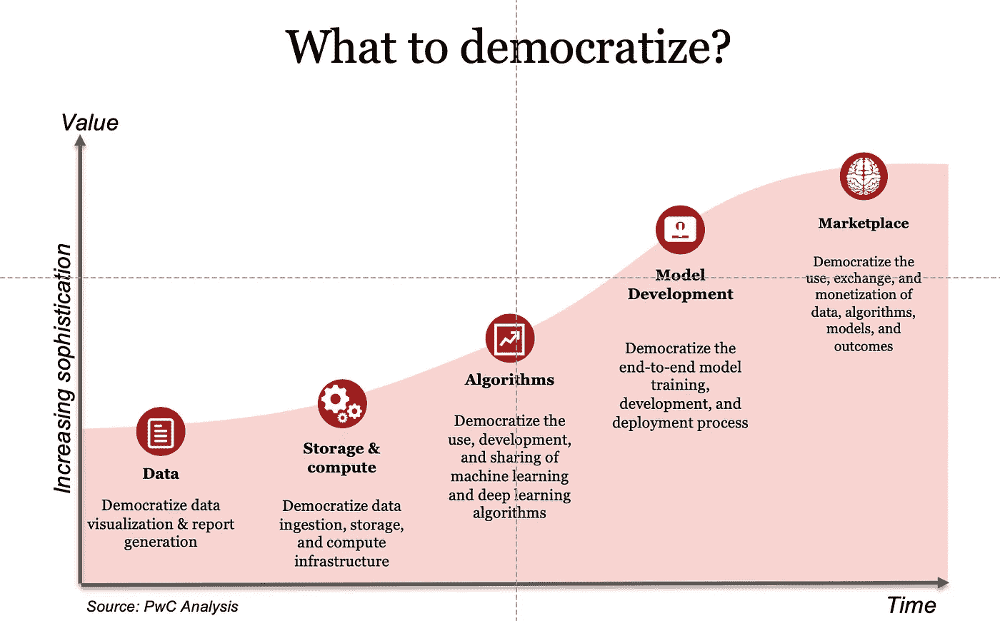
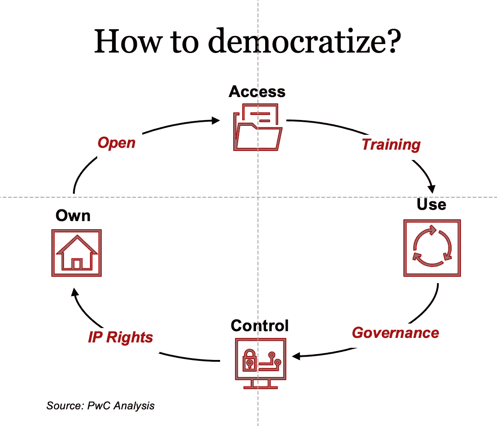
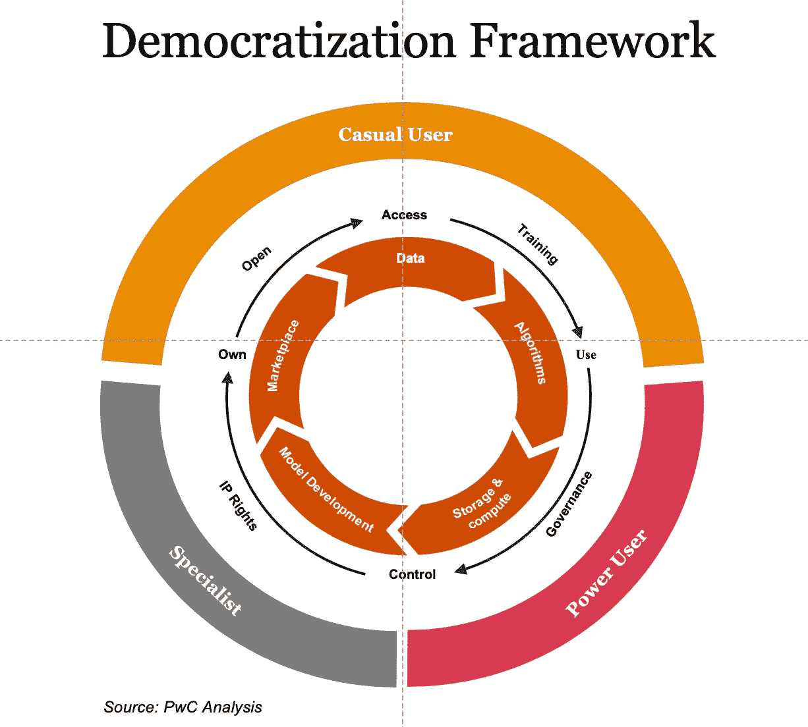

# 人工智能民主化

> 原文：<https://towardsdatascience.com/democratization-of-ai-de155f0616b5?source=collection_archive---------11----------------------->

## 双刃剑

当公司领导人谈论民主化人工智能(AI)时，不难想象他们的想法。越多的人能够接触到构建人工智能系统所需的知识、工具和数据的原材料，必然会出现越多的创新。效率提高，参与度增加。面临技术人才短缺？微软、亚马逊和谷歌都发布了预制、拖放或无代码的人工智能工具，允许人们将人工智能集成到应用程序中，而无需知道如何建立机器学习模型。

但随着公司走向民主化，一个警示故事正在浮现。即使是由高度合格的工程师设计的最复杂的人工智能系统，[也可能成为偏见](https://www.strategy-business.com/article/What-is-fair-when-it-comes-to-AI-bias)、可解释性问题和其他[缺陷](https://www.pwc.com/gx/en/issues/data-and-analytics/artificial-intelligence/what-is-responsible-ai.html)的牺牲品。由没有经过适当培训的人构建的人工智能系统，或者在没有适当控制的情况下运行的人工智能系统，可能会产生非常危险的东西——引入歧视或严重错误。更糟糕的是，问题可能直到系统实施后才变得明显，让公司争先恐后地安抚利益相关者，消除损害，修复技术。

这并不是说 AI 的民主化不是没有价值。让这些新技术变得更容易获得和负担得起，扩大了企业和政府所能实现的可能性，并刺激了竞争。例如，与抗击 COVID19 相关的数据集、模型、论文和研究已经[开源](https://github.blog/2020-03-23-open-collaboration-on-covid-19/)，使大型全球社区能够进行协作。公司领导人的关键是避免被宣传冲昏头脑，而是专注于确定他们到底要民主化什么(是简单的东西，如数据可视化，还是复杂的东西，如模型开发？)，用户是谁(新手还是专家)，以及他们的组织如何通过适当的培训和治理来最大化收益，同时管理或减轻风险。

## 技术领域——民主化什么？

发布人工智能和机器学习(ML)产品的技术供应商需要从确定他们的工具或平台将民主化价值链的哪个或哪些部分开始。在这里，考虑一个范围(见下面的图 1)是有帮助的，在这个范围内，工具和模型变得越来越复杂，并产生更大的价值。

一方面是数据，将数据接收到数据仓库和数据湖中。人工智能系统，尤其是人工智能，运行在大量的结构化和非结构化数据上——这是你可以从中产生见解、决策和结果的材料。在其原始形式中，它很容易民主化，使人们能够进行基本的分析。许多技术提供商已经创建了数据浏览器，帮助用户搜索和可视化公开可用的数据集。

接下来是数据输入的算法。在这里，随着数据投入使用，价值和复杂性都在增加。在这一点上，民主化还是比较容易实现的，事实上算法是广泛可及的。像 GitHub 这样的开源代码库在过去的十年里有了显著的增长。2018 年 11 月，有超过 [1 亿个代码库](https://venturebeat.com/2018/11/08/github-passes-100-million-repositories/)，其中相当一部分与人工智能相关。理解算法需要对计算机科学有一个基本的了解，并有一定的数学或统计学背景，才能理解算法的作用。

随着我们继续向存储和计算平台发展，复杂性也在增加。在过去的五年里，人工智能的技术平台随着亚马逊网络服务(AWS)、微软 Azure 和谷歌计算平台三大人工智能/人工智能提供商转移到了云。这使得中央处理单元和图形处理单元(对训练相当大的深度学习模型至关重要)可以在按需付费的基础上供最终用户使用，大大降低了准入门槛。然而，尽管算法是硬件不可知的(例如，它们通常可以在任何硬件或云平台上运行)，但云存储和计算平台需要技术供应商(亚马逊、微软或谷歌)的特定培训和认证。

现在我们来看模型开发。模型解决具体问题:有的成为推荐引擎，有的成为面部识别，等等。在这里，我们看到了使用自动化平台和工具的民主化。例如，自动化接收各种数据格式(结构化、半结构化和非结构化)的能力，以及在同一数据集上运行多种算法并选择最佳算法集合的能力，使模型开发过程变得更容易(也更快)。但是，如果用户没有经过适当的培训，则很有可能在模型中产生偏见，无法解释模型的结果，甚至做出错误的决策。

最后，在光谱的远端，我们正处于创建数据、算法和模型市场的早期阶段。对于问题和能够解决这些问题的人才，也有一个新兴的市场。Kaggle 创建于 2010 年，于 2017 年被谷歌收购，是数据科学或人工智能市场最知名的例子之一。奖金丰厚的数据科学挑战赛，如卡格尔·网飞电影推荐挑战赛，让世界上任何地方的任何人都可以参与竞争并展示他们的技能。随着我们在这些市场中筛选数据、算法和模型，曲解它们并将其应用于错误环境的风险会显著增加。在这种情况下，系统滥用模型的危险将会增加。

图 1:民主化什么？

## 了解你的用户——为谁民主化？

设计一个人工智能系统需要广泛的技术知识和对数据科学的牢固掌握。就像你希望确保一名外科医生合格、训练有素并有手术室经验一样，人工智能系统应该由拥有扎实技术功底、了解人工智能系统关键组件并致力于负责任的人工智能的人来设计、测试和维护。

供应商经常发表笼统的声明，称他们已经通过创建拖放工具使数据接收、数据清理和数据挖掘民主化。或者他们通过自动化整个机器学习或数据科学过程，使复杂的统计和计算模型开发民主化。但是谁在使用这些工具和模型呢？他们是否接受过适当的培训——不仅是在工具方面，而且在基本概念方面？

在一个例子中，一个已经广泛使用拖放工具的组织的商业用户建立了一个机器学习模型，而没有留出数据样本用于验证和测试。因为模型过度符合训练数据，所以报告的模型准确性是有缺陷的。如果部署了该模型，可能会导致重大的财务损失。

AI 民主化的受益者存在于三大类——****高级用户******专业开发者*** 。临时用户和专业开发人员处于相反的极端，而高级用户介于两者之间；后一组比临时用户更有知识，训练有素，但不是专家水平。商业用户通常是临时用户；他们既没有接受过模型背后的统计和数学概念方面的广泛培训，也没有接受过建立模型所需的具体过程方面的培训。专业开发人员或数据科学家通常具有很强的资格或适当的认证。*

*公司需要确定他们的各种计划针对的是这三个类别中的哪一个。例如，当我们使数据可视化大众化时，我们使所有三种类型的用户能够快速创建各种各样的可视化，只需很少或不需要编程——这是一个低风险的提议。然而，当我们说我们正在使模型开发民主化时，我们是在为专业数据科学家做这件事，让他们能够运行不同的算法，评估它们，并选择正确的模型集合吗？或者，我们是不是也在尝试为临时用户和高级用户普及它？如果是后者，就需要格外小心。*

## *民主化的好处——为什么要民主化？*

*人工智能的民主化提供了三个主要好处。首先，它降低了个人和组织开始尝试人工智能的门槛。他们可以利用公开可用的数据和算法，开始尝试在云基础设施上构建人工智能模型。世界上任何地方的个人，只要很少或没有金融投资(可能只是接入互联网)，就可以进入令人兴奋的人工智能世界。他们不仅可以学习人工智能，还可以解决 Kaggle 等市场中的重要问题，以获得重大奖励。*

*其次，随着程序员和用户社区开始使用和扩展数据、算法和工具来构建更强大的解决方案，民主化降低了构建人工智能解决方案的总成本*。民主化的开放性也有助于培养必要的人才。在民主化中，数据或算法可以免费提供给其他人。ImageNet 的管理和使其公开提供定义的性能指标帮助许多研究人员建立了更快、更准确的模型。开源深度学习框架的可用性，如 Caffe、TensorFlow、PyTorch 等，极大地促进了有才华的深度学习专家数量的增长。因此， ***减少了人才发展的时间*** 也是民主化的一个显著好处。**

**所有这些方面都在增加学术和商业世界采用人工智能的速度。自然语言处理的各个方面，如从文本文档中分析和提取结构化信息、分析来自社交媒体或呼叫中心的客户情绪、使用对话界面或聊天机器人，正在成为常见的商业应用。同样，使用机器学习和深度学习来获取见解、识别或分类数据、自动化任务或增强人类决策也变得越来越普遍。**

## **民主化的价值杠杆——如何民主化？**

**当前围绕民主化的大部分努力都集中在 ***访问*** 数据、算法、存储、计算、模型开发和市场。然而，我们需要超越仅仅使人工智能的访问民主化，转向民主化的许多价值驱动因素，这些因素可以确保人工智能不被滥用，还可以提高整体价值(见图 2)。**

**对人工智能不同组成部分的访问需要是负担得起的——在某些情况下，如开放数据倡议或通过 GitHub 共享算法——甚至是免费的。超越 ***实惠接入*** 以上每一层都需要 ***好用*** 。如果每个人都需要编写 SQL 查询来访问数据，或者理解线性代数和微分方程，以便能够使用一些算法，那么很难说我们已经使人工智能民主化。**

**民主化进程的下一步是能够用 ***控制*** 堆栈中的不同元素。例如，如果在一个层(比如计算平台)中提供服务的技术供应商坚持他们将在有空闲周期时运行计算，并限制您可以从他们的平台之外获取的内容，民主化就变得不那么有用了。为了让人工智能真正民主化，用户需要控制他们运行什么，何时运行，以及如何使用运行的结果。**

**超越控制 ***所有权*** 的概念需要解决。数据是由生成数据的组织/人员、处理数据的组织还是从中获取见解的组织/人员所有。所有权真的可以在多方之间分割吗？我们能让区块链调解或分配所有权的概念吗？这些都是在寻求民主化过程中有待解决的悬而未决的问题。**

**访问、使用、控制和所有权是越来越多的价值杠杆，使人工智能民主化的供应商，以及寻求从人工智能中受益的用户和企业都需要考虑。这些价值杠杆的另一面是与民主化相关的风险。最初提供免费访问以获取市场份额或获取数据，然后收费或使用数据来加强模型和货币化数据是一种成熟的商业模式。明确这一点，并为数据的 ***使用*** 提供安全保障，对于建立消费者的信任大有帮助。**

**其次，如果一个人提供免费使用数据，算法，模型等。，但不要对临时用户或高级用户进行有关获取数据的环境、开发模型的假设或解释模型结果的必要数学的培训，结果可能是灾难性的。在过去的几年中，已经有许多记录在案的误用模型的实例，甚至是由专家构建的模型，例如，机器学习模型中的数据偏差、恶意攻击等。如果没有关于算法和模型的使用和解释的培训，这种现象只会增加。**

****

**图 2:如何民主化？**

## **将所有这些结合在一起——民主化框架**

**设计一个人工智能系统需要广泛的技术知识和对数据科学的牢固掌握。正如你希望确保一名外科医生合格、训练有素并在手术室有丰富的经验一样，人工智能系统应该由拥有扎实技术功底、了解人工智能系统关键组件并致力于负责任的人工智能的人来设计、测试和维护。**

**需要采取四种不同的行动(见图 3)来确保一个人从不同的价值层次——获取、使用、控制和所有权——中获得民主化的全部好处。同时避免误用、滥用、偏见和其他问题。领导者需要采取五项行动:**

****1。培训。在人工智能开发和实施方面缺乏足够的培训可能是灾难性的——特别是在涉及到处理人们健康或财务福祉的系统时。例如，如果不经意或未经训练的用户不理解将数据分成桶用于训练、验证和测试的重要性，他们很容易以产生不准确或意外结果的人工智能而告终。如果我们想从仅仅提供访问权限转向刺激这些工具的使用，那么培训具有适当数据科学基础的临时或高级用户对于安全使用人工智能至关重要。****

****2。治理。**公司领导人需要明确输入人工智能平台的数据的所有权和控制权，以及权利与所产生的洞察力之间的关系。当为特定的 AI/ML 程序收集数据，然后用于不同的应用程序时(开源数据湖可能就是这种情况)，很容易看不到数据的来源、收集数据的目的、修改数据的方式以及如何(或是否)适当地保护数据。“影子人工智能”(Shadow AI)，即使用数据创建的人工智能，而这些数据不是由组织内负责确保数据完整性的团队管理的，也是一个令人担忧的问题。为了最小化风险，AI/ML 模型应该使用被监控、保护和理解的数据来构建。**

**组织通常将数据治理作为公司合规活动的一部分，但很少有人像应有的那样密切监控 AI 系统中涉及的其他元素。控制需要到位，以确保模型的开发具有适当的成功或验证指标(准确性、公平性、可解释性的平衡)，以避免开发和部署结果有偏差或不容易解释或理解的 AI 模型。**

****3。知识产权。如果不决定谁拥有知识产权，民主化的预期好处可能无法实现。许多公司拒绝使用云平台进行图像处理或音频处理，因为他们担心机密信息会在他们的四面墙之外被处理，而云解决方案提供商正在使用并受益于从他们的数据中产生的重要见解。随着越来越多的公司意识到民主化的全部力量来自他们的数据(以及他们竞争对手的数据)，而不是来自工具和平台本身，他们可能会要求某种程度的知识产权。****

****4。开源。**要实现民主化，需要所有政党在不侵犯隐私、保密和竞争动态的前提下，公开他们所做的事情。如果不能完成从所有权到使用权的循环，基本上会造成一种单向流动，一些参与者——通常是资金充裕的大公司或政府——将在短期内从民主化中受益，但那些资源较少的人将被抛在后面。**

****

**图 3:民主化框架**

**可以肯定的是，让人工智能变得更容易获得和负担得起是有好处的。这样做扩大了企业和政府通过让实验变得更容易而实现的可能性。总的来说，[开源运动](https://www.digitalpulse.pwc.com.au/openness-movement-age-transparency/)刺激了竞争，使得质量和客户体验成为最终的赢家。**

**在一个[开源](https://www.digitalpulse.pwc.com.au/openness-movement-age-transparency/)越来越普遍，技术专家和早期采用者都渴望降低门槛以追求进步的世界里，让人工智能民主化的想法似乎是一个好主意。事实上，如果我们不能从彼此的人工智能项目中学习，我们就有可能创造一个单向流，让一些参与者——通常是拥有充足资金的大公司或政府——受益，而那些资源较少的人被抛在后面。正如世界经济论坛人工智能和机器学习负责人 Kay Firth-Butterfield [最近写道](https://www.thenational.ae/opinion/this-is-the-teaching-moment-for-artificial-intelligence-1.924438)，人工智能的长期成功取决于“协作的敏捷性、数据的多样性和完整性以及风险评估的准确性。”**

**但是，允许拖放或新手创建人工智能模型的技术，特别是在极端情况下，对问题的严重性是不公平的。当训练有素的数据科学家在创造道德和负责任的人工智能时会遇到困难，将鲁棒性的负担放在未经训练的人身上是不公平的，也有潜在的危险。通过承认真正民主化可能带来的负面影响，工业界可以探索确保任何可能的风险都不会被打开的标准和准则。通过使人工智能透明并建立治理，可以将其从“黑箱”中移除，并[产生信任](https://www.strategy-business.com/article/The-Future-of-Artificial-Intelligence-Depends-on-Trust)。因为如果人们不信任 AI，它就不可能真正进步。**

**通过承认 AI 民主化可能带来的负面影响，行业可以探索确保创新与安全实施齐头并进所需的标准和指南。通过使人工智能透明并建立治理，它可以从其“黑箱”中取出，并可以[产生信任](https://www.strategy-business.com/article/The-Future-of-Artificial-Intelligence-Depends-on-Trust)。**