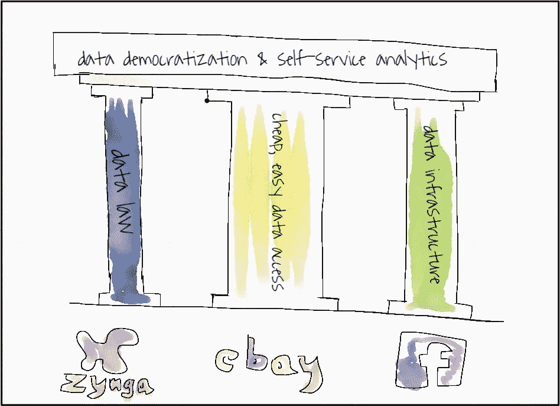
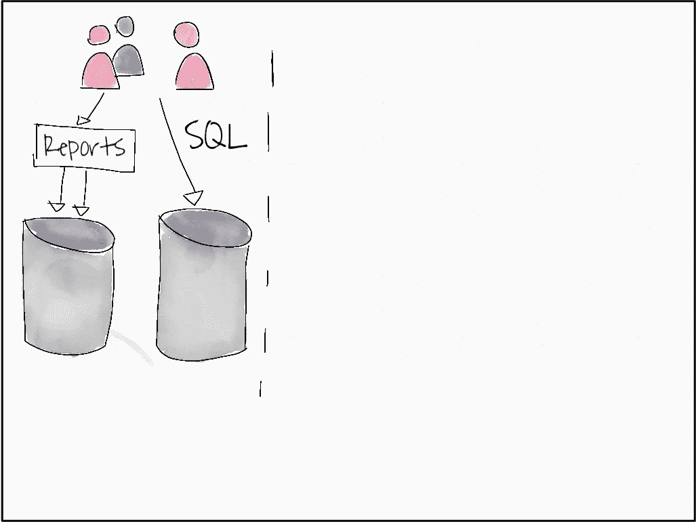
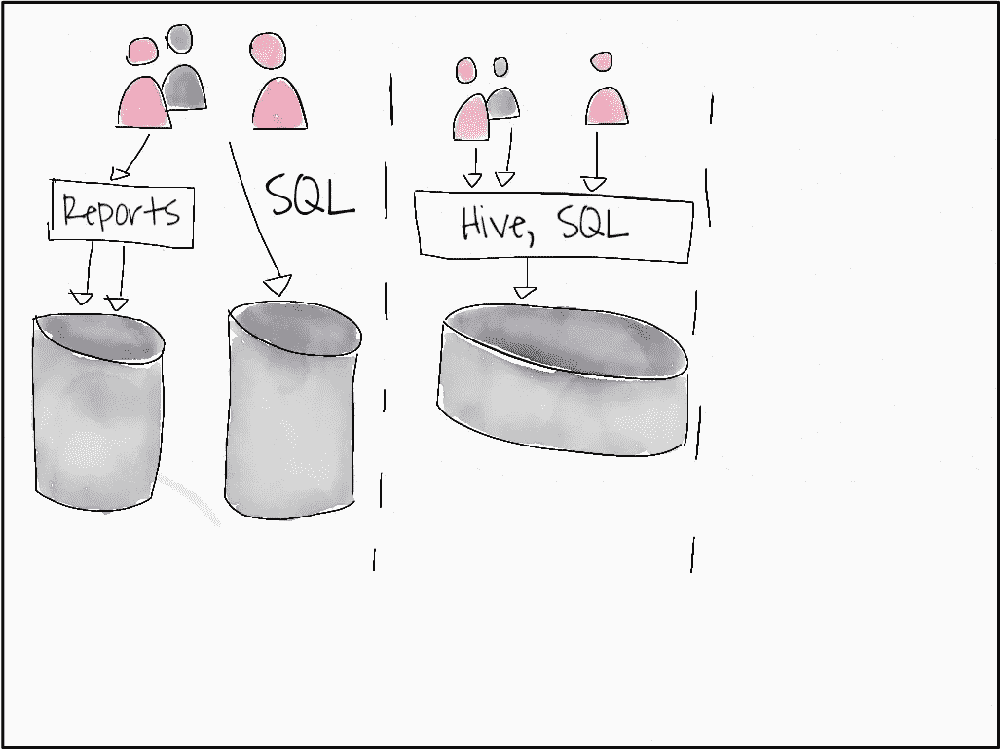
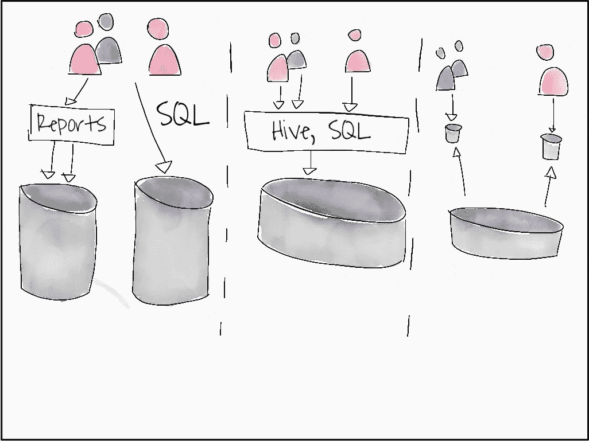

# 像 Zynga、脸书和易贝一样将数据民主化

> 原文：<https://towardsdatascience.com/democratize-data-like-zynga-facebook-and-ebay-do-b15a7325c54a?source=collection_archive---------21----------------------->

*数据民主化的三大支柱&自助服务分析。Zynga 的数据法，易贝的廉价易得，脸书的数据基础设施。(所有图片由作者提供)*

多年来，Zynga、脸书和易贝一直在民主化他们的数据，让他们公司的每个人都可以访问和轻松使用这些数据。[数据民主化](https://www.alation.com/what-is-data-democratization/)是自助服务分析的基础，所以让我们看看您如何也能做到这一点。

这三家公司对他们的流程都非常开放，所以我们可以看到，尽管他们选择了*三种不同的技术架构*，但他们都遵循**相同的流程来实现基于三大支柱**的自助服务分析的数据民主化。

这三大支柱分别是“**数据法**”、“**数据基础设施**”和“**廉价数据访问**”。

在本文的最后，您将有一个三大支柱的蓝图，以及三个清单来指导您的数据民主化工作。

但是在我们深入所有的技术术语之前，*让我们回到 150 年前，回到巴黎…*

***关于污水的寓言***

1870 年一个温暖阳光的日子，尤金·贝尔格兰德沿着巴黎的塞纳河散步。阳光明媚的日子是可爱的，但不是在 1870 年的巴黎。1870 年，塞纳河是 180 万巴黎人的“厕所”。它一定很难闻。但更糟糕的是，霍乱和伤寒刚刚开始席卷整个城市。

贝尔格兰德心想一定有更好的办法。

因此，他和他同时代的人，奥斯曼将军以及所有其他聪明的法国人决定着手解决污水问题。

*首先，他们通过了一项法律；法律规定它不再被允许倒入塞纳河，因为这是霍乱传播的主要原因之一，嗯，还有气味。*

然而，人们开始在街上倒空家中的厕所，这让事情变得更糟。

贝尔格兰德和其他人意识到他们不能强迫人们保持卫生。他们需要给他们提供一个合适的方法。所以，他们建立了一个基础设施。而且是巨大的。贝尔格兰德在巴黎修建了 600 公里的下水道，有效地给每个人提供了放置一次性用品的地方。

但即使这样还不够，变化只是慢慢来的，人们仍然有“简单的出路”，仍然只有富人有连接到这个庞大污水系统的厕所。他们意识到，他们的最后一步将是使这种 ***像清空街道上的*** *一样容易和便宜。所以他们降低了下水道和厕所的价格，并开始教育人们。*

因此，到 1914 年，68%的家庭有了下水道，从接近 0%上升到现在。人们不再死于霍乱和伤寒，巴黎繁荣了。

快进 150 年…贝尔格兰德和其他人发现的三大支柱是:

*   法律，或者用现代术语来说**激励**人们做出正确的选择**并就此教育**他们。
*   **基础设施**，给了他们所有的可能性。
*   的轻松，使**访问**尽可能的**容易**和**便宜**。

让我们看看今天的科技公司如何构建这三大支柱来支持他们的数据民主化和自助式分析工作。

## **Zynga 和数据法**

Zynga 成立于 2007 年，是 FarmVille 和许多其他非常成功的手机游戏背后的公司；2018 年，他们的收入接近 10 亿美元，净收入 1500 万美元，员工接近 2000 人。

在他们 12 年的公司历史中，他们引入了一种数据驱动的崇拜，将数据作为 Zynga 每一项决策的核心。

Zynga 致力于为每一款游戏分析和设计实验。跟踪点必须是他们构建的每个新应用程序的一部分。Zynga 甚至开发了一个名为 **ZTrack** 的系统，能够追踪用户如何与游戏互动。

通过这些工具，Zynga 能够改变整个游戏的方向，就像他们对 FarmVille 所做的一样。

那么在 Zynga，人们实际上是如何访问这些数据来做出决策的呢？

Zyngas 架构特点[两个重要决策](https://www.oreilly.com/data/free/files/building-data-science-teams.pdf):

*   它们为特定的 SQL 访问提供专用的“服务”。他们只是简单地复制了公司中任何人都可以访问的所有数据，提供了一套不同的数据保证，没有运营数据那么严格。
*   它们至少提供两种类型的访问，面向所有人的专用 SQL 访问，以及计划报告和商业智能工具。

示意性地，访问看起来像下面的图片。

*终端用户有两种途径来访问数据。一条路径是通过某个组件，即某个报告功能，然后访问其中一个数据库。第二条路径是对另一个数据库的特定直接 SQL 访问。*

**Zynga 和“数据法则”的浓缩:**

*   基于数据的决策被灌输到公司的**价值观**中。
*   每一个**产品决策都具有** a **假设**，A/B 测试以及**测量**它的可能方式。
*   **不通过**实施**跟踪**来了解如何进一步开发该产品，就不会开发出任何产品。

让我们转向一家大得多的公司，看看他们有什么不同。

## **脸书和数据基础设施**

当脸书选择如何建立他们的数据仓库时，他们决定走稍微不同的方向。Zynga 的数据是海量的，所以脸书选择建立一个巨大的 Hadoop 集群，让公司的每个人都能访问这个 T21。

意识到这种规模的访问是一个问题，不是简单地提供访问并说“*你必须使用数据*就能解决的。facebook 做了 Belgrand 做的事情，他们开始建立基础设施。

今天，脸书有一个完整的部门，其中充满了数据基础架构团队。数据工程师在技术团队中工作，支持产品决策，整个部门帮助公司做出更好的决策。

但是回到 2007-2009 年，facebook 之前存储数据的方法碰壁了。所以他们决定转向 Hadoop。在此之前，数据是一个 SQL 查询，但现在它要复杂得多。

非技术用户无法访问这些数据，所以脸书决定采取行动。

脸书开发了 Hive，给用户一个类似 SQL 的界面，即使非技术用户也可以使用。现在，通过这个基础设施，就像下水道系统一样，每个人都可以轻松地访问所有的数据。

如果你比较访问架构，它与 Zynga 略有不同，但它在 Facebooks 规模上提供了类似的好处。它可能看起来像这样。

*与第一种模式不同，第二种模式有一个主要界面，可以将非技术性的最终用户问题转化为技术性问题，这些问题可以在公司拥有的所有数据中运行。*

**Facebook 和“数据基础设施”的浓缩:**

*   访问数据应该像问一个问题一样简单。这就是“SQL”所提供的。
*   非技术人员应该能够访问大部分或全部数据。脸书的基础设施能够访问所有的 Pb 级数据，不仅仅是一小部分，而是全部。就像巴黎 600 公里的污水。

贝尔格兰德和他的朋友们最重要的一步，在几年内将污水的采用率从 1%提高到 68%，是使*变得便宜和容易。我们看到的最后一家公司正是这样做的。*

## **易贝和廉价数据访问**

多年来，易贝一直致力于让每个人都能廉价、便捷地获取数据。

他们经历了一系列步骤，尽可能方便地访问数据。

易贝选择的建筑又是一个不同的建筑。易贝集中收集数据，然后为每个团队提供一个“桶或立方体”和他们的数据。这种方法从一个"[Datensparsamkeitsperspektive](https://martinfowler.com/bliki/Datensparsamkeit.html)开始就很棒，并且使得把" [*数据转换靠近最终用户*](/data-mesh-applied-21bed87876f2) "成为可能。

*与前两种模式不同，第三种模式认识到不同最终用户群之间的数据需求可能会有很大差异。因此，终端用户拥有自己的小数据“集市”，他们可以直接访问，也可以通过他们选择在组中使用的任何工具访问。*

为了让人们使用数据，他们需要知道数据在哪里。易贝只是从一个维基开始，解释什么是与元数据仓库相结合。

然后他们添加了图片，展示了数据是如何连接的，标记了数据，并把整个系统变成了一个产品叫做“**数据中枢**”。一个查找数据的中心位置。

但是他们并没有就此止步，2015 年他们的**最先进的数据民主化平台**功能:

*   作为元数据目录，
*   讨论板，以及拥有数据并了解数据的团队的链接，
*   与元数据存储库相结合的 SQL 助手，

使其成为检查数据的无缝体验。易贝提供[全程幻灯片](https://de.slideshare.net/HadoopSummit/extreme-analytics-ebay-63926961)。

**易贝的廉价和简单的数据访问方法压缩:**

事实证明，facebook 所遵循的可以被理解为在*数据网格*方法中使用的属性的“ [**数据列表**](https://martinfowler.com/articles/data-monolith-to-mesh.html) ”。适用于易贝的标准是:

*   使**数据对每个人都是可发现的**；易贝通过提供像“数据中心”或 Alation 这样的中心工具做到了这一点。
*   使**数据可寻址**；易贝通过在其元数据存储库中的一个中心位置提供连接信息来做到这一点。
*   使**数据可信**；易贝通过提供知情人士的姓名、数据的 SLA 等等来做到这一点。
*   使其**自描述**；易贝通过提供适当的元数据做到了这一点。
*   使**互操作**；易贝通过提供 SQL 帮助做到了这一点，并把一切都建立在 SQL 之上。
*   确保**安全**。

很好，我们现在有三个支柱，每个支柱都有一个清单。现在怎么办？

## 你从哪里开始？

你从瓶颈所在开始。

这些柱子很好地反映了正在发生的事情。如果你还没有屋顶，你可以从任何地方开始。你可以提供三块短木头来支撑一个轻型铁皮屋顶。

但是如果你想支撑一个完整的石头屋顶，你就必须在所有的三根柱子上下功夫，一次又一次地使它们变得坚固。

在你让**公司做出基于数据的快速决策的过程中，这三个支柱都可能成为瓶颈。**

如果没有人知道如何做出基于数据的决策和编写 SQL，你就需要研究“数据法则”，对人们进行这方面的教育，在产品中建立跟踪等等。这就是为什么 Zynga 非常重视它，也是为什么 Spotify 有整个团队为特定产品做基于数据库的决策。

如果人们不能以一致的方式访问数据，就没有人能获得数据来做出基于数据的决策。Zynga 似乎还不是这种情况，因为它使用了多个数据库，所以这不是它们的瓶颈。但对于像网飞这样的公司来说，情况似乎就是如此。[网飞开发了一个名为 Metacat](https://medium.com/netflix-techblog/metacat-making-big-data-discoverable-and-meaningful-at-netflix-56fb36a53520) 的工具来解决这个问题，并提供一个统一的基础设施。

最后，如果访问数据不够容易，人们将无法及时获得数据，从而无法做出基于数据的快速决策。

因此，你必须关注这三个方面，从一个瓶颈到另一个瓶颈，以便在你的公司做出比以往更好更快的决策。

## 我必须给他们直接的临时 SQL 访问权限吗？

不要！尽管 Zynga、脸书和易贝显然是这样做的，但这实际上是你的具体组织如何运作的问题。通过提供一个中央数据湖，提供一个中央商业智能工具，并教育人们如何使用它，你的瓶颈可能会得到解决。

但是上面的三个支柱依然存在，每个支柱的详细计划都符合你所能想到的最集中的架构，就像它符合你所能想象的最分散的架构一样。

## **更多资源**

下面链接的所有资源都为本文提供了信息。

*   看看[巴黎下水道系统](https://en.wikipedia.org/wiki/History_of_water_supply_and_sanitation)的真实故事，也许还有可爱的[巴黎博物馆](https://en.parisinfo.com/paris-museum-monument/71499/Musee-des-egouts-de-Paris)。我喜欢它！
*   易贝现在使用 alation 作为元数据和 SQL 完成工具，他们与易贝就数据治理和自助服务分析进行了[会谈](https://www.alation.com/blog/resource/customer-video-ebay-session-governed-self-service-analytics-2/)。
*   [此幻灯片分享](https://de.slideshare.net/HadoopSummit/extreme-analytics-ebay-63926961)提供了易贝案例的大部分背景，以及[这篇关于易贝](https://tech.ebayinc.com/engineering/how-ebay-governs-its-big-data-fabric/)数据治理的文章。
*   最后，[DJ Patil 的这本短文](https://www.oreilly.com/data/free/files/building-data-science-teams.pdf)提供了这三个案例的背景。