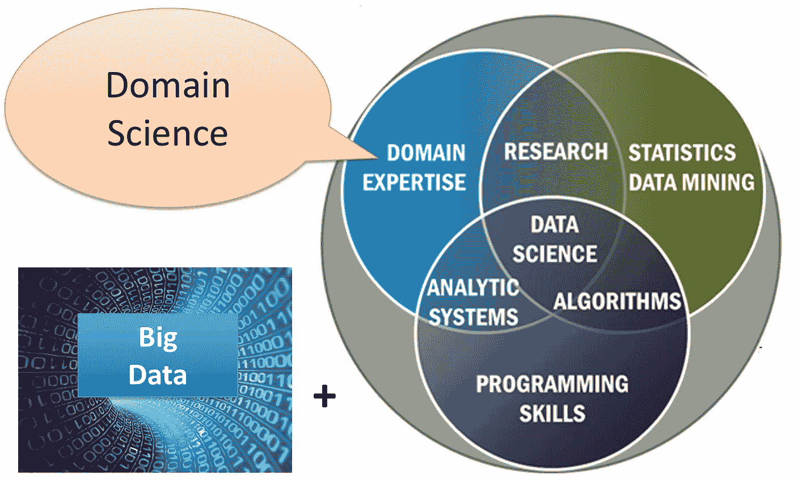

# 使数据科学民主化

> 原文：<https://towardsdatascience.com/democratize-data-science-516f7aa6f50a?source=collection_archive---------80----------------------->

## 数据科学/观点

## 学习一些基本技能可能会让你成为一名数据科学家！

伊尔哈姆·拉赫曼萨在 Unsplash 上的照片

偶尔，我会看到一篇文章，谴责在线数据科学课程和训练营是获得数据科学工作的途径。大多数文章的目的不是打击，而是提醒我们先照照镜子，意识到我们面临的是什么。然而，一些批评者宣称，这些在线课程和训练营的激增导致了该行业的退化。

*对于后者，我坚决不同意。*

# 弥合技能差距

自从《哈佛商业评论》将数据科学家称为[21 世纪最性感的工作](https://hbr.org/2012/10/data-scientist-the-sexiest-job-of-the-21st-century)以来，数据科学就抓住了大众的想象力。七年多后，数据科学仍然是当今最受欢迎的就业市场之一。事实上，由于供需动态，“预计到 2024 年，仅美国就将面临约 25 万数据科学家的缺口。”

因此，资本主义和企业家精神响应了这一号召，像 [Codeup](https://codeup.com/) 这样的公司发誓要“帮助弥合公司和希望进入这一领域的人之间的差距。”

此外，像 [PyCaret](https://pycaret.org/) 这样的 AutoML 库“通过为业务分析师、领域专家、公民数据科学家和经验丰富的数据科学家提供免费、开源和低代码的机器学习解决方案，使机器学习和高级分析的使用民主化”。

在线课程、训练营和 AutoML 库的可用性让许多数据科学家皱起了眉头。他们担心新兵训练营的校友和自学的候选人会以某种方式降低数据科学家的整体素质，给这个领域抹黑。此外，他们担心像 AutoML 这样的工具会让任何人成为数据科学家。

我的意思是，上帝禁止任何人认为他们也可以成为数据科学家！对吗？

不对。

# 街头智能数据科学家

像我一样，新兵训练营的校友和自学者都有一个优势:我们的新秀智慧。引用《新秀智慧》一书的作者利兹·怀斯曼的话:

> 在一个快速变化的世界里，经验可能是一种诅咒。新的，天真的，甚至是无知的可能是一种资产。——利兹·怀斯曼

菜鸟无牵无挂。我们像狩猎采集者一样警觉而不断地寻找，像火行者一样谨慎而敏捷，像 frontiersmen⁴.一样饥饿而无情换句话说，我们很聪明。

许多人陷入了“你必须学会这个”和“你必须学会那个”的困境，以至于他们忘记了强调这样一个事实，即数据科学如此庞大，你不可能知道任何事情的一切。这没关系。

我们学得快，适应得也快。

归根结底，我们为组织带来的价值才是最重要的。毕竟，是他们在为我们买单。我们不会因为记住公式或者知道如何从头开始编写算法而得到报酬。

我们解决问题是有报酬的。

这是街头智能数据科学家擅长的地方。我们不会遭受分析瘫痪或被理论所困扰，至少在上班的时候不会。我们关注的中心是基于对问题的务实解决方案，而不是学术辩论。

这并不是说我们对最新的研究不感兴趣。其实恰恰相反。我们是机器学习和人工智能最新发展的贪婪消费者。我们对自然语言处理的最新发展垂涎三尺。我们总是在寻找最新的工具，让我们的工作变得更简单，不那么无聊。

# 和 AutoML

那么如果我们必须使用 AutoML 呢？如果它让我们进入一个自动管道，分析师可以在没有数据科学家人工干预的情况下获得机器学习的结果，那就更好了。我们没有被自动化所威胁，我们被它所振奋！

> 不要让完美成为进步的敌人。——温斯顿·丘吉尔

通过建立自动管道，必然会有一些权衡。但是以这种方式构建它将解放我们的脑细胞，让我们有更多的时间专注于解决其他更高层次的问题，并产生更有影响力的解决方案。

我们不关心工作保障，因为我们知道它不存在。我们所知道的是，我们给企业带来的价值越多，从长远来看我们就越好。

# 也许他们是对的？

经过这一切，我会让步一点。为了便于讨论，也许他们是对的。也许在线课程、训练营和低代码机器学习库真的会产生低水平的数据科学家。

也许很大。

但是，我认为，这并不意味着我们没有价值。数据科学技能取决于一个范围，公司在数据方面的成熟度也是如此。当你的组织几乎没有可识别的机器学习基础设施时，为什么要雇用一名六位数的员工？

也许吧。

# 独角兽

也许，要被贴上数据科学家的标签，首先必须是独角兽。独角兽数据科学家是在数据科学的所有方面都表现出色的数据科学家。

hckum/CC BY-SA([https://creativecommons.org/licenses/by-sa/4.0](https://creativecommons.org/licenses/by-sa/4.0))

数据科学长期以来被描述为计算机科学、应用统计学和商业或领域知识之间的交叉。对此，他们问，一个人怎么可能在短短几个月内积累所有这些知识？对此，我们也提出同样的问题，一个大学毕业生如何才能？

我相信独角兽确实存在，但它们也必须从某个地方开始。

那么我们为什么不能呢？

# 结论

一系列在线课程和工具承诺将数据科学民主化，这是一件好事。

*感谢您的阅读。如果你想了解更多关于我从懒鬼到数据科学家的旅程，请查看下面的文章:*

 [## 从懒鬼到数据科学家

### 我的无学位数据科学之旅。

towardsdatascience.com](/from-slacker-to-data-scientist-b4f34aa10ea1) 

*如果你正在考虑改变方向，进入数据科学领域，现在就开始考虑重塑品牌:*

 [## 懒鬼将自己重塑为数据科学家指南

### 给我们其他人的固执己见的建议。热爱数学，选修。

towardsdatascience.com](/the-slackers-guide-to-rebranding-yourself-as-a-data-scientist-b34424d45540) 

*敬请期待！*

你可以通过 [Twitter](https://twitter.com/ecdedios) 或 [LinkedIn](https://www.linkedin.com/in/ednalyn-de-dios/) 联系我。

[1]哈佛商业评论。(2020 年 6 月 3 日)。*在您的组织中实现数据科学的民主化。*[https://HBR . org/sponsored/2019/04/democrating-data-science-in-your-organization](https://hbr.org/sponsored/2019/04/democratizing-data-science-in-your-organization)

[2]圣安东尼奥快报-新闻。(2020 年 6 月 3 日)。*软件开发训练营 Codeup 推出新的数据科学计划。*[https://www . mysanantonio . com/business/technology/article/Software-development-boot camp-code up-launching-13271597 . PHP](https://www.mysanantonio.com/business/technology/article/Software-development-bootcamp-Codeup-launching-13271597.php)

[3]走向数据科学。(2020 年 6 月 4 日)。*Power BI 中使用 PyCaret 的机器学习。*[https://towardsdatascience . com/machine-learning-in-power-bi-using-py caret-34307 f 09394 a](/machine-learning-in-power-bi-using-pycaret-34307f09394a)

[4]怀斯曼集团。(2020 年 6 月 4 日)。为什么在新的工作游戏中，学习胜过了解。[https://thewisemangroup.com/books/rookie-smarts/](https://thewisemangroup.com/books/rookie-smarts/)