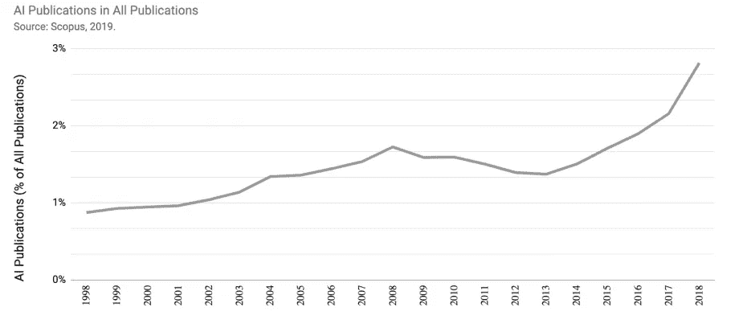
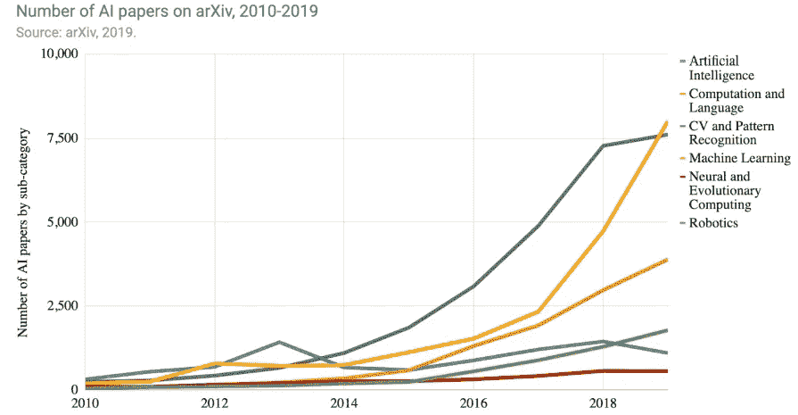
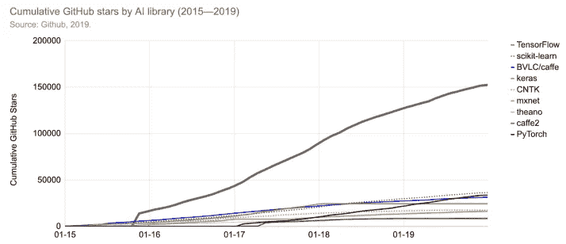
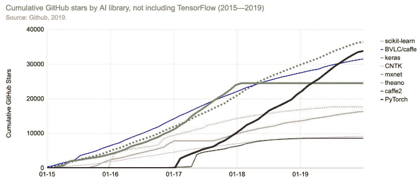
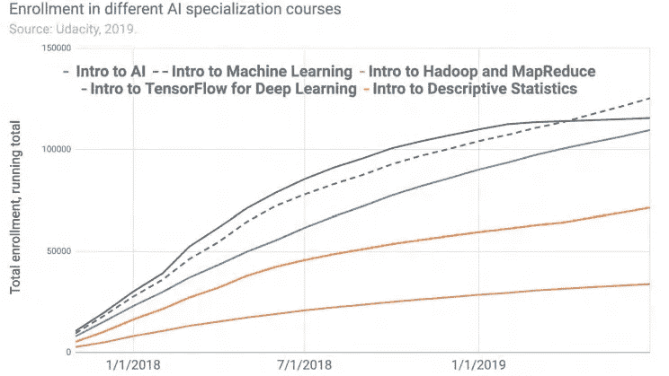
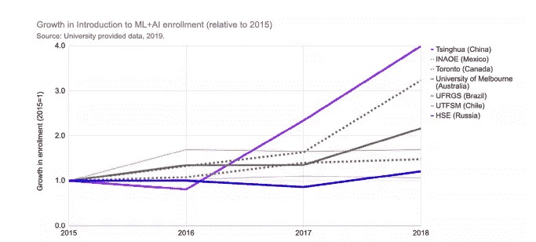

# 将人工智能大众化

> 原文：<https://towardsdatascience.com/democratizing-artificial-intelligence-42222472d3d4?source=collection_archive---------36----------------------->

## “AI 黑匣子”是给所有人的。

照片由 [Unsplash](https://unsplash.com?utm_source=medium&utm_medium=referral) 上的 [h heyerlein](https://unsplash.com/@heyerlein?utm_source=medium&utm_medium=referral) 拍摄

> “领导者的真正标志是愿意坚持大胆的行动路线——非传统的商业战略、独特的产品开发路线图、有争议的营销活动——即使世界上其他人都想知道为什么你不与现状保持一致。换句话说，真正的领导者乐于曲折前进，而其他人则乐于曲折前进。他们明白，在一个高度竞争和不间断破坏的时代，脱颖而出的唯一方式就是代表一些特别的东西。”——比尔·泰勒。

谷歌、脸书、亚马逊等科技巨头在人工智能领域的成功经验。证明了投资先进技术新时代的效率。他们的重要结果将人们分为两类:一类是愿意掌握人工智能艺术的支持者，另一类是声称这只不过是炒作的怀疑者。有一件事是肯定的，从那以后，工业一直在发展。

# 人工智能研究的发展。

*   1998 年至 2018 年间，经过同行评审的人工智能论文数量增长了 300%以上，占同行评审期刊出版物的 3%，占已发表会议论文的 9%。
*   中国现在每年发表的人工智能期刊和会议论文与欧洲一样多，已经在 2006 年超过了美国。美国出版物的领域加权引用影响仍比中国高出约 50%。
*   新加坡、瑞士、澳大利亚、以色列、荷兰和卢森堡人均在 arXiv 上发表的深度学习论文数量相对较高。
*   超过 32%的世界人工智能期刊引用来自东亚。超过 40%的世界人工智能会议论文被北美引用。
*   北美占 2014 年至 2018 年全球人工智能专利引用活动的 60%以上。
*   许多西欧国家，特别是荷兰和丹麦，以及阿根廷、加拿大和伊朗，在人工智能研究中显示了相对较高的女性比例。

# 开源软件。

在过去的十年里，许多机器学习和人工智能库都是开源的，可供广大公众使用，这使得开发人员更容易开发智能产品和平台。这种开源代码受到了社区的广泛关注和欢迎。

衡量各种人工智能编程框架受欢迎程度的标准之一是 Github stars。它们表明一个人在 GitHub 上表达了对特定代码或项目的兴趣，类似于 Twitter 和脸书等社交媒体服务上的“赞”可以表明某个帖子的受欢迎程度。

下图显示了各种 AI 和 ML 软件包在 GitHub 上被打上星号的次数。

人工智能库累积 Github 星级-来源:Github，2019 年

人工智能库(不包括 TensorFlow)累积 Github 星级—来源:Github，2019

# 每个人的人工智能！

最近对人工智能的兴趣激增，对该领域产生了重大影响。除了开源人工智能系统的可用性，其他因素也使人工智能越来越容易为每个人所用:

## 教育

教育已经延伸到大学之外。Moocs 越来越多地为全球劳动力提供不同人工智能技能的课程。人工智能和相关学科的入学人数继续成倍增长，无论是在线课程还是美国和国际上的传统大学。

人工智能在大学和 Moocs 中的应用。

## 云的力量

*   大数据平台提供了捕获和存储大型数据集的能力。
*   计算时间显著减少。在一年半的时间里，在云基础设施上训练大型图像分类系统所需的时间从 2017 年 10 月的约 3 小时下降到 2019 年 7 月的约 88 秒。
*   培训模特的成本也有类似的下降。

人工智能的民主化正在增加与之互动的人数。这种扩张允许人工智能应用扩展到新的领域，并释放人工智能专家的时间来从事前沿开发。

人工智能不再被视为在工业界和学术界输出神奇结果的黑匣子。越来越多的公众可以使用不同的技术。

** **参考文献** : *上述统计数据来自斯坦福海 2019 年度报告。*