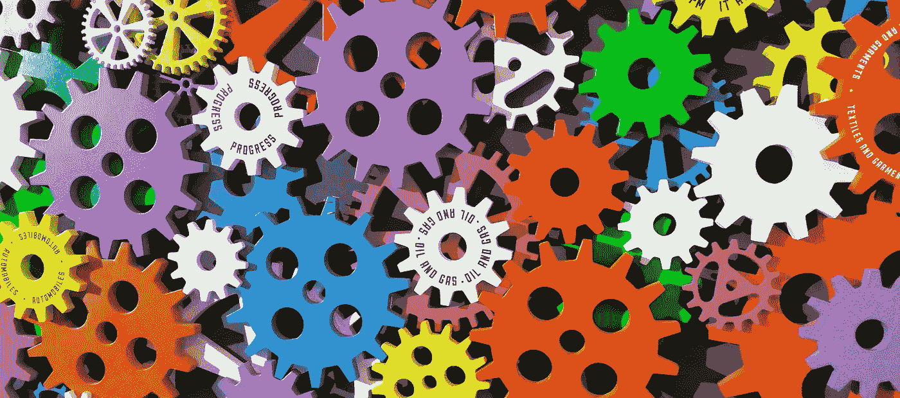
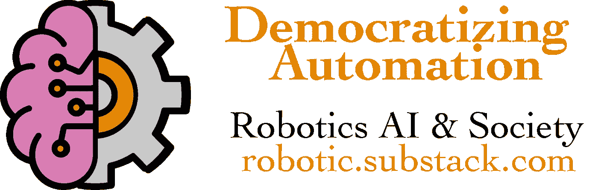

# 自动化大众化

> 原文：<https://towardsdatascience.com/democratizing-automation-744bacdc5e97?source=collection_archive---------63----------------------->

## 让每个人都从人工智能热潮中受益可能比一些人预期的更具挑战性。

照片由[数码 Buggu](https://www.pexels.com/@digitalbuggu?utm_content=attributionCopyText&utm_medium=referral&utm_source=pexels) 从 [Pexels](https://www.pexels.com/photo/colorful-toothed-wheels-171198/?utm_content=attributionCopyText&utm_medium=referral&utm_source=pexels) 拍摄

我们如何平衡人工智能的超能力——在少数人手中——对其他人的眼睛和生活的影响？通过各种文章、播客和对话，我对基于自动化的产品如何进一步分化我们的社会产生了一些担忧。我写了三个主题，我们需要解决，以推动智能系统走向公平。

1.  机器的情感容量及其对用户的影响。
2.  如何让数据驱动的系统没有偏见？
3.  如何缓解科技公司权力聚集后的财富聚集？

为什么我说这很难？看到这个国家对冠状病毒的反应平平，表明我们几乎无法应对一个紧迫的问题。我会把对自动化民主化的需求循环为仅次于气候变化的社会不稳定风险。这些问题是相似的，因为它们慢慢地悄悄逼近我们，逐渐改变我们的生活方式，而我们却没有意识到未来就在眼前。

自动化不是一个零和游戏——也就是说，每个人都可以从它的实施中获得胜利和收益——但肯定会对服务不足的群体和社会产生一些巨大的成本。我希望尽自己的一份力量，建立一个能帮助所有人的系统，而不是一个以增加他人成本的方式过度帮助少数人的系统。

*这篇文章启发了我，使我的博客和我的方向正式化，你可以在这里找到更多*[https://robotic.substack.com/](https://robotic.substack.com/)*。*

# 人工智能中的情感能力

现代生活已经给我们的人性带来了很大的压力，因为我们将如此多的互动转移到了屏幕后面，智能繁荣也将如此(对于成年人来说，屏幕后面的时间长达 34 年)。数据驱动方法的革命还很年轻。我担心当我们再也看不到咖啡店里的笑脸时会发生什么。我并不是说这是人们渴望和需要的互动，但这是事实。这是一种联系。 ***这些微小而众多的联系累积起来，关系到个人的长期心理健康*** 。我对我的精神健康斗争非常开放，这种斗争是由通信的技术漏斗加强的。它影响到每个人，我看不出有什么方法可以让它不那么成问题。

自动咖啡机能让人类感觉自己是整个系统的一部分吗？我们都有**变焦疲劳** ( [来源](https://www.bbc.com/worklife/article/20200421-why-zoom-video-chats-are-so-exhausting)，[来源](https://hbr.org/2020/04/how-to-combat-zoom-fatigue))在一个月的在线工作中，如果生活重新开始，我们只能看到屏幕，那会怎么样——我不认为这将是一个巨大的胜利。消除人与人之间的互动对客户来说也是一种负担；这不仅仅是一种节省成本的技术。

## 情感人工智能

一家公司开始提高患有某些疾病的人的情绪智商，这些疾病使他们很难融入正常社会，**情感人工智能** ( [链接](https://www.affectiva.com/))在这一领域拥有许多关键。创始人希望为那些未被充分代表的人和那些获益最多的人服务。

我强烈推荐下面这一集人工智能播客，它定义并深入探讨了这些问题。

 [## 罗莎琳德·皮卡德:情感计算、情感、隐私和健康|麻省理工学院|人工智能……

### 罗莎琳德·皮卡德是麻省理工学院的教授，麻省理工学院媒体实验室情感计算研究组的主任，以及…

lexfridman.com](https://lexfridman.com/rosalind-picard/) 

## 科技公司将情感货币化

我们希望机器也能跟踪我们的情绪吗？我看到在接下来的几年里，某些社交应用程序想要追踪眼球运动来衡量广告的参与度(来源[一](https://eyezag.com/eye-tracking/mobile/)或[二](https://www.technologyreview.com/2016/07/01/159012/control-your-smartphone-with-your-eyes/))。如果先进的面部识别硬件作为我们手机的生物护照，成为优化广告技术的情感测量设备，会怎么样？老实说，我不知道也没有听到足够多的人谈论这种担忧([来源](https://www.adweek.com/programmatic/how-ad-tech-can-tap-into-consumer-emotions-to-drive-digital-sales/)关于情感如何进入广告技术)。

随着科技公司能够随时改变服务条款，我认为这是一个时间问题，而不是是否的问题。消费者需要对被跟踪的内容有发言权，否则功能蔓延会将情感添加到持续跟踪的内容列表中(位置、浏览、购买等)。

# 无偏差数据

数据驱动方法(也称为基于学习的方法)接受给它们的信号，并优化一些输出。

## 科技领域的当前偏见

> 谁在移动设备上花费最多？富裕人群(主要在苹果设备上)。[来源](https://qz.com/1799912/apple-pay-on-pace-to-account-for-10-percent-of-global-card-transactions/)。
> 
> 面部识别工具上谁的成功率最高？白种人。[来源](https://www.nytimes.com/2018/02/09/technology/facial-recognition-race-artificial-intelligence.html)。

这只是我们日常生活中已经存在的有偏见的数据的两个例子。我想说它们并不具有超级影响力，但当自动化系统影响我们生活的更多领域时，它会发人深省。

## 科技领域的未来偏见

> 如果人工智能系统被用来招聘工作，如果某些人口统计数据被排除在训练集之外，因此他们永远不会被选中，那会怎么样？[来源](https://www.forbes.com/sites/falonfatemi/2019/10/31/how-ai-is-uprooting-recruiting/#5441a8346ce9)。
> 
> 在医疗系统中，已经存在跨人口统计学的治疗有效性的系统性差异，当决策被输入计算机时会发生什么？[来源](https://medicalfuturist.com/a-i-bias-in-healthcare/)。

在这两种情况下，计算机会复制给它们的数据。例如，当神经网络在拟合数据时，其精度与训练数据的密度成比例。关于如何解决这个问题的工作很少，只有很多关于这些问题将如何影响我们的白皮书。

我认为我们需要在数据处理和汇总方面做更多的工作。[我刚才谈到的数据是推动公司价值的](/ai-startups-are-data-startups-2ed6bec1f684)，但我们也需要*一些*数据的透明度。[这是麻省理工学院斯隆管理学院关于数据偏差问题的一个很好的总结。](https://sloanreview.mit.edu/article/the-risk-of-machine-learning-bias-and-how-to-prevent-it/)

## 谁驾驶这个？

我也很高兴看到伯克利 EECS 分校聘请了一个对这些问题感兴趣的新教师团队。欢迎光临！我认为教职员工有一个表达问题的大平台，但运营这个平台的公司能更早地看到潜在的问题。这是一件很难监管的事情，所以我认为工程师们应该意识到这个问题。这就是为什么我认为最优秀的计算机科学家都有某种程度上多样化的背景——理解更广泛问题的能力。

参见[脸书](https://developers.google.com/machine-learning/fairness-overview)、[谷歌](https://developers.google.com/machine-learning/fairness-overview)、[亚马逊](https://www.nsf.gov/funding/pgm_summ.jsp?pims_id=505651)和[微软](https://www.microsoft.com/en-us/research/theme/fate/)对公平的推动。这些只是公共方法。

# 金融公平

2020 年上半年将是技术领域的一次重大聚合事件。枯竭的种子资金，失败的走向市场战略，以及经济封锁的随机打击。大的变得更大(FAANG 或其他更受欢迎的五大科技公司的缩写)。我在自动化领域工作，并期望大量资金流向那里，但这一切都隐藏在隐形模式初创公司和根深蒂固的工程公司的面纱后面。

> 每个人都在谈论即将到来的自动化，但为什么它如此难找(即使对于该领域的专家来说)？

我的目标是研究什么样的自动化会以其前所未有的影响规模让人们措手不及(例如自动驾驶汽车)，以及什么会成为一个具有良好公共关系的玩具应用程序？我想继续写自动化的民主化。我想打造工具，了解趋势。

(软银在 Q1 的财报电话会议上对科技独角兽的陨落进行了滑稽的想象；[来源](https://techcrunch.com/2020/05/18/softbanks-q1-2020-earnings-presentation-mixes-comedy-and-drama/)。)

## 基于人工智能的万亿 GPD 增长

我们能不能让更多的美国科技巨头立足于美国。我不会说任何关于改变税收结构的话，但我们需要找到一种方法，随着 GDP 的飙升，它不仅会创造更多的亿万富翁。每个数字用户的边际增值是惊人的。*如果你有好的资源，可以让财务收益正常化并保留资本主义的好处，请联系我们或发表评论。*

 [## 人工智能前沿笔记:模拟人工智能对世界经济的影响

### 人工智能(AI)工具和技术在商业和全球经济中的作用是一个热门话题。这个…

www.mckinsey.com](https://www.mckinsey.com/featured-insights/artificial-intelligence/notes-from-the-ai-frontier-modeling-the-impact-of-ai-on-the-world-economy) 

这个国家的一些地区不用走很远就可以到达令人惊叹的地方。

科技公司没有动力通过解决这些长期风险来限制其增长。我们需要有效的政府来调节技术的长期轨迹——因为他们是唯一可以为长远的未来安全承担财务风险的人。

 [## 自动化大众化

### 一个关于机器人和人工智能的博客，让它们对每个人都有益，以及即将到来的自动化浪潮…

robotic.substack.com](https://robotic.substack.com/)