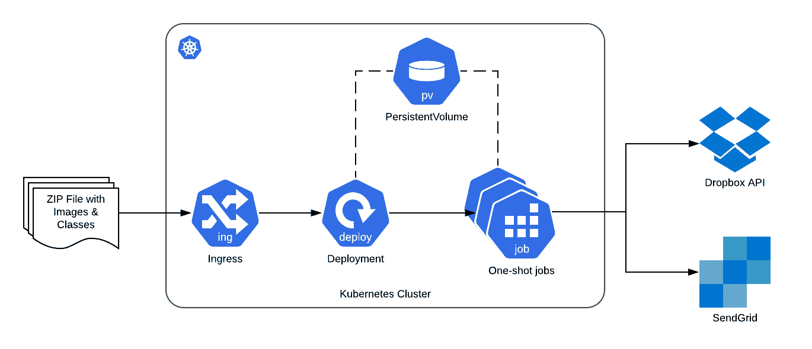
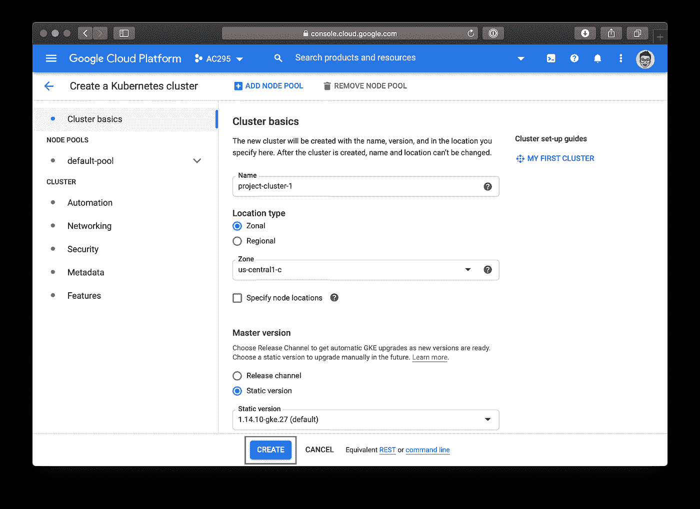
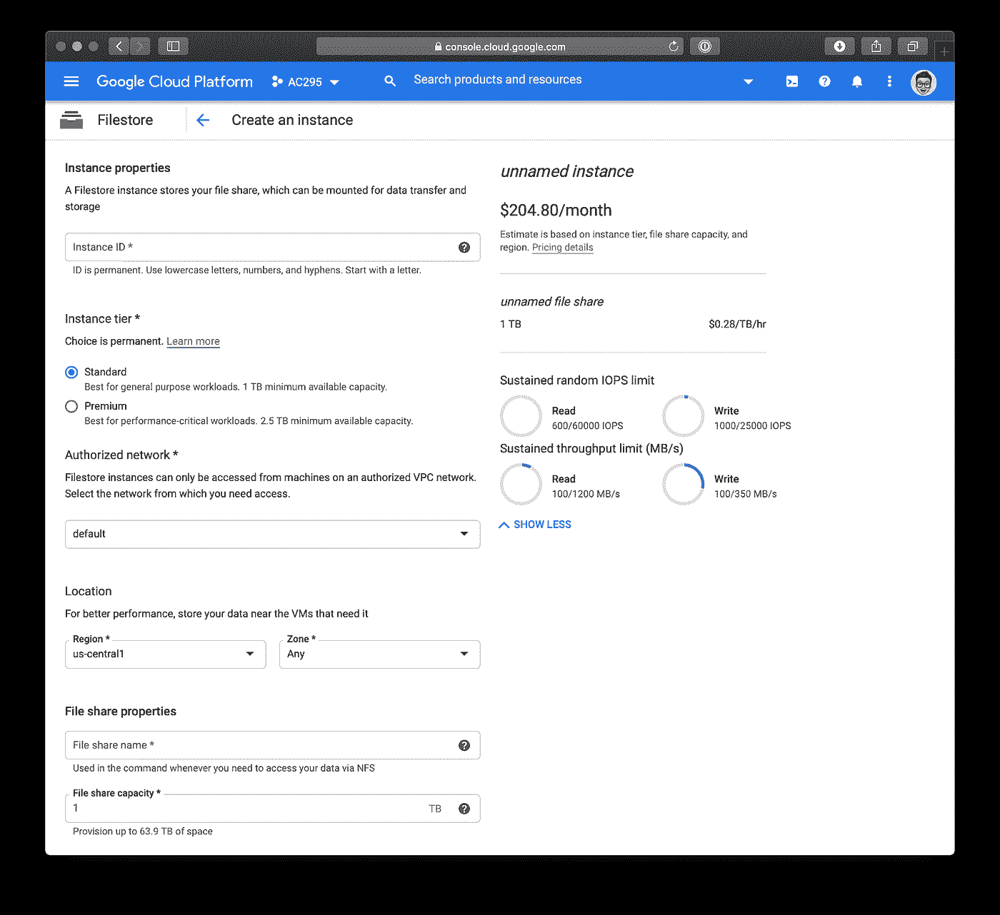
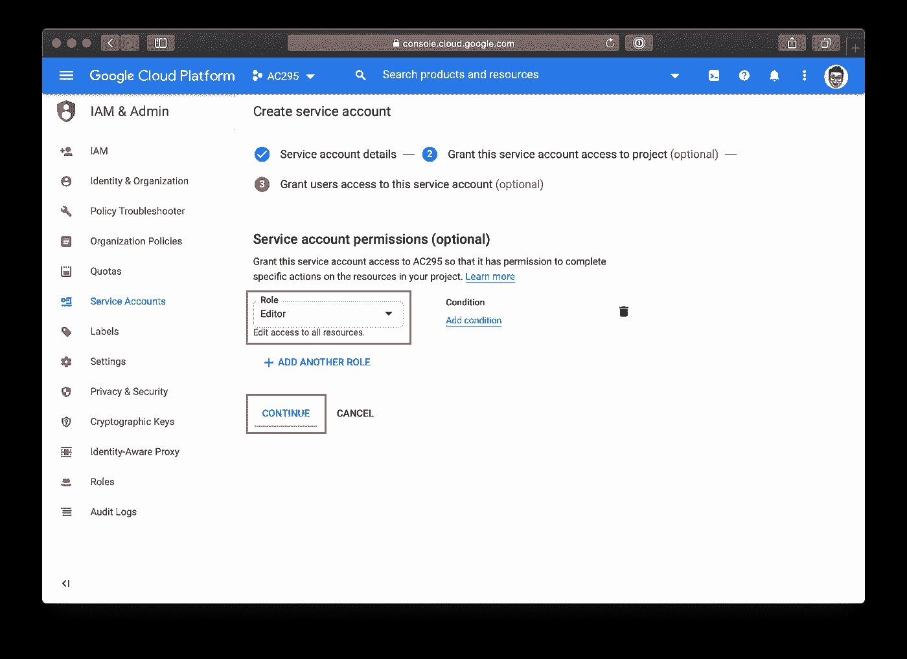
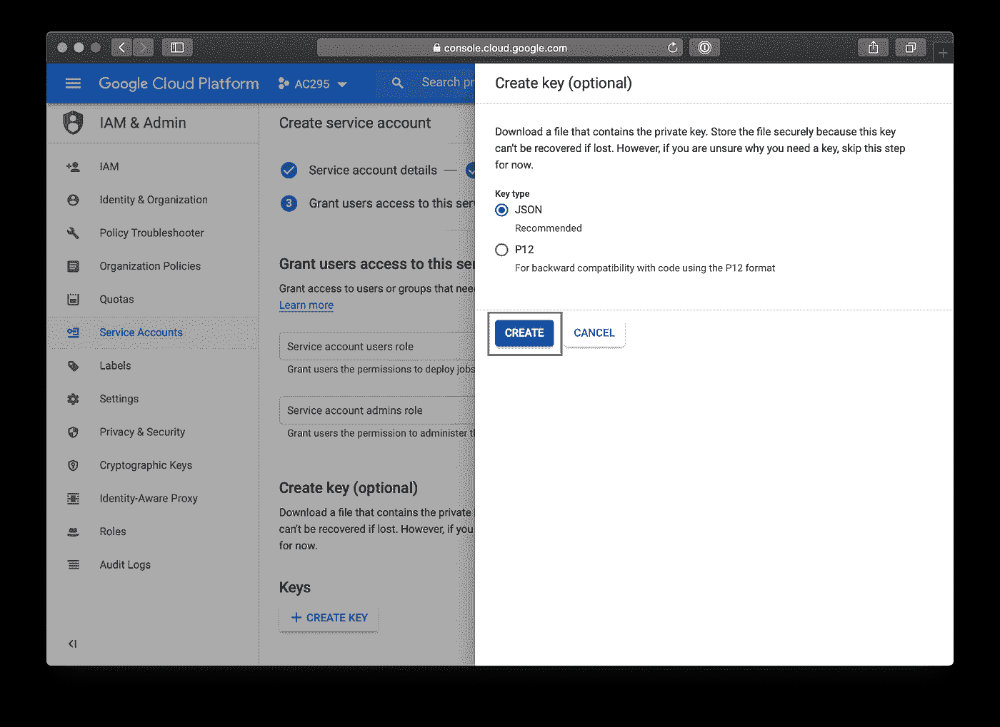
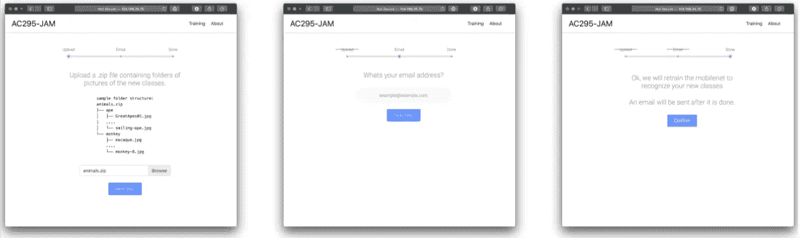
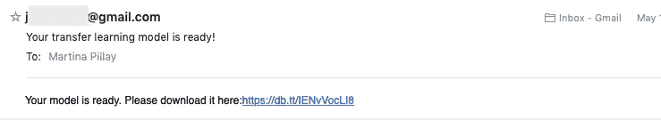

# 民主化图像分类

> 原文：<https://towardsdatascience.com/democratizing-image-classification-d578854a6c19?source=collection_archive---------50----------------------->

## 用 Kubernetes 构建基于网络的迁移学习门户

*作者:* [*【陈明杰】*](https://www.linkedin.com/in/jeffchenhr/)*[*安迪·哈里斯*](https://www.linkedin.com/in/ajrharris/)*[*玛蒂娜·皮莱*](https://www.linkedin.com/in/martinaapillay/)**

**创建定制的图像分类模型需要详细了解 TensorFlow 或其他类似的深度学习框架。它还需要大量的 CPU。虽然存在更高级的工具，如苹果的桌面应用程序， [CreateML](https://developer.apple.com/machine-learning/create-ml/) ，但它们要求你在本地机器上运行软件，这可能会很慢且效率低下。**

**我们的项目旨在使机器学习民主化，并使任何软件工程师都可以建立图像分类模型，不管他们的 ML 知识如何。**

# **站在巨人的肩膀上**

**我们在几个现有资源的基础上开发了一个 web 服务，它可以无缝地接收图像并输出定制的图像分类模型。**

*   **基本模型:使用的基本模型来自 Google 开发的 MobileNet v2 模型。这是在 ImageNet 数据集上预先训练的，这是一个由 1.4 M 图像和 1000 个类组成的大型数据集**
*   **迁移学习:我们利用 MobileNet 基础模型为用户训练定制的图像分类模型**
*   **Docker:我们将迁移学习模型容器化，这样它就可以部署在 GCP 的实例中**
*   **Kubernetes:利用 Kubernetes，我们可以在创建每个分类模型时自动扩展和管理工作**
*   **GitHub:我们服务前端和后端的所有代码都在 GitHub repo 中维护**

# **产品组件和基础设施**

**我们的产品包含三个不同的组件:用于管理用户上传的部署和服务，用于管理模型训练的作业定义，以及用于在训练期间存储数据的持久性存储。组件已连接，如下所示。**

****

****在谷歌云上部署到 Kubernetes****

**对于这个项目，我们需要动态的计算能力来应对需求高峰。Kubernetes 自动管理可伸缩的容器化应用程序，是一个完美的选择。[谷歌云](https://cloud.google.com)让快速建立新的 Kubernetes 集群变得简单[。](https://console.cloud.google.com/kubernetes/add)**

****

**接下来，我们需要设置持久存储，以便上传图像，然后供培训作业使用。Kubernetes Pods 可以使用永久卷共享文件。永久卷有三种[访问模式](https://kubernetes.io/docs/concepts/storage/persistent-volumes/#access-modes) : ReadWriteOnce、ReadOnlyMany 和 ReadWriteMany(这些名称表明了每种卷类型的使用方式)。对于这个项目，我们需要前端能够将文件写入存储；然后，相应的培训工作需要能够读取这些文件。因此，我们需要一个支持读写的卷。**

**我们选择使用 [Filestore](https://cloud.google.com/filestore/) ，这是一个托管的谷歌服务，其工作方式类似于 NAS 服务器。Filestore 至少需要 1Tb 的磁盘空间，并且有些昂贵，因此对于长期项目来说，它可能不是一个理想的选择，除非您计划存储大量数据。但是对于一个短期项目(并且有学分)，它很容易建立并且对我们的用例有意义。为了建立一个文件存储实例，[创建了一个新实例](https://console.cloud.google.com/filestore/locations/-/instances/new)，并跟踪**文件共享名**和 **IP 地址**。**

****

**接下来，我们使用该文件存储信息创建了一个持久卷。**

**最后，我们创建了一个持久的卷声明，可以由前端和各种作业共享。**

****版本管理和自动部署****

**这个项目发生在新冠肺炎，所以我们不得不远程合作，因为庇护所的订单。因此，使用源代码控制和协作工具甚至更加重要。我们将代码存储在 GitHub 中，并使用 [GitHub 动作](https://github.com/features/actions)管理我们所有的部署。设置 autodeploy 需要首先在 Google Cloud 中创建一个[服务帐户。](https://console.cloud.google.com/iam-admin/serviceaccounts/create)**

****

**服务帐户角色需要设置为**编辑器**，这样 GitHub 才能向 Google Cloud 发送命令。在最后阶段，我们为服务帐户生成并下载了一个密钥。**

****

**接下来，我们将[构建并部署到 GKE](https://github.com/actions/starter-workflows/blob/master/ci/google.yml) 工作流添加到 GitHub 项目中。默认模板使用 Github secrets 作为 GKE_EMAIL、GKE_KEY 和 GKE_PROJECT 环境变量。GKE 电子邮件和 GKE 项目分别对应于服务帐户电子邮件地址和项目 ID。GitHub 在这里[提供指令](https://github.com/GoogleCloudPlatform/github-actions/tree/docs/service-account-key/setup-gcloud#inputs)生成 GKE _ 密钥(使用你上面下载的服务账号密钥 JSON 文件)。**

**最后，我们对动作文件做了一些修改。首先，为了避免为每个部署削减一个新的发布，我们在每次有新的提交到主分支时触发工作流。**

**其次，我们构建了两个 Docker 容器，而不是一个——一个用于主服务，一个用于作业(下面将详细介绍)。**

# **建立核心服务和工作岗位**

****设置前端****

**我们使用 Flask 和 Bootstrap 设置前端。前端服务被打包成一个容器，并部署在 Kubernetes 集群中。**

**为了帮助用户完成这个过程，我们设计了一个如下所示的 3 步表单(尽管你可以随意定制！).第一步，我们收集一个. zip 文件，其中包含用户希望模型学习的不同新类的图片。的内容。zip 文件必须匹配[keras . preprocessing . images . imagedata generator . flow _ from _ directory](https://www.tensorflow.org/api_docs/python/tf/keras/preprocessing/image/ImageDataGenerator#flow_from_directory)使用的结构。然后，我们要求用户输入他们希望接收训练模型的电子邮件。最后，我们向用户提供一个摘要和通知，以检查所有细节是否正确。**

****

****与作业共享图像数据****

**上传. zip 文件后，我们使用 [Kubernetes Python 包](https://github.com/kubernetes-client/python)创建一个作业。我们使用 [UUID 生成器](https://docs.python.org/3/library/uuid.html#uuid.uuid4)包给每个作业一个唯一的 UUID。作为环境变量的 zip 文件路径。请注意，创建作业时会附加永久卷声明。**

**前端需要特殊权限才能创建作业。对于这个项目，我们给默认角色 Admin 访问权限。在生产环境中，前端的访问应该仅限于必要的权限。**

****(重新)教授模型****

**为了创建定制的图像分类模型，我们在预训练的神经网络上使用了迁移学习技术。文章[Transfer Learning using Mobilenet and Keras](/transfer-learning-using-mobilenet-and-keras-c75daf7ff299)非常有用，并被用作这项工作的框架。**

**在图像分类的背景下，迁移学习的理论是，已经在大量图像上训练过的预训练模型可以有效地充当大多数图像的通用模型。我们可以利用神经网络的大多数层，只在新图像上重新训练最后几层。这使我们能够减少开发定制图像分类模型所需的时间和计算资源。它还减少了我们添加新类所需的新图像的数量。**

**在这个项目中，我们使用 Google 开发的 MobileNet v2 的基本模型。该网络在 ImageNet 数据集(由 140 万幅图像和 1000 个类组成)上进行预训练。我们冻结了第一批预训练层的大部分，只重新训练最后几个密集层。然后，我们打开分类图像的 zip 文件，重新训练模型。模型被保存为一个. h5 文件，并保存到一个 dropbox 文件中，然后通过电子邮件发送回给用户。**

****集装化的转移学习****

**将我们的机器学习模型产品化的第一步是将其放入 Docker 容器中，以便我们可以将其部署为微服务。利用 Docker，我们可以维护统一的环境、库需求，并使用 Kubernetes 在云中扩展模型。**

**Dockerfile 本质上是一个命令文档，存储在启动容器映像的文本文件中。在我们的 token 文件中，我们安装了 python 和 requirements.txt 中定义的所有包。我们还实例化了几个可以传递到 main.py 文件中的环境变量:图像的 zip 文件位置、用户电子邮件以及 dropbox 密钥和令牌。**

**创建 docker 文件后，我们构建映像并进行测试，以确保输入和输出在本地工作。最后，我们将图像推送到 Google 云平台，在那里它可以被我们的 Kubernetes 集群部署。**

****共享模型并通知用户****

**由于 Google Drive 存储昂贵，我们决定使用 Dropbox API 来临时存储重新训练的模型。训练完成后，模型被上传到 Dropbox，并生成一个可共享的链接。**

**该链接随后被传递给 SendGrid API，以生成一封通知电子邮件供用户检索。下面可以看到这封漂亮邮件的样本！**

****

# **后续步骤**

**我们所创造的服务只是这个产品未来发展的一个起点。为了更好地满足那些希望利用分类模型的人的需求，可以结合以下特征:**

****进一步产品化****

*   **改进 web 应用程序，为用户提供更多指导**
*   **关于培训状态、后端如何工作等更多信息。**
*   **提供更多基本型号的选择(目前只有 MobileNet)**
*   **让用户选择超参数**

****合并模型蒸馏和压缩****

*   **模型文件相当大；输出可用于移动电话的版本可能有用**

****提高用户测试能力****

*   **提供一个界面，允许用户测试模型的准确性**

# **承认**

**我们要感谢 Pavlos Protopapas 和[哈佛应用计算 295 课程](https://harvard-iacs.github.io/2020-AC295/)的其他教学人员的指导和支持。**