# 为手机游戏出版平民化 PySpark

> 原文：<https://towardsdatascience.com/democratizing-pyspark-for-mobile-game-publishing-cf8ec074b2d9?source=collection_archive---------37----------------------->

与朋友的话 2(来源:[https://www.zynga.com](https://www.zynga.com/))

## 2020 年火花峰会上的 Zynga Analytics

在过去的两年里，Zynga 的分析越来越多地使用 PySpark，这是 Spark 大数据平台的 Python 接口。我们的中央和嵌入式分析团队使用 PySpark 支持移动出版运营，包括分析和报告、实验、个性化服务和营销优化。我在 2020 年 Spark 峰会上介绍了我们如何向整个分析组织开放这个强大的平台，并讨论了我们面临的一些挑战以及我们团队开发的新应用。这篇文章提供了视频演示的文本版本，可在[这里](https://databricks.com/session_na20/democratizing-pyspark-for-mobile-game-publishing)获得。我们的机器学习(ML)工程团队[也在峰会上展示了](https://databricks.com/session_na20/productionizing-deep-reinforcement-learning-with-spark-and-mlflow)强化学习的新应用。

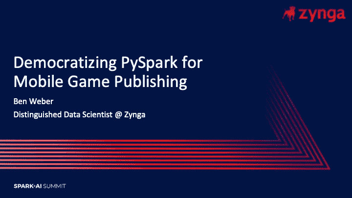

我是 Zynga 的一名杰出的数据科学家，我的职责是探索新技术，并倡导扩大我们分析团队的技术堆栈。本次会议符合大会的主题，即实现人工智能和大数据工具的民主化。在 Zynga，我们通过向我们的完整分析团队开放 Spark 生态系统，与这一主题保持一致。我们确实面临着这种方法的成长烦恼和扩展挑战，但我们将讨论我们如何克服这些障碍，并提供一些在您的分析组织内扩展 Spark 的最佳实践。

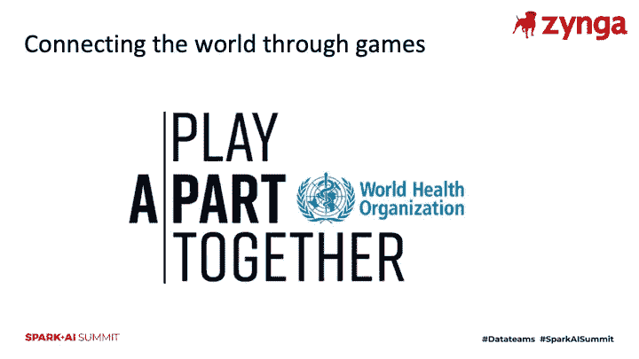

我们正处于前所未有的时代，今年的虚拟会议反映了这一现实。Zynga 回应 COVID 疫情的方式之一是领导与世界卫生组织的一项倡议，我们与数十家游戏出版商和工作室合作，通过游戏传播关于社交距离的信息。 [Play Apart Together](https://www.zynga.com/corporate/games-industry-unites-to-promote-world-health-organization-messages-against-covid-19-launch-playaparttogether-campaign/) 倡议扩大了关于如何在这些充满挑战的时期保持安全，同时通过游戏与朋友和家人保持联系的沟通。我们的使命是通过游戏连接世界，我很自豪 Zynga 在这一举措中发挥了至关重要的作用。

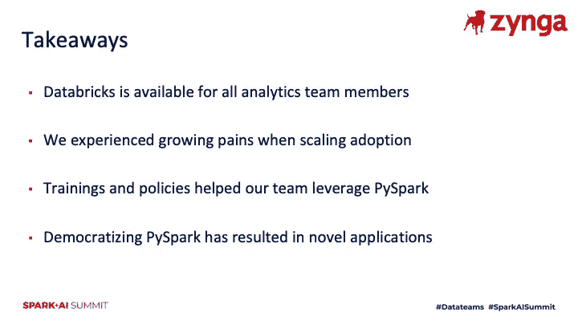

我们在 Zynga 的分析团队现在超过 50 人，我们已经向整个组织开放了 PySpark 平台。Zynga analytics 的任何成员现在都可以使用该平台将分析和 ML 模型扩展到大规模数据集。虽然开放这一强大的工具有助于加快我们分析组织的产出，但随着越来越多的团队成员采用该平台处理日常任务，我们确实面临着一些挑战和成长的烦恼，我们将重点介绍我们克服这些问题的几种方法。我们应对这些挑战的一个关键方法是将一套广泛的培训材料放在一起，并制定政策来保持集群的可维护性和成本可控性。虽然开发 PySpark 并推动该平台的采用需要一些努力，但我们发现我们的团队以新颖的方式使用 Spark，为我们的游戏团队和直播服务带来了有用的分析和工具。

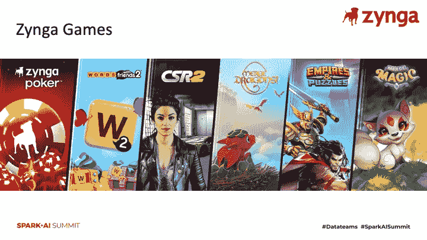

Zynga 拥有多样化的游戏组合，并有嵌入式分析师和数据科学家支持开发这些游戏的工作室。我们把每年收入超过 1 亿美元的游戏称为“永远的专营权”，我们预计这些游戏将持续几年繁荣发展。在录制这个环节的时候，我们有 6 个游戏符合这个标准。从那以后，我们收购了 Peak Games，将玩具爆炸和卡通爆炸加入到我们的投资组合中，使这个数字达到了 8。

作为一个分析组织，我们面临的挑战之一是，我们的游戏组合会生成非常不同的数据集。例如，我们有赌场游戏、社交吃角子老虎机游戏、赛车游戏和基于比赛 3 的游戏，它们具有不同的事件分类。虽然数据集在不同的游戏中差异很大，但我们在过去几年的目标之一是标准化基础设施和工具，我们的嵌入式团队使用这些基础设施和工具来处理这些大规模数据集，并为我们的工作室找到见解。我们发现 Spark 非常适合集中式平台，因为它可以与我们所有的数据源很好地集成，并且可以扩展到处理巨大的工作负载。

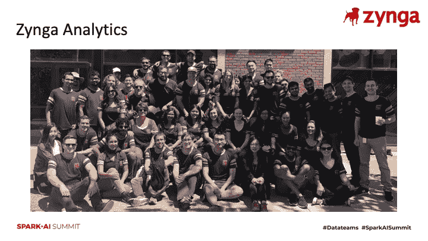

就 Zynga analytics 的结构而言，我们是我们的分析工程、嵌入式分析和中央分析团队的组合。虽然这个团队是不同学科的混合体，但我们有一个共同的目标，那就是帮助我们的游戏团队找到洞察力和个性化的游戏体验。

嵌入式分析师和数据科学家与他们支持的工作室位于同一地点，并与产品经理和工作室领导密切合作，以支持游戏发布和直播服务。这些团队负责监控游戏的性能，进行个性化实验，并探索如何改善我们游戏中的用户体验。我所在的中央分析部门专注于构建工具，这些工具可以扩展到我们所有的分析团队，并支持发布运营，如用户获取和企业发展。这两个团队都利用了我们的数据平台，该平台提供了跟踪事件数据、处理不同数据集以及构建支持我们实时服务的数据产品的能力。我们的分析工程团队负责构建和维护这个平台，它是我们分析能力的支柱。

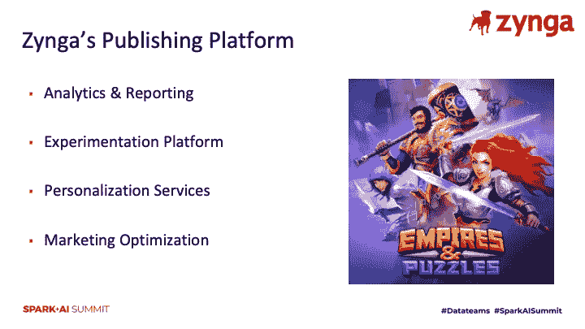

虽然我们的分析团队执行各种不同的职能，但我们在不同的团队中看到了几个共同的主题，即作为游戏发行商支持工作室。第一个是 Zynga 分析的核心功能之一，即利用我们的数据平台来衡量游戏的性能，并为改善我们的玩家体验提供见解。我们看到的第二个常见主题是在我们的游戏中进行实验，并与产品经理密切合作，以确定实验的结果以及如何基于这些发现。第三个主题是构建数据产品，推动游戏中的个性化体验。例如，我们建立倾向模型，预测哪些用户可能会在游戏中失败，并可以根据这些信号定制体验。最后的主题是营销优化，这是产品营销和用户获取的交叉点。虽然这通常是中央分析团队的职能，但在构建支持这一职能的 ML 模型时，利用我们的嵌入式分析师和数据科学家的领域知识是非常有用的。

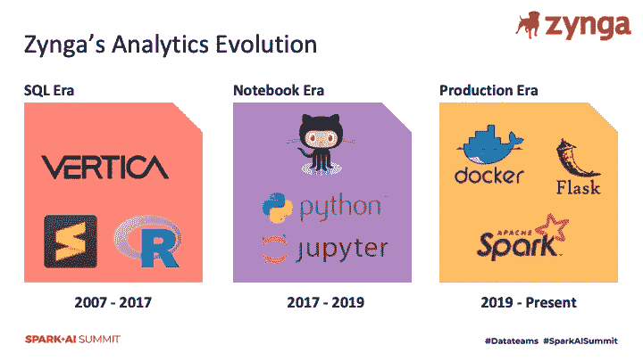

自 Zynga 于 2007 年成立以来，我们的数据平台已经经历了几次迭代，但在过去的几年里，随着我们对分析团队使用的工具进行标准化，我们已经看到了巨大而有益的变化。十多年来，我们一直使用 Vertica 作为数据存储，该数据库为我们的核心分析功能提供了动力，如报告、探索性数据分析和游戏中的 A/B 测试。虽然这个数据库在过去十年中一直是我们数据平台的一部分，但我们的分析师使用的许多工具已经随着时间的推移发生了变化。我将这些不同的工具转变归类为 Zynga 的三个分析时代。

我将第一个时代称为 *SQL 时代*，因为分析师和数据科学家花了大部分时间直接与我们的数据库打交道。这包括构建报告、探索新用户漏斗的指标、计算实验结果以及将数据整理成可用于预测和倾向建模等任务的格式。在这个时代，分析师使用的主要工具是连接和查询我们的数据存储的 IDE。虽然一些分析师和数据科学家使用 R 编程语言来构建 ML 模型，但不同的嵌入式分析团队之间并没有标准化。

2017 年，我们组建了中央分析团队，这是我们工具标准化的转折点。我们决定将 Python 作为 Zynga 的标准分析语言，并建立一个托管的 Jupyter 笔记本环境，分析师可以在其中进行项目合作。我们称之为*笔记本时代*，因为我们的分析师开始花更多的时间在笔记本环境中，而不是直接与我们的数据库打交道。其中一个巨大的成果是，为笔记本电脑使用一个通用的托管环境意味着跨团队共享脚本变得更加容易，因为该环境有固定数量的特定版本的库。虽然我们的团队花了一些时间将 Python 作为我们分析团队的通用语言，但好处很快超过了培训我们团队的成本，因为团队可以更容易地协作，并且更容易对我们的整个游戏组合进行分析，而不是单个游戏。

Zynga 当前的分析时代被称为*生产时代*，因为我们的分析团队现在正在利用工具将 ML 模型投入生产。我们的分析师现在正在利用 PySpark 构建可扩展到数千万玩家的批量 ML 管道，我们正在使用 Flask 构建端点和 web 工具来支持游戏和发布团队，我们正在与分析工程合作，使用 AWS SageMaker 构建实时预测模型。我们的分析团队现在更多地参与构建基于这些见解为直播服务提供动力的系统，而不是寻找见解并将这些见解交给游戏团队。

过去几年发生的变化之一是，我们为分析团队提供了比以前更多的工具。虽然我们现在已经向整个团队开放了我们的 Spark 环境，但我们从有限的访问开始，并在扩展到所有 Zynga Analytics 之前展示了该平台的实用性。当我们看到我们的分析师和数据科学家可以构建端到端的 ML 模型时，我们希望让越来越多的团队能够使用这个平台。

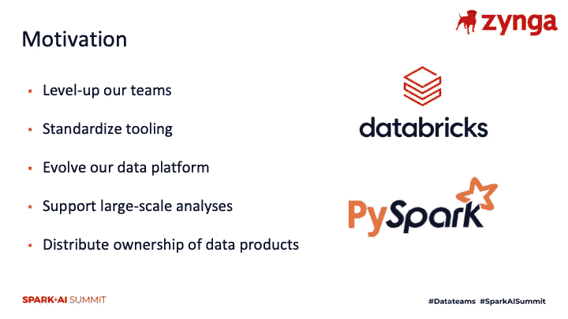

我们希望向所有分析师开放我们的 Spark 生态系统有几个原因。其中一个核心动机是，我们希望为我们的分析师提供一条继续发展他们的技术能力和提升他们的技能集的途径。接触 Spark 并建立端到端的渠道是分析师在 Zynga 继续职业发展的方式之一。

另一个动机是，我们希望对工具进行标准化，使我们的分析师能够处理机器集群，而不是单个实例，这是我们 Jupyter 笔记本电脑生态系统中的一个限制。我们使用 Databricks 作为我们的 Spark 平台，它提供集群管理、作业调度和协作笔记本。与此动机类似，我们希望更新我们的平台，以涵盖我们的团队正在执行的更多类型的任务。例如，一些团队需要处理我们数据库中没有的大型数据集，而 Spark 有多种数据连接器，这意味着我们可以将该平台用作统一的解决方案。同样相关的是，我们希望我们的团队能够扩展到更大的问题，例如为我们的整个用户群而不是一个游戏或一群玩家创建倾向模型。

我们希望向所有分析师开放平台的最后一个原因是为了分配在平台上运行的作业的所有权。不是让我们的分析工程团队负责所有计划作业的监控，而是设置作业的分析团队也负责监控作业失败以及模型维护。随着平台上运行的作业和任务数量的增加，分配所有权变得至关重要。

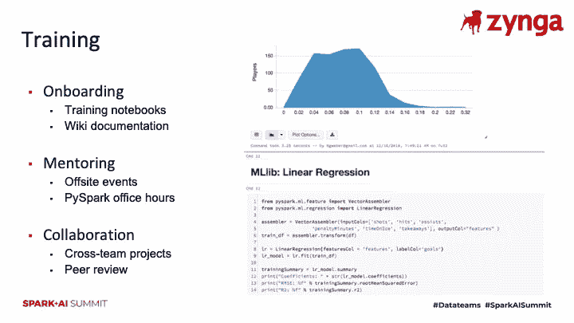

当我们过渡到 PySpark 作为大规模分析的标准化平台时，我们面临的第一个问题是我们的团队需要学习 PySpark，这可以被描述为 Python 语言的一种方言。虽然 PySpark 可以运行任何 Python 命令，但是当您利用使用这种分布式数据结构的 Spark 数据帧和库时，PySpark 的真正潜力将被释放出来，这种分布式数据结构使命令能够在一个机器集群上运行，而不仅仅是在一个驱动程序节点上运行。

为了启动采用 PySpark 运行日常任务的流程，我们开始收集培训材料，以帮助我们的团队适应这个新的生态系统。我们的培训材料包括执行常见操作的示例笔记本、我们为开始使用该平台而编写的入职培训材料，以及作为场外团队活动一部分的培训课程。我们希望提供足够的材料，以确保我们的团队能够在这个新平台上执行日常任务。

我们在这个平台上进行培训的下一步是指导。除了录制培训课程的场外活动之外，我们还提供了更直接的指导。我们举行了办公时间，在那里我们更有经验的 PySpark 用户可以为我们仍在学习该平台的团队成员回答问题。这种方法的结果喜忧参半，但一个积极的结果是，最活跃的参与者与能够提供定向反馈的导师结成了伙伴关系。

虽然我们试图在培训材料方面走在前面，但一旦平台推广到整个团队，推动平台的采用仍然是一个挑战。我们发现，推动平台采用的最佳方式之一是将需要利用平台来完成项目的不同团队配对，从而实现跨团队协作。例如，我们有一个团队正在我们的 Jupyter 笔记本电脑环境中进行强化学习项目，当我们将我们的 ML 工程团队添加到该项目中时，数据科学家了解了如何通过将现有工作流移植到 PySpark 来扩展它们。

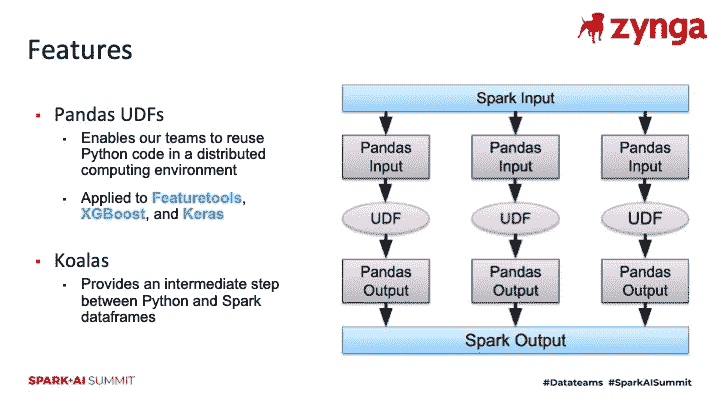

我们加快平台采用的另一种方法是利用 Python 编码人员熟悉的 PySpark 生态系统的功能，但在幕后使笔记本电脑能够在一个机器集群上以分布式方式运行。Pandas UDFs 是一种以分而治之的方式创作函数的方法，在这种方法中，您可以定义如何对数据集进行分区，编写标准 Python 代码以对数据子集进行操作，然后将结果组合回分布式数据框中。我[在 2019 年 Spark 峰会上讨论了【Zynga 如何使用这种方法。](https://www.gamasutra.com/blogs/BenWeber/20190426/340293/PortfolioScale_Machine_Learning_atZynga.php)

考拉是 PySpark 中的另一个特性，我们探索这个特性是为了让我们的分析师和数据科学家能够从 Python 代码跳到 PySpark。它提供了与 Pandas dataframes 相同的接口，但是以分布式模式执行。虽然由于实现的限制，目前不可能简单地替换这些库来使现有的 Python 代码在集群环境中工作，但它确实为学习如何使用分布式数据集提供了一个有用的桥梁。

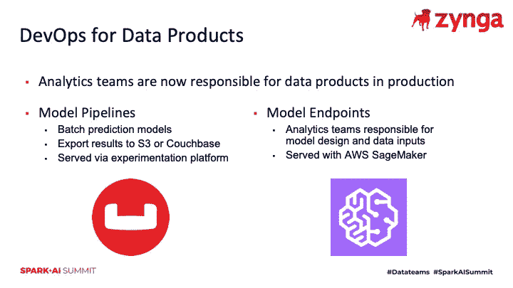

我们已经为 ML 模型分配了数据管道的所有权，这使得我们的分析团队能够将我们生产的模型数量扩大一个数量级。虽然我们以前的方法是让数据科学家构建模型规范，并将其交给我们的分析工程团队进行生产，但我们的新模型是在这些团队之间进行合作，让分析师和数据科学家拥有更多实时 ML 模型的 DevOps 方面。我们有多种方法将模型投入生产，例如构建批处理管道，将预测推送到我们的应用程序数据库，或者与 ML engineering 合作，使用 AWS SageMaker 将模型设置为 web 端点。虽然我们的分析师和数据科学家不负责监控支持这些模型的基础架构，但他们负责监控为预测服务的模型的正常运行时间和性能。

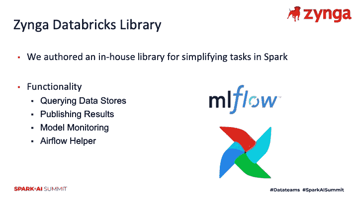

我们让我们的团队更容易访问该平台的另一种方式是创作一个内部库，该库执行我们的分析团队需要执行的常见功能。这包括读取和写入各种数据源，以及将 ML 输出发布到我们的应用程序数据库，在那里我们的实时服务可以使用预测。我们也构建了一些模型维护工具，但是随着库的成熟和提供更多的特性，我们一直在向 [MLflow](https://github.com/mlflow/mlflow) 迁移。

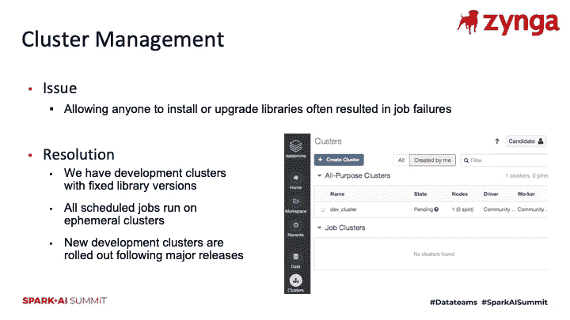

随着我们向更多的团队成员开放平台，我们面临的一个问题是不同笔记本之间的库版本冲突。我们也不想为每个用户增加一个集群，因为成本可能会失控。我们决定采用一种策略，在这种策略中，交互式集群有固定的库版本，调度的作业被设置为在临时集群上运行，这意味着调度的作业不会干扰任何其他任务。此外，对于处理新工作流的团队，团队可以请求开发集群在迁移到运行在临时集群上的计划作业之前测试工作流。

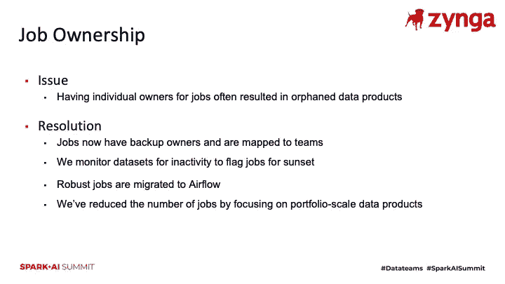

虽然我们将所有权分配给了运行作业的嵌入式团队，但我们在确定作业所有者方面仍然存在差距。在我们向所有团队开放平台之前，我们对现有作业进行了审核，并确保所有正在运行的作业都产生了可供我们的游戏团队使用的输出。一旦我们完成了审计，我们就建立了一个安排新工作的流程。现在作业需要一个所有者、一个备份所有者和一个团队别名来调度，我们收集游戏工作室正在使用的模型输出的日志。对于我们计划长期运行的任务，我们将工作流迁移到气流，在那里我们有强大的监控。

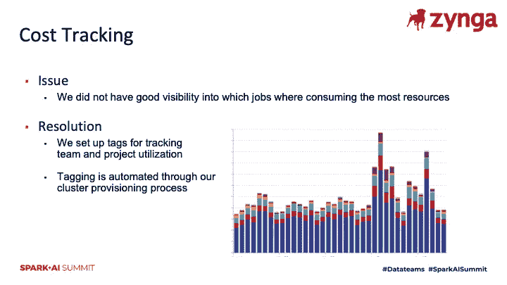

我们学到的另一课是关于成本跟踪。我们在一个新的平台上释放了一个兴奋的团队，我们的团队渴望使用 GPU 等功能来训练深度学习网络。虽然任何人都可以连接笔记本电脑和运行 PySpark 脚本，但我们将集群创建限制在我们的 ML 工程团队，这是分析工程的一部分。为了控制成本，我们使用脚本标记所有集群，以确保我们可以监控费用。我们还会淘汰旧集群，并根据需要淘汰特定于项目的集群。我们的目标是避免需要特定库的长时间运行的集群，而是建立具有最新库的共享集群。

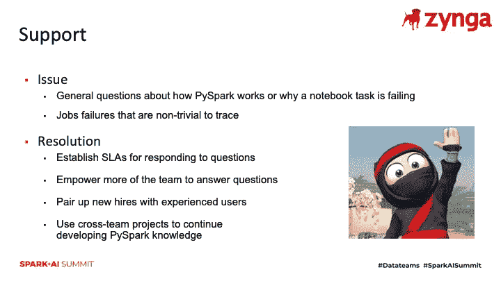

我们打开了这个新平台的闸门，但需要一些推动才能让团队探索这个平台。虽然这是一个类似于 Jupyter 的笔记本电脑环境，但它也面临着挑战。例如，Spark 中任务的延迟执行给我们的团队带来了具有挑战性的调试工作。任务不会立即失败，脚本可能会在失败前完成几个步骤。

虽然我们最初的方法是有一个松散的频道作为 Spark 问题的总括，但当我们将较新的 Spark 用户与有经验的 Spark 用户配对时，我们发现信噪比更高。我们还关注跨团队合作，以确保我们有不同经验水平的人在项目中工作。

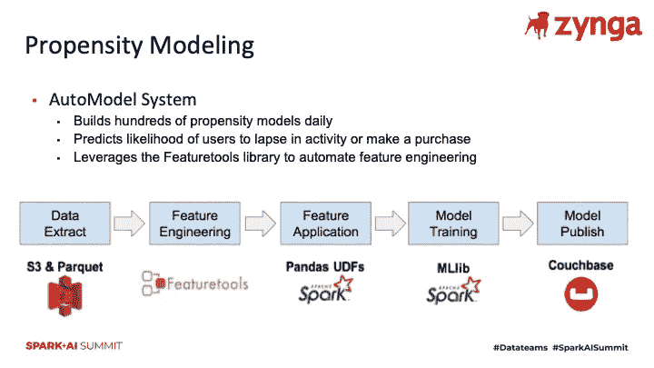

我们发现成功采用 PySpark 的第一个项目是 [AutoModel](https://www.gamasutra.com/blogs/BenWeber/20190426/340293/PortfolioScale_Machine_Learning_atZynga.php) 系统，该系统每天构建数百个倾向模型。这是一个端到端的工作流，它从我们的数据湖中提取数据，使用 Featuretools 库应用自动化特征工程，并使用 Spark 附带的 MLib 库训练分类模型。工作流的输出是写入我们的应用程序数据库的预测分数，该数据库构建在 Couchbase 上。一旦结果发布到 Couchbase，我们的游戏团队就可以使用预测值来设置实验和个性化游戏体验。虽然我们对这个系统有一些用例，这为我们所有的游戏创造了失效的可能性和购买预测的可能性，但我们的产品经理为这些预测值提出了我们没有预料到的新应用。

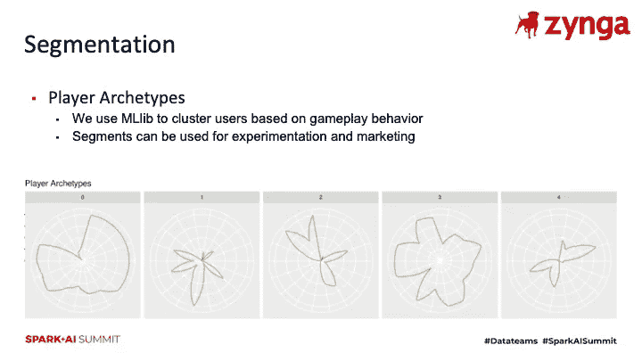

Zynga 的 PySpark 的另一个用例是使用我们的数据将玩家分为不同的玩家原型，这使我们能够更好地了解我们的玩家群。虽然一些嵌入式分析师已经为特定的游戏做了这种类型的工作，但这通常是一次性的工作，而不是为我们的游戏团队提供最新细分市场的计划任务。我们能够使用 PySpark 将这些细分模型投入生产，使这些细分能够用于我们的实验堆栈。虽然与 scikit-learn 相比，我们在 MLlib 中可用于聚类玩家的算法较少，但我们能够标准化我们的方法，并将此管道应用于我们产品组合中的多个游戏。

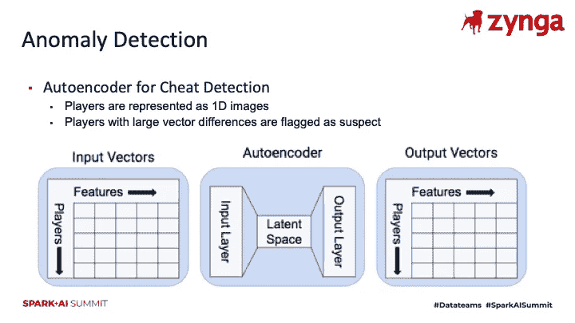

我们的分析团队在过去几年中参加了黑客马拉松，这是我们的分析团队在 PySpark 上尝试项目的绝佳机会。这些项目产生的一个新颖应用是使用深度学习的异常检测系统。该系统将用户活动编码为 1D 图像，使用自动编码器将图像压缩到潜在空间，然后使用自动编码器解压缩图像。输入和输出图像之间有很大差异的玩家会被进一步调查。虽然这个工作流仅限于单个机器而不是集群，但我们的团队能够利用 GPU 设置的大型实例来快速迭代 Tensorflow 模型。这是开放这个平台真正有利于我们正在探索的一些工作的一个很好的方式。

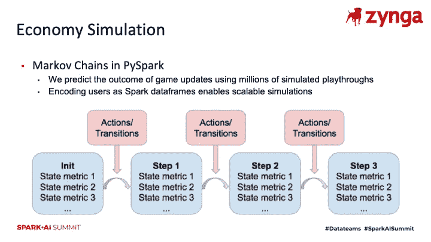

我们在 PySpark 中看到的一个主题是，它支持组合规模分析，为特定游戏开发的方法通常可以扩展到多个游戏。这方面的一个例子是我们的老虎机分析团队最初探索的经济模拟项目。虽然这个工作流的最初版本是针对这种类型的游戏的，但该团队能够将模拟游戏经济概括为马尔可夫链，并将该方法移植到使用 Spark 数据框架。其结果是一种方法，可以提升到跨我们的几个游戏的大型模拟。

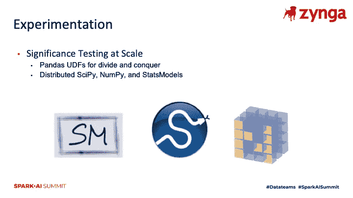

虽然我们发现的大多数新应用程序都专注于构建 ML 管道，但我们也发现 PySpark 对于扩展其他类型数值计算的工作负载很有用。使用 Pandas UDFs，我们能够使用现有的笔记本，并使用分而治之的方法使代码在一个机器集群上并发运行。这使我们能够使用 scipy、numpy 和 statsmodels 库进行分布式工作，并帮助完成缩放任务，例如 A/B 测试的显著性测量。

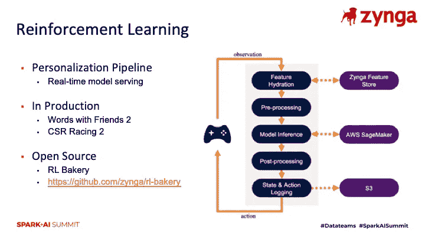

我还想展示 Zynga 的另一个项目，这是我们的强化学习管道，名为 [RL Bakery](https://github.com/zynga/rl-bakery) 。虽然这个工作流没有直接使用 PySpark，但我们发现我们的一些数据科学家正在使用 Spark 进行深度学习模型的离线训练，我们需要一个管道来实时服务这些模型，并为模型提供在线更新。我们已经使用这个管道为 Word With Friends 2 和 CSR Racing 2 的生产中的强化学习模型提供服务，示例应用程序包括通知计时。

回顾本次会议的收获，我们已经向我们的整个分析团队开放了我们的 Spark 基础设施，结果是为游戏工作室开发了新颖的应用程序，这些应用程序现在正在为直播服务提供支持。虽然推动该平台的采用需要一些时间，但随着更多团队成员开始使用该平台，我们确实建立了势头，并且我们专注于能够利用 PySpark 快速扩大规模的跨团队项目。我们还面临着管理机器集群和库版本的挑战，以及控制成本的挑战，但产出的提高完全值得付出这些成本。Zynga 的 PySpark 民主化使我们的分析组织能够解决新的大规模问题，并使我们的分析团队能够接触到更多大数据工具。

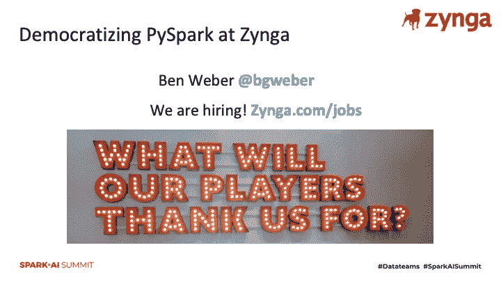

感谢您参与本次会议。Zynga analytics 正在招聘，你可以在这里找到空缺职位的名单。