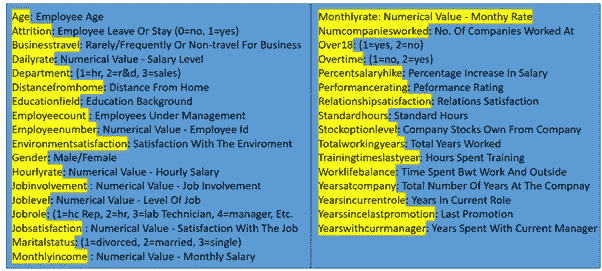
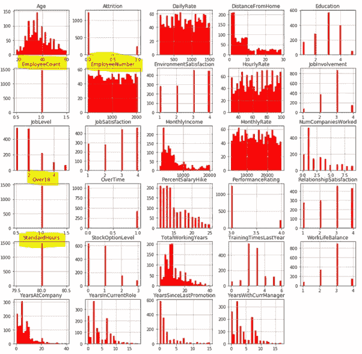
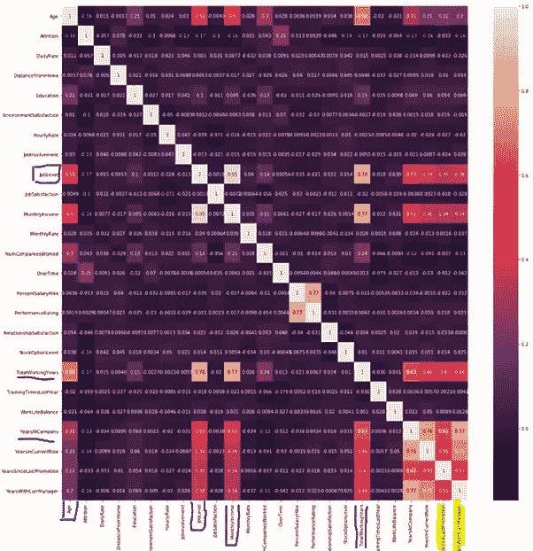
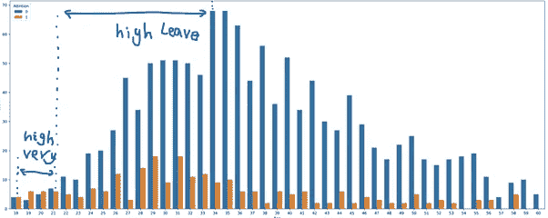
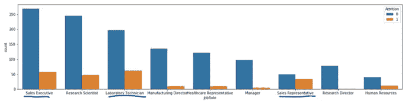
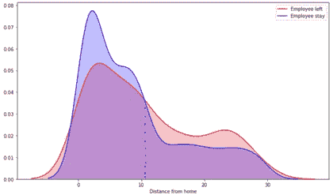
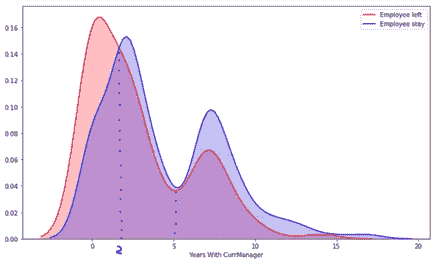
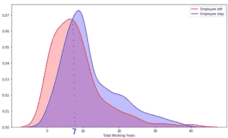
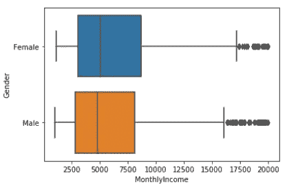
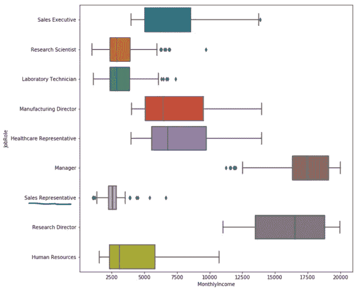

# 揭开员工离开 EDA 的神秘面纱

> 原文：<https://towardsdatascience.com/demystify-employee-leaving-with-eda-2ed96525f3a7?source=collection_archive---------33----------------------->

## 解释性数据分析，具有深刻的视觉效果和有趣的发现


来自 pixabay 的 Img 通过[链接](https://pixabay.com/photos/brexit-leave-remain-europe-exit-4131852/)

**在之前的帖子中，我试图预测一个银行客户是否可能离开，或者一个应用程序用户是否可能流失或订阅。现在，我将分享最近在人力资源领域的工作，给那些努力留住员工的公司带来一些预测能力。**

在这第一篇文章中，我将重点探索数据集的任何有趣的模式。一如既往，它分为以下几部分:

1.问题陈述

2.数据审查

3.分布分析

4.独立变量相关分析

5.响应变量相关分析

6.外卖食品

让我们开始旅程吧🏃‍♂️🏃‍♀️.

**1。问题陈述**

如果你来自人力资源部门，你可能会同意雇佣和留住员工是复杂的任务，需要资金、时间和技能。

> 根据 [toggle hire](https://toggl.com/blog/cost-of-hiring-an-employee) 的说法，公司花费员工工资的 15%-20%来招聘一名新的候选人。在一家拥有 0-500 名员工的公司中，雇佣一名员工的平均成本为 7645 美元🙀🙀。

作为一名数据科学家，你的任务是开发一个可以预测哪些员工更有可能辞职的模型。您的发现将有助于更有效地留住员工。

**2。数据回顾**

这里使用的数据集是来自 [Kaggle](https://www.kaggle.com/pavansubhasht/ibm-hr-analytics-attrition-dataset/activity) 的 IBM HR Analytics 数据集。共有 1470 条记录，包含 35 个特征。查看下面的视频，真正接触原始数据集。

为了更好地理解每个特性的含义，我在下面做了一个易于查看的图。



图 1 数据变量概述

要了解数值变量的分布，请使用下面的。

```
employee_df.describe()
```

对于数据质量检查(如果每列中有任何空数据或缺失数据)和查看数据类型，请使用以下内容:

```
employee_df.info()
```

请注意，您还可以使用下面的命令来检查数据帧中是否有 NA 值:

```
employee_df.isna().any()
employee_df.isnull().any()
```

**通过以上所有内容，我们发现 26 个数值变量和 9 个分类变量没有缺失值。**

**3。分布分析**

我们使用直方图作为数值变量分布分析的简单可视化。

首先，让我们将二进制分类数据转换成数字。使用带有 lambda 的单行函数来应用于整个列。然后，pandas 内置绘图功能来创建直方图。具体来说，

```
employee_df[‘Attrition’] = employee_df[‘Attrition’].apply(lambda x: 1 if x == ‘Yes’ else 0)
employee_df[‘OverTime’] = employee_df[‘OverTime’].apply(lambda x: 1 if x == ‘Yes’ else 0)
employee_df[‘Over18’] = employee_df[‘Over18’].apply(lambda x: 1 if x == ‘Y’ else 0)
employee_df.hist(bins = 30, figsize= (15, 15), color = 'r')
```



图 2 数值变量的分布分析

**回顾图 2，您可能会发现*“员工人数”、“18 岁以上”和“标准工时”*栏没有价值，因为这些对所有员工都是一样的**。因此，让我们删除它们:

```
employee_df.drop([‘EmployeeCount’, ‘EmployeeNumber’, ‘Over18’, ‘StandardHours’], axis = 1, inplace = True)
```

**4。自变量相关性分析**

> 变量相关性是一个值得每个数据科学家关注的重要问题。

通常，相关要素不会提高模型性能。考虑到维数灾难和模型的可解释性，移除相关特征是明智的。要执行相关性分析，请使用:

```
correlations = employee_df.corr()
plt.subplots(figsize = (20, 20))
sns.heatmap(correlations, annot = True)
```

图 3 显示了一些明显的相关性。例如，*‘总工作年数’*与*‘工作级别’*和*‘月度收入’*有很强的相关性。**一般来说，我们可以看到相当多的变量相关性很差。太好了，因为我们希望用彼此不高度相关的特征来训练预测模型。**



图 3 预测因子的相关性分析

**5。响应变量相关性分析**

为了分析每个特征如何影响员工休假，我们可以检查每个变量相对于响应变量的分布。

首先，对于员工*【年龄】*，我们用**计数图**，

```
plt.figure(figsize = (25, 10), dpi = 300)
sns.countplot(x = ‘Age’, hue = ‘Attrition’, data = employee_df )
```

图 4 显示了 25-35 岁之间的员工，与其他年龄组相比，显示了较高的休假比率。在 21 岁以下，可以看到很高的离职率，表明年轻的专业人士更有可能离开公司🤭。



图 4 员工休假计数图与年龄

第二，对于*‘job role’*，计数情节为:

```
sns.countplot(x = ‘JobRole’, hue = ‘Attrition’, data = employee_df)
```

图 5 显示 ***【销售主管】*【销售代表】*【实验室技术员】*相比其他角色**更有可能离职。



图 5 员工休假曲线图与*工作职责*

第三，让我们用 KDE(核密度估计)来分析数值变量的概率密度函数。

> KDE 采用带宽和核函数，通过加权每个样本附近的距离来近似人口的真实分布。附近的数据点越多，估计值就越高，表示看到一个点的概率。带宽决定了最终曲线的“平滑”程度。较低的带宽意味着只有靠近当前位置的点被赋予权重。解释的够多了，如果想要更多的介绍，试试这个[链接](https://mathisonian.github.io/kde/)。我们来看看如何实现。

对于变量*‘距离原点’*，

```
sns.kdeplot(left_df[‘DistanceFromHome’], label = ‘Employee left’, shade = True, color = ‘r’, )
sns.kdeplot(stayed_df[‘DistanceFromHome’], label = ‘Employee stay’, shade = True, color = ‘b’)
```

如图 6 所示，**当离家的距离大于 10 公里时，更多的员工倾向于离开**🆒🆒。



图 6 KDE 距离图

对于变量*【任职年限】*，**更多的员工倾向于在任职不到 2 年的情况下离开，现任经理**，**倾向于在任职超过 5 年的情况下留在🧨🧨**，如图 7 所示



图 7 使用 CurrManager 的*年 KDE 曲线图*

对于变量*‘总工作年数’*，**更多的员工倾向于在工作不到 7 年时离开** ️📣如图 8 所示



图 8*总工作年限*的 KDE 曲线图

现在，让我们用**箱线图**来形象化地比较*【每月收入】*在*【性别】*之间的分布。如图 9 所示，**女性和男性月收入显示出相似的可变性，具有相似的中位数、75%和 25%四分位值**👏👏如图 9 所示



图 9*月收入 btw 性别*箱线图

最后，让我们看看不同的*【工作角色】*收入分配。图 10 显示了不同角色的月收入分布和可变性。**有趣的是，我们发现“*销售代表*”的分布很紧凑，收入普遍低于其他职位**🙀。这可以解释为什么*【销售代表】*倾向于离开更多，如图 5 所示



图 10*月收入 btw 岗位职责*箱线图

**6。外卖**

*   数据质量检查告诉我们，我们的数据集非常干净，没有丢失值。
*   独立变量相关性分析表明，相当多的特征似乎彼此相关性很差。
*   自变量和响应变量之间有趣的模式显示了员工可能离职的一些线索。

希望这能对如何更好地理解你的员工或同事的离职决定有所启发。

**太好了！这趟旅程的终点。在下一篇文章中，我们将关注真正有趣的部分:建模。在那里见💕💕**