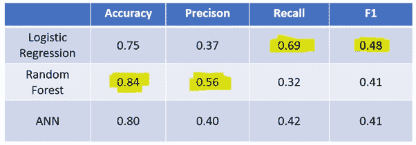

# 用机器学习揭开员工离职之谜

> 原文：<https://towardsdatascience.com/demystify-employee-leaving-with-machine-learning-4016fd6a3b?source=collection_archive---------40----------------------->

## 用于休假预测的少数机器学习模型的创建和评估


来自 unsplash 的 Img 通过[链接](https://unsplash.com/photos/SpgnXs5eTu8)

在以前的帖子中，我试图预测银行客户是否可能离开，或者应用程序用户是否可能流失或订阅。在这里，我将分享最近在人力资源领域的工作，给任何努力留住员工的公司带来一些预测能力。

在这第二篇文章中，我的目标是评估和对比一些不同模型的性能。一如既往，它分为:

1.数据工程

2.数据处理

3.模型创建和评估

4.外卖食品

**1。数据工程**

在第一篇[帖子](https://medium.com/@vistaxjtu/demystify-employee-leaving-with-eda-2ed96525f3a7)中完成了简短的数据探索之后，让我们继续进行特征工程和数据编码。特征工程包括从当前特征创建新特征和关系。

首先，让我们把分类变量和数字变量分开。我们可以使用 ***数据类型方法*** 来查找分类变量，因为它们的 ***数据类型*** 将是*‘对象’*。您可能会注意到，在使用***employee _ df . info()***时，已经显示了数据类型。

然后，我们可以对分类变量进行编码。有两种方法可用。一个是用来自 sklearn 的 ***OneHotEncoder，一个是来自 ***熊猫*** 的***get _ dummies()***。我更喜欢后者，因为它返回一个 dataframe，使下面的步骤变得容易。具体来说，***

```
employee_df_cat = pd.get_dummies(employee_df_cat)
```

然后，将编码的分类变量和数字变量连接在一起。具体来说，

```
X_all = pd.concat([X_cat, X_numerical], axis = 1)
```

最后一步是生成目标变量。

```
employee_df[‘Attrition’] = employee_df[‘Attrition’].apply(lambda x: 1 if x == ‘Yes’ else 0)
y = employee_df[‘Attrition’]
```

**2。数据处理**

现在我们准备好处理数据，包括数据分割、缩放和平衡。

为了使数据为训练做好准备，我们需要缩放特征以避免任何变量支配其他变量，即采取更高的权重和对模型学习的强烈影响。具体来说，

```
from sklearn.preprocessing import MinMaxScaler
scaler = MinMaxScaler()
X = scaler.fit_transform(X_all)
```

现在，让我们将数据集划分为训练集和测试集。要拆分数据，

```
from sklearn.model_selection import train_test_split
X_train, X_test, y_train, y_test = train_test_split(X, y, test_size = 0.25)
```

我们已经注意到员工去留严重失衡。所以让我们实现 **SMOTE** 方法来对少数类进行过采样。具体来说，

```
oversampler = SMOTE(random_state=0)
X_smote_train, y_smote_train = oversampler.fit_sample(X_train,y_train)
```

太好了！现在模型的数据已经准备好了📣📣。

**3。模型创建&评估**

正如本文开头提到的，我们的目标是评估和比较一些模型的性能。

3.1 逻辑回归

简单地说，逻辑回归对独立变量的线性组合使用对数变换，这允许我们以线性方式对非线性问题建模。通常用于二元分类问题，其中假设预测值和响应变量之间存在某种相关性。

为了创建一个逻辑回归分类器，我们使用 sklearn 如下。

```
from sklearn.linear_model import LogisticRegression
model = LogisticRegression()
model.fit(X_smote_train, y_smote_train)
```

为了评估性能，我们使用混淆矩阵。

```
y_pred = model.predict(X_test)
cm = confusion_matrix(y_pred, y_test)
sns.heatmap(cm, annot= True)
```

如图 1 所示，逻辑回归分类器给出的准确度为 0.75，F1 值为 0.52。


图 1 逻辑回归模型的混淆矩阵

3.2 随机森林

随机森林是一种以决策树为构建块的集成模型。它创建了一组决策树，并使用它们的集体预测能力来获得相对较强的性能。要想真正了解兰登森林的基础知识，可以参考这个[公民网博客](https://blog.citizennet.com/blog/2012/11/10/random-forests-ensembles-and-performance-metrics)。

要创建随机森林分类器，

```
from sklearn.ensemble import RandomForestClassifier
model = RandomForestClassifier()
model.fit(X_smote_train, y_smote_train)
```

使用相同的方法来评估性能，我们获得了 0.85 的准确度和 0.39 的 F1 分数。


图 2 随机森林模型的混淆矩阵

3.3 人工神经网络

最后的尝试是创建和训练一个人工神经网络。在这里，我们将建立一个具有几个密集层的顺序模型，并使用剔除技术来减少过拟合。具体来说，

```
from keras.models import Sequential
from keras.layers import Dense, Dropout
model = Sequential()
model.add(Dense(units = 50, activation = ‘relu’, input_shape = (50, )))
model.add(Dense(units = 500, activation = ‘relu’))
model.add(Dropout(0.3))
model.add(Dense(units = 500, activation = ‘relu’))
model.add(Dropout(0.3))
model.add(Dense(units = 50, activation = ‘relu’))
model.add(Dense(units = 1, activation = ‘sigmoid’))
```

为了编译神经网络，我们使用*‘亚当’*优化器和二元交叉熵作为损失函数。

```
model.compile(optimizer=’adam’, loss = ‘binary_crossentropy’, metrics = [‘accuracy’])
epochs_hist = model.fit(X_smote_train, y_smote_train, epochs = 50, batch_size = 50)
y_pred = model.predict(X_test)
y_pred = (y_pred > 0.5)
```

如上所述，我们将 sigmoid 函数输出的阈值概率设置为 0.5。因此，任何大于 0.5 的输出被视为“离开”，否则被视为“停留”。图 3 显示了训练期间的模型损失。似乎该模型在 20 个纪元内达到了收敛。


图 3 训练过程中的模型丢失

最后，如图 4 所示的混淆矩阵热图给出了 0.88 的准确度和 0.41 的 F1 分数。


图 4 人工神经网络的混淆矩阵

**4。外卖**

最后，让我们将性能汇总在表 1 中。为了更好地理解指标，后退一步。我们的任务是预测员工是否可能离职。由于类别之间的高度不平衡，准确性不是一个好的指标。在我看来，减少假阴性错误比假阳性更有意义，因为该模型可以识别更多正在离开的人🤔。基于这个逻辑，逻辑回归模型是赢家。但显然，还有相当大的提升空间。



表 1 模型性能概述

**太好了！希望这篇文章为不同的 EDA 和机器学习技术打下良好的基础。像往常一样，如果你对代码感兴趣，可以查看我的 GitHub 资源库** [**这里**](https://github.com/luke4u/Customer_Behaviour_Prediction) **🤞🤞。**