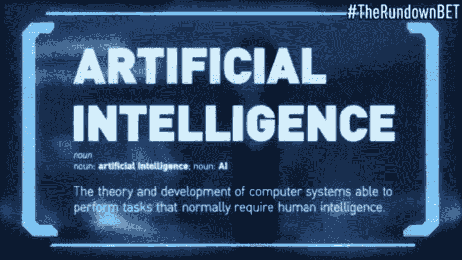

# 揭秘人工智能！

> 原文：<https://towardsdatascience.com/demystifying-artificial-intelligence-d2887879aaf1?source=collection_archive---------41----------------------->

## 打破人工智能领域和它的未来。

GIF 来自 [GIPHY](https://giphy.com/gifs/therundownbet-funny-comedy-l4pTsNgkamxfk2ZLq)

根据[麦肯锡全球研究所](https://www.mckinsey.com/featured-insights/artificial-intelligence/notes-from-the-ai-frontier-modeling-the-impact-of-ai-on-the-world-economy#)的一项研究，预计到 2030 年，人工智能每年将创造 13 万亿美元的额外价值。即使在今天，人工智能技术也产生了巨大的收入，但主要是在软件领域。

然而，到 2030 年，将产生的收入将在软件行业之外，特别是在零售、旅游、运输、汽车、材料、制造等行业。

人工智能将在几个领域产生巨大影响，但围绕它也有很多不必要的炒作。人工智能的“金发姑娘法则”指出，人们不应该对人工智能技术持乐观或过于悲观的态度。

虽然承认人工智能将拥抱世界的现实期望是令人敬畏的，但理解和揭穿围绕人工智能的神话同样重要。

人工智能、机器学习(ML)和深度学习(DL)这些热门词汇在最近被频繁使用。让我们分别反省一下每个方面，以便真正理解这些概念。

在这篇文章中，我们将揭开人工智能的所有概念，并完美地理解它的每个方面，以便在这个问题上没有任何困惑。

所以，事不宜迟，让我们开始打击——**人工智能。**

# 缩小人工智能的领域

照片由[格雷格·拉科齐](https://unsplash.com/@grakozy?utm_source=medium&utm_medium=referral)在 [Unsplash](https://unsplash.com?utm_source=medium&utm_medium=referral) 上拍摄

人工智能的主题是巨大的，类似于巨大的银河系。人工智能(AI)是一个广泛的领域，有许多子类别，如自然语言处理(NLP)、人工神经网络、计算机视觉、机器学习、深度学习、机器人等等。人工智能的正式定义是—

***“能够执行通常需要人类智能的任务的计算机系统的理论和发展，如视觉感知、语音识别、决策和语言之间的翻译。”***

然而，即使在我们开始深入这些其他领域之前，人工智能也可以缩小到以下两个独立的更广泛的领域:

1.  **人工狭义智能—** 执行一项或几项特定的任务，这些任务是通过编程来完成的。这些例子包括自动驾驶汽车、下一个单词预测、自动更正等。这是我们将关注的主要概念。
2.  **人工通用智能—** 它们执行类似人类的活动和任务。通用人工智能是一种智能，可以像人类一样高效地执行任何智力任务。在这一领域仍有许多进展要做。

还有另一个术语叫做超级人工智能或强人工智能，被认为是超越人类的人工智能。然而，这只是一个假设的概念，本文不会讨论，因为我们在未来几年还远远没有达到这种智能水平。

为了理解人工智能的概念和围绕它的各个方面，我开发了一个关于宇宙的简单类比。

浩瀚的银河系类似于人工智能的广阔领域。它包含了数十亿个太阳系，类似于人工智能是如何由这么多子领域组成的。我们的太阳系类似于人工智能中的一个子领域，即“机器学习”。地球是我们太阳系中唯一可居住的星球，可以被称为“深度学习”。

通过我们的类比，我们可以得出这样的结论:人工智能类似于浩瀚的银河系，这是一个由子课题组成的广阔领域，如可以与我们的太阳系相提并论的机器学习，深度学习是机器学习的子课题，类似于太阳系中的地球。下面是一个简单的参考，以便更好地理解这个类比。

AI =银河系| ML =太阳系| DL =地球

让我们讨论一下人工智能的其他重要方面，即机器学习、深度学习和数据。

[亚历山大·奈特](https://unsplash.com/@agk42?utm_source=medium&utm_medium=referral)在 [Unsplash](https://unsplash.com?utm_source=medium&utm_medium=referral) 上拍照

# 机器学习:

机器学习是程序自动学习和提高效率的能力，而无需显式编程。这意味着给定一个训练集，你可以训练机器学习模型，它将理解一个模型到底是如何工作的。在对测试集、验证集或任何其他看不见的数据进行测试时，模型仍然能够评估特定的任务。

让我们用一个简单的例子来理解这一点。假设我们有一个 30，000 封电子邮件的数据集，其中一些被分类为垃圾邮件，一些被分类为非垃圾邮件。机器学习模型将在数据集上训练。一旦训练过程完成，我们可以用一封没有包含在我们的训练数据集中的邮件来测试它。机器学习模型可以对以下输入进行预测，并正确分类输入的电子邮件是否是垃圾邮件。

机器学习的三种主要类型如下:

1.  **监督学习—** 这是一种用专门标记的数据集训练模型的方法。数据集可以是二元分类，也可以是多类分类。这些数据集将具有指定正确和错误选项或一系列选项的标注数据。在监督下，即在这些标记数据的帮助下，对模型进行预训练。
2.  **无监督学习—** 无监督学习是在无标签数据集上训练模型。这意味着模型没有先验信息。它通过将相似的特征和模式组合在一起来训练自己。无监督学习的一个例子可以是狗和猫的分类。
3.  **强化学习—** 强化学习是一种试凑法模型。这是模型通过重复失败来学习的方法。当一个模型没有达到期望的结果时，该模型将重新训练。这可以应用于像下棋这样的概念，在玩了数百万局游戏后，模型将能够学习适当的模式和移动。

随着对机器学习的想法和认识的清晰，我们现在可以继续前进到数据的基本概念以及为什么它对我们如此重要。

斯蒂芬·菲利普斯-Hostreviews.co.uk 在 [Unsplash](https://unsplash.com?utm_source=medium&utm_medium=referral) 上拍摄的照片

# 数据:

**数据**可以被认为是适用于执行机器学习或深度学习任务的任何可用的有用资源或信息。您想要构建的每个模型都有大量数据可用。重要的是搜集并找到完成评估所需的有价值的数据。

数据集是数据的集合。在表格数据的情况下，数据集对应于一个或多个数据库表，其中表的每一列代表一个特定变量，每一行对应于所讨论的数据集的给定记录。

在当今时代，人工智能的普及速度比以往任何时候都快，为此，我们必须感谢**数据**的丰富和增长。由于数据量的增加，人工智能的增长速度大大加快。

更多的数据可以更好地训练机器学习或深度学习模型，因为我们能够在更大的数据集上训练模型，这有助于模型在训练中更好地学习，通常可以更好地执行手头的任务。

数据科学就是关于数据的。这个术语有时可能会被随意抛弃，但它对任何项目来说都是最有价值的资源。大数据、数据科学和数据分析领域正在迅猛发展。科技巨头正在加大对有用数据收集的投资。

数据收集是在一个已建立的系统中收集和测量目标变量信息的过程，然后使人们能够回答相关问题并评估结果。要了解更多关于数据收集和每个机器学习和数据科学项目所需的其他基本技术，请查看下面的文章。

 [## 机器学习和数据科学项目的 10 步终极指南！

### 详细讨论构建您的机器学习和数据科学项目的最佳方法…

towardsdatascience.com](/10-step-ultimate-guide-for-machine-learning-and-data-science-projects-ed61ae9aa301) 

照片由[克莱门特 H](https://unsplash.com/@clemhlrdt?utm_source=medium&utm_medium=referral) 在 [Unsplash](https://unsplash.com?utm_source=medium&utm_medium=referral) 上拍摄

# 深度学习:

深度学习是机器学习的一个子领域，它基于人工神经网络的概念来执行特定的任务。人工神经网络从人脑中提取灵感。

然而，最重要的是要注意，它们在理论上并不像我们的大脑那样运作，*一点也不像！它们被命名为人工神经网络，因为它们可以完成精确的任务，同时达到理想的精度，而无需用任何特定的规则显式编程。*

几十年前，深度学习非常流行，但由于缺乏计算复杂计算的数据和技术，它最终失去了大部分宣传。

然而，在过去几年里，这种情况发生了显著变化。大量的数据每天都在激增，因为大型科技巨头和跨国公司正在投资这些数据。由于强大的图形处理单元(GPU)，计算能力也不再是一个大问题。

深度学习的强化每天都在快速增加，尤其是有了巨大的改进。深度学习在今天非常受欢迎，并且具有远远超过现代大多数机器学习算法的巨大潜力。

如果你有兴趣了解更多关于深度学习和人工神经网络的历史，那么请随意访问下面的文章。

 [## 神经网络的完整有趣和复杂的历史！

### 重温人工神经网络发展背后的迷人历史

towardsdatascience.com](/the-complete-interesting-and-convoluted-history-of-neural-networks-2764a54e9e76) 

库纳尔·辛德在 [Unsplash](https://unsplash.com?utm_source=medium&utm_medium=referral) 上拍摄的照片

# 结论:

人工智能是当今发展最快的领域。据[财富](https://fortune.com/2019/12/10/artificial-intelligence-hottest-job/#:~:text=That%20role%2C%20A.I.,past%20four%20years%2C%20LinkedIn%20said.)报道，统计数据显示，人工智能专家的雇佣量在过去 4 年里增长了 74%。人工智能被认为是当代人最热门的工作。

对熟练人工智能专家的需求正以前所未有的速度增长。对机器学习、深度学习、计算机视觉、统计学和自然语言处理等人工智能子领域专家的需求和空缺职位每天都在激增。

由于我们周围存在巨大的机会，我们很幸运处于人工智能兴起的时代。我们被人工智能包围着，我发现这个领域的快速进步非常令人着迷。我对未来更新的技术和人工智能的兴起感到兴奋。

我很想知道你们所有人对人工智能的不断进步和崛起有何看法。是让你兴奋，还是你真的不太在乎？不管怎样，知道这个会很酷。😄

看看我的其他一些文章，你可能会喜欢读！

 [## 用代码和例子简化函数的 args 和 kwargs！

### 理解 python 编程和机器学习的*args 和*kwargs 的完整概念。

towardsdatascience.com](/simplifying-args-and-kwargs-for-functions-with-codes-and-examples-b785a289c2c2)  [## 简单有趣的万圣节 Python 项目！

### 这是一个有趣的“不给糖就捣蛋”的游戏，让你在万圣节愉快地学习 python 编程

towardsdatascience.com](/simple-fun-python-project-for-halloween-ff93bbd072ad)  [## 5+独特的 Python 模块，用于创建脱颖而出的机器学习和数据科学项目！

### 超过 5 个酷 Python 库模块的指南，用于创建令人敬畏的机器学习和数据科学项目。

towardsdatascience.com](/5-unique-python-modules-for-creating-machine-learning-and-data-science-projects-that-stand-out-a890519de3ae)  [## 用代码和例子理解 Python 中的高级函数！

### 详细了解 python 中的匿名函数和高级函数及其实际应用…

towardsdatascience.com](/understanding-advanced-functions-in-python-with-codes-and-examples-2e68bbb04094) 

谢谢你们坚持到最后。我希望你们喜欢阅读这篇文章。我希望你们都有美好的一天！