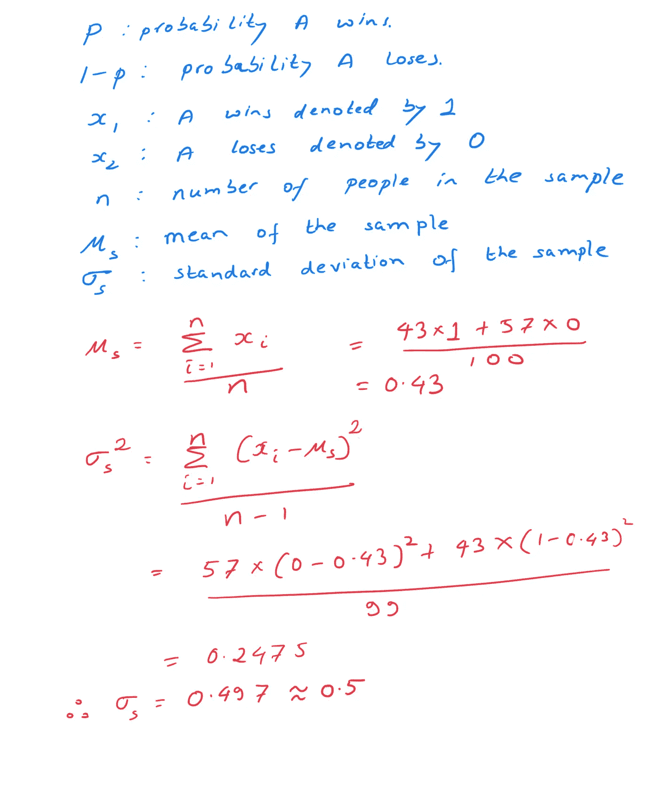
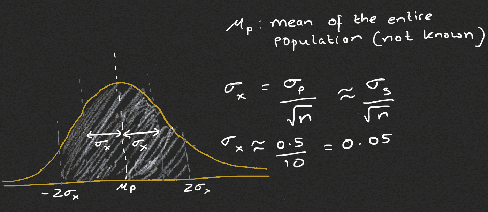
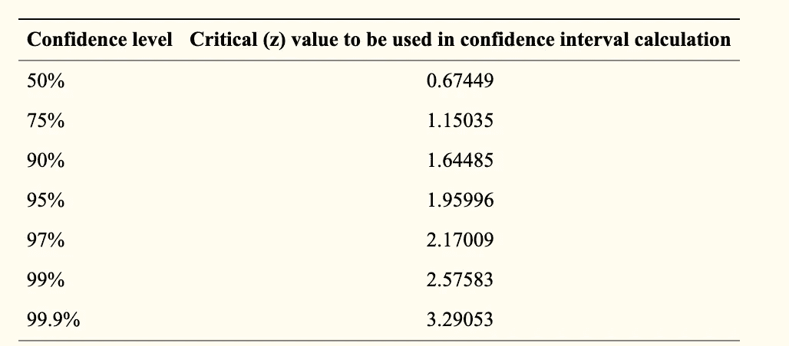
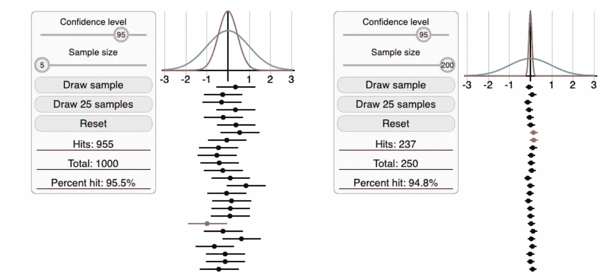

# 揭秘置信区间和误差范围

> 原文：<https://towardsdatascience.com/demystifying-confidence-interval-and-margin-of-error-e01c1bc8760b?source=collection_archive---------30----------------------->

## 从统计学上说，我有 95%的信心到底意味着什么？

来自[派克斯](https://www.pexels.com/photo/people-discuss-about-graphs-and-rates-3184292/?utm_content=attributionCopyText&utm_medium=referral&utm_source=pexels)的[派克斯](https://www.pexels.com/@fauxels?utm_content=attributionCopyText&utm_medium=referral&utm_source=pexels)拍摄的照片

我最近看到了盖洛普国际协会电晕跟踪器的调查

> 我们都喜欢阴谋论！全球 36%的人将新冠肺炎归咎于外国势力。在 95%的置信水平下，调查的误差幅度为 3。本次调查在全球范围内进行了 20，000 多次采访。

我试图找到更多关于置信区间和误差幅度的信息，但对于没有深入统计学知识的人来说，它们似乎很难理解。挑战在于，大多数解释依赖于大量外行可能不知道的行话。

在这篇文章中，我会试着解释误差范围和置信区间的概念，而不用太多的数学和花哨的统计术语。

照片由 [Element5 数码](https://unsplash.com/@element5digital?utm_source=medium&utm_medium=referral)在 [Unsplash](https://unsplash.com?utm_source=medium&utm_medium=referral) 上拍摄

比方说，一家新闻机构正在试图计算在即将到来的选举中，有百分之多少的人会投票给一个政党。由于几乎不可能采访全部人口，他们随机选择了 100 人作为样本。在接受采访的 100 人中，有 43 人愿意投 ***A*** 。

让我们用数学术语来转换这个问题。我们要说，抽样一个将要投 ***A*** 的人相当于抽样 1，抽样一个不打算投 ***A*** 的人相当于抽样 0。这意味着在这 100 个样本中，43 个是 1，其余 57 个是 0。

# 现在让我们定义一些数学符号:

这里你可能会奇怪为什么计算标准差的分母是 ***n-1*** 而不是 ***n*** *。*这是通过使用贝塞尔修正来消除总体方差估计中的偏差。更多信息，请参考此处的。

对于均值 **μ_p** (未知)、标准差 **σ_p** (未知)的总体，[中心极限定理](https://en.wikipedia.org/wiki/Central_limit_theorem)告诉我们:

*   如果我们从替换总体中随机抽取足够多的样本，那么样本均值的分布将是近似正态的。
*   抽样分布的平均值可以用来估计真实的总体平均值 **μ_p**
*   抽样分布的样本标准差( **σ_x)** 由 **σ_p/√n** 给出(即总体的标准差除以样本中的观察数)。

> **重要的补充说明:**只有当我们的样本是随机的，即它们代表总体时，上述估计才成立。

为了计算 **σ_x，**我们需要未知总体的标准差( **σ_p** )。相反，我们使用样本的标准偏差( **σ_s** )来估计 **σ_p** 在使用贝塞尔校正去除偏差之后。

## 置信区间(CI)和误差范围的计算:

从上面的分布中，让我们找到一个区间，即我们可以 95%确定包含真实总体均值( **μ_p，**其值与抽样分布的均值( **μ_s** ))的值范围。说总体均值( **μ_p** )有 95%的概率在区间内，这是不太正确的。总体均值( **μ_p** )有一个我们不知道的固定值。如果我们重复进行相同的实验，它不会改变总体平均值( **μ_p** )。因此，询问总体均值( **μ_p** )在一定范围内的概率是不正确的。相比之下，我们计算的置信区间取决于收集的样本。如果我们重复这个实验，置信区间几乎肯定会不同。所以我们应该问区间包含总体均值的概率。

95%的置信区间仅仅意味着，在重复的随机样本中，真实总体均值( **μ_p** )有 95%的可能性位于区间内。

> 置信区间是频率统计中最广泛使用的区间估计方法，经常与可信区间混淆，可信区间是贝叶斯统计中的一个类似概念。关于这些差异的更专业的解释，请参考这里:[置信区间和可信区间有什么区别？](https://stats.stackexchange.com/questions/2272/whats-the-difference-between-a-confidence-interval-and-a-credible-interval)

[常见的置信水平及其对应的 **z** 值。](https://www.dummies.com/education/math/statistics/checking-out-statistical-confidence-interval-critical-values/)

现在让我们找出 ***z*** 的值，使得阴影区域的面积为 **0.95** 。 ***z*** 是偏离样本均值的标准偏差数，也称为临界值。

计算 ci 的公式采用以下通用形式:

> CI =样本平均 z 值×平均值的标准误差(SEM)
> 
> CI =样本平均 z 值×(标准差/√n)

如果我们正在计算平均值的 95%置信区间，要使用的 ***z*** 值将是 1.96。

在我们的虚拟例子中，误差幅度是 **0.098，或者大约 10%** ( **1.96*σ_x** )。

上述陈述可以解释为“我们有 95%的把握认为**0.332(0.43–0.098)**和 **0.528(0.43+0.098)** 之间的区间，捕捉到了将投票给*的人口的真实平均比例。”这意味着，如果对来自同一总体的随机样本重复采样过程，那么预计 95%的**计算区间**将包含真实值。*

## ****误解:****

> *我们不应该说总体的真实均值( **μ_p** )在 0.332 到 0.528 之间有 95%的几率，因为这暗示着均值可能在这个区间内，也可能在别的地方。这使得总体均值看起来是可变的，但事实并非如此。这个区间要么抓住了平均值，要么没有。样本与样本之间的间隔会发生变化，但是我们试图获取的总体参数不会发生变化。*
> 
> *95%的置信区间并不意味着 95%的样本数据位于该区间内。置信区间不是样本的可信值范围，而是总体参数的可信值的区间估计。*

**

*置信区间模拟。[http://www.rossmanchance.com/applets/ConfSim.html](http://www.rossmanchance.com/applets/ConfSim.html)*

*在第一个实验中，我随机选择了 1000 个样本，样本量为 5，95.5%的时间我们的置信区间包含真参数。需要注意的重要一点是，如果我们希望区间更窄，我们需要增加样本量，因为它与样本量的平方根成反比。*

*我希望置信区间和误差幅度这两个术语不再是一个陌生的概念。虽然这篇介绍遗漏了一些技术部分，但是有很多非常好的资源，可以提供更多的细节。我总是乐于接受问题和建议。通过 [LinkedIn](https://www.linkedin.com/in/ratulghosh1/) 联系我，别忘了点击👏🏻如果你喜欢邮报。*

*参考:*

*Morey，R.D .，Hoekstra，r .，Rouder，J.N. *等*将信心置于置信区间的谬误。*心理牛 Rev* **23，**103–123(2016)。[https://doi.org/10.3758/s13423-015-0947-8](https://doi.org/10.3758/s13423-015-0947-8)*