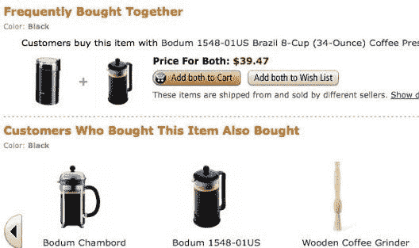
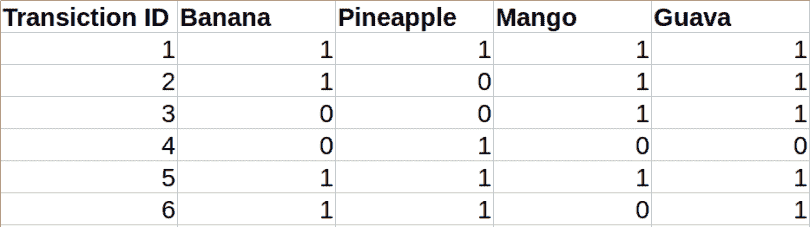
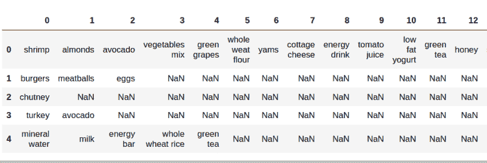
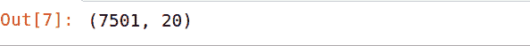
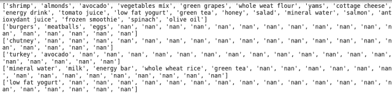
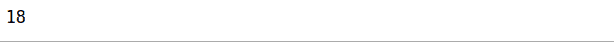
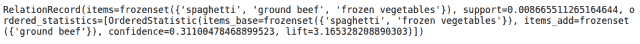
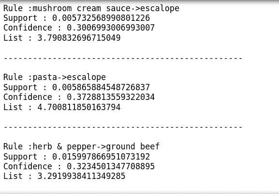

# 用购物篮分析揭开客户行为的神秘面纱

> 原文：<https://towardsdatascience.com/demystifying-customer-behavior-with-market-basket-analysis-87b5841def3a?source=collection_archive---------12----------------------->

在这篇博客中，我们将看到如何通过使用关联规则进行市场购物篮分析来预测客户行为。


来源:oracle.com

# 购物篮分析简介

购物篮分析是大型零售商用来发现商品之间关联的关键技术之一。它通过寻找在交易中频繁出现的项目组合来工作。换句话说，它允许零售商识别人们购买的商品之间的关系。

该方法基于这样的理论，即购买某一商品的顾客更有可能购买另一特定商品)。

例如，买面包的人通常也会买黄油。零售店的营销团队应该瞄准购买面包和黄油的顾客，并向他们提供优惠，让他们购买第三样东西，如鸡蛋。


来源:[爱德华卡](https://www.edureka.co/blog/apriori-algorithm/)

因此，如果顾客购买面包和黄油，看到鸡蛋打折或打折，他们就会被鼓励花更多的钱去买鸡蛋。这就是市场篮子分析的全部内容。

这只是一个小例子。因此，如果你把你的超级市场的 10000 或 20000 项数据带给一个数据科学家，想象一下你能得到多少洞见。这就是为什么关联规则挖掘如此重要。

# 现实生活应用


**购物篮分析**也可用于交叉销售产品。众所周知，亚马逊使用一种算法，根据你的浏览历史或其他人购买的东西，推荐你可能感兴趣的商品。

一个众所周知的城市传说是，一家超市，在运行商业部门蒲式耳检查后，发现男子可能会一起购买啤酒和尿布。Deals 通过将贮藏啤酒放在尿布旁边来扩大交易。

这听起来很简单(大多数时候确实如此)。尽管如此，纠结要知道:

*   对于巨大的库存(例如超过 10，000)，这些东西的组合可能会爆炸成数十亿，这使得数学几乎是古怪的。
*   信息是定期从大量的交易记录中挖掘出来的。许多信息通常由特定的可测量程序处理

# 关联规则挖掘

**关联规则挖掘**主要用于当我们必须在给定的集合中找到对象之间的关联，或者在任何一条信息中找到一些隐藏的模式。

**购物篮分析**或**购物篮数据分析**在零售或聚类中是关联规则挖掘的一些应用。

处理这些例子最广泛使用的方法是市场篮子分析。这是零售领域许多大公司使用的一个关键系统，如亚马逊、Flipkart 等，通过识别用户放入其“购物容器”中的各种东西之间的关系来细分用户的购买行为。这些从属关系的揭示可以帮助零售商通过获取知识来创建广告程序，这些知识是客户尽可能经常一起获取的。这些方法可以包括:

*   根据趋势改变商店布局
*   网上商店的交叉营销
*   顾客购买的流行商品是什么
*   带附加销售的定制电子邮件
*   客户行为分析
*   目录设计

**注**:关于**购物篮分析**和**推荐系统**的相似性，大家心里都有很多困惑

# 联想和推荐的区别

正如已经讨论过的，关联规则对个人的偏好不起作用。它总是发现每笔交易的一些元素集之间的关系。这使得它们与被称为协作过滤的推荐系统方法完全不同。

如果你想了解一下推荐系统，可以去看看我之前的博客[推荐引擎](https://blog.knoldus.com/machinex-the-power-of-recommendation-engines/)。

## 示例:

为了更好地理解它，请看下面来自 Amazon.com 的快照。你会注意到在每个产品的信息页面上有两个标题“经常一起购买”和“购买该商品的顾客也购买了”。

**经常一起买→买了这件物品的协会客户也买了→推荐**



这就是关联规则和推荐之间的区别。

现在，我们来谈谈主要的联想机器学习算法之一。即。 **Apriori 算法**

# Apriori 算法

假设我们有一个包含集合{Banana，菠萝，芒果}的事务，也包含另一个集合{Banana，芒果}。所以，根据先验原理，如果{香蕉，菠萝，芒果}是频繁的，那么{香蕉，芒果}也一定是频繁的。



我们有一个由一些交易组成的数据集。

0 ->缺少项目

1->项目的存在

为了从这个小型企业场景的多个可能规则中找出有趣的规则，我们将使用以下矩阵:

**支持度:**支持度是一个物品的受欢迎程度(出现的频率)。它可以通过包含该项目的交易数量占交易总数的比例来计算。所以，如果我们想计算香蕉的支持度，这里是:

支持(香蕉)=(涉及葡萄的交易)/(总交易)

支持度(香蕉)= 0.666

**置信度:**如果 A 项发生，B 项发生的可能性(条件概率)。

置信度(A => B) =(涉及 A 和 B 的事务)/(仅涉及 A 的事务)

信心({香蕉，菠萝} = > {芒果}) =支持(香蕉，菠萝，芒果)/支持(香蕉，菠萝)

= 2/6 / 3/6

= 0.667

**提升:**如果 A 项出现，B 项出现的几率增加。

升力(A => B) =信心(A，B) /支持(B)

lift({香蕉，菠萝} = > {芒果}) = 1

因此，客户同时购买 **A** 和 **B** 的可能性是单独购买的机会的“提升价值”倍。

*   **Lift (A= > B)** = 1 表示项目集合内没有相关性。
*   **Lift (A = > B)**
*   **Lift (A = > B)** < 1 表示项目集内部存在负相关，即项目集中的产品， **A** *，*和 **B** 不太可能一起购买。

# 履行

你可以从[这里](https://drive.google.com/file/d/1X9ykK3RsyfPxFTCJnCM4Drt2MZKXfIK1/view?usp=sharing)得到数据。

该数据集包含一家商店的各种产品的交易数据。

在导入库之前安装 apyori 包

```
conda install --yes apyori
OR
pip3 install --yes apyori
```

## 导入包

```
import numpy as np
import pandas as pd
import matplotlib.pyplot as plt
from apyori import apriori
```

我们已经导入了所有必需的库:

*   NumPy 和熊猫用于基本操作
*   用于数据可视化的 Matplotlib
*   apyori 用于我们的数据建模

## 导入数据

```
store_data = pd.read_csv("store_data.csv",header = None)
```

我们已经使用 pandas 将数据集读入名为“store_data”的数据框中。现在让我们看看数据

```
store_data.head()
```



所以，这是我们数据的样子，它包含了各种产品的所有交易历史。

```
store_data.shape
```



7501 表示不同物品一起购买的交易总数。20 表示显示项目的列数

## 数据预处理

因为 Apriori 库要求我们的数据集是列表的列表形式。因此，整个数据集是一个大列表，数据集中的每个事务都是外部大列表中的内部列表。[[交易 1]，[交易 2]，。。[交易 7501] ]

让我们将熊猫的数据框转换成如下的列表列表:

```
records = []
for i in range(0,7501):
    records.append([str(store_data.values[i,j]) for j in range(0,20)])
```

让我们看看这些事务集:

```
for sets in records:
    print(sets)
```



## Apriori 算法

先验的参数:

*   **记录**:列表列表
*   **min_support** :选择支持值大于参数指定值的项目的概率值
*   **min_confidence** :过滤置信度大于指定阈值的规则的概率值
*   **min_lift** :入围规则列表的最小提升值
*   **min_length** :您希望在规则中包含的最小项目数

```
association_rules = apriori(records, min_support = 0.0055, min_confidence = .3, min_lift = 3, min_length = 2)
```

将上述规则转换为规则列表:

```
association_results = list(association_rules)
```

现在让我们看看我们的算法生成了多少规则:

```
print(len(association_results))
```



因此，我们总共有 18 条规则，这些规则比我们预期的有更高的支持、信心和提升。让我们看看一些规则

```
print(association_results[5])
```



我们可以看到，规则 5 包含(意大利面条、碎牛肉、冷冻蔬菜)之间有很好的关联。

## 显示规则列表

```
for item in association_results:
    pair = item[0]
    items = [x for x in pair]
    print("Rule :"+ str(items[0]) + "->" + str(items[1]))
    print("Support : {}".format(item[1]))
    print("Confidence : {}".format(item[2][0][2]))
    print("List : {}".format(item[2][0][3]))
    print("\n-------------------------------------------------\n")
```



所以，这是关于如何实现 apriori 算法，在我们的事务集中找到关联性。

保持曲调，快乐学习🙂

最初发布在 Knoldus 博客上:[https://blog . knold us . com/machinex-demystifying-market-basket-analysis/](https://blog.knoldus.com/machinex-demystifying-market-basket-analysis/)

关注 MachineX Intelligence 了解更多信息:

*   [领英](https://www.linkedin.com/company/machinex-intelligence/?viewAsMember=true)
*   [推特](https://twitter.com/Shubham99142929)

# 参考

*   [传统机器学习技术概述](https://blogs.oracle.com/datascience/overview-of-traditional-machine-learning-techniques)
*   [edureka apriori 算法](https://www.edureka.co/blog/apriori-algorithm/)