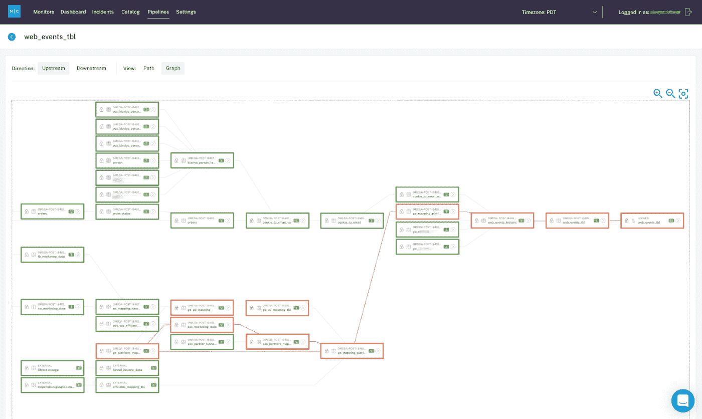
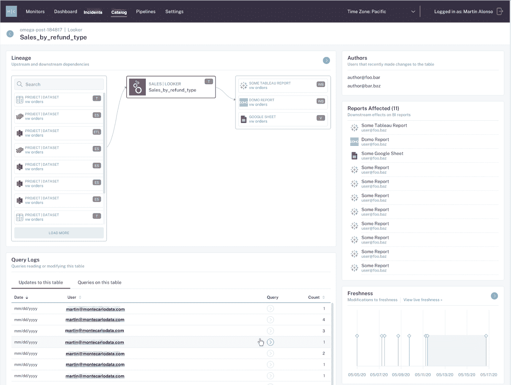
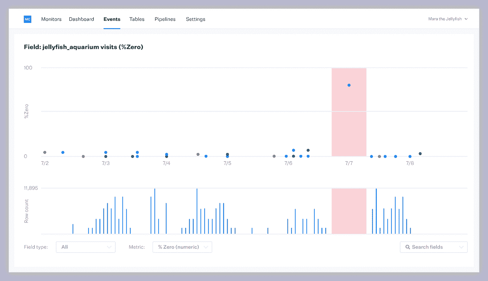

# 揭开数据可观察性的神秘面纱

> 原文：<https://towardsdatascience.com/demystifying-data-observability-31ac6f3b004?source=collection_archive---------35----------------------->

## 3 个关于如何开始使用数据工程堆栈最新层的实例

图片由 [Unsplash](http://unsplash.com) 上的[马特·拉瓦塞尔](https://unsplash.com/photos/bwonz6tZpVA)提供。

*随着公司接收越来越多的数据，数据管道变得越来越复杂，出错的机会也在增加，表现在从破损的仪表板到空值的一切事物中。*

*以下是您的数据工程团队可能受益于* [***数据可观察性***](https://towardsdatascience.com/what-is-data-observability-40b337971e3ehttps://towardsdatascience.com/what-is-data-observability-40b337971e3e) *(现代数据堆栈的最新层)的 3 个迹象。*

> 一位客户最近问我:“我如何知道我的数据是否可信？”

当我在 Gainsight 担任客户成功副总裁时，这个问题出现了很多次。我工作过的每一个数据组织都是不同的，有他们自己的服务水平协议(SLA)、安全需求和“准确、高质量的数据”的 KPI。然而，在所有这些数据团队之间，出现了一个共同的主题:需要一种更好的方法来监控数据的可靠性并消除[数据停机](/the-rise-of-data-downtime-841650cedfd5)。

数据停机时间是指数据丢失、不准确或出现其他错误的时间段，其范围可以从数据表中的几个丢失值到数据转换过程中的一个失误。随着公司越来越多地利用越来越多的数据源并构建越来越复杂的数据管道，数据宕机的可能性只会增加。

我记得自己在想:*如果有一种方法可以让数据团队监控这些不一致并发出警报，就像软件工程师可以通过 New Relic 和 Data Dog 这样的可观察性解决方案来跟踪应用程序停机时间一样，这不是很好吗？*

五年前，还没有足够全面的词汇或方法来满足这种不断变化的需求。2020 年，我们终于到了:世界，遇见[数据可观测性](/data-observability-the-next-frontier-of-data-engineering-f780feb874b)。

在以前的文章中，我已经讨论了为什么数据可观察性是信任你的数据的基础(换句话说，数据可靠性)，但是它看起来像什么呢？

**以下是您的数据团队应该投资于数据可观察性的 3 个迹象:**

# 1.有人更改了上游的字段，导致下游数据丢失或部分丢失

*端到端数据可靠性平台允许团队探索和了解他们的数据谱系，自动映射上游和下游依赖关系，以及这些资产的健康状况。图片由巴尔·摩西提供。*

## 情况

这是斯蒂芬妮。她是数据科学家。Stephanie 负责建立一个数据集的模型，该数据集是关于她公司的需求生成营销活动的成功的。一天，广告团队的成员 Ken 更改了数据集中的一个字段，导致她最近的 A/B 测试生成了不可靠的结果。不幸的是，斯蒂芬妮无法知道为什么她的结果是错误的，她没有在公司的下一次数据科学全体会议上自豪地展示她的实验结果，而是放弃了实验，从头开始。

## 解决办法

数据可观察性解决了对数据管道的上游和下游依赖关系缺乏端到端可见性的问题，因此您可以识别数据防火练习发生的位置并快速解决它们。即使当管道破裂和 A/B 测试出错时，您也可以找出错误的根本原因并相应地更新您的实验，从而增强对数据的信任并降低计算成本。

# #2:您的 Looker 仪表盘已有 24 小时未更新

*数据目录将关于数据资产的所有元数据都放在单一窗口中，因此您可以在单一视图中看到沿袭、模式、历史更改、新鲜度、容量、用户、查询等。图片由巴尔·摩西提供。*

## 情况

在 Stephanie 的公司，营销分析团队使用 Looker 来直观显示纽约时代广场的新广告牌每天会产生多少销售合格线索。在他们的首席执行官和营销副总裁召开第四季度计划会议的前几分钟，他们在 Slack 上 pings Stephanie:“数据都是错的……发生了什么事？!"

她打开 Looker，发现这些通常每 15 分钟更新一次的数字已经 24 小时没动过了！

## 解决办法

一种良好的数据可观察性方法提供了基于 ML 的新鲜度问题检测，并监控数据的异常情况，实时向您发出警报。一个优秀的数据可观察性策略将完成所有这些工作，并为您的数据健康状况提供一个单一的控制台视图，跨各种数据源对您的元数据进行编目。此外，自动检测减少了人工劳动，并腾出时间来从事将真正为您的公司推动发展的项目。

# #3:数据分析师、数据科学家和数据工程师之间的沟通不畅导致了数据消防演习

*数据可观察性有助于数据团队之间更好地协作，因为它可以在问题出现时轻松识别和解决问题，而不是花上几个小时。图片由巴尔·摩西提供。*

## 情况

斯蒂芬妮的团队正在建立一个新的数据模型，以更好地了解哪种类型的潜在客户对她公司的产品最感兴趣，并根据地理区域和行业部门进行筛选。这是数据分析师、数据科学家和数据工程师之间的跨团队合作，结果很重要。

当 Stephanie 部署模型时，什么也没有发生。她又试了一次。再一次。还是不行。她不知道的是，芝加哥的一位数据科学家对一个数据集做了一个模式改变，永远改变了她所知道的模型。没有办法知道更新了什么数据，哪里发生了中断，更不用说如何修复它了！

## 解决办法

一种强大的数据可观察性方法将使团队能够协作地对数据停机事件进行分类和故障排除，使您能够确定问题的根本原因并快速解决问题。也许最重要的是，这种解决方案通过公开有关您的数据资产的丰富信息，从一开始就防止了数据停机事件的发生，以便能够负责任地、主动地进行更改和修改。

虽然数据停机时间因公司(和团队)而异，但数据可观察性会有所帮助。也许你甚至在斯蒂芬妮身上看到了自己，也有一些你自己的好的[坏数据的故事](/good-tales-of-bad-data-91eccc29cbc5)来分享！

我洗耳恭听。

***对学习更感兴趣？联系*** [***巴尔摩西***](https://www.linkedin.com/in/barrmoses) ***并查看我的*** [***数据可观察性办公时间***](https://my.demio.com/ref/vRkTMA2PpWoUTFXh) ***美国东部时间 11 月 12 日星期四中午 12 点/太平洋标准时间上午 9 点！***