# 揭秘决策树、随机森林和梯度推进

> 原文：<https://towardsdatascience.com/demystifying-decision-trees-random-forests-gradient-boosting-20415b0a406f?source=collection_archive---------25----------------------->

## *深入探究这些常用算法的数学直觉*

由[塞巴斯蒂安·恩劳](https://unsplash.com/@sebastian_unrau?utm_source=unsplash&utm_medium=referral&utm_content=creditCopyText)在 [Unsplash](https://unsplash.com/s/photos/forest?utm_source=unsplash&utm_medium=referral&utm_content=creditCopyText) 上拍摄的照片

分类和回归问题都可以通过许多不同的算法来解决。对于数据科学家来说，了解这些预测算法的优缺点以选择一种适合所遇到问题的算法是至关重要的。在这篇博客中，我将首先深入研究最基本的算法之一(决策树),以便能够解释更强大的基于树的算法背后的直觉，这些算法使用技术来对抗这些简单决策树的缺点。基于树的算法优于线性或逻辑回归，因为它们能够捕捉数据集中可能存在的非线性关系。与诸如(深度)神经网络之类的更复杂的算法相比，随机森林和梯度提升易于实现，具有相对较少的要调整的参数，并且在计算资源方面更便宜，并且(通常)需要更少的数据集。理解这些直觉的主要目标是，通过掌握直觉，在实践中使用和优化算法将变得更容易，并最终产生更好的性能。

# **决策树**

决策树是一种简单的算法，本质上模仿了流程图，使其易于理解。一棵树由根节点、几个树节点和树叶组成。基本上每个节点(包括根节点)都将数据集分成子集。每一个分裂都类似于一个基本的特征-特定的问题:某个条件存在还是不存在？回答所有这些问题，直到到达树的底层，产生当前样本的预测。底层的叶子是决策树的最后一步，代表预测的结果。

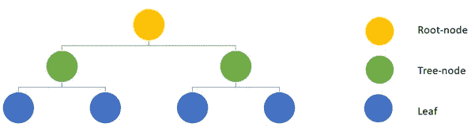

简单决策树的示意图

到目前为止，一切顺利:但现在有趣的部分来了。让我们从分类树开始，假设我们有一个样本数据集，其中包含关于气短、咳嗽和发烧的特征，我们希望预测患者是否患有流感。我们如何确定哪个特征应该是根节点，以及如何构建我们的树来最大化预测的准确性？

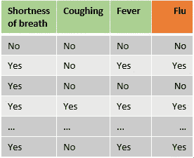

抽样资料

注意:这个例子将只使用分类特征，然而，树的一个主要优点是它们在数据类型方面的灵活性。

使用训练集从上到下构建决策树，并且在每一层，选择相对于目标变量最好地分割训练数据的特征。为了确定哪个特征分割数据集“最好”,可以使用几个指标。这些度量评估在节点中选择某个特征时出现的子集的同质性。最常用的指标是*、【基尼杂质】、*信息增益熵*。这些指标通常会产生类似的结果[【1】](#_ftn1)，由于计算*基尼系数*不包括对数的使用，因此可能会稍微快一些。计算*基尼系数杂质*的目的是测量从集合中随机选择的元素被错误标记的频率。*

让我们从根开始注意:要选择哪些特征应该在决策树的顶部，首先将计算所有单个特征的基尼系数。

基尼系数的公式是

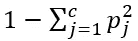

其中 *c* 是类别数，而 *Pj* 是以类别 *j.* 作为预测变量的项目的分数，具有 2 个类别(流感或无流感)，对于每片叶子，杂质是*1-(P-无流感)——(P-流感)。*

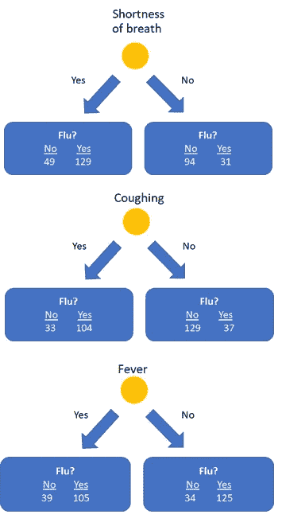

在我们的例子(见上图)中**气短**的左叶的*基尼杂质* 为:*1-(49/(49+129))-(129/(49+129))= 0.399*。右叶杂质*1-(94/(94+31))-(31/(94+31))= 0.372。*

最后，根节**气短**的最终杂质可计算为两片叶子杂质的加权平均值:(*(49+129)/(49+129+94+31))* 0.399+((94+31)/(49+129+94+31))* 0.372 = 0.388。*

我们也可以对特征**咳嗽**和**发烧**这样做，它们分别产生 0.365 和 0.364 的杂质。

由于**发热**杂质最低，因此作为根节点是预测患者是否患流感的最佳特征。在根节点中选择 fever 作为特征后，数据被分成两个不纯的节点，左边是 144 个样本，右边是 159 个样本。

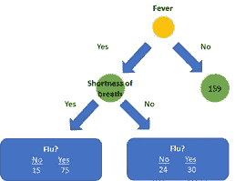

选择**发热**作为根节点特征后的数据集

随后，我们为这些创建的子集计算其他特征**气短**和**咳嗽**的杂质，以决定哪个特征应该用于下一个节点。这里的杂质为**气短**作为根节点后的下一个特征是 0.359。我们假设这个杂质小于**咳**。下一步是比较新添加的节点的杂质与单独在**发烧**上分裂后的左叶的杂质(原来是 0.395)。因此，将节点**气短**添加到树的左分支提供了比单独根据**发热**进行分割更好的分类，并且将被添加到树中。这个过程将继续，直到树中的所有特征都被使用，或者如果随后的分割没有产生杂质的改善。因此，树的左边和右边很可能有不同的架构。

# **回归树**

回归树类似于分类树，因为这些树也是从上到下构建的，然而，为节点选择特征的度量是不同的。可以使用多种指标，但均方误差(MSE)是最常用的指标。

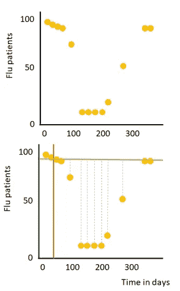

为了简单起见，假设我们有一个数据集，它有一个数字特征(一年中的一天，即 1 月 1 日，是第 1 天)和一个数字目标变量(医院中流感患者的数量)，见右图。首先，我们必须确定应该对根节点使用哪种分割。这个过程可以分为几个(迭代)步骤:

1)在两个连续点之间画一条线，将数据分成两个子集(橙色线)。
2)计算这两个点的流感患者的平均数量，并通过该计算的平均值(绿线)画一条水平线
3)计算两个创建的子集的所有数据点的均方误差(灰色虚线)
4)对两个连续点之间的每条可能的线重复步骤 1 至 3。

在根节点中选择具有最低 MSE 的分裂。该根节点将数据分成两个子集，并且对两个创建的子集重复该过程。注意:在具有多个要素的真实数据集内，会计算数据集中所有要素的所有可能分割的 MSE，并在节点中选择 MSE 最低的分割。可以重复这个过程，直到所有点都在单独的叶子中，这将为您的训练数据提供完美的预测，但是对于新的(测试)数据就不那么准确了(换句话说；模型过拟合)。通常通过例如设置分裂所需的最小样本数来避免过拟合。如果多个观察结果出现在一个叶中，则预测值是该叶中所有观察结果的平均值(在我们的示例中是该叶中所有观察结果的平均流感患者)。

# **装袋增压**

模型的准确性是偏差和方差之间的权衡。树很容易构建、解释和使用，然而*树有一个方面阻止它们成为预测学习的理想工具，即不准确性*[*【2】*](#_ftn1)*。*树可以准确地对训练数据集进行分类，但不能很好地推广到新数据集。在接下来的部分中，我将讨论两种基于决策树的算法，并使用不同的方法来提高决策树的准确性:基于 bagging 的随机森林和顾名思义使用 boosting 技术的梯度增强。Bagging 和 boosting 都是集成技术，这基本上意味着这两种方法都将多个弱学习器组合在一起，以创建一个比单个学习器误差更低的模型。这两种方法之间最明显的区别是 bagging 同时并独立地建立所有弱学习器，而 boosting 随后建立模型，并使用先前建立的模型的信息来提高准确性。

注意:bagging 和 boosting 可以使用几种算法作为基础算法，因此并不局限于使用决策树。

# **随机森林**

如前所述，随机森林是一种同时构建决策树的打包(或引导聚集)方法。随后，它将各个生长树木的预测进行组合，以提供最终预测。随机森林可用于回归和分类问题。

首先，必须确定所需的树的数量。所有这些树都是同时生长的。为了防止树是相同的，使用了两种方法。

**步骤 1:** 首先，为每棵树创建一个自举数据集。这意味着从原始数据中随机选取样本(行)用于自举数据集。对于单个引导数据集，可以多次选择样本(见下图)。

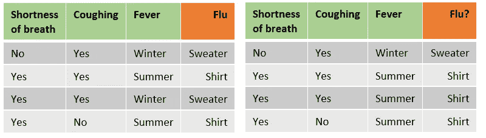

左侧为原始数据集，右侧为引导数据集

**步骤 2:** 对于每个自举数据集，生成一个决策树。但是对于构建过程中的每一步，只使用了(预定数量的)随机选择的特征(在我们的例子中是 **2** )(通常是特征数量的平方根)。例如，为了定义哪个特征应该在根节点中，我们随机选择 2 个特征，计算这些特征的杂质，并选择杂质最少的特征。对于下一步，我们随机选择 2 个其他要素(在我们的示例中，选择根节点后只剩下 2 个要素，但在较大的数据集中，您将在每一步选择 2 个新要素)。类似于构建单个决策树，这些树一直生长，直到杂质不再增加(或者直到预定义的最大深度)。在随机森林中，构建深树并不自动意味着过度拟合，因为最终预测是基于所有组合树的平均预测(或多数投票)的事实。可以使用几种技术来调整随机森林(例如，最小杂质减少或一片叶子中必须有的最小样本数)，但我不会在这篇博客中讨论这些方法的效果。

作为引导和随机特征选择的结果，不同的树将具有不同的架构。

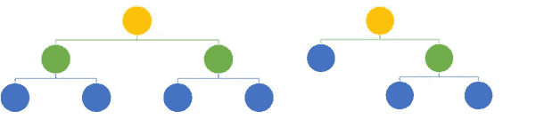

用随机森林算法构建的两个具有不同架构的树

随机森林现在可以用来预测新的例子。组合随机森林中所有单个树的预测，并且(在分类问题的情况下)具有最多预测的类是最终预测。

# **梯度增强**

梯度推进是最流行的机器学习算法之一。虽然通过使用 scikit-learn 等库很容易实现开箱即用，但理解数学细节可以简化调整算法的过程，并最终获得更好的结果。boosting 的主要思想是随后构建弱预测器，并使用先前构建的预测器的信息来增强模型的性能。对于梯度推进，这些预测器是决策树。与随机森林相比，在梯度提升中使用的决策树的深度通常要小得多。sci kit-learn RandomForestRegressor 中的标准树深度未设置，而在 GradientBoostingRegressor 中，树的标准修剪深度为 3。这很重要，因为单个树很容易过度拟合数据，而随机森林通过平均所有单个树的预测来解决这个问题，梯度增强建立在先前构建的树的结果上。因此，单个过度拟合的树在梯度增强中可以有很大的效果。由于深度较小，因此在梯度增强过程中构建的单个树可能会有较大的偏差。

在下一节中，我将对使用梯度推进解决回归问题进行数学上的深入探讨，但是它也可以用于分类。用于分类的梯度推进将不在本博客中讨论，但是直觉与用于回归的梯度推进有很多共同之处。如果你想更深入地研究梯度增强进行分类，我推荐你观看 stat quest([https://www.youtube.com/watch?v=jxuNLH5dXCs](https://www.youtube.com/watch?v=jxuNLH5dXCs))的优秀视频。

让我们来看一个例子，其中我们想要使用身高、体重以及患者是否处于禁食状态来预测患者的血糖。

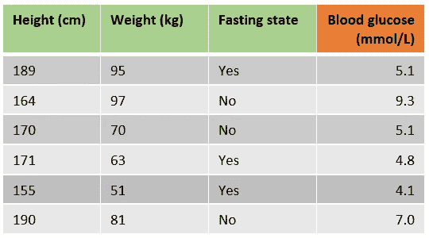

样本数据集

梯度增强使用损失函数来优化算法，scikit-learn 实现中一次观察的标准损失函数是**最小二乘** : 1/2 *(观察值-预测值)

拟合梯度推进回归方程的过程可以分为几个步骤。

**第一步**。回归的梯度推进的第一步是使用以下公式进行初始预测

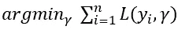

换句话说，找出误差平方和最低的 *γ* 的值。这可以通过梯度下降来解决，以找到公式的导数等于 0 的位置。通过使用链式法则，我们知道

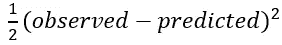

等于

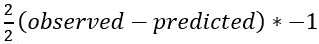

对于我们的样本数据，这意味着我们可以通过求解*-(5.1-predicted)+-(9.3-predicted)+⋯+-(7.0-预测)=0* 来找到最佳的初始预测。这产生了*6 *预测=35.4* ，因此最佳初始预测是 *35.4/6=5.9 毫摩尔/升。N* 注意，这只是目标变量列的平均值。

**第二步。**如前所述，梯度提升使用之前构建的学习器来进一步优化算法。因此，梯度提升中的树不适合目标变量，而是适合预测值和观察值之间的误差或差异。下一步是使用以下公式计算每个样本的误差:

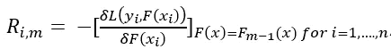

其中 *m* 是当前的树(记住我们随后正在构建预定义数量的树)，而 *n* 是样本的数量。这看起来很有挑战性，但实际上并不是。第一部分

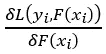

它是损失函数相对于预测值的导数。正如我们在步骤 1 中看到的，使用链式法则，这只是*–(观察值—预测值)，t* 初始方程前面的大减号让我们以观察值减去预测值结束。

下标

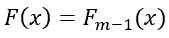

表示先前树的值用于预测当前树的错误。简而言之，样本的误差是观察值和前一个树的预测值之间的差异。

在下表中，添加了用于构建第一个树的所有样本的误差，这只是预测所有样本的平均血糖。

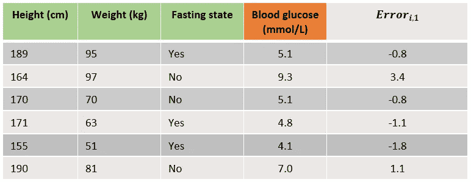

第一次预测后包含错误的样本数据集

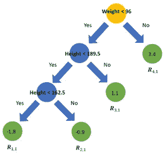

预测样本误差的决策树

**第三步**。下一步是用预定义的错误最大深度而不是目标变量来拟合决策树。通过修剪树(或设置最大叶子数)，一些叶子将以多个错误结束。右边是一个适合错误的树。树叶用 *Rj，m* 表示，其中 *j* 是树叶编号， *m* 是当前树。由于样本数据集很小，树叶 *R(1，1)* 、 *R(3，1)* & *R(4，1)* 都只包含一个样本。 *R(2，1)* 包括误差为-1.1、-0.8 和-0.8 的三个样本。

**第四步**。确定每片叶子的输出值。这可以通过我们在步骤 1 中使用的类似公式来完成，

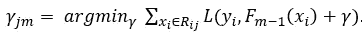

主要区别在于，我们为树 *m，*中的每片叶子 *j* 计算最佳预测 *γ* ，而不是为整个数据集计算一个预测值。此外，为了计算某一叶的最佳预测值，只考虑该叶中的样本:

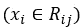

最后一个区别是，前一棵树的预测使用了一个附加项 *γ:*

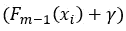

由于损失函数的选择，每片叶子的最佳预测值是该叶子中误差的平均值。对于叶 *R(2，1)* ，最佳预测值为-0.9(误差的平均值[-1.1，-0.8，-0.8])。

**第五步**。使用初始预测和所有构建的树对所有样本进行新的预测，使用

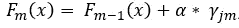

，在哪里

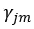

是对样本在当前树中的叶子的预测，而 *α* 是预定义的学习率。设置学习率可以减少单个树对最终预测的影响，并提高准确性。简单地说，用来自当前构建的树的新预测误差来更新对样本的先前预测。为了说明这一点，我们将使用初始预测和学习率为 0.1 的第一个构建的树来预测第一个样本。在我们新构建的树中，这个样本将以-0.9 的预测值出现在第二个叶子中。

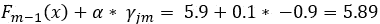

。虽然与初始预测的差异很小，但新的预测更接近观察到的血糖。

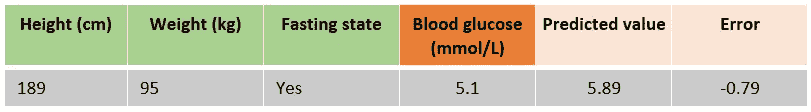

一个样本包括建立第二棵树后的预测值和误差

**第六步。**重复步骤 2、3 和 4，直到构建了所需数量的树，或者添加新树并不能提高拟合度。结果是一个梯度推进模型😊。

这篇博客概述了决策树、随机森林和梯度推进背后的基本直觉。如果您使用 scikit-learn 这样的库来实现这些算法，希望这将为您提供一个很好的理解，并帮助您在未来调整模型的参数，并从长远来看获得更高的精度。

# 关于作者

[Rik Kraan](https://www.linkedin.com/in/rikkraan/) 是医学博士，在荷兰数据科学咨询公司 **Vantage AI** 担任数据科学家。请随时通过[rik.kraan@vantage-ai.com](mailto:rik.kraan@vantage-ai.com)联系

*特别感谢* [*迈克·克劳斯*](https://medium.com/u/b7df3faee249?source=post_page-----20415b0a406f--------------------------------)T22[洛克·盖里茨](https://medium.com/u/67c88c5676e2?source=post_page-----20415b0a406f--------------------------------)

[【1】](#_ftnref1)基尼指数与信息增益准则的理论比较。*劳拉·伊莲娜·雷莱亚努和基利安·斯托菲尔。*T4【https://www . unine . ch/files/live/sites/imi/files/shared/documents/papers/Gini _ index _ full text . pdf

[【2】](#_ftnref2)统计学习的要素:数据挖掘、推理和预测。特雷弗·哈斯蒂、罗伯特·蒂布拉尼和杰罗姆·弗里德曼。