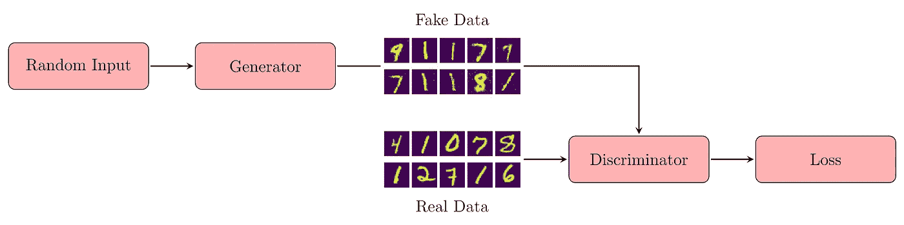
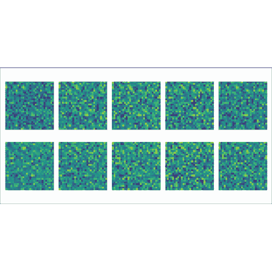
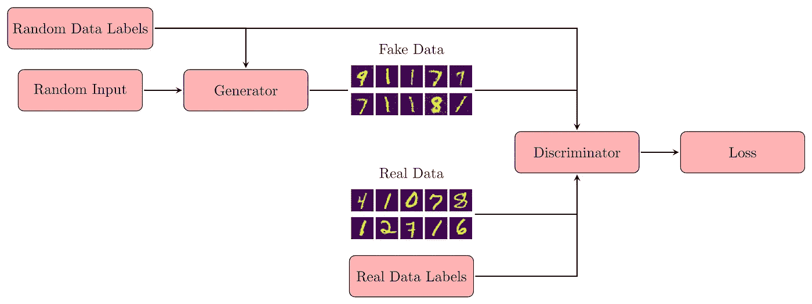
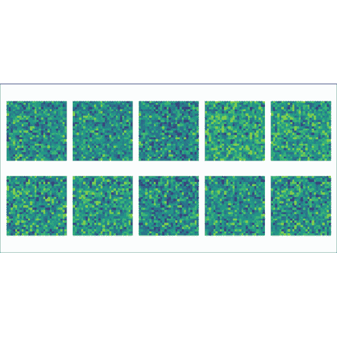
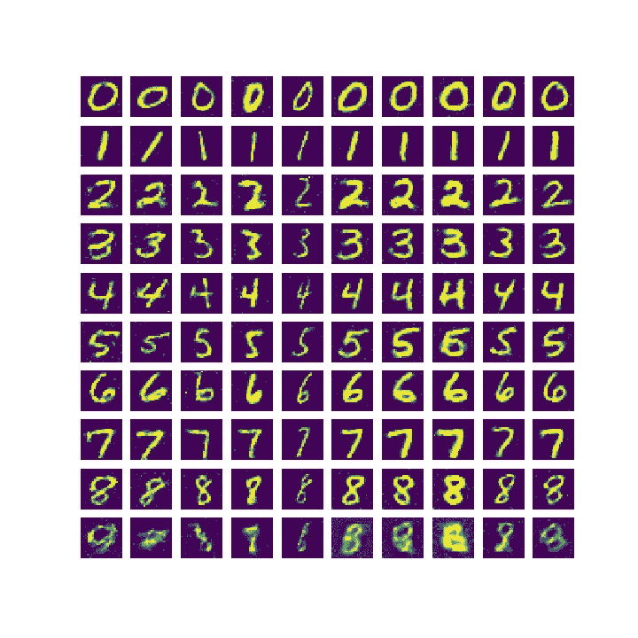
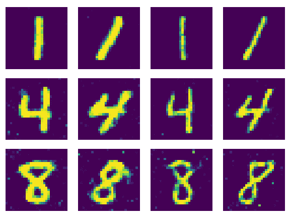
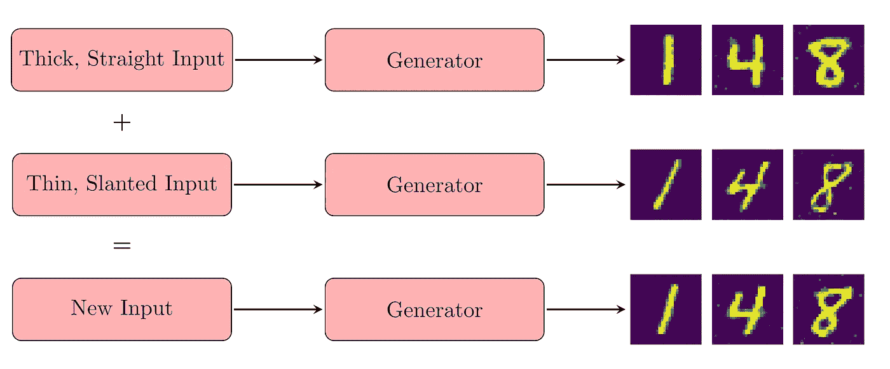
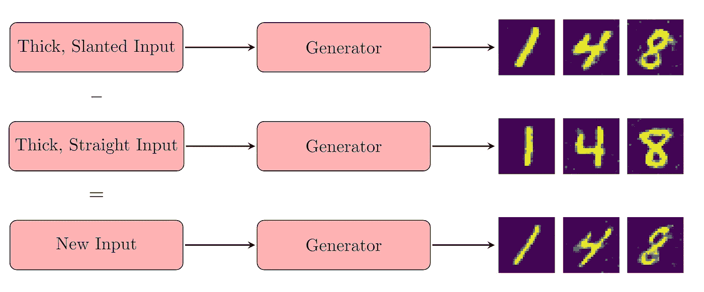

# 揭秘甘斯

> 原文：<https://towardsdatascience.com/demystifying-gans-cc1ac011355?source=collection_archive---------34----------------------->

## 了解这些迷人的模型如何工作以及为什么工作，以及如何使用 Keras 和 Tensorflow 训练自己的模型。

本文的目的是说明生成对抗网络(GANs)的结构和训练方法，强调 GANs 背后的关键思想，并通过一个工作示例来阐明主题，使用 Tensorflow 和 Keras 在 MNIST 数据集上训练 GAN 以产生手写数字。然后，我们将探索增加发电机输出控制水平的方法。

当我最近开始寻找训练 GANs 的教程时，我发现了许多过于复杂的脚本，这些脚本对训练过程中幕后发生的事情提供了很少的直觉。我希望读者能够清楚地理解为什么这里提供的代码有效，并欣赏它的简单性。熟悉 Keras functional API 以及一些深度学习的一般知识将会很有用。

## GAN 概述

首先，让我们讨论一下我们希望在本教程中完成什么。GAN 由两个独立的神经网络组成，一个*发生器*和一个*鉴别器*。这两个网络可以有任何你愿意想象的结构，这取决于手头的任务。

生成器的目标是在给定一些随机输入(通常是从标准正态分布中抽取的 100 个数字)的情况下，生成看起来属于任何给定数据集的对象。例如，我们将在本教程中考虑 MNIST 数据集。这个数据集由 28 x 28 个数组组成(这使它成为一个 784 维的数据集)，每个数组代表一个手写数字 0-9 的图像。每一类数字都可以被认为是 784 维空间中的一个流形，当且仅当一个图像可以被人类识别为相应的数字时，它才会出现在每个流形上。因此，一个好的生成器必须善于将随机输入映射到这些流形上，这样它只会生成看起来像是属于真实数据集的图像。

第二个网络，即鉴别器，具有相反的目的。它必须学会*区分*数据集的真实例子和生成器制造的‘假货’。组合结构如下:

作者图片

名字中的“对抗”部分指的是训练 GANs 的方法。在训练中，他们(作为对手)竞争，每个人都试图击败对方。对每批数据交替训练网络。首先，将训练鉴别器将真实数据分类为“真实”，将生成器创建的虚假图像分类为“虚假”。接下来，生成器将被训练产生被鉴别器分类为“真实”的输出。对数据中的每个批次重复这一过程。这确实是一个简单的想法，但却是一个强有力的想法。

有趣的是，生成器将永远看不到任何真实数据，它将简单地学习如何通过反向传播算法学习通过鉴别器传播的梯度来欺骗鉴别器。因此，gan 特别容易受到梯度消失问题的影响。毕竟，如果梯度在到达发生器之前就消失了，它就没有办法学习了！当使用非常深的 GANs 时，这一点特别重要，但我们在这里不应该担心，因为我们使用的网络相对较小。

另一个常见的问题是“模式崩溃”。在某种程度上，这是发电机为了偷懒而开始跳出框框思考的地方。生成器可以简单地学习生成完全相同的输出，而不管输入是什么！如果这个输出对鉴别器来说是可信的，那么生成器已经完成了它的任务，尽管对我们来说是完全无用的。

我们将在本教程中考虑克服模式崩溃的问题，但首先我们将考虑一个非常简单的模型，以便专注于理解训练算法。事不宜迟，我们开始吧。

## 用 Keras 建立模型

在整个代码中使用了一些参数，为了清楚起见，这里给出了这些参数。

引入一些变量。

我们将使用 tensorflow_datasets 模块提供的 MNIST 数据集。必须加载数据，并将像素值调整到-1 和 1 之间的范围，这是发生器最后一层将使用的双曲正切函数的范围。然后根据 BATCH_SIZE 和 BUFFER_SIZE 参数对数据进行混洗和批处理。我们使用大小为 60，000(数据集长度)的缓冲区，以便完全打乱数据，并使用大小为 128 的批处理。prefetch(1)调用意味着当一批数据用于训练网络时，下一批数据将被加载到内存中，这有助于防止瓶颈。这对于 MNIST 来说可能不是问题，因为每个图像的数据相对较少，但是对于高分辨率图像来说可能会有所不同。

加载、缩放、混排、批处理和获取数据集。

MNIST 的简单性将允许我们抓住具有简单致密结构的 gan。我们将使用一个具有 3 个密集隐藏层的生成器和鉴别器。由于我们需要生成 28 x 28 的图像，最终的图层将有 784 个单元，然后可以将它们重新调整为所需的格式。其他参数可以使用。我们还将在最后一层使用标准的 tanh 激活，为了简单起见，其他层都使用 ReLu 激活。

函数创建一个生成器。

鉴别器是发生器的镜像。这在直觉上是有意义的，因为它试图撤销生成器所做的事情。它将预测“真实”为 1，“虚假”为 0，因此在最后一层使用 sigmoid 激活。我们再次在其他层中使用 ReLu。

函数创建一个鉴别器。

现在，这两个网络可以组合成一个 GAN，就像它们只是层一样。就这么简单！

函数从鉴频器和发生器创建 GAN。

## 用 Keras 训练 GAN

如前所述，不能使用 Keras 中用于更简单的深度学习模型的 model.fit()方法来训练 gan。这是因为我们有两个不同的网络，必须同时训练，但目标相反。因此，我们必须创建自己的训练循环来迭代批量数据，并分别训练每个模型。以下代码中有一些微妙之处，所以我鼓励读者仔细阅读注释，但要点如下:

*   (10–12)鉴别器和 GAN 必须分开编译，我们在编译 GAN 时使鉴别器不可训练。这就允许我们通过调用 gan.train_on_batch()来训练 *only* 发电机，并且在调用 discriminator.train_on_batch()时训练 only*鉴别器。这是 Keras 的一个便利特性，通常被忽略，导致代码不够优雅。*
*   (25–35)我们训练鉴别器将“真实”图像映射到 1，将“虚假”图像映射到 0。软化这些值，即使用接近 1 和 0 的随机数，是帮助 GANs 学习的标准技巧。
*   (40–47)我们通过训练 GAN(鉴别器的权重不可训练)来训练生成器，但是标签被颠倒，也就是将“假”图像映射到 1。这样，我们要求生成器学习如何欺骗鉴别器。

为多个时期创建和训练 GAN 的功能。

通过 100 个时期的训练，我们观察到以下收敛。虽然我们在整个训练中看到不同的数字出现，但它似乎主要停留在 1 号图上，这可能是模式崩溃的一个例子。这是生成器学习从数据集中生成一个类的地方。如果让它训练更长时间，鉴别器可能会学习将该类分类为假的，此时生成器将学习生成另一个类，以此循环继续。由于我们没有努力防止这种行为，我相信我们可以把这个结果算作一个成功，我们显然有一个用于这类神经网络的工作训练方法。

作者提供的图片

## 提高我们模型的性能—增加功能

虽然这第一次尝试在一定程度上取得了成功，但我们当然可以做得更好。毕竟，我们只使用了数据集的一半！我们忽略了利用现有的标签。只需对上面的代码做一些调整，我们就可以创建一个使用标记数据的 GAN，这样生成器将从我们选择的给定类中产生一个数字。就像生成随机数一样有趣，控制生成的图像会给我们的模型增加一层美丽的精致。这也将有助于 GAN 更快地学习，并有助于防止模式崩溃。该模型的新结构如下:

作者图片

生成器必须像以前一样接受随机噪声作为输入，但也接受它应该生成的随机选择的类。这意味着，一旦经过训练，生成器将从我们选择的任何类中产生一个数字。鉴别器还将接受两个输入，第一个是图像，第二个是相应的类标签。这将允许鉴别器不仅根据图像作为数字的可信度，而且根据数字是否属于给定的类来决定图像是真是假，这将迫使生成器从正确的类中绘制图像，以便执行良好。我们只需要对代码做一些非常简单的调整。

首先，我们需要一个变量来告诉我们数据中有多少特征。因为我们将对标签进行一次性编码，所以每个标签将是一个长度为 10 的向量。我们还必须创建带标签的数据集。

声明新变量和创建新数据集。

下面是我们看到的使用 Keras functional API 与顺序 API 相比的优势。在这个框架中添加多个输入并连接它们是一件小事，如下所示:

创建具有新功能的生成器的函数。

鉴别器也做了类似的调整，在将类标签输入到模型中之后，添加了另一个隐藏层。额外的层是必要的，好像直接连接到输出神经元的级联层鉴别器将缺乏处理由类标签给出的信息的灵活性。

用新特性创建鉴别器的函数。

像以前一样直观地创建 GAN。

创建具有新功能的 GAN 的函数。

最后，培训与之前的想法完全相同，但是增加了额外的输入。由于我们生成数据集的方式，代码看起来非常相似。

创建和训练具有新功能的 GAN 的功能。

这个模型然后像以前一样被训练 100 个时期，进度显示在这里。发生器应该产生一个完整的数字序列，0-9。看来我们又取得了更多的成功！除了数字 9，在训练结束时，我们有一个令人信服的数字序列。

作者提供的图片

## 探索特征映射

我们也能够观察到甘斯的一个迷人的特征。他们实际上学会了将某些随机输入编码为他们生成的数据的特征。通过一个例子可以很好地看出这一点:

作者图片

每一列中的图像是从相同的随机输入中生成的，但是具有不同的类别标签。很明显，随机输入中编码的是结果数字的特征。例如，在第五列中，所有笔画都很细，而第八列中的所有数字都有粗线笔画。类似地，第 2 列中的所有数字看起来都向右倾斜，而第 3 列中的数字稍微向左倾斜。虽然这些编码对于任何试图解释它们的人来说都是不清楚的，但是通过研究生成器对随机输入样本的行为，可以在一定程度上控制生成的数字的风格。

## 平均特征

为了演示这一点，我检查了大量输入的生成器输出，并根据生成器产生的输出类型对输入进行了分类。我考虑的类别是“粗笔画，直的”，“粗笔画，向右倾斜”，“细笔画，直的”和“细笔画，向右倾斜”。然后对每个类别进行平均，因此我有四个输入向量，每个类别一个。当这些输入通过生成器时，它们从该类别中产生新的图像，如下所示。在这里，我显示的是 1、4 和 8，因为这些数字显示了最夸张的倾斜。

图片由作者提供；(从左到右)粗直、粗右、细直、细右

## 缩放功能

我们实际上可以做得更好！如果我们将这些输入乘以一个大于 1 的数，我们可以*夸大*那个输入的特征，如果我们使用一个小于 1 的数，我们可以减少那个特征。事实上，似乎如果我们乘以负数，我们可以生成具有相反特征的数字！请看下面的 gif——它们代表了当每个类别的输入乘以范围在 2 到-2 之间的标量时，我们的生成器的输出。看看他们是如何以上述夸张的特征开始，以相反的方式结束的！

作者提供的图片；(从左到右)粗直、粗右、细直、细右

我们在这里看到的是 GANs 的一个共同特征。虽然输入可能是随机的，但生成器对它们的解释绝不是随机的。它已经学会使用潜在空间中的某些向量来表示它所绘制的特征。

## 添加和减去特征

你甚至可以在这个潜在空间里进行有意义的加减运算。如果将粗而直的数字输入添加到细而斜的数字输入中，您会得到什么结果？

作者图片

你得到一个粗斜的数字输入！从粗斜的数字输入中减去粗直的数字输入又如何呢？

作者图片

你得到一个细的，倾斜的数字输入！多酷啊。如果有时间和资源，可以对 GAN 的输出进行更全面的分类，并且可以使用这种方法获得对输出的绝对控制。

将来，我的目标是应用本文中的原则在更复杂的数据集上训练 gan，并探索我获得的特征映射。我使用过的完整代码可以在这个 Github 资源库中找到:

 [## vonny 0123/GAN _ 教程

### 在 GitHub 上创建一个帐户，为 Vonny0123/GAN_Tutorials 开发做贡献。

github.com](https://github.com/Vonny0123/GAN_Tutorials.git)