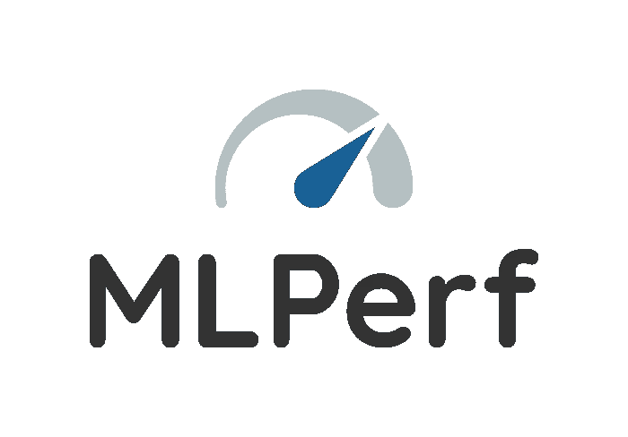
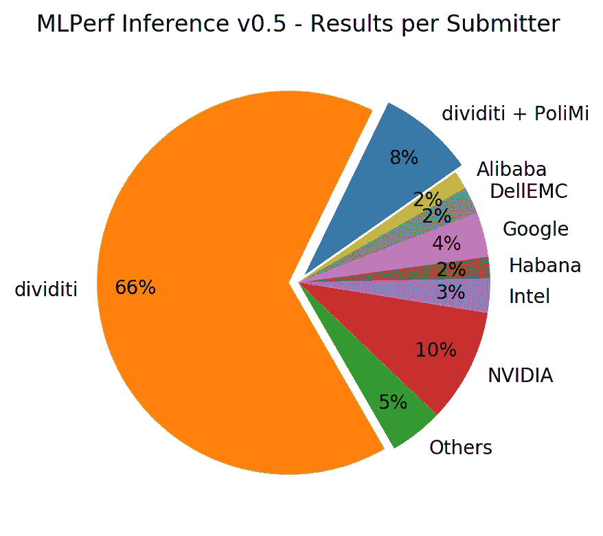

# 揭开 MLPerf 推理的神秘面纱

> 原文：<https://towardsdatascience.com/demystifying-mlperf-inference-956e41790df4?source=collection_archive---------34----------------------->

[**MLPerf**](http://mlperf.org) 是一个广泛的社区，专注于机器学习(ML)的基准测试，有超过 70 个参与组织(还在增加)。*标杆管理*是指*评估“绩效”*(质量、速度、能效等。)的计算机系统使用典型的*工作负载*(任务、数据集、模型)。与大多数其他 ML 基准不同， **MLPerf** 包含了在实践中使用 ML 的**培训**和**推理**(部署)阶段。

第二轮 **MLPerf 培训**收到了来自英特尔、英伟达、谷歌、阿里巴巴和富士通的提交材料(v0.6，结果[于 2019 年 7 月 10 日公布](https://mlperf.org/press#mlperf-training-v0.6-results))。第一轮 [**MLPerf 推论**](https://arxiv.org/abs/1911.02549)(v 0.5，结果[于 2019 年 11 月 6 日](https://mlperf.org/press#mlperf-inference-v0.5-results)公布)收到了来自 14 家组织的提交材料，包括来自上述公司的 Habana Labs ( [于 2019 年 12 月被英特尔收购](https://newsroom.intel.com/news-releases/intel-ai-acquisition))和[divideti](https://dividiti.blogspot.com/2019/11/dividiti-accelerate-omni-benchmarking-for-mlperf.html)。

MLPerf 推理 v0.5:分解提交者接受的 595 个结果。

因此， **MLPerf** 正迅速成为*ML 系统的*行业基准，并成为发布新产品的理想论坛，其基准测试结果将使分析师、投资者和买家*信任*。

作为[至 **MLPerf 推论**的顶级](https://github.com/mlperf/inference/graphs/contributors)[撰稿人之一，我经常回答新人的问题。虽然有一份出色的](https://github.com/mlperf/inference/graphs/contributors)[白皮书](https://arxiv.org/abs/1911.02549)解释了基准测试套件的基本原理和方法，但我从潜在提交者(硬件设计师、云提供商等)那里得到的问题。)和用户(买家、投资人等。)具有更实际的性质。在这篇文章中，我开始回答一些常见的问题。

下面，在问句中，“我”指的是你，读者，“我们”指的是“你的组织”；在答案中，“我”指的是我，作者，“我们”指的是“MLPerf 社区”(但只有当我认为我可以代表整个社区时)。

# 为什么要考虑参加 MLPerf？

一个词——*信任*。

随着在云和边缘加速 ML 的许多选项变得可用，有眼光的买家不再满足于仅仅依靠供应商的销售宣传和营销材料来做出购买决定。相反，购买者要求供应商提供大量细节，例如使用的确切工作负载和优化选项、性能和准确性的权衡、功耗、工具链成熟度等。(例如，参见通用汽车在 2017 年[嵌入式视觉峰会](https://www.edge-ai-vision.com/the-summit/may-2017-embedded-vision-summit-replay/)上的[激励演示](https://www.youtube.com/watch?v=1ldgVZ64hEI)。)

MLPerf 旨在通过商定一个通用的严格方法，在系统之间进行有意义和公平的比较。特别是，所有的**推理**提交必须遵循严格的[规则](https://github.com/mlperf/inference_policies/blob/master/inference_rules.adoc)关于[允许的模型转换](https://github.com/mlperf/inference_policies/blob/master/inference_rules.adoc#8-model)、[数据预处理和后处理](https://github.com/mlperf/inference_policies/blob/master/inference_rules.adoc#data-sets)等等。重要的是，所有的**推理**提交必须使用所谓的 [LoadGen](https://github.com/mlperf/inference_policies/blob/master/inference_rules.adoc#load-generator) API，用于在一个或多个[使用场景](https://github.com/mlperf/inference_policies/blob/master/inference_rules.adoc#scenarios)(单流、多流、服务器、离线)中，在被测系统(软件+硬件)上生成工作负载(ML 模型)的执行轨迹。

现在是建立信任最重要的一步。所有提交的 **MLPerf** 都由其他提交者[审核](https://github.com/mlperf/policies/blob/master/submission_rules.adoc#review)，他们可能包括你的直接竞争对手。因此，如果你的提交经得起审查的审查，你的结果将被认为是最值得信赖的。那是金色的！

例如，向**提交 MLPerf 推论 v0.5** 的三家硬件初创公司已经收获了来之不易的信任:

*   [Furiosa](https://www.furiosa.ai/) [拿到了](http://www.theinvestor.co.kr/view.php?ud=20191107000614)700 万美元的 A 轮投资。
*   [Hailo](https://hailo.ai/#)拿到了 6000 万美元的 B 轮投资。
*   最后，哈瓦那实验室以 20 亿美元的价格被英特尔收购。

# MLPerf 只针对硬件厂商吗？

正如 Linley Newsletter 所总结的那样，MLPerf 推论 v0.5 的提交来自“云服务提供商、服务器供应商、芯片供应商和专业服务公司”。因此，答案似乎是“基本上是”。

然而，公平的基准测试可以帮助展示的东西没有限制:专业服务(例如[作为产品的基准测试](http://bit.ly/benchmarking-product))、知识产权(例如最先进的技术)、技能(例如模型设计和优化、再培训)、工具(例如图形编译器)等等。

# 好，我们如何运行 MLPerf？

**MLPerf** 不是一个可以简单下载运行的基准，至少今天不是。( **MLPerf Mobile** 工作组正在朝着开发一款用于智能手机和平板电脑的用户友好基准测试的 [Android 应用](https://github.com/mlperf/mobile_app)的方向大步前进，但是 ML 推理的前景显然比移动领域要广阔得多。)

所以要回答这个问题，我们首先应该考虑一下 **MLPerf** 基准测试定义过程是如何工作的。 **MLPerf** ( **训练**或**推理** ) 工作组商定一组代表性的*任务*，如图像分类和对象检测，以及每个任务的一个或多个代表性的*工作负载*(模型)。然后，一个或多个人自愿为每个工作负载创建*一个参考实现*。这有助于[明确](https://en.wikipedia.org/wiki/Crystallization)对模型的要求(例如，理想情况下，应该只有一个用于推断的预训练权重来源)、验证数据集、性能和准确性指标等。

然而，参考实现并不是最快的。事实上，提交者被期望*将工作负载*移植到他们的目标硬件。通常，他们需要创建*一个新的实现*，混合 **MLPerf** LoadGen API 用于发布推理查询和一个特定于硬件的 API 用于处理查询。他们仍然应该模仿参考实现的预处理和后处理行为，以使他们的提交符合标准。

当然，加速推理的核心是特定于硬件的 API。例如，对于 **MLPerf 推论 v0.5** ，NVIDIA 使用[tensort](https://developer.nvidia.com/tensorrt)，Intel 使用 [OpenVINO](https://01.org/openvinotoolkit) ，dividiti 使用 [ArmNN](https://github.com/ARM-software/armnn-mlperf) 创建了新的工作负载实现。根据[规则](https://github.com/mlperf/inference_policies/blob/master/inference_rules.adoc#benchmark-implementations-must-be-shared)，加速实现必须在允许基准测试的开源许可下共享。

当然，创建新的符合 **MLPerf** 的实现需要提交者付出巨大的努力，但是这对于获得可信度是必要的。好消息是这项工作应该在几轮提交中分摊。它还可以激发更广泛的[社区驱动的跨其他平台、工作负载、数据集等的基准测试](http://bit.ly/ob-ic)。

# **MLPerf** 推论只针对计算机视觉工作负载吗？

一点也不！诚然，在用于第 **v0.5** 轮的 5 个工作负载中，有 4 个是用于图像分类和物体检测的[计算机视觉](https://en.wikipedia.org/wiki/Computer_vision)任务。然而，对于 **v0.7** 回合，引入了新的任务，例如[自然语言处理](https://github.com/mlperf/inference/tree/master/v0.7/language)、[语音识别](https://github.com/mlperf/inference/tree/master/v0.7/speech_recognition/)和[推荐](https://github.com/mlperf/inference/tree/master/v0.5/recommendation)。推理的复杂性也大大增加了:从 ResNet50 中的 2500 万个参数到 DLRM 中的 250 亿个参数。

# 如果我的客户最喜欢的工作负载不是 MLPerf 推断的一部分，该怎么办？

如果您是潜在的提交者，您可能已经使用客户最喜欢的工作负载为他们执行了一些基准测试。即使此工作负载不是 **MLPerf 推断**的一部分，您也可以重新利用您在优化此工作负载方面所付出的努力，并在两种情况下展示您的解决方案:

1.  工作负载必须仍然执行由 **MLPerf 推断**定义的任务之一。例如，您可以使用另一个[对象检测](http://bit.ly/ob-od)模型。
2.  你必须服从 **MLPerf 推论**的[开师](https://github.com/mlperf/inference_policies/blob/master/inference_rules.adoc#open-division)。虽然开放部门放宽了一些规则(例如允许选择任意模型或从[封闭部门](https://github.com/mlperf/inference_policies/blob/master/inference_rules.adoc#closed-division)中重新训练一个模型)，但您的提交仍必须使用 [LoadGen API](https://github.com/mlperf/inference_policies/blob/master/inference_rules.adoc#load-generator) 并符合[提交格式](https://github.com/mlperf/policies/blob/master/submission_rules.adoc#submission)。

# 如果我最喜欢的工作负载不是 MLPerf 推理的一部分，该怎么办？

如果你有你最喜欢的工作量(事实上，也许是你唯一真正关心的工作量！)，你也可以使用严格的 **MLPerf** 方法来评估你的潜在供应商。理论上，你只需要推动他们产生符合 **MLPerf** 的结果，然后看着竞争展开。实际上，他们可能不会让步，特别是如果他们资源有限，或者如果你的请求被认为不够优先。在这种情况下，你仍然可以自己评估它们，或者请一个可信的第三方帮助。

其他值得注意的超越正式 **MLPerf** 框架的案例包括非公开竞争分析(例如，证明内部研发支出的合理性)或公开营销(例如，通过 **MLPerf** 提交轮次支持您的产品发布)。在后一种情况下，确保遵守 [**MLPerf** 使用条款](https://github.com/mlperf/policies/blob/master/TERMS%20OF%20USE.md)。再次，考虑如何提高你的声明的可信度 **MLPerf-** 风格，完全透明和客观。

在这篇文章中，我试图为潜在的提交者和该基准的用户驱散围绕 **MLPerf 推理**的神秘气氛。但是由于我仅仅触及了表面，如果有进一步的问题，请随时联系 [me](https://www.linkedin.com/in/lokhmotov/) ，我会在以后的帖子中尝试回答这些问题。

反复出现的一个问题是严格基准测试的努力和成本。[与软件工程](http://bit.ly/benchmarking-product)相比，它确实比特别的方法花费多几倍。工作流自动化将是制定严格的 ML 基准(跨不同的硬件、软件、工作负载、数据集等)的关键。)每个人都负担得起，同时不损害信誉和信任。